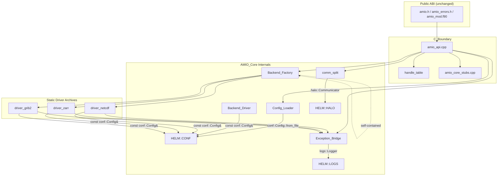
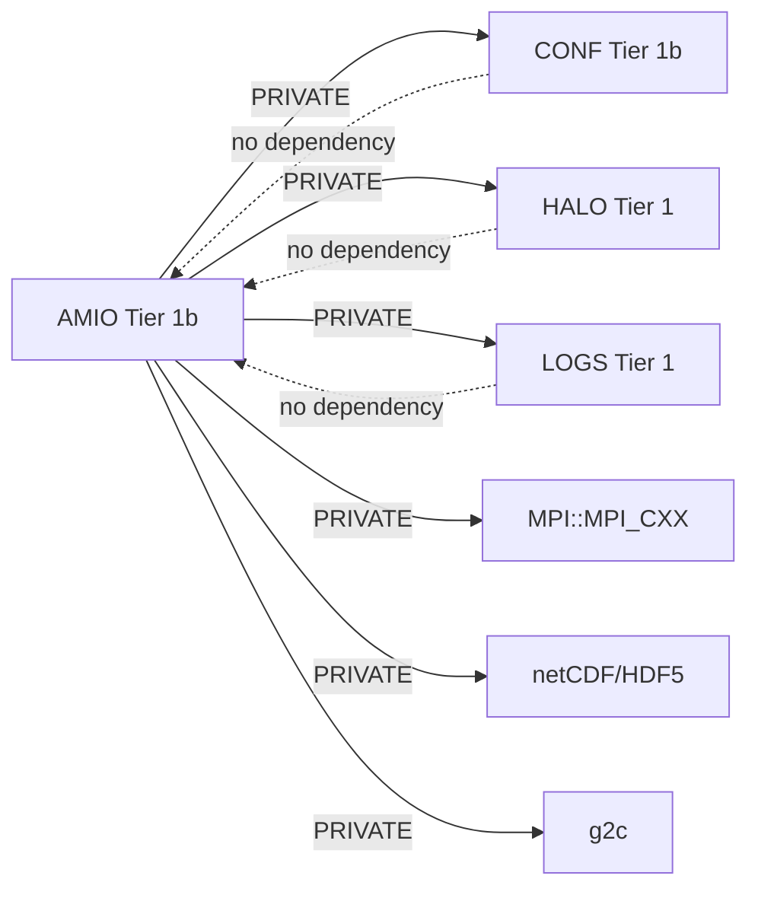
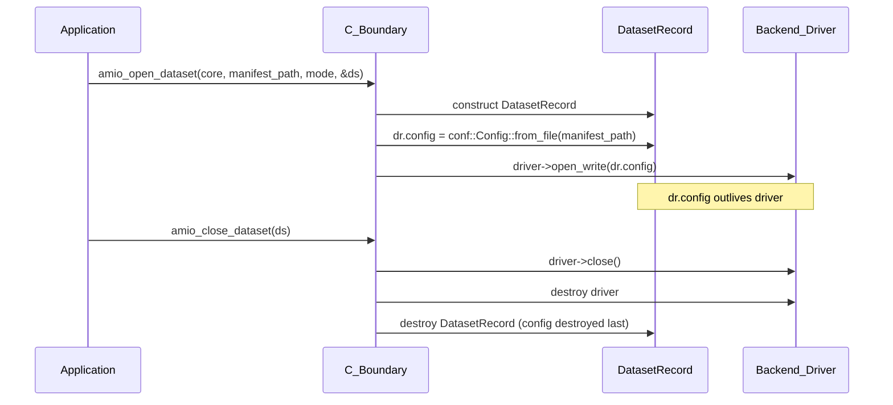

# Design Document: AMIO eckit Replacement

## Overview

This design describes the systematic removal of the eckit dependency from AMIO and its replacement with three HELM-native micro-libraries (CONF, HALO, LOGS) plus a self-contained Backend_Factory. The migration affects six internal modules—Config_Loader, Backend_Driver interface, comm_split, Exception_Bridge, Backend_Factory, and the CMake build system—while preserving the public C99 ABI (`amio.h`, `amio_errors.h`, `amio_mod.f90`) byte-for-byte unchanged.

The design follows a layered substitution strategy: each eckit capability maps to exactly one HELM replacement, and each replacement is integrated behind the existing internal API boundaries so that changes are confined to PRIVATE implementation files. No downstream consumer recompilation is required.

### Design Rationale

1. **CONF replaces eckit::YAMLConfiguration** — CONF provides the same dotted-path accessor pattern (`get_int`, `get_string`, `has`) with typed error codes (`Conf_Error`) that map cleanly to AMIO's existing `AMIO_ERR_*` enumeration. The existing standalone YAML tokenizer in Config_Loader is replaced by CONF's `from_file` / `from_string` factories, eliminating ~300 lines of fragile parser code.

2. **HALO replaces eckit::mpi::Comm** — HALO's `Communicator` class provides RAII lifetime management (automatic `MPI_Comm_free` on destruction), `split()`, `rank()`, `size()`, and `handle()` accessors. This maps directly to AMIO's comm_split requirements while guaranteeing no MPI handle leaks via RAII.

3. **LOGS replaces eckit::Log** — LOGS provides severity-leveled, rank-stamped, thread-safe logging via a `Logger` class with `configure_communicator()`. The FATAL path performs synchronized MPI abort, replacing AMIO's ad-hoc `fprintf(stderr, ...)` + MPI abort pattern.

4. **Self-contained Backend_Factory** — The existing `BackendFactory` in `src/factory/backend_factory.hpp` is already a self-contained implementation with `std::shared_mutex`. The migration removes the remaining eckit comments/references and confirms it has no eckit dependency.

5. **std::exception hierarchy replaces eckit::Exception** — The Exception_Bridge's three-level catch hierarchy collapses to two levels (`std::exception`, `catch(...)`), with `conf::Conf_Error` handled as the most-specific first catch since it carries an `Error_Code` for precise translation.

## Architecture



### Dependency Graph (Post-Migration)



All HELM library dependencies are PRIVATE to `amio_core`. The public headers target (`amio_public_headers`) exposes zero HELM types, preserving downstream isolation.

## Components and Interfaces

### 1. Config_Loader (src/config/config_loader.cpp)

**Current state:** Contains a standalone YAML/JSON tokenizer (~200 lines) plus an `#ifdef AMIO_HAS_ECKIT` path that delegates to `eckit::YAMLConfiguration`.

**Post-migration:** Replaces both paths with CONF's `Config::from_file` / `Config::from_string`. The `populate_config` method reads values via CONF's typed accessors (`get_int`, `get_string`, `get_string_list`, etc.) using dotted-path keys matching the existing manifest schema.

```cpp
// New Config_Loader::parse implementation (sketch)
amio_err_t ConfigLoader::parse(const std::string& path,
                                Config& config_out,
                                ValidationError& error_out) {
    conf::Config manifest = conf::Config::from_file(path);
    // Throws conf::Conf_Error{File_Not_Found} if file missing
    // Throws conf::Conf_Error{Parse_Error} if invalid YAML

    return populate_from_conf(manifest, config_out, error_out);
}
```

**Error mapping:**

| conf::Error_Code | AMIO_ERR_* |
|---|---|
| File_Not_Found | AMIO_ERR_MANIFEST_NOT_FOUND |
| Parse_Error | AMIO_ERR_MANIFEST_INVALID |
| Key_Not_Found | AMIO_ERR_MANIFEST_INVALID |
| Type_Mismatch | AMIO_ERR_MANIFEST_INVALID |
| Invalid_Arg | AMIO_ERR_INVALID_INPUT |

**Key design decisions:**
- Config_Loader catches `conf::Conf_Error` locally for required-key failures during population and translates them to `ValidationError` with the dotted path and human-readable message.
- The `serialize()` method remains unchanged (it emits YAML from the internal `Config` struct, independent of the parser).
- The round-trip guarantee (`parse_string(serialize(config), "yaml", ...) == config`) is preserved because CONF's parser handles the same YAML subset that `serialize()` emits.

### 2. Backend_Driver Interface (src/factory/backend_driver.hpp)

**Current state:** Forward-declares `namespace eckit { class Configuration; }` and uses `const eckit::Configuration&` in `open_write` / `open_read`.

**Post-migration:**

```cpp
// Replace the eckit forward declaration with:
#include <conf/config.hpp>

class Backend_Driver {
public:
    virtual void open_write(const conf::Config& config) = 0;
    virtual void open_read(const conf::Config& config) = 0;
    // ... rest unchanged
};
```

**Concrete driver changes:**
- `config.getString("path")` → `config.get_string("path")`
- `config.getString("data_model", "classic")` → `config.get_or<std::string>("data_model", "classic")`
- `config.has("codec.active_codec")` → `config.has("codec.active_codec")`
- `config.getStringVector("codec.lossless_allow_list", {})` → `config.get_string_list("codec.lossless_allow_list")` wrapped in try/catch or guarded by `has()`

### 3. IOCommunicator / comm_split (src/workers/comm_split.hpp/.cpp)

**Current state:** Uses `eckit::mpi::comm("world").split(...)` when `AMIO_HAS_ECKIT` is defined, raw `MPI_Comm_split` otherwise. The `IOCommunicator` stores raw `int64_t` identifiers.

**Post-migration:** The `IOCommunicator` stores a `std::optional<halo::Communicator>` for the I/O sub-communicator. The split uses HALO's RAII wrapper.

```cpp
struct IOCommunicator {
    bool valid = false;
    bool is_io_rank = false;
    // RAII-owned split communicator (nullopt when no split or no MPI)
    std::optional<halo::Communicator> io_comm;

    // Accessors
    MPI_Comm handle() const noexcept;  // io_comm->handle() or MPI_COMM_WORLD
    int rank() const;                   // io_comm->rank()
    int size() const;                   // io_comm->size()
};
```

**Split implementation:**

```cpp
amio_err_t split_communicator(const CommConfig& config, int my_rank,
                               IOCommunicator& result) {
    if (config.is_default()) {
        result.valid = true;
        result.is_io_rank = true;
        // No split: io_comm remains nullopt; handle() returns MPI_COMM_WORLD
        return AMIO_OK;
    }
    // ...validation...

    halo::Communicator world(MPI_COMM_WORLD);  // non-owning (predefined)
    int color = is_io ? 0 : 1;
    result.io_comm = world.split(color, my_rank);  // RAII-owned result
    result.valid = true;
    result.is_io_rank = is_io;
    return AMIO_OK;
}
```

**MPI threading validation:** Replaces `MPI_Query_thread` / eckit queries with `halo::Environment::thread_support_level()` (requires `halo::Environment::initialize()` to have been called).

### 4. Exception_Bridge (src/workers/exception_bridge.cpp)

**Current state:** Three-level catch: `eckit::Exception` → `std::exception` → `catch(...)`.

**Post-migration:** The catch hierarchy becomes:

```cpp
amio_err_t translate_exception_to_error(std::string* out_message) {
    try { throw; }
    catch (const conf::Conf_Error& e) {
        if (out_message) *out_message = e.what();
        switch (e.code()) {
            case conf::Error_Code::File_Not_Found:
                return AMIO_ERR_MANIFEST_NOT_FOUND;
            case conf::Error_Code::Parse_Error:
            case conf::Error_Code::Key_Not_Found:
                return AMIO_ERR_MANIFEST_INVALID;
            case conf::Error_Code::Type_Mismatch:
            case conf::Error_Code::Invalid_Arg:
                return AMIO_ERR_INVALID_INPUT;
            default:
                return AMIO_ERR_BACKEND_FAILURE;
        }
    }
    catch (const std::invalid_argument& e) {
        if (out_message) *out_message = e.what();
        return AMIO_ERR_INVALID_INPUT;
    }
    catch (const std::exception& e) {
        if (out_message) *out_message = e.what();
        return AMIO_ERR_BACKEND_FAILURE;
    }
    catch (...) {
        if (out_message) *out_message = "Unknown exception (non-std)";
        return AMIO_ERR_BACKEND_FAILURE;
    }
}
```

**Parallel stack trace emission:** Replaces `fprintf(stderr, ...)` with `logs::Logger::log(Severity_Level::FATAL, ...)` when LOGS is initialized, falling back to stderr before initialization completes.

### 5. LOGS Integration

**Initialization lifecycle:**

```cpp
// In AMIO_Core state (amio_core.hpp)
struct AMIO_Core_State {
    logs::Logger logger;                    // Owned logger instance
    std::atomic<bool> logs_initialized{false};  // Pre-init fallback flag
    // ...
};

// During amio_init, after comm_split succeeds:
state.logger.configure_communicator(state.io_comm.handle());
state.logger.set_threshold(logs::Severity_Level::INFO);
state.logs_initialized.store(true, std::memory_order_release);
```

**Severity mapping:**

| AMIO usage | LOGS Severity |
|---|---|
| Configuration summary, backend selection | INFO |
| Thread pinning failure, codec fallback | WARNING |
| Recoverable backend error | ERROR |
| Unrecoverable error, parallel stack trace | FATAL |

**Pre-initialization fallback:** The Exception_Bridge checks the `logs_initialized` atomic. If false, diagnostics go to `fprintf(stderr, ...)`. If true, they route through the Logger.

### 6. Backend_Factory (src/factory/backend_factory.hpp/.cpp)

**Current state:** Already self-contained with `std::shared_mutex`. Contains comments referencing eckit::Factory semantics.

**Post-migration:**
- Remove all comments referencing eckit::Factory, eckit::ConcreteBuilderT0
- Remove `#include <eckit/...>` if any remain
- Update documentation to describe it as "AMIO's own registry pattern"
- No behavioral changes required; the API (`register_driver`, `build`, `has`, `registered_keys`, `clear`) remains identical

### 7. CMake Build System (CMakeLists.txt)

**Changes:**

```cmake
# REMOVE:
find_package(eckit CONFIG QUIET)

# ADD:
find_package(CONF REQUIRED)
find_package(HALO REQUIRED)
find_package(LOGS REQUIRED)

# amio_core link changes:
target_link_libraries(amio_core
    PUBLIC amio_public_headers
    PRIVATE driver_netcdf driver_zarr driver_grib2
            HELM::CONF HELM::HALO HELM::LOGS)

# Driver link changes:
target_link_libraries(driver_netcdf PRIVATE HELM::CONF ...)
target_link_libraries(driver_zarr PRIVATE HELM::CONF ...)
target_link_libraries(driver_grib2 PRIVATE HELM::CONF ...)

# REMOVE from all targets:
# target_compile_definitions(... PRIVATE AMIO_HAS_ECKIT=1)
# target_link_libraries(... PRIVATE eckit)
```

**AMIOConfig.cmake:** Does NOT list CONF, HALO, or LOGS as `find_dependency` since they are PRIVATE.

### 8. Config Object Lifetime (C_Boundary → Driver)



The `DatasetRecord` owns the `conf::Config` instance. The `Backend_Driver` receives it by const reference. Drivers that need values beyond `open_write`/`open_read` copy scalars into their own members.

## Data Models

### Internal Config Struct (unchanged)

The `amio::detail::Config` struct remains the canonical internal representation. The Config_Loader populates it from CONF's `conf::Config` rather than from the standalone tokenizer or eckit. No fields are added or removed.

### IOCommunicator (modified)

```cpp
struct IOCommunicator {
    bool valid = false;
    bool is_io_rank = false;

#ifdef AMIO_HAS_MPI
    std::optional<halo::Communicator> io_comm;  // RAII-owned split result
#endif

    // Accessors (inline, header-only)
    MPI_Comm handle() const noexcept {
#ifdef AMIO_HAS_MPI
        return io_comm.has_value() ? io_comm->handle() : MPI_COMM_WORLD;
#else
        return 0;  // sentinel
#endif
    }

    int rank() const {
#ifdef AMIO_HAS_MPI
        return io_comm.has_value() ? io_comm->rank() : 0;
#else
        return 0;
#endif
    }

    int size() const {
#ifdef AMIO_HAS_MPI
        return io_comm.has_value() ? io_comm->size() : 1;
#else
        return 1;
#endif
    }
};
```

### DatasetRecord (modified)

```cpp
struct DatasetRecord {
    conf::Config config;                    // Owns the parsed manifest
    std::unique_ptr<Backend_Driver> driver; // Destroyed before config
    DatasetId id;
    // ... other fields unchanged
};
```

Destruction order: `driver` is destroyed first (via unique_ptr reset or natural ordering), then `config`. This satisfies Requirement 13.4.

### AMIO_Core_State (modified)

```cpp
struct AMIO_Core_State {
    amio::detail::Config core_config;       // Parsed from amio_init manifest
    IOCommunicator io_comm;                 // HALO RAII communicator
    logs::Logger logger;                    // LOGS instance
    std::atomic<bool> logs_initialized{false};
    // Worker_Pool, Staging_Pool, etc. unchanged
};
```
