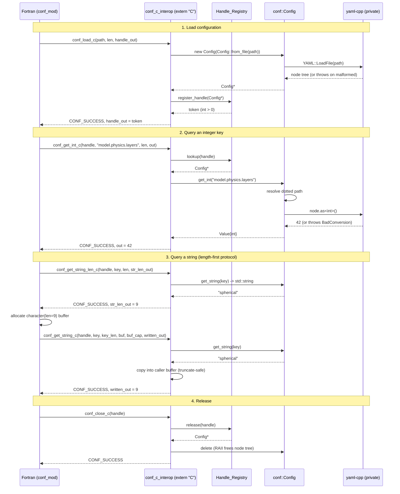

# Design Document: CONF — Configuration Parser Micro-Library

> Internal reference: `helm_conf_spec.md`
> HELM Phase A · Tier 1b Elective Utility · `conf::` namespace · C++20

## Overview

CONF (Configuration Object & Notation Framework) is a Tier 1b elective micro-library
in the HELM ecosystem. It provides a thin, stateless, RAII-managed C++20 wrapper
around a high-performance YAML parser. Its sole responsibility is to load complex
YAML hierarchies (nested dictionaries, lists, scalar parameters) and expose strongly
typed accessors for deeply nested keys via dotted-path syntax such as
`"model.physics.layers"`.

CONF mirrors the proven architecture of its HALO sibling: a clean C++ core, an
`extern "C"` / `iso_c_binding` bridge for legacy Fortran models, an opaque
thread-safe `Handle_Registry`, an exception-to-error-code translation macro, and a
modern target-centric CMake build that produces the `HELM::CONF` alias. Unlike the
Tier 1 compute libraries, CONF requires **neither Kokkos nor MPI** — configuration
parsing is a node-local, serial concern. It does, however, remain bound by the
HELM Laws of Physics that apply to it: stateless design, RAII resource ownership,
and **no circular Tier-1 dependencies** (CONF includes no other HELM headers).

The single third-party dependency (the YAML parser) is fetched and managed
privately via CMake `FetchContent`, with a Spack-friendly `find_package` fallback.
It is linked `PRIVATE` so it never leaks into the public interface of `HELM::CONF`.
Downstream consumers see only `conf::` types and standard-library types.

This document is the design specification for the `conf-config-parser` feature. It
contains both the High-Level Design (architecture diagrams, components, data models)
and the Low-Level Design (C++20 class declarations, function signatures, algorithms,
and the string-marshalling lifetime contract). **No source code is to be generated
until this design is approved.**

---

## Goals and Non-Goals

### Goals

- Parse arbitrary YAML 1.2 hierarchies from a file path or in-memory string.
- Resolve dotted-path keys (`"a.b.c"`) into nested map/sequence nodes.
- Provide typed accessors returning `int`, `double`/`float`, `bool`, and `std::string`,
  plus list accessors, with explicit, non-throwing-by-default error reporting.
- Expose the parser to Fortran models through a stable `extern "C"` ABI that mirrors
  HALO's handle/error-code pattern exactly.
- Guarantee leak-free string marshalling across the Fortran boundary.
- Build as a standalone repository producing `HELM::CONF`, with the YAML backend as
  an invisible private implementation detail.

### Non-Goals

- CONF does **not** write or serialize YAML back to disk (read-only in Phase A).
- CONF does **not** perform schema validation beyond type-cast checking.
- CONF does **not** depend on Kokkos, MPI, or any other HELM library.
- CONF does **not** cache or share state across instances (stateless; each
  `Config` owns its own parsed tree).

---

## Backend Decision: yaml-cpp vs. rapidyaml (ryml)

CONF wraps an existing high-performance YAML library rather than implementing a
parser. The two leading C++ candidates were evaluated.

| Criterion | yaml-cpp | rapidyaml (ryml) |
| --- | --- | --- |
| Parse throughput | Good; node-graph allocation per element | Excellent; in-situ parsing, near zero-copy, benchmarks ~10–30x faster |
| Memory model | Owns a heap node graph (`YAML::Node`) | Parses into a flat arena indexed by node id; can reference source buffer in-place |
| API ergonomics | High-level, intuitive `node["a"]["b"].as<int>()` | Lower-level, index/csubstr based; steeper learning curve |
| Error reporting | Throws `YAML::Exception` with mark (line/col) | Callback-based error handler; must be installed to avoid `abort()` |
| Type conversion | Built-in `as<T>()` with `BadConversion` | Manual `>>` extraction; explicit |
| Maturity / ubiquity | Very widely deployed; packaged in Spack, apt, vcpkg | Growing adoption; available in Spack and via FetchContent |
| Exceptions | Exception-based (fits HELM `*_C_TRY` pattern naturally) | Error-callback based (must adapt to throw) |
| Header/build footprint | Compiled static/shared lib | Header-light, easy FetchContent |

### Recommendation: **yaml-cpp**

For CONF's Phase A scope, **yaml-cpp is the recommended backend**:

1. **Configuration files are small.** Model config YAML is kilobytes, not gigabytes.
   ryml's raw-throughput advantage is irrelevant for one-time startup parsing; the
   bottleneck is developer clarity, not parse speed.
2. **Exception-native API maps cleanly onto the HELM bridge.** yaml-cpp throws on
   bad conversions and malformed input, which slots directly into the
   `CONF_C_TRY` exception-to-error-code macro (mirroring `HALO_C_TRY`). ryml's
   default error handler calls `abort()` and must be manually overridden to throw —
   an easy source of process-killing bugs at the Fortran boundary.
3. **Ergonomic typed access** (`node.as<int>()`, `node["k"]`) makes the dotted-path
   resolver and typed accessors straightforward to implement and audit.
4. **Ubiquitous packaging** simplifies the Spack `find_package` fallback.

Because the backend is fully encapsulated behind `conf::detail` and linked
`PRIVATE`, this decision is reversible: a future swap to ryml (e.g., if CONF ever
parses very large data manifests) requires changes only inside
`src/detail/yaml_backend.cpp`, with no impact on the public API or the C bridge.
The design below deliberately keeps all yaml-cpp types out of public headers to
preserve this option.

---

## Architecture

CONF is organized in three concentric layers. The pure C++ core knows nothing about
Fortran; the C bridge knows nothing about YAML internals; the YAML backend is sealed
inside `detail`.

```mermaid
graph TD
    subgraph Fortran["Legacy Fortran Model"]
        FM["conf_mod\n(iso_c_binding interfaces)"]
    end

    subgraph Bridge["CONF C-API Bridge (extern \"C\")"]
        CB["conf_c_interop.cpp\nCONF_C_TRY macro"]
        HR["Handle_Registry\n(thread-safe singleton)"]
    end

    subgraph Core["CONF C++20 Core (conf::)"]
        CFG["conf::Config\n(RAII owner of parsed tree)"]
        VAL["conf::Value\n(typed view of a node)"]
        RES["Dotted-path resolver"]
        ERR["conf::Error_Code\nconf::Conf_Error"]
    end

    subgraph Backend["Private Backend (conf::detail)"]
        YB["yaml_backend\n(yaml-cpp wrapper)"]
        YC["yaml-cpp\n(FetchContent, linked PRIVATE)"]
    end

    FM -->|"int error codes\nopaque int handles"| CB
    CB --> HR
    CB --> CFG
    CFG --> RES
    RES --> VAL
    CFG --> ERR
    CFG --> YB
    YB --> YC

    classDef priv fill:#f6f6f6,stroke:#999,stroke-dasharray:4 3;
    class YB,YC priv;
```

### Layering Rules

- **`conf::` public layer** — `Config`, `Value`, `Error_Code`, `Conf_Error`. Depends
  only on the C++ standard library. No yaml-cpp types appear in any public header.
- **`conf::detail` private layer** — owns the `YAML::Node` tree and all yaml-cpp
  includes. Compiled into the library, never installed, never exposed.
- **C bridge layer** — `extern "C"` functions + `Handle_Registry`. Translates
  exceptions to `int` error codes and C++ objects to opaque `int` handle tokens.
- **No circular Tier-1 dependency** — CONF includes no HELM headers. The umbrella
  header `conf/conf.hpp` pulls in only CONF's own public headers.

### HELM Law Compliance

| Law | Applicability to CONF | How CONF complies |
| --- | --- | --- |
| 1. Zero-Copy Memory (`std::mdspan`) | N/A — CONF moves no domain data arrays | CONF only returns scalar config values and strings; no Fortran array views involved |
| 2. Hardware Portability (Kokkos) | N/A — parsing is serial, node-local | CONF links neither Kokkos nor any GPU runtime |
| 3. RAII | **Applies** | `Config` owns the parsed tree via a `unique_ptr` to a pimpl; destructor releases all backend memory. No raw `new`/`delete` in the core |
| 4. No Circular Dependencies | **Applies** | CONF includes zero HELM headers; the YAML backend is private and `detail`-scoped |

---

## Fortran → C++ → YAML Call & Data Flow

The sequence below shows a Fortran model opening a config file and querying an
integer key, then querying a string using the length-first marshalling protocol.



The string path uses a **query-length-then-copy** protocol so the Fortran caller
owns and allocates the receiving buffer, eliminating any cross-language ownership of
heap memory. An alternative get-then-free pattern is documented later as a rejected
option.

---

## Components and Interfaces

### Component 1: `conf::Config` — RAII Configuration Owner

**Purpose**: Owns a parsed YAML document and serves as the entry point for all
queries. Stateless with respect to the rest of the system (each instance is
independent); RAII-managed (destruction frees the entire backend node tree).

**Responsibilities**:
- Parse YAML from a file path (`from_file`) or in-memory string (`from_string`).
- Resolve dotted-path keys to nodes.
- Provide typed scalar accessors (`get_int`, `get_double`, `get_bool`, `get_string`)
  in both throwing and non-throwing (`std::optional` / `try_get`) flavors.
- Provide list/size introspection (`has`, `size`, `is_map`, `is_sequence`).
- Hide all yaml-cpp types behind a pimpl (`detail::Yaml_Tree`).

**Public interface** (declared in `include/conf/config.hpp`):

```cpp
namespace conf {

class Value;  // forward declaration

/// RAII owner of a parsed YAML configuration document.
/// Movable, non-copyable. Each instance owns an independent node tree.
class Config {
public:
    // ── Factory constructors (named, to disambiguate file vs. string) ──
    [[nodiscard]] static Config from_file(const std::string& path);
    [[nodiscard]] static Config from_string(const std::string& yaml_text);

    // ── RAII: move-only ──
    Config(Config&&) noexcept;
    Config& operator=(Config&&) noexcept;
    Config(const Config&)            = delete;
    Config& operator=(const Config&) = delete;
    ~Config();  // frees the backend node tree

    // ── Existence / structure introspection (non-throwing) ──
    [[nodiscard]] bool has(std::string_view dotted_path) const noexcept;
    [[nodiscard]] bool is_map(std::string_view dotted_path) const noexcept;
    [[nodiscard]] bool is_sequence(std::string_view dotted_path) const noexcept;
    /// Number of children for a map/sequence node; 0 if scalar or missing.
    [[nodiscard]] std::size_t size(std::string_view dotted_path) const noexcept;

    // ── Typed scalar accessors (throwing flavor) ──
    // Throw Conf_Error{Key_Not_Found} or Conf_Error{Type_Mismatch} on failure.
    [[nodiscard]] int         get_int(std::string_view dotted_path) const;
    [[nodiscard]] double      get_double(std::string_view dotted_path) const;
    [[nodiscard]] bool        get_bool(std::string_view dotted_path) const;
    [[nodiscard]] std::string get_string(std::string_view dotted_path) const;

    // ── Typed scalar accessors (non-throwing flavor) ──
    // Return std::nullopt on missing key OR type mismatch.
    [[nodiscard]] std::optional<int>         try_int(std::string_view path) const noexcept;
    [[nodiscard]] std::optional<double>      try_double(std::string_view path) const noexcept;
    [[nodiscard]] std::optional<bool>        try_bool(std::string_view path) const noexcept;
    [[nodiscard]] std::optional<std::string> try_string(std::string_view path) const noexcept;

    // ── Defaulted accessor (never throws; returns fallback on any failure) ──
    template <typename T>
    [[nodiscard]] T get_or(std::string_view dotted_path, T fallback) const noexcept;

    // ── Generic node access (returns a lightweight Value view) ──
    [[nodiscard]] Value at(std::string_view dotted_path) const;  // throws if missing

    // ── List access ──
    [[nodiscard]] std::vector<int>         get_int_list(std::string_view path) const;
    [[nodiscard]] std::vector<double>      get_double_list(std::string_view path) const;
    [[nodiscard]] std::vector<std::string> get_string_list(std::string_view path) const;

private:
    Config() noexcept;  // used by factory methods
    struct Impl;                       // pimpl: hides detail::Yaml_Tree + yaml-cpp
    std::unique_ptr<Impl> impl_;       // RAII ownership of the parsed tree
};

} // namespace conf
```

### Component 2: `conf::Value` — Typed View of a Resolved Node

**Purpose**: A lightweight, non-owning view over a single resolved node, returned by
`Config::at`. Allows callers to introspect and convert without re-resolving the path.

**Responsibilities**:
- Report the node's kind (scalar, sequence, map, null/undefined).
- Convert to a requested scalar type with explicit success/failure.

```cpp
namespace conf {

enum class Node_Kind { Undefined, Null, Scalar, Sequence, Map };

/// Non-owning typed view over a single resolved node.
/// Validity is tied to the parent Config's lifetime (does not extend it).
class Value {
public:
    [[nodiscard]] Node_Kind kind() const noexcept;
    [[nodiscard]] bool is_defined() const noexcept;
    [[nodiscard]] std::size_t size() const noexcept;   // children count

    // Throwing conversions (Conf_Error{Type_Mismatch} on failure)
    [[nodiscard]] int         as_int() const;
    [[nodiscard]] double      as_double() const;
    [[nodiscard]] bool        as_bool() const;
    [[nodiscard]] std::string as_string() const;

    // Non-throwing conversions
    [[nodiscard]] std::optional<int>         try_int() const noexcept;
    [[nodiscard]] std::optional<double>      try_double() const noexcept;
    [[nodiscard]] std::optional<bool>        try_bool() const noexcept;
    [[nodiscard]] std::optional<std::string> try_string() const noexcept;

private:
    friend class Config;
    explicit Value(const void* node_ptr) noexcept;  // type-erased detail::node handle
    const void* node_;  // points into the parent Config's tree; non-owning
};

} // namespace conf
```

### Component 3: `conf::Error_Code` and `conf::Conf_Error` — Error Model

**Purpose**: A single, stable enumeration of failure modes shared by the C++ core
(as an exception payload) and the C bridge (as the returned `int`). This keeps the
Fortran-visible error codes and the C++ exception taxonomy in lockstep, mirroring
HALO's `Halo_Error` enum.

```cpp
namespace conf {

/// Stable error taxonomy. Integer values are part of the C ABI and MUST match
/// the parameter constants declared in conf_mod.f90. Append-only: never renumber.
enum class Error_Code : int {
    Success        = 0,   ///< Operation completed successfully.
    Invalid_Arg    = 1,   ///< Null pointer or malformed argument from caller.
    File_Not_Found = 2,   ///< Config file path does not exist / cannot be opened.
    Parse_Error    = 3,   ///< Malformed YAML (syntax error at parse time).
    Key_Not_Found  = 4,   ///< Dotted-path key does not resolve to a node.
    Type_Mismatch  = 5,   ///< Node exists but cannot convert to requested type.
    Bad_Handle     = 6,   ///< Invalid or released opaque handle token.
    Buffer_Too_Small = 7, ///< Caller string buffer cannot hold the value.
    Unknown        = 99   ///< Unexpected / uncategorized error.
};

/// Exception type carrying an Error_Code plus a human-readable message.
/// Thrown by the C++ core; caught and translated at the C boundary.
class Conf_Error : public std::runtime_error {
public:
    Conf_Error(Error_Code code, const std::string& what_msg);
    [[nodiscard]] Error_Code code() const noexcept { return code_; }
private:
    Error_Code code_;
};

} // namespace conf
```

### Component 4: `conf::detail::Yaml_Tree` — Private Backend (not installed)

**Purpose**: The only place that `#include <yaml-cpp/yaml.h>` appears. Wraps the
`YAML::Node` root, implements dotted-path resolution against yaml-cpp, and performs
typed conversions. Lives in `src/detail/` and is compiled into the library but never
exported.

```cpp
// src/detail/yaml_tree.hpp  (PRIVATE — not in include/, never installed)
namespace conf::detail {

class Yaml_Tree {
public:
    static Yaml_Tree from_file(const std::string& path);    // throws Conf_Error
    static Yaml_Tree from_string(const std::string& text);  // throws Conf_Error

    /// Resolve a dotted path to a node. Returns an undefined node if any
    /// segment is missing (caller decides whether that is an error).
    [[nodiscard]] YAML::Node resolve(std::string_view dotted_path) const;

    // conversion helpers used by Config / Value
    template <typename T>
    [[nodiscard]] T convert(const YAML::Node& n) const;  // throws Type_Mismatch

private:
    explicit Yaml_Tree(YAML::Node root);
    YAML::Node root_;
};

} // namespace conf::detail
```

### Component 5: `conf::Handle_Registry` — Thread-Safe Opaque Handle Map

**Purpose**: Identical in contract to HALO's `Handle_Registry`. Maps monotonically
increasing positive `int` tokens to `Config*` pointers so Fortran can reference C++
objects without seeing raw pointers. Token `0` is the invalid sentinel; tokens are
never reused (prevents stale-handle reuse bugs). Guarded by `std::mutex` for
`THREAD_MULTIPLE`-safe use.

```cpp
// src/fortran/handle_registry.hpp  (PRIVATE)
namespace conf::fortran {

inline constexpr int CONF_HANDLE_INVALID = 0;

class Handle_Registry {
public:
    static Handle_Registry& instance();
    int   register_handle(void* ptr);  // returns unique token > 0
    void* lookup(int token) const;     // nullptr if invalid/released
    void* release(int token);          // removes mapping, returns ptr or nullptr
    bool  valid(int token) const;
    // non-copyable, non-movable singleton
};

} // namespace conf::fortran
```

This component is reused verbatim from HALO's design (only the namespace and
sentinel name change), satisfying the "mirror HALO's proven pattern exactly"
requirement.

---

## Data Models

### Model 1: Parsed Configuration Tree

CONF treats the YAML document as a tree of three node kinds: **maps** (key→node),
**sequences** (ordered node lists), and **scalars** (leaf strings interpreted as
int/double/bool/string on demand). The tree is owned privately by `Config::Impl`.

```cpp
// Conceptual model (actual storage is yaml-cpp's YAML::Node inside detail)
//   Map      : std::unordered_map<std::string, Node>
//   Sequence : std::vector<Node>
//   Scalar   : std::string (lazily converted)
```

**Validation rules**:
- A dotted path segment indexes a **map** by key, or a **sequence** by base-10
  integer index (e.g., `"layers.0.thickness"`).
- Scalar conversion follows yaml-cpp semantics: `"42"`→int, `"3.14"`→double,
  `"true"/"false"/"yes"/"no"`→bool, any scalar→string.
- A missing intermediate segment yields `Key_Not_Found`, never a crash.

### Model 2: Dotted-Path Key

```cpp
// A non-empty, '.'-delimited string. Each segment is a map key or sequence index.
//   "model.physics.layers"      -> map.map.scalar
//   "grid.resolution.0"          -> map.map.sequence[0]
//   ""                           -> Invalid_Arg (empty path)
//   "model..layers"              -> Invalid_Arg (empty segment)
```

**Validation rules**:
- Empty string or any empty segment (leading/trailing/double dot) → `Invalid_Arg`.
- Whitespace is significant and not trimmed (keys are matched literally).
- Maximum path depth is bounded by the document; no artificial limit imposed.

### Model 3: C-ABI Handle Token

```cpp
// Opaque int returned to Fortran. 0 = invalid. Monotonic, never reused.
//   integer :: cfg_handle      ! Fortran sees only this
```

**Validation rules**:
- `0` is always invalid (`CONF_HANDLE_INVALID`).
- A released token is permanently invalid; reuse returns `Bad_Handle`.

---

## Low-Level Design

### Dotted-Path Resolution Algorithm

The resolver walks the parsed tree one segment at a time. It is the core algorithm
of CONF and must never crash on bad input — every failure maps to an `Error_Code`.

```pascal
ALGORITHM resolve(root, dotted_path)
INPUT:  root         — the parsed YAML root node
        dotted_path  — a '.'-delimited key string
OUTPUT: node         — the resolved node, OR raises Conf_Error

BEGIN
    // ── Precondition checks ──
    IF dotted_path IS EMPTY THEN
        RAISE Conf_Error(Invalid_Arg, "empty path")
    END IF

    segments ← SPLIT(dotted_path, '.')

    FOR each seg IN segments DO
        IF seg IS EMPTY THEN
            RAISE Conf_Error(Invalid_Arg, "empty path segment")
        END IF
    END FOR

    // ── Walk the tree ──
    current ← root
    FOR each seg IN segments DO
        // Loop invariant: 'current' is a defined node reachable
        // by the already-consumed prefix of 'dotted_path'.
        IF current IS NOT defined THEN
            RAISE Conf_Error(Key_Not_Found, dotted_path)
        END IF

        IF current.kind = Map THEN
            IF current.contains(seg) THEN
                current ← current[seg]
            ELSE
                RAISE Conf_Error(Key_Not_Found, dotted_path)
            END IF

        ELSE IF current.kind = Sequence THEN
            IF is_integer(seg) AND parse_index(seg) < current.size THEN
                current ← current[parse_index(seg)]
            ELSE
                RAISE Conf_Error(Key_Not_Found, dotted_path)
            END IF

        ELSE
            // Reached a scalar but path expects to descend further.
            RAISE Conf_Error(Key_Not_Found, dotted_path)
        END IF
    END FOR

    RETURN current
END
```

**Preconditions**:
- `root` is a successfully parsed, defined node.
- `dotted_path` parameter is provided (may be empty, but is then rejected).

**Postconditions**:
- Returns a defined node reachable by the full path, OR
- Raises `Conf_Error` with `Invalid_Arg` (malformed path) or `Key_Not_Found`
  (path does not resolve). Never returns an undefined node; never crashes.

**Loop invariant**: At the top of each iteration, `current` is a defined node that
is reachable from `root` by the segments consumed so far. The invariant is
established by the initial assignment `current ← root` and preserved because each
branch either advances `current` to a defined child or raises.

### Typed Accessor Algorithm (non-throwing flavor)

```pascal
ALGORITHM try_get<T>(root, dotted_path)
INPUT:  root, dotted_path, target type T
OUTPUT: optional<T> — value on success, nullopt on any failure

BEGIN
    TRY
        node ← resolve(root, dotted_path)        // may raise Key_Not_Found
        value ← convert<T>(node)                 // may raise Type_Mismatch
        RETURN Some(value)
    CATCH Conf_Error
        RETURN None
    END TRY
END
```

**Postconditions**:
- Returns `Some(v)` iff the key resolves AND converts to `T`.
- Returns `None` (never throws) on missing key, type mismatch, or invalid path.
- No mutation of the configuration tree (read-only, referentially transparent).

### Typed Conversion Algorithm (throwing flavor)

```pascal
ALGORITHM convert<T>(node)
INPUT:  node — a resolved node, type T
OUTPUT: value of type T, OR raises Conf_Error(Type_Mismatch)

BEGIN
    IF node.kind ≠ Scalar AND T ≠ String THEN
        RAISE Conf_Error(Type_Mismatch, "node is not a scalar")
    END IF

    TRY
        RETURN backend.as<T>(node)   // delegates to yaml-cpp YAML::Node::as<T>
    CATCH backend_conversion_error
        RAISE Conf_Error(Type_Mismatch, "cannot convert scalar to " + name(T))
    END TRY
END
```

**Preconditions**: `node` is defined (guaranteed by `resolve`).
**Postconditions**: Returns a `T`, or raises `Type_Mismatch`. Input node unchanged.

---

## The C-API Bridge (extern "C")

### Exception-to-Error-Code Macro

CONF mirrors HALO's `HALO_C_TRY` exactly, with one enhancement: it first catches
`conf::Conf_Error` so the precise `Error_Code` reaches Fortran, then falls back to
the standard-exception families.

```cpp
/// Wraps a C-bridge function body, translating any C++ exception into an int
/// error code. Guarantees no exception ever crosses into Fortran (which would be
/// undefined behavior). Mirrors HALO_C_TRY.
#define CONF_C_TRY(body)                                              \
    try {                                                             \
        body;                                                         \
        return static_cast<int>(conf::Error_Code::Success);           \
    } catch (const conf::Conf_Error& e) {                             \
        return static_cast<int>(e.code());                            \
    } catch (const std::invalid_argument&) {                          \
        return static_cast<int>(conf::Error_Code::Invalid_Arg);       \
    } catch (const std::bad_alloc&) {                                 \
        return static_cast<int>(conf::Error_Code::Unknown);           \
    } catch (const std::exception&) {                                 \
        return static_cast<int>(conf::Error_Code::Unknown);           \
    } catch (...) {                                                   \
        return static_cast<int>(conf::Error_Code::Unknown);           \
    }
```

### extern "C" Function Signatures

All functions return `int` (an `Error_Code` value), accept an opaque `int` handle
where relevant, take input strings as `(const char*, int len)` pairs (Fortran is not
null-terminated), and return outputs via pointers.

```cpp
extern "C" {

// ── Lifecycle ────────────────────────────────────────────────────────────────

/// Parse a YAML file and register a Config. Returns handle via handle_out.
/// Errors: File_Not_Found, Parse_Error, Invalid_Arg.
int conf_load_c(const char* path, int path_len, int* handle_out);

/// Parse YAML from an in-memory string. Returns handle via handle_out.
/// Errors: Parse_Error, Invalid_Arg.
int conf_load_string_c(const char* yaml_text, int text_len, int* handle_out);

/// Destroy a Config and invalidate its handle. RAII frees the node tree.
/// Errors: Bad_Handle.
int conf_close_c(int handle);

// ── Existence / structure ────────────────────────────────────────────────────

/// Set exists_out to 1 if the dotted-path key resolves, else 0.
/// Errors: Bad_Handle, Invalid_Arg. (A missing key is NOT an error here.)
int conf_has_key_c(int handle, const char* key, int key_len, int* exists_out);

/// Set size_out to the child count of a map/sequence node (0 if scalar/missing).
/// Errors: Bad_Handle, Invalid_Arg.
int conf_size_c(int handle, const char* key, int key_len, int* size_out);

// ── Scalar getters (numeric / bool) ─────────────────────────────────────────

/// Errors: Bad_Handle, Invalid_Arg, Key_Not_Found, Type_Mismatch.
int conf_get_int_c   (int handle, const char* key, int key_len, int*    out);
int conf_get_double_c(int handle, const char* key, int key_len, double* out);
int conf_get_bool_c  (int handle, const char* key, int key_len, int*    out); // 0/1

// ── String getter (two-call, length-first protocol) ──────────────────────────

/// STEP 1: report the length (in bytes, no null terminator) the string value
/// would occupy. The Fortran caller uses this to allocate its character buffer.
/// Errors: Bad_Handle, Invalid_Arg, Key_Not_Found, Type_Mismatch.
int conf_get_string_len_c(int handle, const char* key, int key_len,
                          int* str_len_out);

/// STEP 2: copy the string value into the caller-allocated buffer.
///   buf      — caller-owned buffer of capacity buf_cap bytes
///   buf_cap  — capacity of buf in bytes
///   written_out — number of bytes actually written
/// If buf_cap < required length, copies nothing and returns Buffer_Too_Small.
/// Errors: Bad_Handle, Invalid_Arg, Key_Not_Found, Type_Mismatch, Buffer_Too_Small.
int conf_get_string_c(int handle, const char* key, int key_len,
                      char* buf, int buf_cap, int* written_out);

} // extern "C"
```

### Reference Implementation Sketch (selected functions)

```cpp
int conf_load_c(const char* path, int path_len, int* handle_out) {
    CONF_C_TRY(
        if (!path || !handle_out || path_len <= 0)
            throw conf::Conf_Error(conf::Error_Code::Invalid_Arg, "null/empty path");
        std::string p(path, static_cast<std::size_t>(path_len));
        auto* cfg = new conf::Config(conf::Config::from_file(p));
        *handle_out = conf::fortran::Handle_Registry::instance()
                          .register_handle(static_cast<void*>(cfg));
    )
}

int conf_get_int_c(int handle, const char* key, int key_len, int* out) {
    CONF_C_TRY(
        if (!key || !out || key_len <= 0)
            throw conf::Conf_Error(conf::Error_Code::Invalid_Arg, "null/empty key");
        auto& reg = conf::fortran::Handle_Registry::instance();
        auto* cfg = static_cast<conf::Config*>(reg.lookup(handle));
        if (!cfg)
            throw conf::Conf_Error(conf::Error_Code::Bad_Handle, "bad config handle");
        std::string k(key, static_cast<std::size_t>(key_len));
        *out = cfg->get_int(k);   // throws Key_Not_Found / Type_Mismatch
    )
}

int conf_get_string_len_c(int handle, const char* key, int key_len, int* str_len_out) {
    CONF_C_TRY(
        if (!key || !str_len_out || key_len <= 0)
            throw conf::Conf_Error(conf::Error_Code::Invalid_Arg, "null/empty key");
        auto& reg = conf::fortran::Handle_Registry::instance();
        auto* cfg = static_cast<conf::Config*>(reg.lookup(handle));
        if (!cfg)
            throw conf::Conf_Error(conf::Error_Code::Bad_Handle, "bad config handle");
        std::string k(key, static_cast<std::size_t>(key_len));
        std::string v = cfg->get_string(k);    // throws if missing / not convertible
        *str_len_out = static_cast<int>(v.size());
    )
}

int conf_get_string_c(int handle, const char* key, int key_len,
                      char* buf, int buf_cap, int* written_out) {
    CONF_C_TRY(
        if (!key || !buf || !written_out || key_len <= 0 || buf_cap < 0)
            throw conf::Conf_Error(conf::Error_Code::Invalid_Arg, "bad string args");
        auto& reg = conf::fortran::Handle_Registry::instance();
        auto* cfg = static_cast<conf::Config*>(reg.lookup(handle));
        if (!cfg)
            throw conf::Conf_Error(conf::Error_Code::Bad_Handle, "bad config handle");
        std::string k(key, static_cast<std::size_t>(key_len));
        std::string v = cfg->get_string(k);
        if (static_cast<int>(v.size()) > buf_cap)
            throw conf::Conf_Error(conf::Error_Code::Buffer_Too_Small, "buffer too small");
        std::memcpy(buf, v.data(), v.size());
        *written_out = static_cast<int>(v.size());
        // NOTE: not null-terminated; Fortran uses written_out as the logical length.
    )
}
```

---

## String Marshalling Lifetime Contract

Returning a heap-allocated string across the C/Fortran boundary is the single most
common source of leaks and corruption in legacy interop. CONF adopts the
**caller-allocated, length-first ("two-call") protocol** as its primary contract.

### The Contract (normative)

1. **No CONF function ever returns ownership of heap memory to Fortran.** Every
   `char*` that crosses the boundary is a buffer the *Fortran caller* allocated and
   owns. CONF only copies bytes into it.
2. **Length is queried first.** `conf_get_string_len_c` reports the exact byte count
   the value occupies (excluding any terminator).
3. **The caller allocates** a `character(len=N)` buffer of at least that size.
4. **CONF copies** into the buffer via `conf_get_string_c`, reporting bytes written.
   If the buffer is too small, CONF writes nothing and returns `Buffer_Too_Small`.
5. **Strings are not null-terminated** at the boundary. The authoritative length is
   the returned `written_out` / `str_len_out` value, which Fortran uses directly as
   the logical string length.
6. **No global/static string buffers** are retained inside CONF between calls — the
   `std::string` produced by `get_string` is a local that is destroyed when the
   bridge function returns, so the library holds no dangling state.

```pascal
CONTRACT string_query(handle, key)
  // Phase 1 — discover length
  status ← conf_get_string_len_c(handle, key, key_len, &need)
  ASSERT status = Success
  // Phase 2 — caller owns allocation
  buffer ← Fortran_ALLOCATE(character(len = need))   // owned by Fortran
  // Phase 3 — copy
  status ← conf_get_string_c(handle, key, key_len, buffer, need, &written)
  ASSERT status = Success AND written = need
  // Phase 4 — Fortran deallocates buffer at end of scope (RAII on the Fortran side)
END CONTRACT
```

**Invariant (no-leak)**: For every byte CONF writes across the boundary, the
allocation and deallocation are both performed by the Fortran caller. CONF performs
zero heap allocations that outlive a single bridge call. This invariant is asserted
by the property test `prop_no_leak_on_c_bridge` (see Testing Strategy).

### Rejected Alternative: get-then-free

A `conf_get_string_alloc_c(handle, key, char** out_ptr)` that mallocs and returns a
pointer, paired with `conf_free_string_c(char* ptr)`, was considered and **rejected**
as the primary mechanism because:

- It splits ownership across the language boundary; a forgotten `conf_free_string_c`
  is an immediate, silent leak with no compiler diagnostic.
- It requires Fortran to hold a `type(c_ptr)` and call `c_f_pointer`, which is more
  error-prone than a native `character(len=N)` buffer.
- Allocator mismatch (CONF's `new`/`malloc` vs. Fortran's deallocate) risks heap
  corruption.

The length-first protocol keeps allocation lifetime entirely on one side (Fortran),
matching HALO's philosophy of never leaking C++-owned resources into Fortran.

---

## Fortran Module Interface (`conf_mod`)

The Fortran module mirrors HALO's `halo_mod` style: `iso_c_binding` interface blocks
to the `extern "C"` functions, thin Fortran wrappers that hide the length-first
string dance, and named integer error-code parameters that match `Error_Code`.

```fortran
module conf_mod
  use, intrinsic :: iso_c_binding
  implicit none
  private

  ! ── Error code parameters (MUST match conf::Error_Code) ──
  integer(c_int), parameter, public :: CONF_SUCCESS          = 0
  integer(c_int), parameter, public :: CONF_ERR_INVALID_ARG  = 1
  integer(c_int), parameter, public :: CONF_ERR_FILE_NOT_FOUND = 2
  integer(c_int), parameter, public :: CONF_ERR_PARSE        = 3
  integer(c_int), parameter, public :: CONF_ERR_KEY_NOT_FOUND = 4
  integer(c_int), parameter, public :: CONF_ERR_TYPE_MISMATCH = 5
  integer(c_int), parameter, public :: CONF_ERR_BAD_HANDLE   = 6
  integer(c_int), parameter, public :: CONF_ERR_BUFFER_TOO_SMALL = 7
  integer(c_int), parameter, public :: CONF_ERR_UNKNOWN      = 99

  public :: conf_load, conf_close
  public :: conf_get_int, conf_get_real, conf_get_logical, conf_get_string
  public :: conf_has_key

  ! ── Raw C interfaces (private) ──
  interface
    integer(c_int) function conf_load_c(path, path_len, handle_out) &
        bind(C, name="conf_load_c")
      import :: c_int, c_char
      character(kind=c_char), dimension(*), intent(in) :: path
      integer(c_int), value, intent(in)  :: path_len
      integer(c_int), intent(out)        :: handle_out
    end function conf_load_c

    integer(c_int) function conf_close_c(handle) bind(C, name="conf_close_c")
      import :: c_int
      integer(c_int), value, intent(in) :: handle
    end function conf_close_c

    integer(c_int) function conf_get_int_c(handle, key, key_len, out) &
        bind(C, name="conf_get_int_c")
      import :: c_int, c_char
      integer(c_int), value, intent(in) :: handle
      character(kind=c_char), dimension(*), intent(in) :: key
      integer(c_int), value, intent(in) :: key_len
      integer(c_int), intent(out)       :: out
    end function conf_get_int_c

    integer(c_int) function conf_get_double_c(handle, key, key_len, out) &
        bind(C, name="conf_get_double_c")
      import :: c_int, c_char, c_double
      integer(c_int), value, intent(in) :: handle
      character(kind=c_char), dimension(*), intent(in) :: key
      integer(c_int), value, intent(in) :: key_len
      real(c_double), intent(out)       :: out
    end function conf_get_double_c

    integer(c_int) function conf_get_string_len_c(handle, key, key_len, len_out) &
        bind(C, name="conf_get_string_len_c")
      import :: c_int, c_char
      integer(c_int), value, intent(in) :: handle
      character(kind=c_char), dimension(*), intent(in) :: key
      integer(c_int), value, intent(in) :: key_len
      integer(c_int), intent(out)       :: len_out
    end function conf_get_string_len_c

    integer(c_int) function conf_get_string_c(handle, key, key_len, &
                                              buf, buf_cap, written_out) &
        bind(C, name="conf_get_string_c")
      import :: c_int, c_char
      integer(c_int), value, intent(in) :: handle
      character(kind=c_char), dimension(*), intent(in)  :: key
      integer(c_int), value, intent(in) :: key_len
      character(kind=c_char), dimension(*), intent(out) :: buf
      integer(c_int), value, intent(in) :: buf_cap
      integer(c_int), intent(out)       :: written_out
    end function conf_get_string_c
  end interface

contains

  !> Open a YAML config file. Returns a handle and a status code.
  function conf_load(path, handle) result(status)
    character(len=*), intent(in)  :: path
    integer(c_int),   intent(out) :: handle
    integer(c_int) :: status
    status = conf_load_c(path, len(path, kind=c_int), handle)
  end function conf_load

  !> Query an integer key (e.g. "model.physics.layers").
  function conf_get_int(handle, key, value) result(status)
    integer(c_int),   intent(in)  :: handle
    character(len=*), intent(in)  :: key
    integer(c_int),   intent(out) :: value
    integer(c_int) :: status
    status = conf_get_int_c(handle, key, len(key, kind=c_int), value)
  end function conf_get_int

  !> Query a real (double) key, returned as real(c_double).
  function conf_get_real(handle, key, value) result(status)
    integer(c_int),   intent(in)  :: handle
    character(len=*), intent(in)  :: key
    real(c_double),   intent(out) :: value
    integer(c_int) :: status
    status = conf_get_double_c(handle, key, len(key, kind=c_int), value)
  end function conf_get_real

  !> Query a string key. Hides the length-first protocol entirely:
  !> allocates an allocatable character of exactly the right size.
  function conf_get_string(handle, key, value) result(status)
    integer(c_int),               intent(in)  :: handle
    character(len=*),             intent(in)  :: key
    character(len=:), allocatable, intent(out) :: value
    integer(c_int) :: status, need, written
    ! Phase 1: discover length
    status = conf_get_string_len_c(handle, key, len(key, kind=c_int), need)
    if (status /= CONF_SUCCESS) return
    ! Phase 2: Fortran owns the allocation
    allocate(character(len=need) :: value)
    ! Phase 3: copy into caller buffer
    status = conf_get_string_c(handle, key, len(key, kind=c_int), &
                               value, need, written)
    ! Phase 4: 'value' is deallocated automatically when it goes out of scope
  end function conf_get_string

end module conf_mod
```

Example Fortran usage:

```fortran
use conf_mod
integer(c_int) :: cfg, status, nlayers
character(len=:), allocatable :: geometry

status = conf_load("model_config.yaml", cfg)
if (status /= CONF_SUCCESS) call abort_run("cannot load config")

status = conf_get_int(cfg, "model.physics.layers", nlayers)
if (status == CONF_ERR_KEY_NOT_FOUND) nlayers = 32   ! sensible default

status = conf_get_string(cfg, "grid.geometry", geometry)   ! no manual free

status = conf_close(cfg)
```

---

## Standalone Build System (CMake)

CONF ships as a standalone repository under `libs/conf/`, mirroring HALO's
target-centric CMake. The defining difference: the YAML backend is fetched via
`FetchContent` (with a Spack `find_package` fallback) and linked **PRIVATE**, so it
never appears in `HELM::CONF`'s public usage requirements.

```cmake
cmake_minimum_required(VERSION 3.21)
project(CONF
    VERSION 0.1.0
    LANGUAGES CXX
    DESCRIPTION "Configuration Object & Notation Framework — typed YAML access for HELM"
)

# ─── C++20 Requirement ───────────────────────────────────────────────────────
set(CMAKE_CXX_STANDARD 20)
set(CMAKE_CXX_STANDARD_REQUIRED ON)
set(CMAKE_CXX_EXTENSIONS OFF)

# ─── Options ─────────────────────────────────────────────────────────────────
option(BUILD_TESTING "Build the CONF test suite (GTest + RapidCheck)" OFF)
option(BUILD_FORTRAN "Build the Fortran C-interop layer (conf_mod)"   ON)
option(CONF_USE_SYSTEM_YAMLCPP
       "Prefer a Spack/system yaml-cpp via find_package over FetchContent" OFF)

# ─── Private YAML backend: FetchContent with Spack find_package fallback ─────
# yaml-cpp is an INTERNAL implementation detail. It is linked PRIVATE below so it
# never leaks into the public interface of HELM::CONF. Downstream consumers of
# HELM::CONF require neither yaml-cpp headers nor yaml-cpp on their link line.
include(FetchContent)

set(_conf_yamlcpp_target "")

if(CONF_USE_SYSTEM_YAMLCPP)
    # Spack-provided path: spack load yaml-cpp puts it on CMAKE_PREFIX_PATH.
    find_package(yaml-cpp 0.8 QUIET)
    if(yaml-cpp_FOUND)
        set(_conf_yamlcpp_target yaml-cpp::yaml-cpp)
        message(STATUS "CONF: using system/Spack yaml-cpp (${yaml-cpp_VERSION})")
    endif()
endif()

if(NOT _conf_yamlcpp_target)
    # Greenfield/Docker path: fetch a pinned yaml-cpp and build it privately.
    set(YAML_CPP_BUILD_TESTS  OFF CACHE BOOL "" FORCE)
    set(YAML_CPP_BUILD_TOOLS  OFF CACHE BOOL "" FORCE)
    set(YAML_CPP_INSTALL      OFF CACHE BOOL "" FORCE)  # do NOT install/export it
    FetchContent_Declare(
        yaml-cpp
        GIT_REPOSITORY https://github.com/jbeder/yaml-cpp.git
        GIT_TAG        0.8.0          # pinned, exact version
        GIT_SHALLOW    TRUE
    )
    FetchContent_MakeAvailable(yaml-cpp)
    set(_conf_yamlcpp_target yaml-cpp::yaml-cpp)
    message(STATUS "CONF: using FetchContent yaml-cpp 0.8.0 (private, not installed)")
endif()

# ─── Library Target ──────────────────────────────────────────────────────────
add_library(conf)
add_library(HELM::CONF ALIAS conf)

target_sources(conf PRIVATE
    src/config.cpp
    src/value.cpp
    src/detail/yaml_tree.cpp
)

target_include_directories(conf
    PUBLIC
        $<BUILD_INTERFACE:${CMAKE_CURRENT_SOURCE_DIR}/include>
        $<INSTALL_INTERFACE:include>
    PRIVATE
        ${CMAKE_CURRENT_SOURCE_DIR}/src   # detail/ headers, never installed
)

# CRITICAL: yaml-cpp is PRIVATE — it does not propagate to consumers of HELM::CONF.
target_link_libraries(conf PRIVATE ${_conf_yamlcpp_target})

target_compile_features(conf PUBLIC cxx_std_20)

# ─── Fortran Interop Layer ───────────────────────────────────────────────────
if(BUILD_FORTRAN)
    enable_language(Fortran)
    target_sources(conf PRIVATE src/fortran/conf_c_interop.cpp)
    # conf_mod.f90 compiled into HELM::CONF_Fortran (added with Fortran tests)
endif()

# ─── Install and Export Configuration ────────────────────────────────────────
include(GNUInstallDirs)
include(CMakePackageConfigHelpers)

install(TARGETS conf
    EXPORT CONFTargets
    LIBRARY  DESTINATION ${CMAKE_INSTALL_LIBDIR}
    ARCHIVE  DESTINATION ${CMAKE_INSTALL_LIBDIR}
    RUNTIME  DESTINATION ${CMAKE_INSTALL_BINDIR}
    INCLUDES DESTINATION ${CMAKE_INSTALL_INCLUDEDIR}
)

# Install ONLY the public headers (include/conf/**). detail/ stays private.
install(DIRECTORY include/
    DESTINATION ${CMAKE_INSTALL_INCLUDEDIR}
    FILES_MATCHING PATTERN "*.hpp"
)

install(EXPORT CONFTargets
    FILE CONFTargets.cmake
    NAMESPACE HELM::
    DESTINATION ${CMAKE_INSTALL_LIBDIR}/cmake/CONF
)

configure_package_config_file(
    "${CMAKE_CURRENT_SOURCE_DIR}/cmake/CONFConfig.cmake.in"
    "${CMAKE_CURRENT_BINARY_DIR}/CONFConfig.cmake"
    INSTALL_DESTINATION ${CMAKE_INSTALL_LIBDIR}/cmake/CONF
)

write_basic_package_version_file(
    "${CMAKE_CURRENT_BINARY_DIR}/CONFConfigVersion.cmake"
    VERSION ${PROJECT_VERSION}
    COMPATIBILITY SameMajorVersion
)

install(FILES
    "${CMAKE_CURRENT_BINARY_DIR}/CONFConfig.cmake"
    "${CMAKE_CURRENT_BINARY_DIR}/CONFConfigVersion.cmake"
    DESTINATION ${CMAKE_INSTALL_LIBDIR}/cmake/CONF
)

# ─── Testing ─────────────────────────────────────────────────────────────────
if(BUILD_TESTING)
    enable_testing()
    add_subdirectory(tests)
    if(BUILD_FORTRAN)
        add_subdirectory(tests_fortran)
    endif()
endif()
```

### Why the YAML backend must be PRIVATE

Because `yaml-cpp` is linked `PRIVATE` and only `#include`d inside `src/detail/`,
the generated `CONFConfig.cmake` does **not** call `find_dependency(yaml-cpp)`.
Contrast with HALO, whose `HALOConfig.cmake` *must* re-find MPI and Kokkos because
those are PUBLIC. CONF's package config only re-finds what actually leaks:

```cmake
# cmake/CONFConfig.cmake.in
@PACKAGE_INIT@
include(CMakeFindDependencyMacro)

# NOTE: yaml-cpp is intentionally NOT a find_dependency here. It is a PRIVATE
# implementation detail of HELM::CONF and is statically absorbed at build time.

include("${CMAKE_CURRENT_LIST_DIR}/CONFTargets.cmake")
check_required_components(CONF)
```

This guarantees a downstream `find_package(CONF)` + `target_link_libraries(my_target
PRIVATE HELM::CONF)` pulls in zero YAML symbols, headers, or transitive find calls —
the backend is genuinely invisible.

### Project Structure

```
libs/conf/
├── CMakeLists.txt              # Standalone build (produces HELM::CONF)
├── cmake/
│   ├── CONFConfig.cmake.in     # package config (no yaml-cpp find_dependency)
│   └── CONFConfigVersion.cmake.in
├── include/conf/               # PUBLIC headers (installed) — no yaml-cpp types
│   ├── conf.hpp                # umbrella header
│   ├── config.hpp              # conf::Config
│   ├── value.hpp               # conf::Value, Node_Kind
│   └── error.hpp               # conf::Error_Code, conf::Conf_Error
├── src/                        # implementation (not installed)
│   ├── config.cpp
│   ├── value.cpp
│   ├── detail/
│   │   ├── yaml_tree.hpp        # the ONLY place yaml-cpp is included
│   │   └── yaml_tree.cpp
│   └── fortran/
│       ├── handle_registry.hpp  # mirrors HALO's registry
│       └── conf_c_interop.cpp   # extern "C" bridge + CONF_C_TRY
├── fortran/
│   └── conf_mod.f90             # Fortran iso_c_binding module
├── tests/                       # C++ unit + property tests (GTest + RapidCheck)
└── tests_fortran/               # Fortran integration tests
```

---

## Error Handling

CONF never crashes on bad input; every failure becomes a typed `Error_Code`.

### Error Scenario 1: Missing Key

**Condition**: A dotted-path key does not resolve (missing map key, out-of-range
sequence index, or descending past a scalar).
**Response**: Throwing accessors raise `Conf_Error{Key_Not_Found}`; non-throwing
accessors return `std::nullopt`; the C bridge returns `Error_Code::Key_Not_Found (4)`.
**Recovery**: Caller substitutes a default (`get_or`, or checks the code in Fortran).

### Error Scenario 2: Malformed YAML

**Condition**: The file or string is not valid YAML (syntax error, bad indentation).
**Response**: `Config::from_file` / `from_string` catch the backend's parse
exception and re-throw `Conf_Error{Parse_Error}` carrying the line/column from the
yaml-cpp mark. The C bridge returns `Error_Code::Parse_Error (3)`.
**Recovery**: Caller reports the parse diagnostic and aborts load; no handle is
registered, so there is nothing to leak.

### Error Scenario 3: Type Mismatch

**Condition**: A key resolves to a node that cannot convert to the requested type
(e.g., `get_int` on `"spherical"`).
**Response**: Throwing accessors raise `Conf_Error{Type_Mismatch}`; non-throwing
return `std::nullopt`; the C bridge returns `Error_Code::Type_Mismatch (5)`.
**Recovery**: Caller selects a different accessor or default.

### Error Scenario 4: File Not Found

**Condition**: The path passed to `conf_load_c` does not exist or cannot be opened.
**Response**: `from_file` raises `Conf_Error{File_Not_Found}`; bridge returns
`Error_Code::File_Not_Found (2)`.
**Recovery**: Caller checks the path / reports a config-location error.

### Error Scenario 5: Bad Handle

**Condition**: Fortran passes a stale, released, or never-registered handle token.
**Response**: `Handle_Registry::lookup` returns `nullptr`; the bridge returns
`Error_Code::Bad_Handle (6)`.
**Recovery**: Caller treats it as a programming error; no C++ object is touched.

### Error Scenario 6: Buffer Too Small (string marshalling)

**Condition**: `conf_get_string_c` is given a buffer smaller than the value length.
**Response**: CONF copies nothing and returns `Error_Code::Buffer_Too_Small (7)`.
**Recovery**: Caller re-queries the length and re-allocates (the `conf_get_string`
Fortran wrapper makes this impossible by always sizing exactly).

---

## Testing Strategy

CONF's test architecture mirrors HALO's: GTest for example-based unit tests and
RapidCheck for property-based tests, wired through a `tests/CMakeLists.txt` with
per-file existence guards for incremental development. Unlike HALO, **no MPI and no
`mpirun`** are needed — every test runs single-process.

### Unit Testing Approach (Google Test)

The suite must prove the three mandated behaviors plus type-cast handling.

| Test file | Focus | Representative cases |
| --- | --- | --- |
| `test_config_load.cpp` | Loading | valid file loads; valid string loads; `from_file` on missing path → `File_Not_Found` |
| `test_malformed_yaml.cpp` | Parse errors | bad indentation, unclosed bracket, tab-indent → `Parse_Error` (no crash, no abort) |
| `test_missing_keys.cpp` | Missing keys | missing leaf, missing intermediate, OOB sequence index, descend-past-scalar → `Key_Not_Found`; `try_*` → `nullopt` |
| `test_type_casting.cpp` | Type casts | `get_int`/`get_double`/`get_bool`/`get_string` happy paths; int↔string, string↔bool mismatches → `Type_Mismatch` |
| `test_dotted_path.cpp` | Resolver | deep nesting `a.b.c.d`; sequence index `list.0.x`; empty path & double-dot → `Invalid_Arg` |
| `test_handle_registry.cpp` | Registry | register/lookup/release; released token invalid; token never reused (mirrors HALO) |
| `test_c_bridge.cpp` | extern "C" | each error path returns the exact `Error_Code`; string length-first round trip; `Buffer_Too_Small` |

Representative GTest fixture sketch:

```cpp
TEST(MissingKeys, ThrowingAccessorReportsKeyNotFound) {
    auto cfg = conf::Config::from_string("model:\n  physics:\n    layers: 42\n");
    EXPECT_EQ(cfg.get_int("model.physics.layers"), 42);
    EXPECT_THROW(cfg.get_int("model.physics.missing"), conf::Conf_Error);
    try { cfg.get_int("model.physics.missing"); }
    catch (const conf::Conf_Error& e) {
        EXPECT_EQ(e.code(), conf::Error_Code::Key_Not_Found);
    }
}

TEST(Malformed, ParseErrorDoesNotCrash) {
    EXPECT_THROW(conf::Config::from_string("a:\n  - b\n c: oops\n"),
                 conf::Conf_Error);
}

TEST(TypeCasting, IntRequestOnStringIsTypeMismatch) {
    auto cfg = conf::Config::from_string("grid:\n  geometry: spherical\n");
    EXPECT_FALSE(cfg.try_int("grid.geometry").has_value());
    EXPECT_THROW(cfg.get_int("grid.geometry"), conf::Conf_Error);
}
```

### Property-Based Testing Approach (RapidCheck)

Following the HELM convention (RapidCheck, single-process, `LABELS "property"`),
property tests assert universal invariants over generated YAML documents and keys.

**Property Test Library**: RapidCheck (same version/wiring as HALO's `tests/`).

| Property test file | Property |
| --- | --- |
| `prop_round_trip.cpp` | Round-trip / type-safety |
| `prop_path_resolution.cpp` | Resolver totality (never crashes) |
| `prop_no_leak_c_bridge.cpp` | No-leak invariant on the C bridge |
| `prop_handle_registry.cpp` | Handle uniqueness & non-reuse |

### Correctness Properties

See the dedicated [Correctness Properties](#correctness-properties-1) section for the
full universal-quantification statements (P1–P6). The RapidCheck files above realize
those properties.

### Integration Testing Approach (Fortran)

`tests_fortran/` compiles a small program against `conf_mod` (built only when
`BUILD_FORTRAN=ON`) that loads a fixture YAML, queries an int, a real, and a string
(exercising the allocatable wrapper), and asserts each status code — proving the
end-to-end Fortran → C → yaml-cpp path including leak-free string marshalling.

---

## Correctness Properties

These are stated as universal-quantification invariants and realized as the
RapidCheck property tests listed in the Testing Strategy.

### Property 1: Round-Trip

For any generated map of typed key/value pairs serialized to YAML and parsed by
CONF, reading each key back with the matching typed accessor yields the original
value.

```
∀ kvs ∈ Map<DottedKey, TypedValue> :
    let cfg = Config::from_string(to_yaml(kvs)) in
    ∀ (k, v) ∈ kvs : cfg.get<typeof(v)>(k) == v
```

### Property 2: Type-Safety

For any node holding a value of type `A`, a request for an incompatible type `B`
never returns a value: it either throws `Type_Mismatch` (throwing API) or returns
`nullopt` (non-throwing API). It never returns garbage and never crashes.

```
∀ node, ∀ B ≠ typeof(node) where B not convertible :
    try_B(node) == nullopt  ∧  get_B(node) raises Conf_Error{Type_Mismatch}
```

### Property 3: Resolver Totality (No Crash)

For any arbitrary string key (including empty, double-dot, unicode, very long),
`try_*` returns a value or `nullopt` and never crashes, never aborts, never invokes
UB.

```
∀ s ∈ String : try_string(s) ∈ {Some(_), None}   // total function, no abort
```

### Property 4: No-Leak on the C Bridge

For any sequence of bridge calls (load → N queries → close), total bytes allocated
by CONF that outlive the call sequence is zero. The length-first string protocol
allocates only caller-owned Fortran buffers.

```
∀ ops ∈ [BridgeCall] ending in conf_close_c :
    conf_resident_heap_after(ops) == conf_resident_heap_before(ops)
```

Realized by running the op sequence under a leak sanitizer / allocation counter and
asserting the delta is zero (analogous to HALO's MPI-spy leak checks).

### Property 5: Handle Uniqueness & Non-Reuse

For any interleaving of register/release calls, every issued token is unique, `0` is
never issued, and a released token never becomes valid again.

```
∀ tokens issued : all_distinct(tokens) ∧ 0 ∉ tokens
∀ t released : valid(t) == false forever after
```

### Property 6: Error-Code/Exception Lockstep

For every failure mode, the `Error_Code` carried by the thrown `Conf_Error` equals
the `int` the corresponding C-bridge function returns. This keeps `conf_mod.f90`
parameters and `conf::Error_Code` in sync.

```
∀ failing op : conf::Conf_Error.code() == bridge_return_code(op)
```

---

## Performance Considerations

Configuration parsing is a one-time, startup-phase, node-local operation on
kilobyte-scale files, so raw parse throughput is not a design driver — this is the
central reason yaml-cpp's ergonomics are favored over ryml's speed (see Backend
Decision). Two modest guarantees still hold: parsing happens once per `Config`
(no re-parse per query), and dotted-path resolution is O(path-depth) map/sequence
lookups with no allocation in the non-throwing happy path beyond the returned
`std::string`.

---

## Security Considerations

- **Untrusted YAML**: CONF parses model configuration files that are part of the run
  deck, not arbitrary network input. Even so, the backend is pinned to an exact
  yaml-cpp version (0.8.0) to control for parser CVEs, and malformed input is
  contained as `Parse_Error` rather than UB.
- **No code execution**: CONF does not support YAML custom tags that could trigger
  type-coercion surprises beyond scalar conversion; only standard scalar/sequence/map
  nodes are interpreted.
- **Boundary safety**: All `extern "C"` entry points validate pointers and lengths
  before use, and the `CONF_C_TRY` macro guarantees no C++ exception escapes into
  Fortran (which would be undefined behavior).

---

## Dependencies

| Dependency | Version | Scope | Acquisition |
| --- | --- | --- | --- |
| CMake | 3.21+ | build | system / container |
| C++ compiler | C++20 (GCC 13+, Clang 16+, NVHPC 23.1+) | build | system / container |
| yaml-cpp | 0.8.0 (pinned) | **PRIVATE** runtime impl detail | FetchContent (default) or Spack `find_package` fallback |
| Google Test | 1.14+ | test only (`BUILD_TESTING`) | system / FetchContent |
| RapidCheck | latest (HALO convention) | test only (`BUILD_TESTING`) | FetchContent / container cache |
| Fortran compiler | Fortran 2008 (gfortran 9+, ifort/ifx, nvfortran) | optional (`BUILD_FORTRAN`) | system / container |

**Explicitly NOT dependencies** (unlike HALO): **MPI** and **Kokkos**. CONF is an
elective Tier 1b utility and links neither. It also includes **zero HELM headers**,
upholding the No-Circular-Dependency law.

---

## Open Questions for Architect Review

1. **Backend choice** — Confirm yaml-cpp over ryml for Phase A, accepting the
   documented reversibility via the `detail` seam.
2. **List accessors scope** — Are `get_int_list` / `get_string_list` (and their C
   bridge equivalents) in scope for Phase A, or deferred? The C bridge for lists is
   sketched conceptually but not fully specified above.
3. **Write/serialize** — Confirmed out of scope (read-only) for Phase A?
4. **String protocol** — Confirm the length-first (caller-allocated) protocol as the
   sole sanctioned mechanism, with get-then-free rejected.
