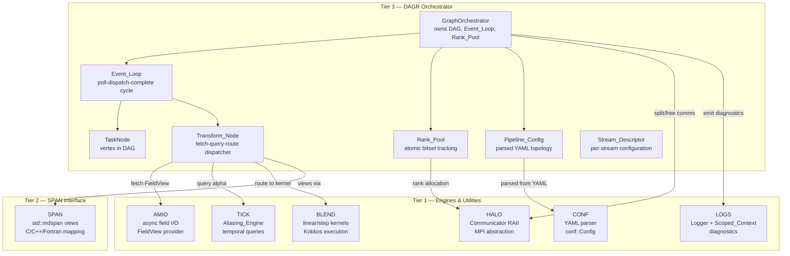
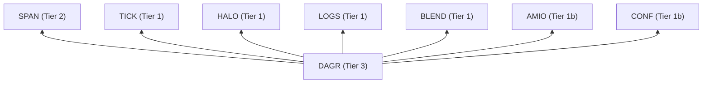
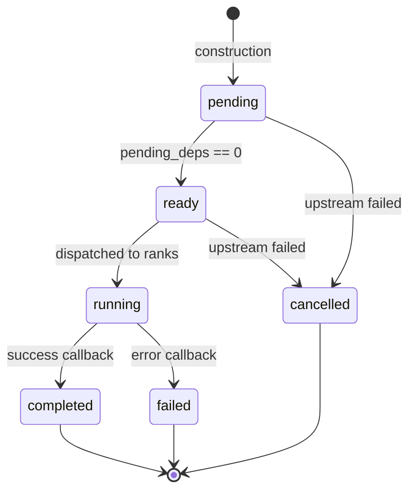
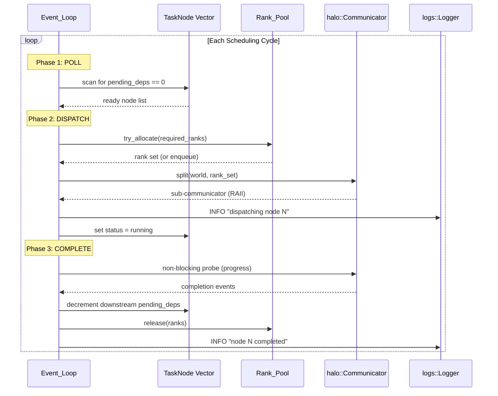
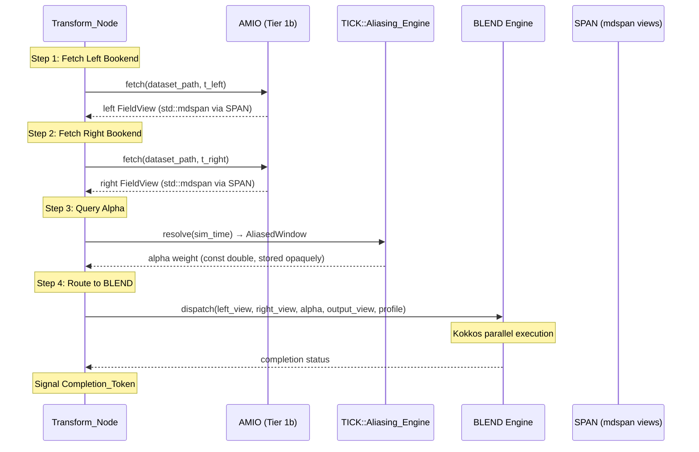
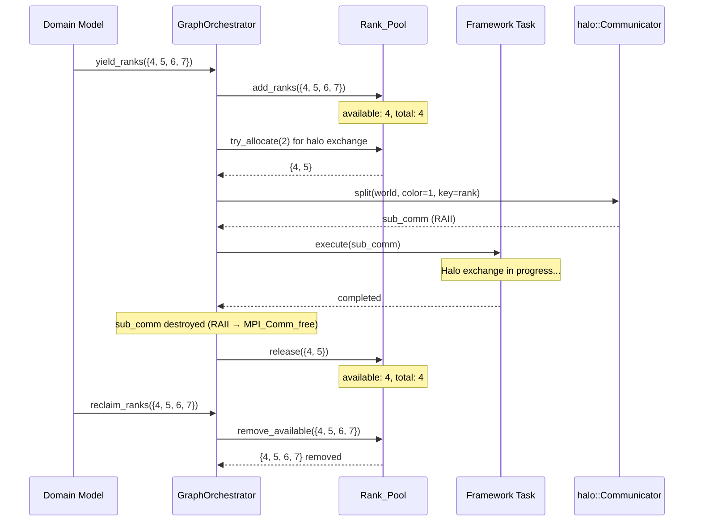

# Design Document: DAGR Graph Orchestrator

## Overview

DAGR (Directed Acyclic Graph Router) is the Tier 3 orchestrator in the HELM ecosystem — a YAML-driven, asynchronous event-loop scheduler whose sole responsibility is routing non-owning memory views (`std::mdspan` via SPAN) between lower-tier computation engines and managing execution dependencies as a DAG.

DAGR performs **zero mathematical calculations** and **zero calendar manipulations**. It queries TICK for temporal state, dispatches work to BLEND/AXIS engines, routes pointers via SPAN, and manages MPI rank pools via HALO. All arithmetic on field data, interpolation weights, and timestamps is delegated to the appropriate Tier 1 engine.

### Design Principles

- **Pure Pointer Router**: DAGR stores, passes, and routes pointers. It never reads numeric content of field data or interpolation weights.
- **Zero-Copy (SPAN)**: All FieldView interfaces use `std::mdspan` non-owning views. SPAN maps between C/C++/Fortran sub-components at the Tier 2 boundary.
- **RAII MPI (HALO)**: Every MPI communicator is a `halo::Communicator` RAII object. No raw `MPI_Comm` handles exist in DAGR source.
- **Asynchronous Event-Driven**: The event loop polls for task readiness and dispatches work without blocking on individual completions.
- **Dynamic Rank Hijacking**: Idle model processors are temporarily reassigned to framework tasks to maximize HPC utilization.
- **Strict C++20**: All code targets the C++20 standard. No Kokkos loops in DAGR itself — parallel execution is delegated to engines.

## Architecture



### Dependency Direction (Tier Enforcement)



All dependencies flow **downward** only. No Tier 1/1b/2 library references DAGR. CMake linkage is PRIVATE to prevent transitive leakage.

### File Layout

```
libs/dagr/
├── include/dagr/
│   ├── dagr.hpp                  ← Public header (GraphOrchestrator)
│   ├── pipeline_config.hpp       ← Pipeline_Config, Stream_Descriptor, enums
│   └── detail/
│       ├── task_node.hpp         ← TaskNode, Transform_Node (PRIVATE)
│       ├── event_loop.hpp        ← Event_Loop (PRIVATE)
│       ├── rank_pool.hpp         ← Rank_Pool (PRIVATE)
│       └── completion_token.hpp  ← Completion_Token (PRIVATE)
├── src/
│   ├── graph_orchestrator.cpp
│   ├── parse_pipeline.cpp
│   ├── event_loop.cpp
│   ├── rank_pool.cpp
│   └── transform_node.cpp
├── tests/
│   ├── generators.hpp              ← DAG + Pipeline generators (Req 13.8)
│   ├── test_yaml_parser.cpp        ← Parser unit tests
│   ├── test_rank_pool.cpp          ← Rank pool unit tests
│   ├── test_transform_node.cpp     ← Transform dispatch unit tests
│   ├── prop_topological_order.cpp  ← Property 1 (Req 13.1)
│   ├── prop_no_orphan.cpp          ← Property 2 (Req 13.2)
│   ├── prop_rank_conservation.cpp  ← Property 3 (Req 13.3)
│   ├── prop_acyclicity_detection.cpp ← Property 4 (Req 13.4)
│   ├── prop_concurrency_limit.cpp  ← Property 5 (Req 13.5)
│   ├── prop_idempotent_shutdown.cpp ← Property 6 (Req 13.6)
│   ├── prop_failure_cascade.cpp    ← Property 7
│   ├── prop_yaml_roundtrip.cpp     ← Property 8
│   ├── prop_dag_construction.cpp   ← Property 9
│   ├── prop_invalid_enum.cpp       ← Property 10
│   ├── prop_missing_field.cpp      ← Property 11
│   └── prop_duplicate_stream.cpp   ← Property 12
└── CMakeLists.txt
```

## Components and Interfaces

### Enums

```cpp
// include/dagr/pipeline_config.hpp
#pragma once
#include <cstdint>

namespace dagr {

/// Temporal interpolation strategy for a stream's bookend blending.
enum class Temporal_Profile : std::uint8_t {
    linear = 0,  ///< Linear interpolation between bookends
    step   = 1   ///< Step function (nearest-neighbor select)
};

/// Out-of-bounds remapping policy when simulation time exceeds dataset coverage.
enum class OutOfBounds_Policy : std::uint8_t {
    clamp = 0,   ///< Clamp to boundary snapshot
    cycle = 1    ///< Cycle within the last year of coverage
};

} // namespace dagr
```

### Stream_Descriptor

```cpp
// include/dagr/pipeline_config.hpp (continued)
#include <filesystem>
#include <string>
#include <compare>

// Forward declaration — DAGR stores tick::Duration as an opaque value
namespace tick { class Duration; }

namespace dagr {

/// Parsed representation of a single I/O stream from the pipeline YAML.
/// Value type: copyable, movable, equality-comparable.
struct Stream_Descriptor {
    std::string            name;               ///< Stream identifier (max 128 chars)
    Temporal_Profile       temporal_profile;    ///< Interpolation strategy
    OutOfBounds_Policy     oob_policy;         ///< Out-of-bounds handling
    std::filesystem::path  dataset_path;       ///< Path to dataset (validated at runtime by AMIO)
    tick::Duration         snapshot_interval;   ///< Opaque duration token for TICK

    bool operator==(const Stream_Descriptor&) const = default;
};

} // namespace dagr
```

### Pipeline_Config

```cpp
// include/dagr/pipeline_config.hpp (continued)
#include <vector>
#include <cstdint>

namespace dagr {

/// Adjacency list edge: from producer_id → consumer_id.
struct Dependency_Edge {
    std::uint32_t producer_id;
    std::uint32_t consumer_id;
};

/// Complete parsed pipeline configuration.
struct Pipeline_Config {
    std::vector<Stream_Descriptor> streams;         ///< Ordered stream declarations
    std::vector<std::string>       task_names;      ///< Task identifiers (index = node ID)
    std::vector<Dependency_Edge>   edges;           ///< DAG adjacency list
    std::uint32_t                  max_concurrency{64};    ///< [1, 1024]
    std::uint32_t                  deadlock_timeout_s{30}; ///< [1, 3600] seconds
    std::uint32_t                  shutdown_timeout_s{30}; ///< Rank reclamation timeout
};

} // namespace dagr
```

### parse_pipeline Free Function

```cpp
// include/dagr/pipeline_config.hpp (continued)
#include <filesystem>

namespace dagr {

/// Parse a pipeline YAML file into a Pipeline_Config.
/// @param yaml_path  Path to the YAML pipeline configuration file
/// @return Fully validated Pipeline_Config (acyclic, no duplicates, all fields present)
/// @throws std::invalid_argument on validation failure (cycles, duplicates, missing fields)
/// @throws conf::Conf_Error on YAML parse failure (propagated from conf::Config::from_file)
[[nodiscard]] Pipeline_Config parse_pipeline(const std::filesystem::path& yaml_path);

} // namespace dagr
```

### GraphOrchestrator

```cpp
// include/dagr/dagr.hpp
#pragma once

#include <cstdint>
#include <memory>
#include <set>
#include <stdexcept>

// Forward declarations only — no lower-tier headers exposed publicly
namespace halo { class Communicator; }
namespace dagr {
    struct Pipeline_Config;
}

namespace dagr {

/// @brief Tier 3 DAG-driven orchestrator for the HELM ecosystem.
///
/// @details GraphOrchestrator owns the complete DAG lifecycle: pipeline construction
/// from YAML, asynchronous event-loop scheduling, dynamic MPI rank hijacking, and
/// orderly teardown. It dispatches to lower-tier engines (TICK, AMIO, BLEND, HALO)
/// and performs no computation itself — it routes pointers and manages execution
/// dependencies.
///
/// GraphOrchestrator is move-only (non-copyable) and manages RAII resources including
/// halo::Communicator objects for MPI rank pools.
class GraphOrchestrator {
public:
    /// Construct from parsed pipeline config and world communicator.
    /// @param config  Pipeline configuration (taken by value, moved into internal state)
    /// @param world   World communicator (taken by rvalue reference, moved)
    /// @throws std::invalid_argument if config contains cyclic dependencies,
    ///         dangling task references, or invalid parameter ranges
    GraphOrchestrator(Pipeline_Config config, halo::Communicator&& world);

    ~GraphOrchestrator();

    // Move-only semantics
    GraphOrchestrator(GraphOrchestrator&&) noexcept;
    GraphOrchestrator& operator=(GraphOrchestrator&&) noexcept;
    GraphOrchestrator(const GraphOrchestrator&) = delete;
    GraphOrchestrator& operator=(const GraphOrchestrator&) = delete;

    /// Enter the event loop and process all tasks to completion.
    /// @throws std::runtime_error if any TaskNode fails (after draining non-cancelled nodes)
    void run();

    /// Execute one scheduling cycle (resolve → dispatch → complete).
    /// @return true if all nodes completed, false if work remains
    bool advance_step();

    /// Drain in-flight tasks, release hijacked ranks, destroy state.
    /// Idempotent: calling on an already-shut-down instance is a no-op.
    void shutdown();

    /// Yield model processors to the framework rank pool.
    /// @param rank_set  Set of MPI rank identifiers to yield
    void yield_ranks(std::set<int> rank_set);

    /// Reclaim previously yielded ranks (deferred if currently allocated).
    /// @param rank_set  Set of MPI rank identifiers to reclaim
    void reclaim_ranks(std::set<int> rank_set);

    // ─── Const Accessors ──────────────────────────────────────────────
    [[nodiscard]] std::uint32_t total_ranks() const noexcept;
    [[nodiscard]] std::uint32_t available_ranks() const noexcept;
    [[nodiscard]] std::uint32_t in_flight_count() const noexcept;
    [[nodiscard]] bool is_shutdown() const noexcept;

private:
    struct Impl;
    std::unique_ptr<Impl> impl_;
};

} // namespace dagr
```

### TaskNode (Internal)

```cpp
// include/dagr/detail/task_node.hpp (PRIVATE)
#pragma once

#include <cstdint>
#include <atomic>
#include <string>

namespace dagr::detail {

/// Task execution status.
enum class Task_Status : std::uint8_t {
    pending   = 0,  ///< Waiting for dependencies
    ready     = 1,  ///< All dependencies resolved, awaiting dispatch
    running   = 2,  ///< Currently executing
    completed = 3,  ///< Finished successfully
    failed    = 4,  ///< Execution error
    cancelled = 5   ///< Cancelled due to upstream failure
};

/// A vertex in the scheduling DAG.
struct TaskNode {
    std::uint32_t             id;              ///< Zero-based sequential index
    std::string               name;            ///< Human-readable identifier
    std::atomic<std::uint32_t> pending_deps;   ///< In-degree countdown (decremented on upstream completion)
    Task_Status               status{Task_Status::pending};
    std::uint32_t             required_ranks{1}; ///< MPI ranks needed for execution

    // Downstream adjacency (indices into the node vector)
    std::vector<std::uint32_t> dependents;
};

} // namespace dagr::detail
```

### Rank_Pool (Internal)

```cpp
// include/dagr/detail/rank_pool.hpp (PRIVATE)
#pragma once

#include <atomic>
#include <cstdint>
#include <set>
#include <vector>

namespace dagr::detail {

/// Lock-free rank tracking using an atomic bitset.
/// Invariant: available_ranks() + allocated_ranks() == total_ranks() at every observable point.
class Rank_Pool {
public:
    /// @param ranks  Initial set of MPI rank identifiers managed by this pool
    explicit Rank_Pool(std::set<int> ranks);

    /// Attempt to allocate `count` ranks from the pool.
    /// @return Set of allocated rank IDs, or empty set if insufficient ranks available
    /// @throws std::invalid_argument if count == 0
    [[nodiscard]] std::set<int> try_allocate(std::uint32_t count);

    /// Return ranks to the pool after task completion.
    void release(const std::set<int>& ranks);

    /// Add newly yielded ranks to the pool.
    void add_ranks(const std::set<int>& ranks);

    /// Remove ranks from the pool (for reclamation). Only removes available ranks.
    /// @return Set of ranks actually removed (may be smaller if some are allocated)
    std::set<int> remove_available(const std::set<int>& ranks);

    [[nodiscard]] std::uint32_t total_ranks() const noexcept;
    [[nodiscard]] std::uint32_t available_ranks() const noexcept;
    [[nodiscard]] std::uint32_t allocated_ranks() const noexcept;

private:
    std::vector<std::atomic<bool>> bitset_;  ///< Per-rank availability flag
    std::vector<int>               rank_ids_; ///< Mapping: index → MPI rank ID
    std::atomic<std::uint32_t>     total_{0};
    std::atomic<std::uint32_t>     available_{0};
};

} // namespace dagr::detail
```

### Event_Loop (Internal)

```cpp
// include/dagr/detail/event_loop.hpp (PRIVATE)
#pragma once

#include <cstdint>
#include <functional>
#include <vector>
#include <queue>

namespace dagr::detail {

/// Completion_Token: opaque handle tracking an in-flight task.
struct Completion_Token {
    std::uint32_t node_id;
    std::uint64_t dispatch_timestamp_ns;  ///< Monotonic clock at dispatch
};

/// The asynchronous poll-dispatch-complete scheduling loop.
class Event_Loop {
public:
    /// Configuration
    struct Config {
        std::uint32_t max_concurrency;      ///< [1, 1024]
        std::uint32_t deadlock_timeout_s;   ///< [1, 3600]
    };

    explicit Event_Loop(Config cfg);

    /// Execute one full poll-dispatch-complete cycle.
    /// @return true if all nodes reached terminal state, false otherwise
    bool cycle();

    /// Check if all nodes are in terminal state.
    [[nodiscard]] bool all_complete() const noexcept;

    /// Current count of dispatched-but-not-completed tasks.
    [[nodiscard]] std::uint32_t in_flight_count() const noexcept;

private:
    // Phase 1: Poll for newly ready nodes
    void poll_ready_nodes();

    // Phase 2: Dispatch ready nodes to available ranks
    void dispatch_ready_nodes();

    // Phase 3: Process completion callbacks
    void process_completions();

    Config config_;
    std::uint32_t in_flight_{0};
    std::uint64_t last_progress_ns_{0};  ///< Timestamp of last progress event
};

} // namespace dagr::detail
```

### Transform_Node Dispatch Method

```cpp
// include/dagr/detail/task_node.hpp (continued)
namespace dagr::detail {

/// @brief Dispatch method for Temporal_Bookend transform tasks.
///
/// Executes the four-step pointer routing sequence:
///   1. Fetch Left FieldView from AMIO (stream dataset, left bounding timestamp)
///   2. Fetch Right FieldView from AMIO (stream dataset, right bounding timestamp)
///   3. Query TICK Aliasing_Engine for interpolation weight (alpha)
///   4. Route pointers to BLEND engine (left, right, alpha, output)
///
/// @pre The stream's dataset must be open in AMIO.
/// @pre The simulation time must be set in TICK.
/// @post The output FieldView contains the blended result written by BLEND.
/// @post DAGR has not modified any FieldView data (zero-computation guarantee).
///
/// @param stream  The Stream_Descriptor configuring this transform
/// @param output  Non-owning mdspan destination for the blended result
/// @param sim_time  Opaque simulation time token forwarded to TICK
///
/// @throws std::runtime_error propagated from AMIO on fetch failure
/// @throws std::runtime_error propagated from TICK on alpha query failure
/// @throws std::runtime_error propagated from BLEND on kernel execution failure
///
/// @note DAGR performs no arithmetic on the routed pointers or field values.
///       It acts as a pure dispatcher.
///
/// @see amio_read() — AMIO FieldView fetch API
/// @see tick::Aliasing_Engine::resolve() — TICK alpha query API
/// @see blend::dispatch() — BLEND kernel dispatch API
void dispatch_temporal_bookend(/* parameters */);

} // namespace dagr::detail
```

## Data Models

### DAG Topology

```text
┌─────────────────────────────────────────────────────────────────┐
│ Pipeline_Config                                                  │
├─────────────────────────────────────────────────────────────────┤
│ streams:          vector<Stream_Descriptor>  (ordered)          │
│ task_names:       vector<string>             (index = node ID)  │
│ edges:            vector<Dependency_Edge>    (producer → consumer)│
│ max_concurrency:  uint32_t                  [1, 1024]           │
│ deadlock_timeout: uint32_t                  [1, 3600] seconds   │
│ shutdown_timeout: uint32_t                  default 30 seconds  │
└─────────────────────────────────────────────────────────────────┘

┌─────────────────────────────────────────────────────────────────┐
│ TaskNode (stored in std::vector, indexed by uint32_t)           │
├─────────────────────────────────────────────────────────────────┤
│ id:              uint32_t          (sequential, stable)          │
│ name:            string            (from Pipeline_Config)        │
│ pending_deps:    atomic<uint32_t>  (in-degree countdown)         │
│ status:          Task_Status       (pending→ready→running→done)  │
│ required_ranks:  uint32_t          (MPI ranks needed)            │
│ dependents:      vector<uint32_t>  (downstream node indices)     │
└─────────────────────────────────────────────────────────────────┘

┌─────────────────────────────────────────────────────────────────┐
│ Rank_Pool                                                        │
├─────────────────────────────────────────────────────────────────┤
│ bitset_:     vector<atomic<bool>>   (per-rank availability)      │
│ rank_ids_:   vector<int>            (index → MPI rank number)    │
│ total_:      atomic<uint32_t>                                    │
│ available_:  atomic<uint32_t>                                    │
│ Invariant: available_ + allocated == total_                      │
└─────────────────────────────────────────────────────────────────┘
```

### TaskNode State Machine



### Event_Loop Cycle



### Transform_Node Dispatch Sequence



### Topological Sort Algorithm (DAG Validation)

The DAG is validated at construction time using Kahn's algorithm:

```text
Algorithm: kahn_topological_sort(nodes, edges)
─────────────────────────────────────────────────
Input:  node_count (uint32_t), edges (vector<Dependency_Edge>)
Output: sorted order (vector<uint32_t>) or throw on cycle

1. Compute in_degree[i] for each node i
2. Initialize queue Q with all nodes where in_degree[i] == 0
3. sorted ← empty vector
4. WHILE Q is not empty:
   a. node ← Q.pop_front()
   b. sorted.push_back(node)
   c. FOR each edge (node → downstream) in adjacency:
      i. in_degree[downstream] -= 1
      ii. IF in_degree[downstream] == 0:
          Q.push_back(downstream)
5. IF sorted.size() != node_count:
   → Cycle detected. Find two nodes still with in_degree > 0.
   → throw std::invalid_argument("cycle: nodeA → nodeB")
6. RETURN sorted
```

Time complexity: O(V + E) where V = nodes, E = edges.

### Rank Hijacking Flow



## Correctness Properties

*A property is a characteristic or behavior that should hold true across all valid executions of a system — essentially, a formal statement about what the system should do. Properties serve as the bridge between human-readable specifications and machine-verifiable correctness guarantees.*

### Property 1: Topological-Order Invariant

*For any* valid DAG of 2 to 128 nodes and 1 to 512 directed edges, every TaskNode's recorded completion sequence number SHALL be strictly greater than the completion sequence numbers of all its upstream dependencies.

**Validates: Requirements 3.1, 3.3, 3.4, 3.6, 13.1**

### Property 2: No-Orphan Invariant

*For any* valid DAG of 2 to 128 nodes and 1 to 512 directed edges, every TaskNode SHALL reach a terminal state (completed or cancelled) within a number of scheduling cycles no greater than the DAG's longest path length plus one.

**Validates: Requirements 3.7, 13.2**

### Property 3: Rank-Conservation Invariant

*For any* scheduling sequence with a generated Rank_Pool of 1 to 64 total ranks, the value returned by `available_ranks()` plus the count of ranks currently allocated to in-flight tasks SHALL equal `total_ranks()` immediately before and after every dispatch and completion event.

**Validates: Requirements 5.1, 5.2, 5.3, 5.9, 13.3**

### Property 4: Acyclicity-Detection

*For any* generated directed graph of 2 to 128 nodes containing at least one cycle, the `parse_pipeline` function or `GraphOrchestrator` constructor SHALL throw `std::invalid_argument` before returning.

**Validates: Requirements 1.7, 2.11, 13.4**

### Property 5: Concurrency-Limit Enforcement

*For any* scheduling sequence with a generated max-concurrency value N in the range 1 to 64, the count of simultaneously dispatched-but-not-completed tasks SHALL never exceed N at any point during Event_Loop execution.

**Validates: Requirements 3.5, 6.5, 13.5**

### Property 6: Idempotent Shutdown

*For any* GraphOrchestrator instance, calling `shutdown()` two or more times (up to 5 calls) SHALL NOT throw an exception on any call after the first, SHALL leave `available_ranks()` equal to `total_ranks()`, and SHALL produce no LOGS emissions beyond those emitted by the first `shutdown()` call.

**Validates: Requirements 1.5, 13.6**

### Property 7: Transitive Cancellation on Failure

*For any* valid DAG and *any* single TaskNode that fails during execution, all TaskNodes that are transitively reachable (downstream) from the failed node via Dependency_Edges SHALL have their status set to `cancelled`, and no cancelled node SHALL have been dispatched for execution after the failure event.

**Validates: Requirements 4.8, 4.9, 4.10, 6.6**

### Property 8: YAML Parsing Round-Trip (Stream_Descriptor)

*For any* generated set of valid Stream_Descriptors (1 to 32 streams with unique names, valid temporal profiles, valid out-of-bounds policies, non-empty paths, and positive snapshot intervals), serializing them to YAML format and parsing with `parse_pipeline` SHALL produce a `Pipeline_Config` whose `streams` vector contains Stream_Descriptors that compare equal to the originals, in the same declaration order.

**Validates: Requirements 2.3, 2.4, 2.5, 2.10, 8.4, 8.5, 8.6, 8.7, 8.8**

### Property 9: DAG Construction Correctness

*For any* valid acyclic adjacency list of 2 to 128 nodes, the constructed DAG SHALL have exactly one TaskNode per declared task, each TaskNode's initial `pending_deps` value SHALL equal its in-degree (number of incoming edges), and if the adjacency list references a task identifier that does not correspond to any declared task, construction SHALL throw `std::invalid_argument`.

**Validates: Requirements 3.1, 3.8**

### Property 10: Invalid Enum Rejection

*For any* stream entry whose `temporal_profile` field is a non-empty string other than "linear" or "step", OR whose `out_of_bounds_policy` field is a non-empty string other than "clamp" or "cycle", `parse_pipeline` SHALL throw `std::invalid_argument` reporting the stream name and the invalid value.

**Validates: Requirements 2.6, 2.7**

### Property 11: Missing Required Field Rejection

*For any* stream entry missing one or more of the four required fields (`temporal_profile`, `out_of_bounds_policy`, `dataset_path`, `snapshot_interval`), `parse_pipeline` SHALL throw `std::invalid_argument` reporting the stream name and the name of the missing field.

**Validates: Requirements 2.8**

### Property 12: Duplicate Stream Name Rejection

*For any* pipeline configuration containing two or more stream entries with the same stream name, `parse_pipeline` SHALL throw `std::invalid_argument` reporting the duplicate stream name.

**Validates: Requirements 2.9**

## Error Handling

| Condition | Exception | Thrown By | Severity |
|-----------|-----------|-----------|----------|
| Cyclic dependency in Pipeline_Config | `std::invalid_argument` | GraphOrchestrator ctor / parse_pipeline | FATAL |
| Dangling task reference in adjacency list | `std::invalid_argument` | GraphOrchestrator ctor | ERROR |
| Duplicate stream names in YAML | `std::invalid_argument` | parse_pipeline | ERROR |
| Missing required YAML field | `std::invalid_argument` | parse_pipeline | WARNING + throw |
| Unrecognized temporal_profile value | `std::invalid_argument` | parse_pipeline | WARNING + throw |
| Unrecognized out_of_bounds_policy value | `std::invalid_argument` | parse_pipeline | WARNING + throw |
| Empty dataset_path or invalid snapshot_interval | `std::invalid_argument` | parse_pipeline | WARNING + throw |
| max_concurrency outside [1, 1024] | `std::invalid_argument` | Event_Loop ctor | ERROR |
| deadlock_timeout outside [1, 3600] | `std::invalid_argument` | Event_Loop ctor | ERROR |
| Zero-rank allocation request | `std::invalid_argument` | Rank_Pool | ERROR |
| TaskNode execution failure | `std::runtime_error` | run() (after drain) | ERROR via LOGS |
| AMIO fetch failure | `std::runtime_error` (propagated) | Transform_Node | ERROR via LOGS |
| TICK query failure | `std::runtime_error` (propagated) | Transform_Node | ERROR via LOGS |
| BLEND execution failure | `std::runtime_error` (propagated) | Transform_Node | ERROR via LOGS |
| halo::Communicator::split failure | exception propagated | GraphOrchestrator | FATAL via LOGS |
| Shutdown timeout with unreturned ranks | N/A (forced shutdown) | shutdown() | FATAL via LOGS |
| Deadlock detection (no progress) | N/A (warning only) | Event_Loop | WARNING via LOGS |

### Error Design Rationale

- **Fail-fast validation**: All structural errors (cycles, missing fields, invalid ranges) are detected at construction/parse time. No deferred validation.
- **Exception propagation**: Errors from lower-tier engines (AMIO, TICK, BLEND, HALO) propagate naturally. DAGR does not wrap or translate them — it logs and re-throws or marks nodes as failed.
- **RAII cleanup**: Exception safety is guaranteed by RAII ownership of `halo::Communicator` objects. No cleanup code in catch blocks.
- **Diagnostic-before-throw**: Parser validation errors emit a WARNING via LOGS before throwing, providing traceable diagnostics on all MPI ranks.
- **No stdout/stderr**: All output goes through LOGS. DAGR never writes to file descriptors directly.

## Testing Strategy

### Property-Based Tests (RapidCheck + Google Test)

DAGR's scheduling logic is well-suited for property-based testing because:

- The DAG scheduler is a pure state machine with clear invariants
- Behavior varies meaningfully across a large input space (arbitrary DAG topologies, rank pool sizes, concurrency limits)
- Universal properties (topological order, rank conservation, concurrency limit) hold across all valid inputs
- 1000+ iterations will expose edge cases in dependency resolution that example-based tests miss

**Configuration:**
- Library: RapidCheck (existing project dependency)
- Framework: Google Test (existing)
- Minimum iterations: 1000 per property (as specified in Requirement 13.7)
- Tag format: `Feature: dagr-graph-orchestrator, Property N: <description>`

**Properties to implement (1 property-based test per correctness property):**

| Property | Generator Strategy |
|----------|-------------------|
| 1: Topological-order | Generate random acyclic DAG (layered construction), simulate execution, verify ordering |
| 2: No-orphan | Generate random DAG, run to completion, verify all nodes terminal within bound |
| 3: Rank-conservation | Generate random rank pool (1-64) + scheduling sequence, verify invariant at every event |
| 4: Acyclicity-detection | Generate random directed graph WITH cycle, verify exception thrown |
| 5: Concurrency-limit | Generate random DAG + max_concurrency N, verify peak in-flight ≤ N |
| 6: Idempotent-shutdown | Generate random DAG, complete, call shutdown 2-5 times, verify no throw after first |
| 7: Transitive-cancellation | Generate random DAG, inject failure at random node, verify all downstream cancelled |
| 8: YAML round-trip | Generate random Stream_Descriptors, serialize, parse, verify equality |
| 9: DAG construction | Generate random acyclic adjacency list, verify in-degrees and dangling detection |
| 10: Invalid enum | Generate random strings ∉ {"linear","step","clamp","cycle"}, verify rejection |
| 11: Missing field | Generate stream entries with random required field subsets removed, verify rejection |
| 12: Duplicate stream | Generate configs with injected duplicate stream names, verify rejection |

### Custom Generators (`tests/generators.hpp`)

```cpp
namespace dagr::gen {

/// Generate a random acyclic DAG by assigning nodes to topological layers.
/// Edges only flow from lower layers to higher layers, guaranteeing acyclicity.
/// @param min_nodes Minimum node count (default 2)
/// @param max_nodes Maximum node count (default 128)
/// @param max_edges Maximum edge count (default 512)
inline auto acyclic_dag(int min_nodes = 2, int max_nodes = 128, int max_edges = 512);

/// Generate a random directed graph guaranteed to contain at least one cycle.
/// Constructed by creating an acyclic DAG then adding a back-edge.
inline auto cyclic_graph(int min_nodes = 2, int max_nodes = 128);

/// Generate a random valid Pipeline_Config with N streams and an acyclic DAG.
inline auto valid_pipeline_config(int min_streams = 1, int max_streams = 32);

/// Generate a random Stream_Descriptor with valid fields.
inline auto valid_stream_descriptor();

/// Generate a random Rank_Pool size in [1, 64].
inline auto rank_pool_size();

/// Generate a random max_concurrency value in [1, 64].
inline auto max_concurrency();

} // namespace dagr::gen
```

### Unit Tests (Specific Examples and Edge Cases)

- **Parser**: missing file → exception propagation, duplicate stream names, invalid enum values, empty dataset_path, zero/negative snapshot_interval
- **Transform_Node**: mock AMIO/TICK/BLEND verifying call sequence (left before right, query after fetch, route after query), Temporal_Profile dispatch (linear vs step)
- **Rank_Pool**: zero-rank request → exception, concurrent allocation/release (ThreadSanitizer), deferred reclamation
- **Event_Loop**: deadlock timeout detection, max_concurrency boundary validation (0, 1, 1024, 1025)
- **GraphOrchestrator**: move semantics, double-shutdown idempotency, RAII communicator destruction order
- **RAII**: exception during split → cleanup verification, cancellation → communicator destruction

### Integration Tests

- Full pipeline execution with mock engines (AMIO, TICK, BLEND) verifying end-to-end scheduling
- Multi-rank MPI test (2-4 ranks) verifying rank hijacking and communicator lifecycle
- YAML file round-trip: write config → parse → verify equality

### Static Analysis (CI)

- Scan all `dagr` namespace source files for prohibited includes (`<cmath>`, `<numeric>`, `<complex>`, `<valarray>`, `<random>`, `<numbers>`)
- Scan for raw MPI function calls (`MPI_Comm_free`, `MPI_Comm_split`, `MPI_Comm_dup`)
- Scan for floating-point arithmetic operators on FieldView/alpha/timestamp variables
- Verify CMake PRIVATE linkage via `cmake --graphviz` dependency graph validation
- Header isolation test: compile `dagr.hpp` standalone without lower-tier headers in include path

### Build Integration

```cmake
# libs/dagr/CMakeLists.txt
add_library(dagr
    src/graph_orchestrator.cpp
    src/parse_pipeline.cpp
    src/event_loop.cpp
    src/rank_pool.cpp
    src/transform_node.cpp
)
target_include_directories(dagr PUBLIC include)
target_link_libraries(dagr
    PRIVATE HELM::SPAN HELM::TICK HELM::HALO HELM::LOGS HELM::BLEND HELM::AMIO HELM::CONF
)
target_compile_features(dagr PUBLIC cxx_std_20)

# Tests
add_executable(dagr_tests
    tests/test_dag_scheduling.cpp
    tests/test_yaml_parser.cpp
    tests/test_rank_pool.cpp
    tests/test_transform_node.cpp
)
target_link_libraries(dagr_tests PRIVATE dagr GTest::gtest_main rapidcheck)
```
