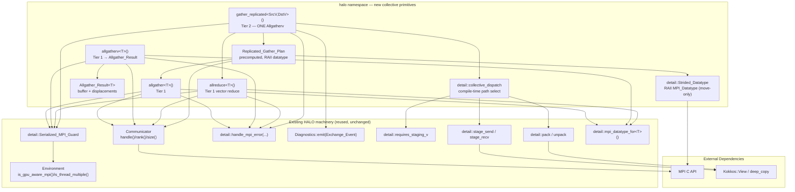
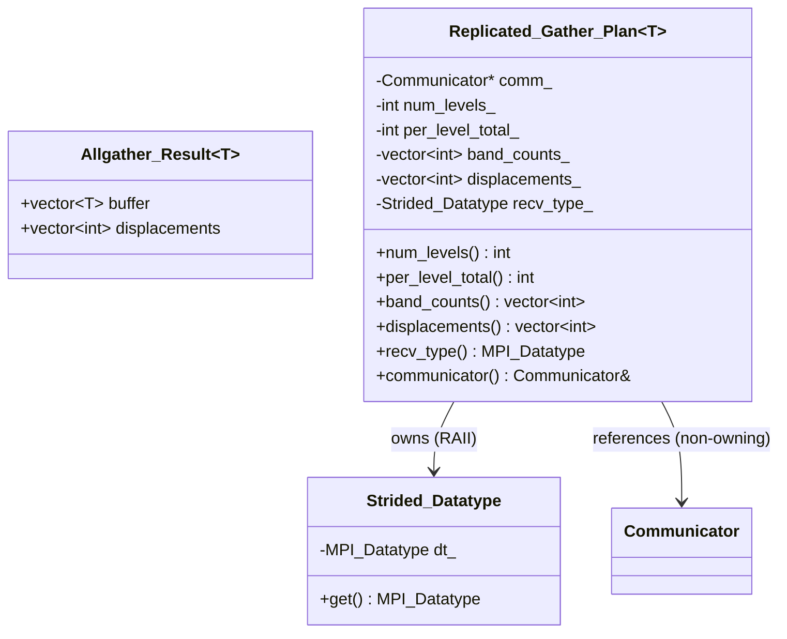
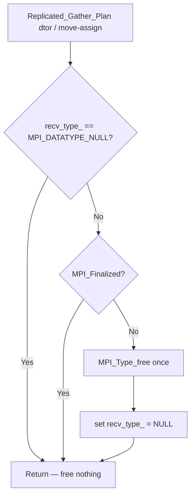

# Design Document: HALO Collective Primitives

## Overview

This feature adds general-purpose MPI **collective** primitives to the HALO
(Hardware-Abstracted Link Operations) Tier 1 micro-library. HALO today provides
only point-to-point neighbor exchange (`Isend`/`Irecv` and
`MPI_Neighbor_alltoallv` over a `Structured_Halo_Plan`). It has no all-gather,
all-gatherv, or all-reduce wrapper. Two independent consumers currently
hand-roll raw MPI against the RAII `Communicator` to express an all-gather
pattern. This feature closes that gap with a **two-tier API** so the pattern is
expressed once, correctly, portably, and without leaking any consumer, library,
or domain name into the API.

- **Tier 1 (low-level collective wrappers).** RAII-`Communicator`-aware,
  `ErrorPolicy`-aware wrappers around `MPI_Allgather`, `MPI_Allgatherv` (with a
  counts-to-displacements prefix sum computed once inside the wrapper, returning
  both the gathered buffer and the displacements), and a vector `MPI_Allreduce`.
  This tier directly serves **Pattern A** (small fixed-count metadata gather +
  prefix sum) and provides the building blocks for Tier 2.

- **Tier 2 (high-level replicated-gather plan).** A precomputed, reusable
  `Replicated_Gather_Plan` plus a `gather_replicated` operation, built on Tier 1,
  that assembles a replicated multi-level field from rank-local contiguous bands
  as a **single** `MPI_Allgatherv` using a derived (strided) MPI datatype so all
  levels land directly in the replicated `[level][j][i]` layout in ONE collective
  with ZERO host reorder. This tier serves **Pattern B**.

The design is deliberately parallel to the existing HALO machinery. It reuses
the RAII `Communicator` (`handle()`, `rank()`, `size()`), `Environment`
(`is_gpu_aware_mpi()`, `is_thread_multiple()`, `thread_support_level()`), the
`detail::Serialized_MPI_Guard`, the `handle_mpi_error` family, the `Diagnostics`
hook, the `detail::memory_traits` (`requires_staging_v`), `detail::staging`, and
`detail::pack_unpack` machinery, and it mirrors `Structured_Halo_Plan` as the
precedent for a precomputed, reusable, RAII-owned plan.

### The measured performance conclusion this design implements

Profiling in the HELM development container (np=2 and np=4, a 1440×720 field,
level counts swept 1→72) established three facts that shape Tier 2:

1. Fusing the small front-gate reductions is only a minor secondary win (~1.0×,
   rising to ~1.36× at np=4 with 72 levels).
2. Naively batching the per-level gather into one large gather **followed by a
   host-side reorder was 2–2.5× SLOWER** — the regression was caused entirely by
   the host reorder copy and its buffer allocation, not by the collective.
3. The isolated "one gather, no host reorder" variant was **1.07–1.43× FASTER**,
   with the advantage growing as rank and level counts increase.

The measured conclusion is therefore explicit: the win requires collapsing many
level-wise collectives into ONE collective **and** eliminating the host reorder.
Tier 2 achieves both with a derived strided receive datatype (host/device-direct
paths) and on-device `pack_unpack` reorder (host-staged path), never a host
reorder copy.

### Design Rationale

| Decision | Rationale |
|----------|-----------|
| Two-tier API (thin wrappers + plan) | Pattern A needs only the thin wrappers; Pattern B needs a reusable plan. Splitting keeps each tier minimal and lets Tier 2 build on Tier 1. |
| Prefix sum computed once inside the Allgatherv wrapper | Requirement 2 — replaces a hand-rolled `MPI_Allgather` + manual offset loop with a single call; the displacements are returned so callers reuse them. |
| `Allgather_Result` returns buffer AND displacements | Callers of Pattern A need both the gathered data and the derived offsets; returning both avoids a second pass. |
| `Replicated_Gather_Plan` mirrors `Structured_Halo_Plan` | Reuses a pattern scientists already understand: precompute once, reuse across invocations; move-only, RAII-owned MPI resource, non-owning `Communicator*`. |
| Derived strided receive datatype (built once, owned by the plan) | The crux of the measured win: one `MPI_Allgatherv` scatters each rank's `[level][band]` contribution directly into `[level][j][i]` with no host reorder. |
| `MPI_Type_create_hindexed_block` + resized extent for the receive type | Chosen over `MPI_Type_vector`/`MPI_Type_indexed` because per-rank bands differ in size and start at rank-specific displacements; see Data Models for the rationale and the receive-placement math. |
| Compile-time GPU-aware dispatch via `requires_staging_v` + flag | Matches the existing exchange templates — no per-element runtime memory-space branch (Requirement 6.5). |
| On-device `pack_unpack` for any required strided source reorder | Requirement 6.4 — the reorder happens on device, never on host, reusing the existing kernels. |
| Readiness/status reductions issued at most once per gather | Requirement 7 — reduction count is independent of `nlev`; multiple checks fuse into one vector `Allreduce`. |
| Zero-count fast path in the Allgather wrapper | Requirement 1.5 — avoids an empty collective and its latency. |
| Invalid-argument guards before any MPI call | Requirements 2.4, 2.5, 4.5, 4.6 — fail fast, deterministically, with a clear message and no partial MPI state. |
| Header-only templates + one small `.cpp` for non-template helpers | Matches HALO: templates in `include/halo/`, non-template implementation under `src/`, device kernels under `detail/`. |

---

## Architecture

### Component Diagram



### Two consumer patterns served (generic framing)

| Pattern | What the caller does | Served by |
|---------|----------------------|-----------|
| **Pattern A** | Gather a small, fixed number of elements per rank (e.g., one count per rank), then derive per-rank displacements via a counts→displacements prefix sum. Latency-bound. | Tier 1 `allgather` / `allgatherv` (prefix sum computed once, returned in `Allgather_Result`). |
| **Pattern B** | Assemble a replicated multi-dimensional field on every rank from rank-local contiguous bands, for many levels of an outer axis, with the gather cost independent of the level count and with zero host reorder. | Tier 2 `Replicated_Gather_Plan` + `gather_replicated` (single `Allgatherv` + strided datatype / on-device reorder). |

No API name, parameter, or doc string references any consumer, other HELM
library, or domain concept. The vocabulary is strictly generic: per-rank counts,
rank-local bands, replicated fields, levels, displacements (Requirement 9.3).

### Namespace and Header Layout

New public headers live alongside the existing HALO public headers and are added
to the umbrella `halo/halo.hpp`. Tier-1 isolation is preserved: every new header
includes only C++ standard library, MPI, Kokkos, and other HALO headers
(Requirement 9.1, 9.2).

```
include/halo/
├── halo.hpp                       // umbrella — add the 3 new includes below
├── collectives.hpp                // NEW Tier 1: allgather / allgatherv / allreduce + Allgather_Result
├── replicated_gather_plan.hpp     // NEW Tier 2: Replicated_Gather_Plan (header-only, templated)
├── gather_replicated.hpp          // NEW Tier 2: gather_replicated<SrcV,DstV>() function template
└── detail/
    ├── strided_datatype.hpp       // NEW: RAII MPI_Datatype wrapper (move-only), mirrors plan datatype ownership
    └── collective_dispatch.hpp    // NEW: compile-time host-direct / device-direct / host-staged selection
```

```
src/
└── collectives.cpp                // NEW: non-template helpers only
                                   //   - prefix_sum(counts) -> displacements
                                   //   - argument-validation helpers (throw std::invalid_argument)
                                   //   - Strided_Datatype construction/free helpers (non-template parts)
```

Rationale for the split: the wrappers and the plan are templated on element type
and Kokkos view type, so they are header-only (like `exchange_structured.hpp`
and `structured_halo_plan.hpp`). The purely non-template pieces — prefix sum over
`int`/`std::size_t`, the argument-validation message builders, and the datatype
construction that does not depend on the element C++ type beyond
`mpi_datatype_for<T>()` — are collected in `src/collectives.cpp` and compiled
into the existing `halo` target (Requirement 12.1, no new library target).

### Umbrella header additions

```cpp
// added to include/halo/halo.hpp
#include <halo/collectives.hpp>
#include <halo/replicated_gather_plan.hpp>
#include <halo/gather_replicated.hpp>
```

### Repository Layout (additions only)

```
libs/halo/
├── include/halo/
│   ├── collectives.hpp                 // NEW
│   ├── replicated_gather_plan.hpp      // NEW
│   ├── gather_replicated.hpp           // NEW
│   └── detail/
│       ├── strided_datatype.hpp        // NEW
│       └── collective_dispatch.hpp     // NEW
├── src/
│   └── collectives.cpp                 // NEW (compiled into `halo`)
└── tests/
    ├── test_collectives.cpp            // NEW GTest, MPI np2/np4 — Tier 1 wrappers + Pattern A
    ├── test_gather_replicated.cpp      // NEW GTest, MPI np2/np4 — Tier 2 end-to-end
    ├── test_collective_spy.cpp         // NEW MPI-spy count tests (Req 10)
    └── prop_gather_replicated.cpp      // NEW RapidCheck property test (Req 11), MPI np2/np4
```

---

## Components and Interfaces

### 1. `Allgather_Result<T>` — Tier 1 Allgatherv output

```cpp
namespace halo {

/// Output of allgatherv(): the gathered receive buffer plus the per-rank
/// displacement array computed from the per-rank counts via a prefix sum.
/// displacements[0] == 0, displacements[k] == sum(counts[0..k-1]),
/// and displacements has length comm.size().
template <typename T>
struct Allgather_Result {
    std::vector<T>   buffer;         ///< Concatenated contributions, all ranks.
    std::vector<int> displacements;  ///< Per-rank start offsets (prefix sum).
};

} // namespace halo
```

`displacements` is returned as `int` because that is what `MPI_Allgatherv`
consumes for its `displs` argument, and Pattern A callers previously maintained
exactly this array by hand.

### 2. Tier 1 collective wrappers (`halo/collectives.hpp`)

All three wrappers follow the identical HALO idiom already used in
`exchange_structured.hpp`: acquire a `detail::Serialized_MPI_Guard`, resolve the
element type via `detail::mpi_datatype_for<T>()`, issue exactly one MPI collective,
and route any non-success return code through `detail::handle_mpi_error(rc, rank,
operation, comm.handle())`.

```cpp
namespace halo {

/// @brief Wrapper around MPI_Allgather for a fixed per-rank element count.
///
/// Every rank contributes `count_per_rank` elements; the result is the
/// ascending-rank concatenation of all ranks' send buffers, length
/// count_per_rank * comm.size().
///
/// Zero-count fast path (Req 1.5): if count_per_rank == 0, returns an empty
/// buffer WITHOUT calling MPI_Allgather.
///
/// @throws std::runtime_error via handle_mpi_error if MPI_Allgather fails
///         (under ErrorPolicy::throw_on_error).
template <typename T>
[[nodiscard]] std::vector<T> allgather(const Communicator& comm,
                                       const T* send_data,
                                       int count_per_rank);

/// Convenience overload accepting a contiguous std::vector send buffer.
template <typename T>
[[nodiscard]] std::vector<T> allgather(const Communicator& comm,
                                       const std::vector<T>& send_data);

/// @brief Wrapper around MPI_Allgatherv with prefix-sum displacements.
///
/// Computes displacements from `counts` (length must equal comm.size()) via a
/// single prefix sum (Req 2.1), issues one MPI_Allgatherv (Req 2.2), and
/// returns both the gathered buffer and the displacements (Req 2.3).
///
/// Validation BEFORE any MPI call:
///   - counts.size() != comm.size()  -> std::invalid_argument (Req 2.5)
///   - any counts[k] < 0             -> std::invalid_argument naming k (Req 2.4)
///
/// @throws std::invalid_argument on bad arguments (before any MPI call).
/// @throws std::runtime_error via handle_mpi_error if MPI_Allgatherv fails.
template <typename T>
[[nodiscard]] Allgather_Result<T> allgatherv(const Communicator& comm,
                                             const T* send_data,
                                             const std::vector<int>& counts);

/// @brief Wrapper around MPI_Allreduce for a vector of one or more elements.
///
/// Issues exactly one MPI_Allreduce over the whole buffer (Req 3.1) and returns
/// an output vector of the same length where element i is the reduction of
/// input[i] across all ranks (Req 3.2). Supports at minimum MPI_MIN, MPI_MAX,
/// MPI_SUM for integer element types (Req 3.3).
///
/// @throws std::runtime_error via handle_mpi_error if MPI_Allreduce fails.
template <typename T>
[[nodiscard]] std::vector<T> allreduce(const Communicator& comm,
                                       const std::vector<T>& input,
                                       MPI_Op op);

namespace detail {

/// Counts-to-displacements prefix sum (Req 2.1). displ[0]=0,
/// displ[k]=sum(counts[0..k-1]). Non-template; lives in src/collectives.cpp.
std::vector<int> prefix_sum(const std::vector<int>& counts);

/// Validate an Allgatherv counts array against comm size; throws
/// std::invalid_argument before any MPI call. Non-template; src/collectives.cpp.
void validate_counts(const std::vector<int>& counts, int comm_size);

} // namespace detail
} // namespace halo
```

Reference sketch of the `allgatherv` body (illustrating the ordering guarantees):

```cpp
template <typename T>
Allgather_Result<T> allgatherv(const Communicator& comm,
                               const T* send_data,
                               const std::vector<int>& counts) {
    const int comm_size = comm.size();
    detail::validate_counts(counts, comm_size);          // Req 2.4, 2.5 — BEFORE MPI
    auto displs = detail::prefix_sum(counts);            // Req 2.1 — once

    const int my_count = counts[comm.rank()];
    const std::size_t total =
        static_cast<std::size_t>(displs.back()) + counts.back();

    Allgather_Result<T> result;
    result.buffer.resize(total);
    result.displacements = displs;                       // Req 2.3

    detail::Serialized_MPI_Guard guard;                  // Req 2.7
    const MPI_Datatype dt = detail::mpi_datatype_for<T>();
    const int rc = MPI_Allgatherv(send_data, my_count, dt,
                                  result.buffer.data(), counts.data(),
                                  displs.data(), dt, comm.handle());  // Req 2.2
    if (rc != MPI_SUCCESS) {
        detail::handle_mpi_error(rc, comm.rank(), "MPI_Allgatherv", comm.handle()); // Req 2.6
    }
    return result;
}
```

### 3. `Replicated_Gather_Plan` — Tier 2 precomputed plan (`halo/replicated_gather_plan.hpp`)

Mirrors `Structured_Halo_Plan`: non-owning `const Communicator*`, deleted copy,
valid move that transfers datatype ownership and leaves the source freeing
nothing, and a destructor that frees the owned datatype exactly once unless MPI
is finalized (Requirements 4.7, 8.2, 8.5, 8.6).

```cpp
namespace halo {

/// @brief Precomputed, reusable plan for a multi-level replicated gather.
///
/// Built once from this rank's per-level band element count and the number of
/// levels. At construction it:
///   1. Allgathers every rank's per-level band count (via Tier 1 allgather).
///   2. Prefix-sums those counts into per-rank displacements (Req 4.2).
///   3. Builds a Strided_Datatype describing how one Allgatherv scatters each
///      rank's [level][band] contribution into the replicated [level][j][i]
///      layout (Req 4.3).
///   4. Stores level count and total per-level element count immutably (Req 4.4).
///
/// Templated on the element type T because the derived receive datatype is
/// built from mpi_datatype_for<T>() and the per-level stride is in units of T.
template <typename T>
class Replicated_Gather_Plan {
public:
    /// @param comm            Communicator (non-owning; must outlive the plan).
    /// @param local_band_count This rank's band element count for ONE level.
    /// @param num_levels      Number of outer-axis levels (> 0).
    /// @throws std::invalid_argument if num_levels == 0 (Req 4.5) or
    ///         local_band_count < 0 (Req 4.6), BEFORE constructing any datatype.
    Replicated_Gather_Plan(const Communicator& comm,
                           int local_band_count,
                           int num_levels);

    ~Replicated_Gather_Plan();                                    // frees datatype once

    Replicated_Gather_Plan(Replicated_Gather_Plan&&) noexcept;     // transfers ownership
    Replicated_Gather_Plan& operator=(Replicated_Gather_Plan&&) noexcept;
    Replicated_Gather_Plan(const Replicated_Gather_Plan&) = delete;             // Req 8.5
    Replicated_Gather_Plan& operator=(const Replicated_Gather_Plan&) = delete;  // Req 8.5

    // ─── Immutable accessors (all noexcept, const) ───────────────────────
    [[nodiscard]] int              num_levels() const noexcept;
    [[nodiscard]] int              per_level_total() const noexcept;   // sum of band counts
    [[nodiscard]] const std::vector<int>& band_counts() const noexcept; // per-rank, one level
    [[nodiscard]] const std::vector<int>& displacements() const noexcept; // per-rank, one level
    [[nodiscard]] MPI_Datatype     recv_type() const noexcept;         // the Strided_Datatype
    [[nodiscard]] const Communicator& communicator() const noexcept;

private:
    const Communicator*      comm_;              // non-owning (Req 8.6)
    int                      num_levels_{0};
    int                      per_level_total_{0};
    std::vector<int>         band_counts_;        // immutable after ctor (Req 4.1)
    std::vector<int>         displacements_;       // immutable after ctor (Req 4.2)
    detail::Strided_Datatype recv_type_;          // RAII, move-only (Req 4.7)
};

} // namespace halo
```

### 4. `detail::Strided_Datatype` — RAII MPI datatype (`halo/detail/strided_datatype.hpp`)

A minimal move-only RAII wrapper mirroring the `Structured_Halo_Plan` topology-
comm ownership semantics: free exactly once on destruction unless MPI is
finalized; moved-from instances free nothing.

```cpp
namespace halo::detail {

class Strided_Datatype {
public:
    Strided_Datatype() noexcept = default;                 // holds MPI_DATATYPE_NULL
    explicit Strided_Datatype(MPI_Datatype dt) noexcept : dt_(dt) {}

    ~Strided_Datatype() { free(); }

    Strided_Datatype(Strided_Datatype&& o) noexcept : dt_(o.dt_) { o.dt_ = MPI_DATATYPE_NULL; }
    Strided_Datatype& operator=(Strided_Datatype&& o) noexcept {
        if (this != &o) { free(); dt_ = o.dt_; o.dt_ = MPI_DATATYPE_NULL; }
        return *this;
    }
    Strided_Datatype(const Strided_Datatype&) = delete;
    Strided_Datatype& operator=(const Strided_Datatype&) = delete;

    [[nodiscard]] MPI_Datatype get() const noexcept { return dt_; }

private:
    void free() noexcept {
        if (dt_ != MPI_DATATYPE_NULL) {
            int finalized = 0;
            MPI_Finalized(&finalized);
            if (!finalized) { MPI_Type_free(&dt_); }   // exactly once (Req 4.7, 8.2)
            dt_ = MPI_DATATYPE_NULL;
        }
    }
    MPI_Datatype dt_{MPI_DATATYPE_NULL};
};

} // namespace halo::detail
```

### 5. `gather_replicated` — Tier 2 execution (`halo/gather_replicated.hpp`)

```cpp
namespace halo {

/// @brief Execute a Replicated_Gather_Plan as a SINGLE MPI_Allgatherv.
///
/// Places every rank's band, for every level, into `dest` in [level][j][i]
/// layout using the plan's Strided_Datatype, with NO host reorder (Req 5.1, 5.2).
/// After success, `dest` holds identical contents on every rank (Req 5.3).
///
/// Reductions: issues AT MOST one Readiness_Reduction before and one
/// Status_Reduction after the gather, each a single vector Allreduce whose count
/// is independent of num_levels (Req 7.1, 7.2, 7.4).
///
/// Dispatch (Req 6): host-direct, device-direct (GPU-aware), or host-staged is
/// selected at COMPILE TIME via detail::collective_dispatch; any required
/// strided reorder of the source band is done on device via detail::pack (Req 6.4).
///
/// Emits Diagnostics begin/end events when a callback is registered (Req 5.6).
///
/// @tparam SrcView Kokkos::View holding this rank's band for all levels.
/// @tparam DstView Kokkos::View for the replicated destination field.
/// @throws std::runtime_error via handle_mpi_error if MPI_Allgatherv fails (Req 5.4).
template <typename T, typename SrcView, typename DstView>
void gather_replicated(const Replicated_Gather_Plan<T>& plan,
                       const SrcView& src,
                       DstView& dest);

} // namespace halo
```

Execution outline (single collective, level-independent reductions):

```
gather_replicated(plan, src, dest):
    diag begin (if active)                                  # Req 5.6
    Serialized_MPI_Guard guard                              # Req 5.5
    # optional readiness gate — ONE vector Allreduce, count independent of nlev
    if readiness checks requested:
        allreduce(comm, {ready_flags...}, MPI_MIN)          # Req 7.1, 7.3, 7.4
    # compile-time path selection (Req 6.5) — no per-element runtime branch
    src_ptr, dest_ptr = collective_dispatch::prepare(src, dest, plan)
        # host-direct    : raw view.data()                  # Req 6.1
        # device-direct  : raw device data() (GPU-aware)    # Req 6.2
        # host-staged    : detail::pack (on-device reorder) # Req 6.4
        #                  then detail::stage_send to host  # Req 6.3
    rc = MPI_Allgatherv(src_ptr, plan.per_level_total(), dt,
                        dest_ptr, /*recvcounts=*/ones(size),
                        /*displs=*/rank_displs, plan.recv_type(),
                        comm.handle())                       # Req 5.1 — exactly ONE
    if rc != MPI_SUCCESS: handle_mpi_error(...)              # Req 5.4
    collective_dispatch::finalize(dest, dest_ptr, plan)
        # host-staged only: detail::stage_recv host -> device # Req 6.3
    # optional status gate — ONE vector Allreduce, count independent of nlev
    if status checks requested:
        allreduce(comm, {status_flags...}, MPI_MIN)          # Req 7.2, 7.4
    diag end (if active)                                     # Req 5.6
```

The receive side uses `recvcounts = 1` per rank against the derived
`recv_type()`; one instance of the derived type spans that rank's band across
all levels. This is what makes a single `Allgatherv` place all levels correctly
(see Data Models for the receive-placement math).

### 6. `detail::collective_dispatch` — compile-time path selection (`halo/detail/collective_dispatch.hpp`)

```cpp
namespace halo::detail {

/// Selects the transfer path at compile time from requires_staging_v<SrcView>
/// and requires_staging_v<DstView> (which already fold in the HALO_GPU_AWARE_MPI
/// flag — see memory_traits.hpp). There is NO runtime branch on memory space
/// per element (Req 6.5).
///
///   requires_staging_v == false  (host view, or device view + GPU-aware MPI)
///       -> pass view.data() directly to MPI  (host-direct / device-direct)
///          Req 6.1, 6.2
///   requires_staging_v == true   (device view, no GPU-aware MPI)
///       -> detail::pack the source band on device into a contiguous device
///          buffer (Req 6.4), detail::stage_send to a host mirror, run the
///          collective on host memory, detail::stage_recv back to device (Req 6.3)
///
/// Implemented with `if constexpr (requires_staging_v<...>)`.
template <typename T, typename SrcView, typename DstView>
struct collective_dispatch { /* prepare(...) / finalize(...) */ };

} // namespace halo::detail
```

---

## Data Models

### The strided receive datatype — the crux

**Goal.** After one `MPI_Allgatherv`, the replicated destination field must hold,
on every rank, `dest[level][j][i]` where the `j`-axis is the concatenation of all
ranks' bands in ascending rank order. Rank `r` contributes, per level, a
contiguous band of `band_counts_[r]` elements starting at `displacements_[r]`
within a single level. The destination is one big buffer of
`num_levels * per_level_total` elements in `[level][j]` (row-major over levels,
then the concatenated `j`-axis) layout.

**The placement problem.** Rank `r`'s contribution for all levels is `num_levels`
separate contiguous runs in the destination:

```
run for level L of rank r occupies destination elements
    [ L * per_level_total + displacements_[r] ,
      L * per_level_total + displacements_[r] + band_counts_[r] )
for L = 0 .. num_levels-1
```

These runs are equally spaced: the stride between consecutive level-runs is
`per_level_total` elements, and each run is `band_counts_[r]` elements long. This
is exactly a **fixed-block, fixed-stride** layout — one derived datatype
describes rank `r`'s entire multi-level contribution.

### Candidate datatype constructions (and the choice)

| Construction | Fit | Verdict |
|--------------|-----|---------|
| `MPI_Type_vector(count=num_levels, blocklength=band_counts_[r], stride=per_level_total, oldtype=T)` | Blocks are equal length, equally spaced — an exact fit for one rank's runs. | **Chosen for the per-rank block shape.** Simple, expresses "num_levels blocks of band_counts_[r], stride per_level_total". |
| `MPI_Type_indexed` / `MPI_Type_create_hindexed` | Needed only when block lengths or displacements are irregular. Here they are regular (constant blocklength, constant stride). | Rejected — more general than necessary; `Type_vector` is the precise tool. |
| `MPI_Type_create_resized` | Adjusts the type's *extent* so `Allgatherv` places rank `r`'s type instance at the correct starting offset `displacements_[r]` via the `displs` argument (in extent units). | **Chosen as the wrapper** around the vector type so the receive `displs[r] = displacements_[r]` lands each rank's band at the right `j`-offset within level 0, with the vector stride carrying it across levels. |

**Chosen construction (per receiving layout, built once in the plan):**

Because `Allgatherv`'s single receive datatype must work for *all* senders, and
each sender `r` has a different `band_counts_[r]`, the receive type is built as a
**resized `hindexed_block`/`vector` family** describing the general multi-level
scatter. Concretely, the plan builds one receive datatype whose base block shape
is the level stride and uses the per-rank `recvcounts`/`displs` pair to select
each rank's band:

```cpp
// Built once in Replicated_Gather_Plan ctor, stored in recv_type_ (Req 4.3).
// Base type: one element T with extent shrunk to 1 element so that the
// Allgatherv `displs` array (in units of the resized extent) addresses the
// j-axis directly.
MPI_Datatype level_strided;
// num_levels blocks, each 1 base-run long, stride = per_level_total elements:
MPI_Type_vector(/*count=*/num_levels_,
                /*blocklength=*/1,           // scaled per sender via recvcounts
                /*stride=*/per_level_total_,
                mpi_datatype_for<T>(),
                &level_strided);
MPI_Datatype resized;
MPI_Type_create_resized(level_strided,
                        /*lb=*/0,
                        /*extent=*/ (MPI_Aint)(sizeof(T)),   // 1 T-element extent
                        &resized);
MPI_Type_commit(&resized);
MPI_Type_free(&level_strided);
recv_type_ = detail::Strided_Datatype{resized};
```

with the gather issued as

```cpp
// recvcounts[r] = band_counts_[r]   (elements per level for sender r)
// rdispls[r]    = displacements_[r] (j-offset of sender r within a level)
MPI_Allgatherv(send_ptr, per_level_total_ /*this rank sends its full band×levels*/,
               send_type_or_T,
               dest_ptr, band_counts_.data(), displacements_.data(),
               recv_type_.get(), comm.handle());
```

**Receive-placement math (why this is correct).** For sender `r`, the receive
datatype has extent 1 `T`-element, so `rdispls[r] = displacements_[r]` positions
the first block at `j = displacements_[r]` in level 0. The vector stride
`per_level_total` advances each subsequent block by exactly one full level, and
`recvcounts[r] = band_counts_[r]` selects `band_counts_[r]` consecutive base
elements per block. The result is that sender `r`'s band lands at
`dest[L][displacements_[r] .. displacements_[r]+band_counts_[r])` for every level
`L`, which is precisely the replicated `[level][j][i]` layout — with no host
reorder pass. The send side contributes `num_levels × band_counts_[myrank]`
contiguous elements in `[level][band]` order, which the derived receive type
scatters across levels.

> Implementation note: the exact base-type/`recvcounts` factoring
> (`blocklength=1` + `recvcounts=band` vs. `blocklength=band` + `recvcounts=1`)
> is an equivalent-outcome detail to be pinned during implementation against the
> container's OpenMPI; both produce the identical byte placement. The invariant
> the plan guarantees is: **one committed receive datatype + the per-rank
> (`band_counts_`, `displacements_`) pair reproduce the naive per-level layout
> exactly** (verified by the Requirement 11 property test).

### Plan state (immutable after construction)



### Prefix sum (shared by Tier 1 and the plan)

```
prefix_sum(counts)[0] = 0
prefix_sum(counts)[k] = counts[0] + counts[1] + ... + counts[k-1]
```

Used by `allgatherv` (Requirement 2.1) and by the plan's displacement
computation (Requirement 4.2). Single implementation in `src/collectives.cpp`.

---

## Correctness Properties

*A property is a characteristic or behavior that should hold true across all
valid executions of a system — essentially, a formal statement about what the
system should do. Properties serve as the bridge between human-readable
specifications and machine-verifiable correctness guarantees.*

### Acceptance-criteria testing prework

The prework classification below drove the property set. It was produced with the
prework tool and is summarized here for traceability. Criteria that describe
one-time setup, infrastructure wiring, or "how the code is organized" are
classified INTEGRATION/SMOKE/not-testable and are covered by example or MPI-spy
tests rather than properties.

- **1.1/1.2 Allgather concatenation & length** → PROPERTY (varies with per-rank
  count and comm size; batched result vs. naive reference).
- **1.5 Zero-count fast path** → PROPERTY/EDGE (count 0 yields empty buffer, no
  collective — verified via MPI-spy).
- **2.1/2.3 Prefix-sum displacements** → PROPERTY (round-trip: displacements
  reconstruct the counts; displs[0]=0).
- **2.4/2.5 Invalid counts guards** → EDGE_CASE/PROPERTY (any negative count, or
  wrong-length array, throws before any MPI call).
- **3.2 Vector Allreduce elementwise** → PROPERTY (each output element equals the
  reduction across ranks; varies with values and op).
- **4.2 Plan displacements non-overlapping/contiguous** → PROPERTY (bands tile a
  level with no gaps or overlaps).
- **5.2/5.3 Single-collective placement & replication** → PROPERTY (batched field
  equals naive per-level/per-rank reference, bit-for-bit for integers; identical
  on every rank).
- **5.1/7.4 Collective counts** → INTEGRATION via MPI-spy (exactly one Allgatherv;
  Allreduce count independent of nlev).
- **6.x GPU-aware dispatch** → covered by compile-time `static_assert` + host-path
  example tests; device paths are compile-time selected (not runtime-varying).
- **9.x Tier-1 isolation** → SMOKE (build-time include-hygiene check).

### Property 1: Allgather concatenation and length

*For any* communicator, element type, and non-negative per-rank element count `k`,
`allgather` SHALL produce a receive buffer of length `k * comm.size()` equal to
the ascending-rank concatenation of every rank's send buffer.

**Validates: Requirements 1.1, 1.2**

### Property 2: Prefix-sum displacements reconstruct counts

*For any* non-negative per-rank count array of length `comm.size()`, the
displacements computed by `allgatherv` SHALL satisfy `displacements[0] == 0` and
`displacements[k] == displacements[k-1] + counts[k-1]` for all `k`, so that the
counts are exactly recoverable from consecutive displacement differences.

**Validates: Requirements 2.1, 2.3**

### Property 3: Allgatherv rejects invalid counts before any MPI call

*For any* counts array that is either the wrong length (≠ `comm.size()`) or
contains at least one negative entry, `allgatherv` SHALL throw
`std::invalid_argument` identifying the offending rank index or expected length,
and SHALL NOT issue any MPI collective.

**Validates: Requirements 2.4, 2.5**

### Property 4: Vector Allreduce is elementwise across ranks

*For any* input vector of one or more integer elements and any of MPI_MIN,
MPI_MAX, MPI_SUM, `allreduce` SHALL produce an output vector of the same length
whose element `i` equals the reduction, under the given op, of every rank's
input element `i`.

**Validates: Requirements 3.1, 3.2, 3.3**

### Property 5: Plan bands tile each level without gaps or overlaps

*For any* set of non-negative per-rank band counts, the plan's displacements
SHALL place each rank's band in a contiguous, non-overlapping region such that the
bands exactly tile the interval `[0, per_level_total)` in ascending rank order.

**Validates: Requirements 4.2, 4.4**

### Property 6: Batched replicated gather equals the naive reference

*For any* randomly generated per-rank band sizes, level count, and element values,
the destination field produced by `gather_replicated` (single Allgatherv +
strided datatype) SHALL equal, element-for-element (bit-for-bit for integer
element types), the field produced by a naive per-level, per-rank gather
reference — and SHALL be identical on every rank.

**Validates: Requirements 5.2, 5.3, 11.1, 11.2**

### Property 7: Gather issues exactly one Allgatherv regardless of level count

*For any* level count, a single `gather_replicated` invocation SHALL cause exactly
one `MPI_Allgatherv` to be recorded by the MPI spy.

**Validates: Requirements 5.1, 10.1**

### Property 8: Reduction count is independent of level count

*For any* two distinct level counts, the number of `MPI_Allreduce` calls recorded
by the MPI spy during a single `gather_replicated` invocation SHALL be identical
across the two level counts.

**Validates: Requirements 7.1, 7.2, 7.4, 10.2**

### Property 9: Each Tier-1 wrapper issues exactly one collective per call

*For any* single call to `allgatherv` (with a non-empty result) or `allreduce`,
the MPI spy SHALL record exactly one `MPI_Allgatherv` or one `MPI_Allreduce`
respectively.

**Validates: Requirements 10.3**

### Property 10: Zero-count Allgather issues no collective

*For any* communicator, when `allgather` is called with a per-rank count of zero,
the result SHALL be an empty buffer and the MPI spy SHALL record no
`MPI_Allgather` call.

**Validates: Requirements 1.5**

---

## Error Handling

### Error Classification

| Error Source | Handling Strategy | User-Facing Behavior |
|---|---|---|
| `MPI_Allgather` / `MPI_Allgatherv` / `MPI_Allreduce` non-success return | Route through `detail::handle_mpi_error(rc, rank, operation, comm.handle())` | ErrorPolicy governs: throw `std::runtime_error` (default) OR write diagnostics + `MPI_Abort` (Req 1.3, 2.6, 3.4, 5.4, 8.1) |
| Allgatherv counts wrong length | Validate before any MPI call | `std::invalid_argument` naming expected length (Req 2.5) |
| Allgatherv negative count entry | Validate before any MPI call | `std::invalid_argument` naming offending rank index (Req 2.4) |
| Plan `num_levels == 0` | Validate before building any datatype | `std::invalid_argument` naming level count (Req 4.5) |
| Plan negative `local_band_count` | Validate before building any datatype | `std::invalid_argument` (Req 4.6) |
| Derived MPI datatype cleanup | `Strided_Datatype` RAII: `MPI_Type_free` exactly once, guarded by `MPI_Finalized` | Silent, leak-free on all exit paths incl. exceptions (Req 4.7, 8.2) |

### Exception Safety Guarantees

| Component | Guarantee |
|---|---|
| `allgather` / `allgatherv` / `allreduce` | Strong — validation throws before any MPI state change; on MPI failure the collective either completed or `handle_mpi_error` runs, no partial buffer is returned |
| `Replicated_Gather_Plan` ctor | Strong — argument guards run before any MPI/datatype creation; if the internal allgather or datatype build throws, no committed datatype leaks (RAII member) |
| `Replicated_Gather_Plan` dtor | No-throw — frees the datatype under an `MPI_Finalized` guard; moved-from plans free nothing |
| `gather_replicated` | Basic — any staging buffers are Kokkos-owned and released on scope exit; the plan's datatype is untouched by execution |

### Datatype cleanup on all paths



Argument validation always precedes MPI calls, so an invalid-argument throw
leaves MPI entirely untouched (no committed datatype, no in-flight collective).

---

## Testing Strategy

### Framework

- **Unit / integration tests:** Google Test, run under `mpirun` in the cece-dev
  container (Requirements 12.2–12.4).
- **Property tests:** RapidCheck (already available in the container per the HALO
  `tests/CMakeLists.txt`), minimum 100 iterations (Requirement 11.3).
- **MPI-spy count tests:** the existing `tests/mpi_interposition.hpp`
  (`halo::testing::MPI_Spy`) linked via the `halo_mpi_spy` static library, using
  `count_of(MPI_Call_Record::Type::...)` — no changes to production collective
  code are needed to enable interception (Requirement 10.5). The spy's
  `MPI_Call_Record::Type` enum will be extended with `Allgather`, `Allgatherv`,
  and `Allreduce` variants in the interposition layer (test-only, not production).

This feature IS suitable for property-based testing: the batched gather and the
Tier-1 wrappers are data transformations with universal input/output properties
(concatenation, prefix-sum, elementwise reduction, batched-equals-naive). PBT
therefore applies and the Correctness Properties above are the specification.

### Dual approach

**Unit / example tests** (`test_collectives.cpp`, `test_gather_replicated.cpp`):
- Pattern A end-to-end: `allgather` of one int per rank + `allgatherv` with
  per-rank counts; assert concatenation, length, and returned displacements.
- Zero-count fast path returns empty and issues no collective.
- Invalid-argument guards: wrong-length counts, negative count, `num_levels==0`,
  negative band count — assert the exact exception type and that no MPI ran.
- Host-path `gather_replicated` on a small `[level][j]` field; compare to a naive
  per-level gather reference.
- Compile-time dispatch: `static_assert` coverage that host views select the
  direct path and device views under `requires_staging_v` select staging (the
  three paths are compile-time selected, not runtime-varying).

**Property tests** (`prop_gather_replicated.cpp`):
- Implements Properties 1–6 and 10 with RapidCheck generators for per-rank band
  sizes, level counts, and element values.
- Each test carries the tag
  `// Feature: halo-collective-primitives, Property N: <text>`.
- Property 6 (batched == naive reference) is the numerical-equivalence test
  (Requirement 11): ≥100 iterations, tagged, integer element type for bit-for-bit
  comparison, generated sizes constrained so total buffers stay well within the
  ~7 GB container budget (e.g., `per_level_total ≤ a few thousand`,
  `num_levels ≤ 16`), run under `mpirun` np2 and np4.

**MPI-spy count tests** (`test_collective_spy.cpp`, Requirement 10):
- Property 7: exactly one `Allgatherv` recorded per `gather_replicated`,
  swept over several level counts.
- Property 8: `Allreduce` count identical across two different level counts.
- Property 9: `allgatherv` records exactly one `Allgatherv`; `allreduce` records
  exactly one `Allreduce`.
- Registered under `mpirun` with np2 and np4 (Requirement 10.4).

### Memory budget and single-run discipline

All 3D/large cases are sized modestly for the ~7 GB container: property
generators cap `per_level_total` and `num_levels` (Requirement 11.5), and no test
allocates a full F720×72 field. All tests complete a single `ctest` run to
completion with no watch mode (Requirement 12.5). Builds use bounded `-j2`
parallelism per the container rules.

### CMake test registration

New test targets are registered in `libs/halo/tests/CMakeLists.txt` using the
existing helpers, so np2/np4 come from the same mechanism as the current suite:

```cmake
# MPI end-to-end tests (Pattern A + Tier 2), reuse halo_add_mpi_test (np = HALO_MPI_TEST_NUMPROCS)
if(EXISTS "${CMAKE_CURRENT_SOURCE_DIR}/test_collectives.cpp")
    halo_add_mpi_test(test_collectives SOURCES test_collectives.cpp LIBRARIES Kokkos::kokkos)
endif()
if(EXISTS "${CMAKE_CURRENT_SOURCE_DIR}/test_gather_replicated.cpp")
    halo_add_mpi_test(test_gather_replicated SOURCES test_gather_replicated.cpp LIBRARIES Kokkos::kokkos)
endif()

# MPI-spy count tests link the halo_mpi_spy static library (Req 10.5)
if(EXISTS "${CMAKE_CURRENT_SOURCE_DIR}/test_collective_spy.cpp")
    halo_add_mpi_test(test_collective_spy SOURCES test_collective_spy.cpp LIBRARIES halo_mpi_spy Kokkos::kokkos)
endif()

# RapidCheck numerical-equivalence property test, MPI-based (Req 11)
if(EXISTS "${CMAKE_CURRENT_SOURCE_DIR}/prop_gather_replicated.cpp")
    halo_add_mpi_test(prop_gather_replicated SOURCES prop_gather_replicated.cpp LIBRARIES Kokkos::kokkos rapidcheck)
    if(TARGET rapidcheck_gtest)
        target_link_libraries(prop_gather_replicated PRIVATE rapidcheck_gtest)
    endif()
    set_tests_properties(prop_gather_replicated PROPERTIES TIMEOUT 120 LABELS "mpi;property")
endif()
```

To also exercise np2 explicitly (Requirements 10.4, 11.6 require "at least 2 and
up to 4"), the spy and property tests are additionally registered with an np2
variant via a second `add_test` using `-np 2`, mirroring the existing
`halo_add_mpi_test` launcher but overriding the rank count.

### Container invocation

All builds and tests run in the cece-dev container via the repo-root wrapper,
never on the host toolchain, with bounded parallelism:

```bash
./setup.sh -c "cmake -S /work -B /work/build -DHALO_BUILD_TESTING=ON && cmake --build /work/build -j2"
./setup.sh -c "ctest --test-dir /work/build --output-on-failure"
```

---

## Tier 1 Isolation Verification

The collective primitives must preserve HALO's Tier 1 independence
(Requirement 9). The verification has two enforced parts:

1. **Include hygiene (Requirement 9.1, 9.2, 9.5).** The build's isolation step
   scans every new collective source and header
   (`include/halo/collectives.hpp`, `replicated_gather_plan.hpp`,
   `gather_replicated.hpp`, `detail/strided_datatype.hpp`,
   `detail/collective_dispatch.hpp`, `src/collectives.cpp`) for any `#include`
   referencing a forbidden component path — `tick/`, `logs/`, `axis/`, `amio/`,
   `span/`, `dagr/`. If any is found, the build FAILS. New headers include only
   `<...>` standard-library headers, `<mpi.h>`, `<Kokkos_*>`, and `halo/...`.
   This reuses the same header-scan gate the existing HALO CI applies (the
   reference design's "Static Analysis: scan HALO headers for forbidden
   includes"); the new files are simply added to that scan's file list.

2. **CMake link hygiene (Requirement 9.4).** The collective sources compile into
   the existing `halo` target under the `HELM::HALO` alias — no new library
   target (Requirement 12.1). No `target_link_libraries`, `add_dependencies`, or
   `find_package` for the collective sources references any `HELM::` target other
   than `HELM::HALO`. Test targets link only `halo`, `GTest::*`, `MPI::MPI_CXX`,
   `Kokkos::kokkos`, `rapidcheck`, and `halo_mpi_spy`.

3. **Generic API check (Requirement 9.3).** The public API names, parameters, and
   documentation use only generic vocabulary (per-rank counts, rank-local bands,
   replicated fields, levels, displacements). No consumer, HELM library, or
   domain-science term appears. This is enforced by review and by the same header
   scan extended with a deny-list of consumer/domain tokens.

---

## Requirements Coverage Map

| Requirement | Design element that satisfies it |
|---|---|
| 1. Low-level Allgather wrapper | `allgather<T>()` in `collectives.hpp`; zero-count fast path; `Serialized_MPI_Guard`; `handle_mpi_error`; Properties 1, 10 |
| 2. Allgatherv + prefix-sum displacements | `allgatherv<T>()` + `Allgather_Result<T>`; `detail::prefix_sum` / `validate_counts` (before any MPI call); Properties 2, 3 |
| 3. Vector Allreduce | `allreduce<T>()` (single call, elementwise, MIN/MAX/SUM); Property 4 |
| 4. Replicated_Gather_Plan precomputation | `Replicated_Gather_Plan<T>` — allgather of band counts, prefix-sum displacements, committed `Strided_Datatype`, immutable level/total; RAII move-only (Req 4.7); Property 5 |
| 5. Single-collective replicated gather | `gather_replicated<...>()` — exactly one `Allgatherv`, strided placement, replicated result, diagnostics; Properties 6, 7 |
| 6. Compile-time GPU-aware dispatch | `detail::collective_dispatch` via `requires_staging_v` + flag; on-device `detail::pack`; `detail::stage_send/recv`; no per-element runtime branch |
| 7. Non-level-scaling readiness/status | At most one readiness + one status vector `allreduce` per gather; count independent of `nlev`; Property 8 |
| 8. RAII/thread-safety/error-policy | `handle_mpi_error` routing; `Strided_Datatype` RAII; `Serialized_MPI_Guard`; deleted copy + valid move; non-owning `Communicator*` |
| 9. Tier 1 isolation | Include-hygiene scan + CMake link hygiene + generic API (see Isolation section) |
| 10. MPI-spy collective-count tests | `test_collective_spy.cpp` using `MPI_Spy`; Properties 7, 8, 9; np2/np4 |
| 11. Numerical-equivalence property test | `prop_gather_replicated.cpp` — Property 6, ≥100 iters, tagged, integer bit-for-bit, budget-capped, np2/np4 |
| 12. Build and test integration | Sources compiled into `halo` (no new target); tests registered with CTest under `HALO_BUILD_TESTING`; cece-dev container; single `ctest` run |
