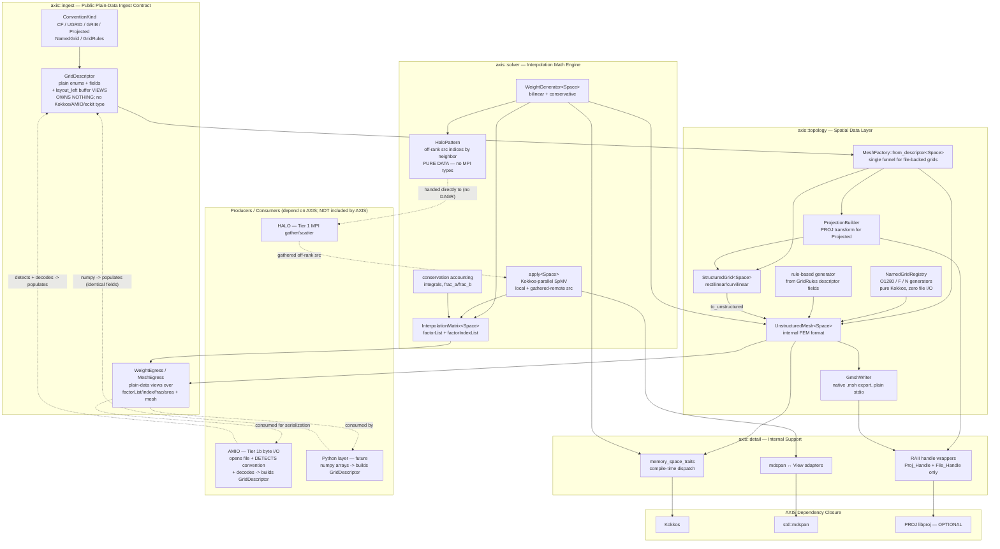
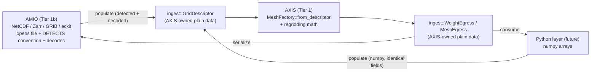
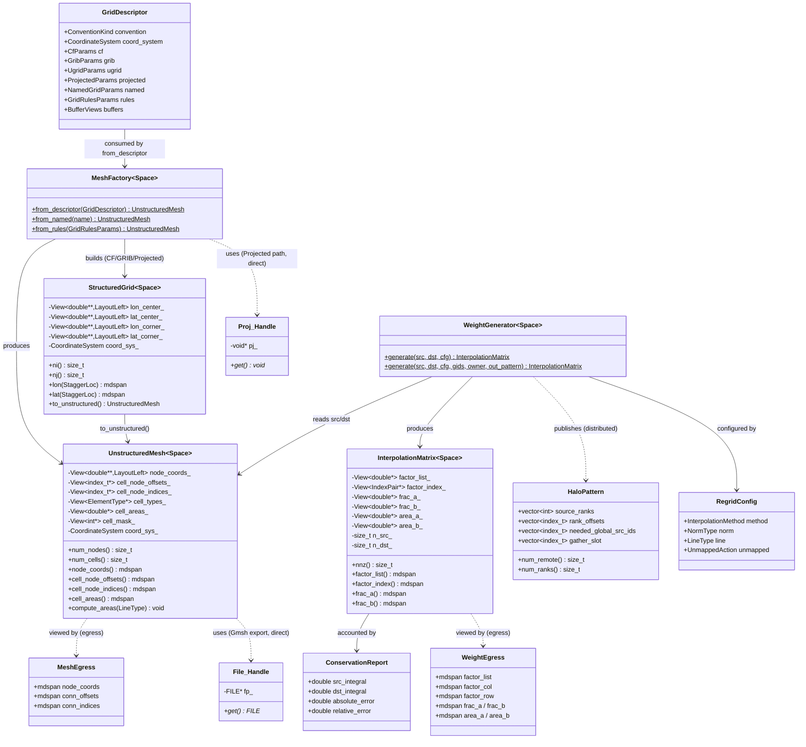
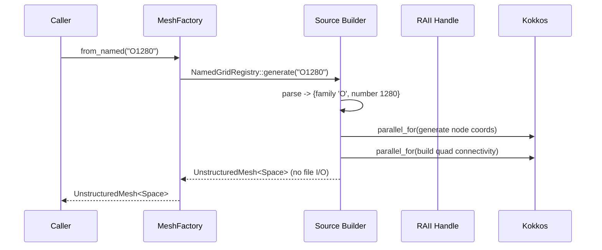
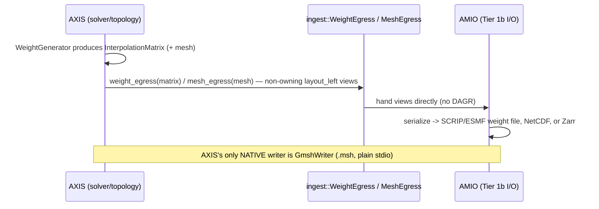
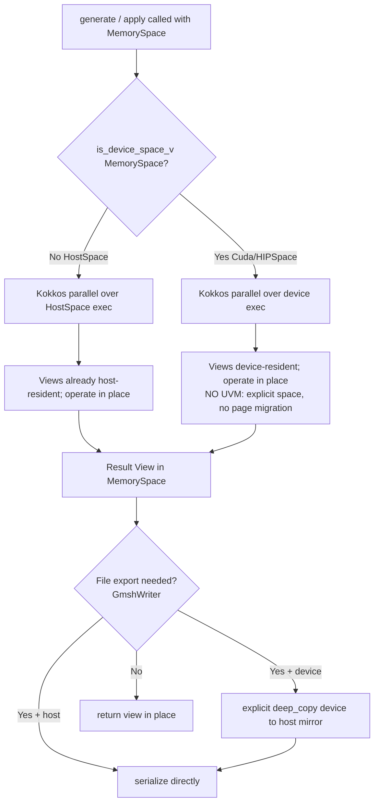

# Design Document: AXIS (Arbitrary eXgrid Interpolation Solver)

## Overview

AXIS is a Tier 1 C++20 micro-library providing stateless spatial interpolation (regridding) for Earth-system fields. It replaces the legacy ESMF spatial-discretization stack — `ESMF_Mesh`, `ESMF_Grid`, `ESMF_LocStream`, `ESMF_Regrid`, and the offline `ESMF_RegridWeightGen` application — with a decentralized, zero-copy, hardware-portable toolkit built on Kokkos.

AXIS is deliberately scoped to **stateless grid semantics and regridding math only**. It opens no files and links no file-format libraries. Instead of reading bytes, AXIS publishes a single **standard, plain-data ingest contract** — `axis::ingest::GridDescriptor` — and *any* producer populates it: today **AMIO** (the HELM Tier-1b bidirectional I/O engine) opens the file, detects the grid convention, decodes it, and hands AXIS a `GridDescriptor`; tomorrow a **Python interface** (pybind11 + numpy) constructs the *same* descriptor from in-memory arrays and feeds AXIS identically. There is **no DAGR mediation** of this handoff — the descriptor *is* the contract, and a producer talks to AXIS directly. Because the descriptor is pure data (plain enums, plain fields, and non-owning `std::mdspan<layout_left>` buffer views — **no Kokkos type, no AMIO type, no eckit type, no file handle**), it is *trivially mirrorable in Python*: this "easily duplicated from numpy" property is an explicit design goal, not an accident.

Symmetrically, **all distributed (cross-rank) communication is delegated to HALO** (the HELM MPI engine) through a neutral, MPI-free **exchange-plan descriptor** (`solver::HaloPattern`) that AXIS *publishes as plain data* for a caller to hand directly to HALO (or to a Python layer). This is a strict application of **dependency inversion**: AXIS exposes data-only contracts and never `#include`s or links AMIO, HALO, or DAGR, so HELM Law #4 (no cross-Tier-1 dependencies) is preserved bit-for-bit. The dependency direction is one-way and acyclic — **AMIO and the future Python layer depend on AXIS's public contract header; AXIS depends on none of them.** AXIS's entire third-party dependency closure beyond Kokkos and `std::mdspan` is a *single optional* library — **PROJ** — retained only because projection-string coordinate transforms are pure math with no equivalent in AMIO's stack.

Concretely, AXIS ingests grids through exactly four mechanisms, and emits them through one:

- **(a) In-memory generators native to AXIS.** Named global weather grids ("O1280", "F128", "N320") and rule-based grids (regular/Gaussian lat-lon, projected) are generated on the fly by Kokkos parallel kernels with **zero file I/O** and zero third-party parsing.
- **(b) The `GridDescriptor` ingest contract.** A producer (AMIO today, Python tomorrow) detects the file convention (CF, UGRID, GRIB), decodes the arrays, and populates a `GridDescriptor`. `MeshFactory::from_descriptor` is the *single funnel* through which every file-backed grid enters AXIS.
- **(c) Gmsh native export.** AXIS natively serializes a mesh to the open-source Gmsh `.msh` format using plain `std::FILE*`/`std::ofstream` (no third-party library). All other serialization (SCRIP/ESMF weight files, NetCDF, Zarr) is delegated to AMIO via the egress contract.
- **(d) PROJ — the only optional third-party dependency.** Projection-string coordinate transforms for `Projected` descriptors are pure math with no equivalent in AMIO's stack, so PROJ genuinely belongs to AXIS.

The library is structured around a strict physical separation between the *ingest contract*, the *spatial data structures*, and the *interpolation math engine*, expressed as namespaces that never leak into each other's contracts:

1. **`axis::ingest`** — the public **plain-data ingest contract**. It defines `GridDescriptor` (and its `ConventionKind` enum + convention-specific metadata) plus the symmetric egress descriptors. This header is header-only, owns no memory, names no Kokkos/AMIO/eckit type, and is the *one* header a producer (AMIO or Python) includes to talk to AXIS.
2. **`axis::topology`** — the spatial data layer. It defines structured (rectilinear/curvilinear) and unstructured grids/meshes (nodes, cells, connectivity, coordinates, center/corner staggers, areas, and masks). `MeshFactory::from_descriptor` assembles the internal mesh from any `GridDescriptor`; `NamedGridRegistry` and the rule generator build meshes purely in memory. This is the replacement for ESMF `Mesh`, `Grid`, and `LocStream`.
3. **`axis::solver`** — the interpolation math engine. It generates interpolation weights (bilinear and first-order conservative), stores them as a sparse interpolation matrix (`factorList` + `factorIndexList` in ESMF terms), and applies them via a Kokkos-parallel sparse matrix-vector multiply (SpMV) over non-owning `std::mdspan<layout_left>` field views. In *distributed* mode it additionally analyzes the generated matrix and publishes a `solver::HaloPattern` — a pure-data description of the off-rank source values the local SpMV needs — that a caller hands directly to HALO for the actual gather. This is the replacement for ESMF `Regrid` / `ESMF_RegridWeightGen` (including the ASMM parallel apply).
4. **`axis::detail`** — internal compile-time traits, memory-space dispatch helpers, and `std::mdspan` ↔ `Kokkos::View` adapters that keep the public API free of backend plumbing.

A central design decision, inherited directly from the ESMF regrid architecture, is the **common internal format strategy**: rather than supporting every (source-grid-type × destination-grid-type × method) combination — which grows quadratically — AXIS converts *all* input grids, structured or not, into a single internal finite-element unstructured mesh (`topology::UnstructuredMesh`). The solver operates exclusively on that representation, so a new grid source only needs a converter to the internal format, not a new weight kernel.

Every multi-dimensional array that crosses the AXIS boundary is a non-owning view typed with `std::layout_left` to match the column-major memory layout of the Fortran domain models that own the data. AXIS never copies a field array, never writes raw CUDA/HIP/OpenMP, and never depends on Unified Virtual Memory (UVM): execution and memory spaces are explicit template parameters, and host/device transfers — where unavoidable for staging decoded buffers — are explicit `Kokkos::deep_copy` calls.

### Design Rationale

| Decision | Rationale |
|----------|-----------|
| Convert all grids to one internal FEM unstructured mesh | Mirrors ESMF's proven strategy; avoids quadratic growth of grid-type × method combinations; a new source needs only a converter, not a new kernel |
| `axis::ingest` vs `axis::topology` vs `axis::solver` namespace split | Physically separates the public plain-data ingest contract from the spatial data structures and from the math engine, so the solver is agnostic to how a mesh was built and the contract is agnostic to who produced it |
| **Publish `ingest::GridDescriptor` as the public ingest contract** | Decouples the I/O *producer* from AXIS entirely. AMIO (today) and a Python layer (tomorrow) populate the *same* plain-data descriptor; AXIS has one consumer entry point (`MeshFactory::from_descriptor`) and zero producer-specific branches. **No DAGR is in the loop** — the descriptor *is* the handoff |
| **Descriptor is plain data, trivially mirrorable in Python** | The descriptor holds only plain enums, plain fields, and non-owning `std::mdspan<layout_left>` views — **no Kokkos type, no AMIO type, no eckit type, no file handle**. A future pybind11 + numpy layer constructs the identical descriptor from numpy arrays and feeds AXIS exactly as AMIO does. "Easily duplicated in Python" is an explicit, tested design goal |
| `std::mdspan<T, extents, std::layout_left>` for all field/coordinate views | Satisfies HELM Law #1 (zero-copy) and matches Fortran column-major layout bit-for-bit; views are non-owning. It is also the HELM *lingua franca* the ingest/egress contracts use so producers and consumers share one buffer type |
| Explicit `MemorySpace`/`ExecSpace` template parameters; no UVM | Satisfies HELM Law #2; guarantees deterministic placement and performance on GPU without implicit page migration. `from_descriptor` copies the producer's host buffers into the target memory space via explicit `Kokkos::deep_copy` |
| Sparse interpolation matrix = `factorList` + `factorIndexList` | Surfaces the exact ESMF weight-file semantics scientists already validate against; enables offline weight reuse |
| **Delegate all file I/O to AMIO (no redundant software stack)** | AMIO is the HELM Tier-1b bidirectional I/O engine and already owns the entire file-format stack (NetCDF-4/Parallel-HDF5, Zarr v3/TensorStore, GRIB2/g2c, eckit YAML/JSON). The producer opens, detects the convention, and decodes; AXIS only interprets descriptor *fields*. This is **zero duplication** of the software stack |
| **Remove ecCodes, yaml-cpp, and NetCDF-C from AXIS** | Each is redundant with AMIO's stack: GRIB decoding belongs to AMIO's g2c driver (ecCodes deleted), YAML/JSON parsing belongs to eckit (yaml-cpp deleted), and CF/UGRID byte reading belongs to AMIO's NetCDF driver (NetCDF-C readers/handles deleted). AXIS keeps only the *semantic interpretation* of the decoded descriptor fields |
| **Dependency inversion for HALO via `solver::HaloPattern` (distributed regridding)** | Applying weights in parallel (ESMF ASMM) needs off-rank source cells. AXIS does no MPI; instead it publishes a neutral `solver::HaloPattern` (plain data, no MPI types) describing which off-rank global source indices it needs per neighbor and the local gather layout. A caller hands that directly to HALO (no DAGR required) for the gather, then hands the gathered buffer back to AXIS's apply step. HELM Law #4 preserved |
| **PROJ is the single optional third-party dependency** | Projection-string (proj4) coordinate transforms are pure math with no equivalent in AMIO's stack, so `detail::Proj_Handle` / `AXIS_ENABLE_PROJ` is retained; everything else file/parse-related is delegated to the producer via the descriptor |
| RAII wrappers for the only retained C resource handles (`PJ*` via `Proj_Handle`; plain-text `FILE*` via `File_Handle`) | Satisfies HELM Law #3; guarantees PROJ cleanup and Gmsh-file cleanup on all exit paths including exceptions. No NetCDF/GRIB/codes handles exist in AXIS anymore — `NetCDF_Handle` and `Grib_Handle` are deleted |
| Registry/factory for named grids ("O1280", "F128", "N320") | Generates standard global weather grids in parallel with zero file I/O, mirroring ECMWF Atlas |
| Kokkos-only parallelism for generation, weight calc, and apply | Satisfies HELM Law #2; one code path runs on CPU `HostSpace` and GPU device spaces |
| Zero includes of TICK/LOGS/HALO/AMIO/SPAN/DAGR/eckit or domain headers | Satisfies HELM Law #4; AXIS is a blind, self-contained Tier 1 utility. The `check_tier1_isolation.sh` static scan forbids all cross-Tier-1 includes, AMIO and HALO included. AMIO is **not** a CMake link dependency of AXIS — the only coupling is the pure-data contract type AXIS itself defines |

---

## Architecture

### Component Diagram



> **Reading the seams.** Solid arrows are real C++ includes/links inside AXIS's dependency closure (Kokkos, `std::mdspan`, optional PROJ). Dashed arrows are *data hand-offs* across the dependency-inversion boundary. Their arrowheads point **at AXIS-owned contract types** (`ingest::GridDescriptor`, the egress views, `solver::HaloPattern`): AMIO and the future Python layer **depend on AXIS's public contract header**, never the reverse, and **DAGR is not in the loop**. AMIO (or Python) opens the file, *detects the grid convention*, decodes it, and populates a `GridDescriptor`; AXIS consumes it through the single funnel `MeshFactory::from_descriptor`. No AXIS signature ever names an AMIO handle, a HALO communicator, an eckit type, or an MPI type.

### Integration Seams (Dependency Inversion)

AXIS is pure compute + grid semantics. The two things a real coupled forecast needs that AXIS deliberately does **not** do — touching the filesystem and talking across MPI ranks — are delegated to sibling HELM libraries (and, in the future, to a Python layer) through *data-only contracts that AXIS itself owns*. AXIS never `#include`s or links those libraries; it only defines neutral plain-data types and accepts/returns them. Critically, **there is no DAGR mediation**: a producer talks to AXIS's contract directly. This is dependency inversion with the dependency arrow pointing **at** AXIS — AMIO and the Python layer depend on AXIS's public contract header; AXIS depends on none of them.

| Concern | Owner / Producer | What AXIS exposes (AXIS-owned pure data) | How it is wired |
|---|---|---|---|
| Byte-level input + **grid-convention detection** (open file, sniff CF/UGRID/GRIB, decode) | **AMIO** today, **Python** tomorrow | `ingest::GridDescriptor` — a `ConventionKind` + plain convention metadata + non-owning `std::mdspan<layout_left>` views over the decoded arrays | Producer populates the descriptor and calls `MeshFactory::from_descriptor` directly. No DAGR |
| Byte-level output (SCRIP/ESMF weight files, regridded fields, serialized meshes) | **AMIO** today, **Python** tomorrow | `ingest::WeightEgress` / `ingest::MeshEgress` — plain-data views over `factor_list`/`factor_index`/`frac`/`area` + mesh node/connectivity | Consumer reads the egress views and serializes them. AXIS itself natively writes only Gmsh. No DAGR |
| Off-rank source gather for distributed apply (ESMF ASMM) | **HALO** | `solver::HaloPattern` — off-rank global source ids grouped per neighbor + the local gather layout; **contains no MPI type** | Caller hands the pattern directly to HALO, gets the gathered buffer, hands it back to AXIS's `apply`. No DAGR required |

Four invariants make the inversion airtight:

1. **No forbidden includes.** AXIS includes no header from HALO, AMIO, TICK, LOGS, SPAN, DAGR, eckit, or domain science. `cmake/check_tier1_isolation.sh` statically scans shipping sources and fails the build if any such `#include` (or Fortran `use`) appears — AMIO and HALO are on the forbidden list alongside the other Tier-1 components.
2. **No leaked third-party types.** Because the contracts are plain data (mdspans, vectors, enums, key/value maps, integer indices), no `MPI_Comm`, `eckit::*`, `nc_*`, `codes_handle*`, `Kokkos::View`, or TensorStore type ever appears in the `ingest` contract or any AXIS public signature. AXIS's public surface is `std::mdspan` + plain structs (and Kokkos only *inside* `topology`/`solver`, never in the contract).
3. **One-way, acyclic dependency.** AMIO (Tier 1b) and the future Python layer `#include` AXIS's `ingest/grid_descriptor.hpp` and depend on AXIS. AXIS depends on neither. **AMIO is not a CMake link dependency of AXIS** — the only coupling is the pure-data contract type AXIS defines and owns.
4. **Zero stack duplication.** AXIS reuses AMIO's NetCDF/Zarr/GRIB/eckit stack *transitively, through the descriptor hand-off* — it does not re-link any of it. AXIS's own dependency closure is just Kokkos + `std::mdspan` + (optional) PROJ.

#### The "trivially mirrorable in Python" property

Because `GridDescriptor` is header-only plain data with non-owning buffer views and **no AXIS-internal machinery**, two completely independent producers populate the *identical* contract:

- **AMIO** decodes a NetCDF/GRIB/Zarr file, lays the coordinate/connectivity arrays out `layout_left`, fills in the `ConventionKind` and metadata, and wraps the arrays in `std::mdspan` views.
- **A future Python layer** (pybind11 + numpy) takes numpy arrays (already strided views over contiguous memory), fills in the *same* `ConventionKind` and metadata fields, and wraps the numpy buffers in the *same* `std::mdspan` views.

AXIS's `from_descriptor` cannot tell the two apart and contains **no producer-specific branch** — this producer-equivalence is an explicit correctness property (see Property 9). It is what makes a native Python interface to AXIS a thin wrapper rather than a re-implementation.

#### Distributed Regridding Seam (HALO)

The legacy ESMF reality is that applying interpolation weights in parallel (ESMF's ASMM — Array Sparse Matrix Multiply) requires gathering off-rank source cell values, because a destination cell owned by one rank may need source cells owned by another. AXIS performs the *analysis* of which off-rank values are needed, but never the MPI itself, and **does not require DAGR** to broker the exchange:

- The `WeightGenerator` / `InterpolationMatrix` can run in a **distributed mode** in which the source and destination meshes carry a *global cell index* per local cell (`global_ids`).
- After generating the local sparse matrix, AXIS inspects every `factor_index()[k].col` (a global source index). Any source index not owned locally is an off-rank dependency. AXIS groups those global indices by owning neighbor rank and records, per remote source cell, the local gather slot where its value will land. It publishes this as `solver::HaloPattern` — a struct of `std::vector<index_t>` lists, with **no MPI types**.
- A caller hands the pattern directly to HALO, which performs the actual cross-rank gather, returning a contiguous *halo/ghost source buffer* of the off-rank values in the order AXIS asked for.
- AXIS's `apply` accepts that gathered buffer alongside the local source view; the SpMV reads local source cells from the local view and remote source cells from the gathered buffer. AXIS may also accept a caller-supplied abstract gather callback/functor that returns the off-rank values, keeping AXIS blind to *how* they were communicated. The single-rank/shared-memory `apply` overload is unchanged and is the default.

```mermaid
sequenceDiagram
    participant Caller as Caller (HALO-aware host)
    participant AXIS as AXIS solver
    participant HALO as HALO (MPI engine)

    Note over AXIS: meshes carry global_ids per local cell
    Caller->>AXIS: WeightGenerator::generate(src, dst, cfg, global_ids, owner_of_src, out_pattern)
    AXIS->>AXIS: build local sparse matrix (factorList/factorIndexList)
    AXIS->>AXIS: scan col indices; group off-rank global src ids by neighbor rank
    AXIS-->>Caller: publish solver::HaloPattern (plain data, NO MPI types)

    Caller->>HALO: gather(pattern) — HALO owns MPI_Comm/Irecv/Isend
    HALO-->>Caller: gathered off-rank source buffer (AXIS's requested slot order)
    Caller->>AXIS: apply(matrix, pattern, local_src, gathered_src, dst)
    AXIS->>AXIS: SpMV reads local view + gathered buffer -> dst (Kokkos)
    AXIS-->>Caller: dst field populated
    Note over AXIS,HALO: No MPI type ever appears in an AXIS signature; no DAGR in the loop
```

#### I/O Seam (AMIO) — Producer Detects, AXIS Interprets the Descriptor

AMIO is the HELM Tier-1b asynchronous, **bidirectional** I/O engine: it already owns the entire file-format dependency stack (NetCDF-4 + Parallel HDF5, Zarr v3 via TensorStore with NCZarr fallback, GRIB2 via nceplibs-g2c, and eckit for YAML/JSON config parsing) and handles both **input** (ingestion, look-ahead prefetch, spatial subsetting on read) and **output**. AXIS therefore opens no files, detects no conventions at the byte level, and links no file-format library:

- **Input.** AMIO opens the file, **detects the grid convention** (CF, UGRID, GRIB, projected, named, or a GridRules YAML spec parsed by eckit), decodes the arrays, and produces an `ingest::GridDescriptor`: a `ConventionKind` tag, the convention-specific metadata as plain fields, and the decoded coordinate/connectivity arrays as `layout_left` `std::mdspan` views. AXIS interprets the descriptor *fields* through `MeshFactory::from_descriptor` and builds the internal mesh. AXIS owns the *semantic interpretation of descriptor fields*; AMIO owns the *bytes and the convention detection*.
- **Output.** AXIS produces weight arrays (the `InterpolationMatrix` views) and mesh buffers entirely in memory and exposes them through the symmetric `ingest::WeightEgress` / `ingest::MeshEgress` plain-data contract; AMIO serializes them to SCRIP/ESMF weight files, NetCDF/Zarr fields, or meshes. AXIS itself natively writes only Gmsh `.msh` (plain stdio, no third-party library).



### Namespace Structure

```
axis::                              // Top-level public namespace (umbrella only)
├── ingest::                        // PUBLIC plain-data ingest/egress contract (header-only)
│   ├── GridDescriptor              // The ingest contract: ConventionKind + metadata + buffer VIEWS
│   ├── ConventionKind              // Enum: CF / UGRID / GRIB / Projected / NamedGrid / GridRules
│   ├── CfParams                    // CF grid_mapping parameters (plain fields)
│   ├── UgridParams                 // UGRID topology attrs (dim names, start_index)
│   ├── GribParams                  // GRIB grid-description keys (gridType, Ni/Nj, gaussian N, ...)
│   ├── ProjectedParams             // proj4/PROJ string for Projected
│   ├── NamedGridParams             // named-grid token (e.g. "O1280")
│   ├── GridRulesParams             // rule kind, bbox, resolution, gaussian_n
│   ├── BufferViews                 // non-owning layout_left mdspan views (coords/CSR/dims/areas/mask)
│   ├── WeightEgress                // egress: plain-data views over factorList/index/frac/area
│   └── MeshEgress                  // egress: plain-data views over mesh nodes + CSR connectivity
├── topology::                      // Spatial data structures + builders/generators
│   ├── UnstructuredMesh<Space>     // Internal FEM unstructured mesh (common format)
│   ├── StructuredGrid<Space>       // Rectilinear / curvilinear grid
│   ├── MeshFactory                 // from_descriptor (single file-backed funnel) + in-memory generators
│   ├── ProjectionBuilder           // PROJ/proj4 transform for Projected descriptors (optional dep)
│   ├── NamedGridRegistry           // On-the-fly named-grid factory (O1280, F, N) — pure Kokkos
│   ├── RuleGenerator               // Rule-based generation from GridRules descriptor fields
│   ├── GmshWriter                  // Native Gmsh .msh export (plain stdio, no third-party lib)
│   ├── ElementType / StaggerLoc    // Enums: cell topology + stagger location
│   └── CoordinateSystem            // Enum: spherical-deg / spherical-rad / cartesian-3D
├── solver::                        // Interpolation math engine
│   ├── InterpolationMatrix<Space>  // Sparse weights: factorList + factorIndexList
│   ├── WeightGenerator<Space>      // Bilinear + first-order conservative weight calc
│   ├── HaloPattern                 // Off-rank source-gather pattern (plain data, NO MPI types)
│   ├── RegridConfig                // Method, NormType, LineType, UnmappedAction
│   ├── InterpolationMethod         // Enum: Bilinear, Conservative1stOrder
│   ├── NormType                    // Enum: DstArea (default), FracArea
│   ├── LineType                    // Enum: Cartesian, GreatCircle
│   ├── UnmappedAction              // Enum: Error, Ignore
│   ├── apply<Space>()              // Kokkos-parallel SpMV: dst = S · src (local [+ gathered remote])
│   └── ConservationReport          // source/destination integrals, frac/area sums
└── detail::                        // Internal compile-time + RAII support
    ├── is_device_space<S>          // constexpr device-space trait
    ├── memory_space_t<V>           // extract memory space from a view
    ├── to_mdspan() / to_view()     // std::mdspan ↔ Kokkos::View adapters (layout_left)
    ├── Proj_Handle                 // RAII wrapper for PROJ PJ* (only retained C handle)
    └── File_Handle                 // RAII wrapper for std::FILE* (optional standalone .msh text writer)
```

### Header Layout

```
include/axis/
├── axis.hpp                        // Umbrella header (includes all public headers)
├── ingest/
│   ├── grid_descriptor.hpp         // GridDescriptor + ConventionKind + *Params + BufferViews (header-only contract)
│   └── egress.hpp                  // WeightEgress / MeshEgress plain-data egress contract
├── topology/
│   ├── unstructured_mesh.hpp       // UnstructuredMesh<Space>
│   ├── structured_grid.hpp         // StructuredGrid<Space>
│   ├── mesh_factory.hpp            // MeshFactory facade (from_descriptor + in-memory generators)
│   ├── projection_builder.hpp      // ProjectionBuilder (PROJ transform for Projected)
│   ├── named_grid_registry.hpp     // NamedGridRegistry + generators
│   ├── rule_generator.hpp          // RuleGenerator (rule->mesh from GridRules fields)
│   ├── gmsh_writer.hpp             // GmshWriter (native .msh export, plain stdio)
│   └── enums.hpp                   // ElementType, StaggerLoc, CoordinateSystem
├── solver/
│   ├── interpolation_matrix.hpp    // InterpolationMatrix<Space>
│   ├── weight_generator.hpp        // WeightGenerator<Space>
│   ├── halo_pattern.hpp            // HaloPattern (distributed seam, plain data, NO MPI types)
│   ├── regrid_config.hpp           // RegridConfig + method/norm/line/unmapped enums
│   ├── apply.hpp                   // apply<Space>() SpMV function template
│   └── conservation.hpp            // ConservationReport + integral helpers
└── detail/
    ├── memory_traits.hpp           // is_device_space, memory_space_t
    ├── mdspan_interop.hpp          // to_mdspan / to_view adapters
    └── raii_handles.hpp            // Proj_Handle, File_Handle (only retained C handles)
```

### Repository Layout

```
libs/axis/                          // Standalone repo / submodule within HELM workspace
├── CMakeLists.txt                  // Target-centric build (produces HELM::AXIS)
├── cmake/
│   ├── AXISConfig.cmake.in         // Exported package config template
│   ├── AXISConfigVersion.cmake.in
│   └── check_tier1_isolation.sh    // Static scan for forbidden HELM/domain includes
├── include/axis/                   // Public headers (as above)
├── src/
│   ├── topology/
│   │   ├── unstructured_mesh.cpp   // Non-template mesh operations
│   │   ├── structured_grid.cpp     // to_unstructured() conversion
│   │   ├── mesh_factory.cpp        // from_descriptor funnel + in-memory generator dispatch (always built)
│   │   ├── projection_builder.cpp  // PROJ-backed (guarded by AXIS_ENABLE_PROJ)
│   │   ├── named_grid_registry.cpp // Always built (pure math generators)
│   │   ├── rule_generator.cpp      // Always built (rule->mesh generation, no parser)
│   │   └── gmsh_writer.cpp         // Always built (native plain-stdio .msh writer)
│   ├── solver/
│   │   ├── weight_generator.cpp
│   │   ├── interpolation_matrix.cpp
│   │   ├── halo_pattern.cpp        // Distributed off-rank pattern analysis (always built)
│   │   └── conservation.cpp
│   └── fortran/                    // iso_c_binding C-interop (guarded by BUILD_FORTRAN)
│       ├── handle_registry.hpp
│       └── axis_c_interop.cpp
├── fortran/
│   └── axis_mod.f90                // Fortran module (iso_c_binding)
├── tests/
│   ├── CMakeLists.txt
│   ├── test_conservation.cpp       // Σ src == Σ dst proof
│   ├── test_constant_field.cpp     // partition-of-unity preservation
│   ├── test_bilinear_exactness.cpp // linear-field exact reproduction
│   ├── test_descriptor_roundtrip.cpp // mesh -> GridDescriptor -> from_descriptor reproduces mesh
│   ├── test_producer_equivalence.cpp // AMIO-style vs Python-style descriptor -> identical mesh
│   ├── test_descriptor_validation.cpp // bad/inconsistent descriptor throws std::invalid_argument
│   ├── test_named_and_rules.cpp    // named grids (O1280) + GridRules generation
│   ├── test_gmsh_roundtrip.cpp     // native Gmsh export -> reimport round-trip
│   ├── test_distributed_apply.cpp  // HaloPattern + gathered-buffer apply equivalence
│   ├── test_spmv_apply.cpp
│   └── prop_*.cpp                  // RapidCheck property tests
├── data/                           // Small reference grids/weights for tests
├── README.md
└── .gitignore
```

---

## Components and Interfaces

### Memory & Layout Conventions

All field and coordinate data crossing the AXIS boundary use `std::mdspan` with an explicit `std::layout_left` mapping and an explicit memory space. The library defines convenience aliases so every signature states its layout and ownership intent up front.

```cpp
namespace axis {

// Column-major (Fortran) layout, the ONLY layout AXIS accepts at its boundary.
// HELM Law #1: these are non-owning views over memory the domain model owns.
template <class T, std::size_t Rank>
using field_view =
    std::mdspan<T, std::dextents<std::size_t, Rank>, std::layout_left>;

using field1d = field_view<double, 1>;   // unstructured field: [n_cells]
using field2d = field_view<double, 2>;   // structured field:   [ni, nj]  (i fastest)

// Index type used throughout the sparse matrix and connectivity tables.
using index_t = std::int64_t;

} // namespace axis
```

### 1. `axis::detail` — Compile-Time Memory Space Dispatch

The solver and topology generators are templated on a Kokkos memory space. The `detail` traits select host vs device code paths at compile time with no virtual dispatch and no UVM reliance.

```cpp
namespace axis::detail {

/// True when MemorySpace is a GPU/device space (data not directly host-addressable).
template <class MemorySpace>
struct is_device_space : std::false_type {};

template <> struct is_device_space<Kokkos::HostSpace> : std::false_type {};
#ifdef KOKKOS_ENABLE_CUDA
template <> struct is_device_space<Kokkos::CudaSpace>    : std::true_type {};
#endif
#ifdef KOKKOS_ENABLE_HIP
template <> struct is_device_space<Kokkos::HIPSpace>     : std::true_type {};
#endif

template <class MemorySpace>
inline constexpr bool is_device_space_v = is_device_space<MemorySpace>::value;

/// The execution space paired with a memory space (Kokkos default mapping).
template <class MemorySpace>
using exec_space_t = typename MemorySpace::execution_space;

/// Wrap a column-major std::mdspan as an unmanaged Kokkos::View in the SAME
/// memory space WITHOUT copying. The LayoutLeft View matches layout_left exactly.
/// Precondition: the mdspan's data lives in MemorySpace (caller's responsibility).
template <class T, class MemorySpace, std::size_t Rank>
[[nodiscard]] auto to_view(field_view<T, Rank> m, MemorySpace) noexcept;

/// Inverse adapter: expose a LayoutLeft unmanaged View as a layout_left mdspan.
template <class ViewType>
[[nodiscard]] auto to_mdspan(ViewType v) noexcept;

} // namespace axis::detail
```

### 2. `axis::detail` — RAII Resource Handles

Only one C-style resource handle survives in AXIS: the PROJ transformation object, wrapped in a move-only RAII type whose destructor releases the resource on all exit paths and never throws (HELM Law #3). Because AXIS no longer opens NetCDF datasets, decodes GRIB messages, or parses YAML — all of that is AMIO's job, surfaced to AXIS as decoded buffers — there are no `NetCDF_Handle`, `Grib_Handle`, or any other file-format handles. An optional `File_Handle` remains *only* for the standalone plain-text `.msh` convenience writer (it uses `std::FILE*`/`std::ofstream`, which add no third-party dependency); the preferred Gmsh path produces a buffer for AMIO to serialize.

```cpp
namespace axis::detail {

/// RAII wrapper for a PROJ transformation object (PJ*). PROJ is AXIS's ONLY
/// optional third-party dependency, retained because projection-string coordinate
/// transforms are pure math with no equivalent in AMIO's stack.
class Proj_Handle {
public:
    /// Construct from a PROJ definition string. Throws std::runtime_error if
    /// PROJ cannot parse the definition (proj_create returns nullptr).
    explicit Proj_Handle(const std::string& proj_string);
    ~Proj_Handle();                                   // proj_destroy(pj_)

    Proj_Handle(Proj_Handle&&) noexcept;
    Proj_Handle& operator=(Proj_Handle&&) noexcept;
    Proj_Handle(const Proj_Handle&) = delete;
    Proj_Handle& operator=(const Proj_Handle&) = delete;

    [[nodiscard]] void* get() const noexcept;         // raw PJ* (opaque to callers)
private:
    void* pj_{nullptr};                               // PJ* (kept void* to avoid PROJ in header)
};

/// RAII wrapper for std::FILE* — used ONLY by the optional standalone Gmsh .msh
/// text writer. Plain text I/O adds no third-party library, so this is acceptable
/// in a Tier-1-PURE library. The preferred Gmsh path emits a buffer for AMIO to
/// serialize and does not use this handle at all.
class File_Handle {
public:
    File_Handle(const std::filesystem::path& path, const char* mode);
    ~File_Handle();                                   // std::fclose(fp_)

    File_Handle(File_Handle&&) noexcept;
    File_Handle& operator=(File_Handle&&) noexcept;
    File_Handle(const File_Handle&) = delete;
    File_Handle& operator=(const File_Handle&) = delete;

    [[nodiscard]] std::FILE* get() const noexcept;
private:
    std::FILE* fp_{nullptr};
};

} // namespace axis::detail
```

### 3. `axis::topology::UnstructuredMesh` — The Common Internal Format

`UnstructuredMesh` is the finite-element unstructured representation that every source converts into and that the solver operates on exclusively. It owns Kokkos Views in a single memory space; all accessors return `std::mdspan<layout_left>` so consumers never copy.

```cpp
namespace axis::topology {

enum class ElementType : std::uint8_t { Triangle, Quadrilateral, Tetrahedron, Hexahedron };
enum class StaggerLoc  : std::uint8_t { Center, Corner };
enum class CoordinateSystem : std::uint8_t { SphericalDeg, SphericalRad, Cartesian3D };

/// Finite-element unstructured mesh: nodes (vertices) + elements (cells) with
/// arbitrary mixed element types, stored CSR-style for cell→node connectivity.
/// Templated on Kokkos memory space (HELM Law #2: explicit placement, no UVM).
template <class MemorySpace = Kokkos::HostSpace>
class UnstructuredMesh {
public:
    using memory_space = MemorySpace;

    UnstructuredMesh() = default;

    /// Construct by adopting pre-built device/host arrays (move-in, no copy).
    UnstructuredMesh(Kokkos::View<double**, Kokkos::LayoutLeft, MemorySpace> node_coords,
                     Kokkos::View<index_t*,  MemorySpace>                    cell_node_offsets,
                     Kokkos::View<index_t*,  MemorySpace>                    cell_node_indices,
                     Kokkos::View<ElementType*, MemorySpace>                 cell_types,
                     CoordinateSystem coord_sys);

    [[nodiscard]] std::size_t num_nodes()    const noexcept;
    [[nodiscard]] std::size_t num_cells()    const noexcept;
    [[nodiscard]] CoordinateSystem coord_system() const noexcept;

    /// Node coordinates as a layout_left view: [num_nodes, spatial_dim].
    [[nodiscard]] field_view<const double, 2> node_coords() const noexcept;

    /// CSR connectivity: node indices of cell c are
    /// cell_node_indices[cell_node_offsets[c] .. cell_node_offsets[c+1]).
    [[nodiscard]] field_view<const index_t, 1> cell_node_offsets() const noexcept;
    [[nodiscard]] field_view<const index_t, 1> cell_node_indices() const noexcept;

    /// Per-cell areas (area_a / area_b in ESMF weight-file terms). Computed via
    /// compute_areas() using the configured LineType; spherical areas in
    /// square radians. Returns an empty view until compute_areas() runs.
    [[nodiscard]] field_view<const double, 1> cell_areas() const noexcept;

    /// Optional integer mask per cell (0 == masked, matching ESMF mask_a/mask_b).
    [[nodiscard]] field_view<const int, 1> cell_mask() const noexcept;

    /// Kokkos-parallel computation of cell areas. line == GreatCircle uses
    /// spherical-excess area; line == Cartesian uses planar polygon area.
    void compute_areas(solver::LineType line);

private:
    Kokkos::View<double**, Kokkos::LayoutLeft, MemorySpace> node_coords_;
    Kokkos::View<index_t*,  MemorySpace> cell_node_offsets_;
    Kokkos::View<index_t*,  MemorySpace> cell_node_indices_;
    Kokkos::View<ElementType*, MemorySpace> cell_types_;
    Kokkos::View<double*, MemorySpace> cell_areas_;
    Kokkos::View<int*,    MemorySpace> cell_mask_;
    CoordinateSystem coord_sys_{CoordinateSystem::SphericalDeg};
};

} // namespace axis::topology
```

### 4. `axis::topology::StructuredGrid` — Rectilinear/Curvilinear Grids

Structured grids are represented directly (logically rectangular, `[ni, nj]`) and converted to the internal unstructured form for the solver. This is the replacement for ESMF `Grid` with center/corner staggers.

```cpp
namespace axis::topology {

template <class MemorySpace = Kokkos::HostSpace>
class StructuredGrid {
public:
    using memory_space = MemorySpace;

    /// Construct from center coordinates [ni, nj] (curvilinear) and optional
    /// corner coordinates [ni+1, nj+1]. Coordinates are layout_left.
    StructuredGrid(Kokkos::View<double**, Kokkos::LayoutLeft, MemorySpace> lon_center,
                   Kokkos::View<double**, Kokkos::LayoutLeft, MemorySpace> lat_center,
                   CoordinateSystem coord_sys);

    [[nodiscard]] std::size_t ni() const noexcept;
    [[nodiscard]] std::size_t nj() const noexcept;

    /// Center / corner coordinate accessors as layout_left views.
    [[nodiscard]] field_view<const double, 2> lon(StaggerLoc s = StaggerLoc::Center) const;
    [[nodiscard]] field_view<const double, 2> lat(StaggerLoc s = StaggerLoc::Center) const;

    void set_corners(Kokkos::View<double**, Kokkos::LayoutLeft, MemorySpace> lon_corner,
                     Kokkos::View<double**, Kokkos::LayoutLeft, MemorySpace> lat_corner);

    /// Convert this structured grid to the common internal FEM format. Each
    /// logical cell becomes a quadrilateral element built in parallel via Kokkos.
    /// This is the single conversion every solver path funnels through.
    [[nodiscard]] UnstructuredMesh<MemorySpace> to_unstructured() const;

private:
    Kokkos::View<double**, Kokkos::LayoutLeft, MemorySpace> lon_center_, lat_center_;
    Kokkos::View<double**, Kokkos::LayoutLeft, MemorySpace> lon_corner_, lat_corner_;
    CoordinateSystem coord_sys_;
};

} // namespace axis::topology
```

### 5. `axis::ingest::GridDescriptor` — The Public Plain-Data Ingest Contract

`GridDescriptor` is the single, standard, **plain-data value type** that every file-backed grid enters AXIS through. A *producer* — AMIO today, a Python (pybind11 + numpy) layer tomorrow — opens the file, **detects the grid convention**, decodes the arrays, and populates this descriptor; AXIS interprets it. The descriptor is **header-only pure data**: plain enums, plain fields, and *non-owning* `std::mdspan<…, std::layout_left>` views over arrays the **producer owns**. It contains **no `Kokkos::View`, no AMIO type, no eckit type, no file handle, and no file path** — so a Python layer can build the identical descriptor from numpy arrays with zero AXIS-internal machinery. This "trivially mirrorable in Python" property is an explicit, tested design goal (Property 9).

```cpp
namespace axis::ingest {

/// How to interpret the descriptor's metadata and buffers. The producer sets
/// this after detecting the file's grid convention; AXIS branches on it ONCE
/// inside MeshFactory::from_descriptor.
enum class ConventionKind : std::uint8_t {
    CF,         ///< CF-conventions structured grid (grid_mapping + coord vars)
    UGRID,      ///< UGRID unstructured mesh (node/edge/face topology)
    GRIB,       ///< GRIB2 grid-description keys (gridType, Ni/Nj, Gaussian N, ...)
    Projected,  ///< Regular grid in a PROJ/proj4 projection (AXIS transforms via PROJ)
    NamedGrid,  ///< A registry token (e.g. "O1280"); AXIS generates it in-memory
    GridRules   ///< Rule parameters (kind, bbox, resolution, gaussian_n); AXIS generates
};

// NOTE: CoordinateSystem is the SAME enum used throughout axis::topology
// (SphericalDeg / SphericalRad / Cartesian3D). The contract reuses topology's
// value set rather than inventing a parallel one (see topology/enums.hpp).
using topology::CoordinateSystem;

/// Convention-specific metadata, held as PLAIN DATA. Only the member matching
/// GridDescriptor::convention is meaningful; the rest are default-constructed.
/// (A std::variant could be used; explicit fields are chosen so a Python layer
/// can populate by name without variant gymnastics.)

/// CF grid_mapping parameters (cf-conventions ch.5.6). Strings/scalars only.
struct CfParams {
    std::string grid_mapping_name;          ///< e.g. "latitude_longitude", "lambert_conformal_conic"
    std::map<std::string, double> mapping_parameters; ///< e.g. standard_parallel, false_easting
    std::string x_coordinate_name;          ///< name of the decoded X/lon buffer
    std::string y_coordinate_name;          ///< name of the decoded Y/lat buffer
};

/// UGRID topology attributes (ugrid-conventions). Plain dimension/var names.
struct UgridParams {
    std::string node_dimension;             ///< name of the node dimension
    std::string edge_dimension;             ///< name of the edge dimension (optional)
    std::string face_dimension;             ///< name of the face dimension
    int         connectivity_start_index{0};///< 0- or 1-based connectivity offset
    int         topology_dimension{2};      ///< 2 (surface) or 3 (volume)
};

/// GRIB grid-description keys (as surfaced by AMIO's g2c driver). Plain scalars.
struct GribParams {
    std::string grid_type;                  ///< "regular_ll", "regular_gg", "reduced_gg", ...
    int         ni{0};                       ///< points along a parallel (Ni)
    int         nj{0};                       ///< points along a meridian (Nj)
    int         gaussian_n{0};               ///< Gaussian truncation N (0 if not Gaussian)
    double      lat_first{0.0};              ///< latitudeOfFirstGridPointInDegrees
    double      lon_first{0.0};              ///< longitudeOfFirstGridPointInDegrees
    double      lat_last{0.0};               ///< latitudeOfLastGridPointInDegrees
    double      lon_last{0.0};               ///< longitudeOfLastGridPointInDegrees
};

/// Projected-grid parameters. AXIS transforms via PROJ (its only optional dep).
struct ProjectedParams {
    std::string proj_string;                ///< proj4 / PROJ definition string
    std::array<double, 4> bbox{};           ///< {min_x, min_y, max_x, max_y} in projection units
    std::array<double, 2> resolution{};     ///< {dx, dy} in projection units
};

/// Named-grid parameters: just the registry token. AXIS generates in-memory.
struct NamedGridParams {
    std::string name;                       ///< e.g. "O1280", "F128", "N320"
};

/// Rule-based parameters (a GridRules YAML FILE is parsed by the PRODUCER —
/// AMIO via eckit, or Python — into these plain fields; AXIS never parses YAML).
struct GridRulesParams {
    enum class Kind : std::uint8_t { RegularLatLon, GaussianRegular, GaussianReduced, Projected };
    Kind   kind{Kind::RegularLatLon};
    std::array<double, 4> bbox{-180.0, -90.0, 180.0, 90.0};
    std::array<double, 2> resolution{1.0, 1.0};
    int    gaussian_n{0};
    std::string proj_string;                ///< when kind == Projected
};

/// Non-owning views over the DECODED arrays the producer supplies. AXIS COPIES
/// out of these into the target Kokkos memory space (explicit deep_copy, no UVM);
/// the descriptor OWNS NOTHING. All views are std::layout_left (HELM lingua
/// franca). Unused members are left empty (extent 0) per ConventionKind.
struct BufferViews {
    // Unstructured (UGRID): node coordinates [n_nodes, ndim] + CSR connectivity.
    field_view<const double, 2> node_coords{};        ///< [n_nodes, ndim]
    field_view<const double, 2> corner_coords{};      ///< optional cell corners [n_corners, ndim]
    field_view<const index_t, 1> conn_offsets{};      ///< CSR offsets, length n_cells + 1
    field_view<const index_t, 1> conn_indices{};      ///< CSR node indices

    // Structured (CF / GRIB / Projected): center coordinate fields.
    field_view<const double, 2> center_x{};           ///< [ni, nj] (or [ni,1] rectilinear)
    field_view<const double, 2> center_y{};           ///< [ni, nj]
    std::size_t ni{0};                                ///< structured dim i (0 if unstructured)
    std::size_t nj{0};                                ///< structured dim j (0 if unstructured)

    // Optional per-cell metadata (any convention).
    field_view<const double, 1> areas{};              ///< optional precomputed cell areas
    field_view<const int, 1>    mask{};               ///< optional 0/1 cell mask
};

/// THE INGEST CONTRACT. A producer fills this; MeshFactory::from_descriptor
/// consumes it. Pure data: copyable, no destructor logic, no owned resources.
struct GridDescriptor {
    ConventionKind   convention{ConventionKind::CF};
    CoordinateSystem coord_system{CoordinateSystem::SphericalDeg};

    // Exactly one of these is meaningful, selected by `convention`:
    CfParams         cf{};
    UgridParams      ugrid{};
    GribParams       grib{};
    ProjectedParams  projected{};
    NamedGridParams  named{};
    GridRulesParams  rules{};

    // Decoded buffers (empty for NamedGrid / GridRules, which AXIS generates).
    BufferViews      buffers{};
};

} // namespace axis::ingest
```

> **Why fields instead of inheritance/handles.** Everything here is a value or a non-owning view. A pybind11 layer maps numpy arrays to `field_view` (numpy arrays are contiguous/strided buffers; AXIS requires `layout_left`, which numpy can produce with `order='F'`), fills the matching `*Params` struct, sets `convention`, and calls `from_descriptor` — identical to AMIO's path.

### 6. `axis::topology::MeshFactory` — Descriptor Funnel + In-Memory Generators

`MeshFactory` is the single public entry point for constructing meshes. **`from_descriptor` is the one funnel through which all file-backed sources enter AXIS**: it branches on `descriptor.convention` exactly once and assembles the internal `UnstructuredMesh<MemorySpace>`, copying the producer's host buffers into the target Kokkos memory space via explicit `Kokkos::deep_copy` (HELM Law #2: no UVM). No method takes a `std::filesystem::path` and no method opens a file or links a file-format library — the producer (AMIO or Python) already opened, detected, and decoded. The remaining methods are the pure in-memory generators that are native to AXIS (named grids and rule-based generation), which need no producer at all.

```cpp
namespace axis::topology {

/// Stateless facade. Every method returns an UnstructuredMesh in MemorySpace.
/// No method opens a file or links a file-format library.
template <class MemorySpace = Kokkos::HostSpace>
class MeshFactory {
public:
    /// THE SINGLE FILE-BACKED FUNNEL. Assemble an UnstructuredMesh from a
    /// producer-populated GridDescriptor. Branches on descriptor.convention:
    ///   - CF        -> interpret cf params + center_x/center_y -> StructuredGrid -> to_unstructured()
    ///   - GRIB      -> reconstruct geometry from grib params    -> StructuredGrid -> to_unstructured()
    ///   - Projected -> ProjectionBuilder (PROJ) over projected params + buffers
    ///   - UGRID     -> adopt node_coords + CSR connectivity directly
    ///   - NamedGrid -> NamedGridRegistry::generate(named.name)  (ignores buffers)
    ///   - GridRules -> RuleGenerator::generate(rules)           (ignores buffers)
    /// Copies the descriptor's (host) buffer views into MemorySpace via explicit
    /// Kokkos::deep_copy when the producer memory is not already in MemorySpace;
    /// adopts them with NO copy when the space already matches (Property 8).
    ///
    /// Validation: throws std::invalid_argument for an unknown ConventionKind,
    /// a missing required field/buffer for the selected kind, inconsistent buffer
    /// extents, or a null buffer where one is required (Property 7 / 11).
    [[nodiscard]] static UnstructuredMesh<MemorySpace>
        from_descriptor(const ingest::GridDescriptor& descriptor);

    /// In-memory named-grid generation (no producer, no file). Convenience
    /// wrapper over NamedGridRegistry; equivalent to a NamedGrid descriptor.
    [[nodiscard]] static UnstructuredMesh<MemorySpace>
        from_named(std::string_view grid_name);

    /// In-memory rule-based generation (no producer, no file). Convenience
    /// wrapper over RuleGenerator; equivalent to a GridRules descriptor.
    [[nodiscard]] static UnstructuredMesh<MemorySpace>
        from_rules(const ingest::GridRulesParams& rules);
};

} // namespace axis::topology
```

> **One funnel, no producer branching beyond convention.** `from_descriptor` is the *only* place a file-backed grid is interpreted, and it branches solely on `ConventionKind` — never on *who* produced the descriptor. An AMIO-populated descriptor and a Python-populated descriptor with identical fields take identical code paths (Property 9).

### 7. `ProjectionBuilder` and `RuleGenerator` — AXIS-Native Construction Helpers

Only two construction helpers survive as AXIS code (besides the named-grid registry below): the **PROJ projection builder** (AXIS's single optional third-party dependency) and the **rule generator** (pure Kokkos math). The former is invoked by `from_descriptor` for a `Projected` descriptor; the latter for a `GridRules` descriptor. Neither opens a file, and the CF/UGRID/GRIB *file readers* and their RAII handles (`CFReader`, `UgridReader`, `GribReader`, `NetCDF_Handle`, `Grib_Handle`) are **deleted** — that knowledge is now reduced to interpreting descriptor *fields* inside `from_descriptor`, not parsing file layouts.

```cpp
namespace axis::topology {

/// PROJ projection builder. Transforms a regular grid laid out in projection
/// space (bbox + resolution) to geographic coordinates via detail::Proj_Handle.
/// This is the ONLY helper guarded by an optional dependency (AXIS_ENABLE_PROJ);
/// projection math has no equivalent in AMIO's stack, so it genuinely belongs
/// to AXIS. Invoked by MeshFactory::from_descriptor for ConventionKind::Projected.
class ProjectionBuilder {
public:
    template <class MemorySpace>
    [[nodiscard]] static StructuredGrid<MemorySpace>
        build(const ingest::ProjectedParams& params);   // uses detail::Proj_Handle
};

/// Rule-based generator. Builds a mesh purely from the GridRules parameters in a
/// descriptor (kind, bbox, resolution, gaussian_n) using a Kokkos parallel
/// kernel — NO file enumeration and NO YAML/JSON parsing. A GridRules YAML FILE
/// is parsed by the PRODUCER (AMIO via eckit, or Python) into GridRulesParams;
/// AXIS only generates the mesh from those fields. The former YamlGridBuilder
/// file-parsing path and its yaml-cpp dependency are DELETED; this generation
/// logic is what remains. Invoked by from_descriptor for ConventionKind::GridRules.
class RuleGenerator {
public:
    template <class MemorySpace>
    [[nodiscard]] static UnstructuredMesh<MemorySpace>
        generate(const ingest::GridRulesParams& rules);
};

} // namespace axis::topology
```

> **What moved out of AXIS.** CF/UGRID/GRIB byte reading, GRIB decoding (ecCodes), and YAML/JSON parsing (yaml-cpp) all belonged to producers and are gone from AXIS. The producer detects the convention and decodes; `from_descriptor` interprets the resulting plain fields. UGRID node coordinates + CSR connectivity are adopted directly from `descriptor.buffers`; CF/GRIB structured geometry is reconstructed from `descriptor.cf` / `descriptor.grib` plus `center_x`/`center_y`. Mixed triangles/quads (2D) and tets/hexes (3D) are all expressible through the CSR connectivity in `BufferViews`.

### 8. Named-Grid Registry

A registry/factory of hardcoded mathematical generators for standard global weather grids. Passing a name such as `"O1280"` (octahedral Gaussian), `"F128"` (regular Gaussian), or `"N320"` (reduced Gaussian) builds the full mesh in parallel on CPU or GPU, bypassing file I/O entirely.

```cpp
namespace axis::topology {

/// A generator function builds an UnstructuredMesh for a parsed grid spec.
/// Registered by family prefix ('O' octahedral, 'F' regular, 'N' reduced Gaussian).
class NamedGridRegistry {
public:
    /// Parsed name, e.g. "O1280" -> {family 'O', number 1280}.
    struct ParsedName { char family; int number; };

    /// Parse and validate a named-grid string. Throws std::invalid_argument
    /// if the family is unknown or the number is non-positive.
    [[nodiscard]] static ParsedName parse(std::string_view name);

    /// Returns true if a generator is registered for the parsed family.
    [[nodiscard]] static bool is_registered(std::string_view name) noexcept;

    /// Generate the named grid on MemorySpace via a Kokkos parallel kernel.
    /// Throws std::invalid_argument if the name is unknown.
    template <class MemorySpace>
    [[nodiscard]] static UnstructuredMesh<MemorySpace> generate(std::string_view name);

    /// Enumerate all registered family prefixes (for diagnostics / tooling).
    [[nodiscard]] static std::vector<char> registered_families();
};

} // namespace axis::topology
```

### 9. Gmsh Export (Source 5)

`GmshWriter` serializes an explicit physical mesh (node coordinates + cell connectivity) to the open-source Gmsh `.msh` format for offline analysis, visualization, or external coupling. It is the inverse of the loaders and enables a round-trip test.

```cpp
namespace axis::topology {

class GmshWriter {
public:
    /// Write the mesh to a Gmsh .msh v2.2 ASCII file. Uses detail::File_Handle
    /// for RAII file management. Throws std::runtime_error on write failure.
    /// For device-resident meshes, node/connectivity arrays are mirrored to host
    /// via explicit Kokkos::deep_copy before serialization (no UVM dependence).
    template <class MemorySpace>
    static void write(const UnstructuredMesh<MemorySpace>& mesh,
                      const std::filesystem::path& msh_path);
};

} // namespace axis::topology
```

### 10. `axis::solver::RegridConfig` and Enums

`RegridConfig` captures the operational semantics surfaced from ESMF: method, normalization, line type, and unmapped-point handling.

```cpp
namespace axis::solver {

enum class InterpolationMethod : std::uint8_t { Bilinear, Conservative1stOrder };

/// Conservative normalization. DstArea (ESMF default "dstarea") does NOT divide
/// weights by destination fraction; FracArea ("fracarea") bakes the fraction in.
enum class NormType : std::uint8_t { DstArea, FracArea };

/// Cell-edge geometry for spherical cells. GreatCircle edges follow geodesics;
/// Cartesian edges are straight lines in 3-D Cartesian space.
enum class LineType : std::uint8_t { Cartesian, GreatCircle };

/// Behavior when a destination point finds no source coverage.
enum class UnmappedAction : std::uint8_t { Error, Ignore };

struct RegridConfig {
    InterpolationMethod method{InterpolationMethod::Bilinear};
    NormType            norm{NormType::DstArea};
    LineType            line{LineType::GreatCircle};
    UnmappedAction      unmapped{UnmappedAction::Ignore};
};

} // namespace axis::solver
```

### 11. `axis::solver::InterpolationMatrix` — Sparse Weights

The interpolation result is a sparse matrix expressed exactly as ESMF surfaces it: a `factorList` (the weights `S`) and a `factorIndexList` (the `(col, row)` = `(src_index, dst_index)` pairs). Conservation bookkeeping (`frac_a`, `frac_b`, `area_a`, `area_b`) travels alongside.

```cpp
namespace axis::solver {

/// Sparse interpolation operator dst = S · src in COO form.
/// factor_list[k]      == S(k)            (weight of the k-th nonzero)
/// factor_index[k]     == {col, row}      (src cell, dst cell) — ESMF convention
template <class MemorySpace = Kokkos::HostSpace>
class InterpolationMatrix {
public:
    using memory_space = MemorySpace;

    struct IndexPair { index_t col; index_t row; };   // {src_index, dst_index}

    InterpolationMatrix(Kokkos::View<double*,    MemorySpace> factor_list,
                        Kokkos::View<IndexPair*, MemorySpace> factor_index,
                        std::size_t n_src, std::size_t n_dst);

    [[nodiscard]] std::size_t nnz()    const noexcept;   // n_s in ESMF terms
    [[nodiscard]] std::size_t n_src()  const noexcept;   // n_a
    [[nodiscard]] std::size_t n_dst()  const noexcept;   // n_b

    /// Weights S and (col,row) index pairs as layout_left views.
    [[nodiscard]] field_view<const double, 1>    factor_list()  const noexcept;
    [[nodiscard]] field_view<const IndexPair, 1>  factor_index() const noexcept;

    /// Conservation accounting arrays (populated for conservative method):
    ///   frac_a/frac_b: source/destination fractions; area_a/area_b: cell areas.
    [[nodiscard]] field_view<const double, 1> frac_a() const noexcept;
    [[nodiscard]] field_view<const double, 1> frac_b() const noexcept;
    [[nodiscard]] field_view<const double, 1> area_a() const noexcept;
    [[nodiscard]] field_view<const double, 1> area_b() const noexcept;

private:
    Kokkos::View<double*,    MemorySpace> factor_list_;
    Kokkos::View<IndexPair*, MemorySpace> factor_index_;
    Kokkos::View<double*, MemorySpace> frac_a_, frac_b_, area_a_, area_b_;
    std::size_t n_src_{0}, n_dst_{0};
};

} // namespace axis::solver
```

### 12. `axis::solver::WeightGenerator` — Weight Calculation

`WeightGenerator` computes the sparse weights from a source and destination `UnstructuredMesh`. Both bilinear and first-order conservative kernels are Kokkos parallel patterns templated on the memory space.

```cpp
namespace axis::solver {

template <class MemorySpace = Kokkos::HostSpace>
class WeightGenerator {
public:
    using memory_space = MemorySpace;

    /// Generate interpolation weights from src -> dst under cfg.
    ///
    /// Bilinear: for each destination point, locate the containing source cell
    /// and compute distance-based barycentric weights (non-conservative;
    /// source areas set to 0.0, matching ESMF bilinear weight files).
    ///
    /// Conservative1stOrder: for each source/destination cell overlap, the
    /// weight is  w_ij = (f_ij * A_i) / A_j  where f_ij is the fraction of source
    /// cell i overlapping destination cell j, A_i = area_a(i), A_j = area_b(j).
    /// frac_a/frac_b are accumulated for conservation accounting. NormType::FracArea
    /// divides the weight by frac_b(j); NormType::DstArea leaves it unnormalized.
    ///
    /// Both meshes must share a CoordinateSystem. Throws std::invalid_argument
    /// otherwise. If cfg.unmapped == Error and any destination cell is uncovered,
    /// throws std::runtime_error naming the first unmapped destination index.
    [[nodiscard]] static InterpolationMatrix<MemorySpace>
        generate(const topology::UnstructuredMesh<MemorySpace>& src,
                 const topology::UnstructuredMesh<MemorySpace>& dst,
                 const RegridConfig& cfg);

    /// Distributed-mode generation (ESMF ASMM analysis). Produces the SAME local
    /// sparse matrix as the single-rank overload, and additionally analyzes which
    /// source cells referenced by local destination rows are NOT owned locally,
    /// publishing them as a HaloPattern (plain data; NO MPI types) that a caller
    /// hands directly to HALO. NO DAGR is involved.
    ///
    ///   - global_src_ids / global_dst_ids give the GLOBAL cell index of each
    ///     LOCAL source / destination cell.
    ///   - owner_of_src maps a global source id to its owning rank; AXIS calls it
    ///     only to classify ids — it performs no communication.
    ///
    /// The returned matrix's column indices remain LOCAL-or-global per the
    /// distributed apply contract (see solver::apply distributed overload); the
    /// out_pattern enumerates exactly the off-rank ids the local SpMV needs.
    /// AXIS itself performs NO MPI.
    [[nodiscard]] static InterpolationMatrix<MemorySpace>
        generate(const topology::UnstructuredMesh<MemorySpace>& src,
                 const topology::UnstructuredMesh<MemorySpace>& dst,
                 const RegridConfig& cfg,
                 field_view<const index_t, 1>        global_src_ids,
                 field_view<const index_t, 1>        global_dst_ids,
                 const std::function<int(index_t)>&  owner_of_src,
                 HaloPattern&                        out_pattern);
};

} // namespace axis::solver
```

### 13. `axis::solver::HaloPattern` — Off-Rank Gather Seam (Distributed)

`HaloPattern` is the **distributed communication seam**: the pure-data description of the off-rank source values a local sparse-matrix apply needs, published by `WeightGenerator` and handed **directly to HALO by the caller** (no DAGR mediation, and a Python layer can consume it identically). It mirrors the off-PET source gather that ESMF's ASMM performs, but contains **no MPI type, no HALO type, and no AMIO type** — only integer index arrays. AXIS performs the *analysis*; HALO performs the *exchange*.

```cpp
namespace axis::solver {

/// Plain-data exchange-plan describing the off-rank source cells a local
/// distributed apply requires. Produced by WeightGenerator in distributed mode;
/// handed directly to HALO (or a Python layer) — NO DAGR, NO MPI/HALO/AMIO types.
///
/// Off-rank global source ids are grouped by owning neighbor rank in CSR form:
///   ids needed from source_ranks[r] are
///     needed_global_src_ids[rank_offsets[r] .. rank_offsets[r+1]).
/// For each needed id k, gather_slot[k] is the local index in the gathered
/// "halo" source buffer where HALO must deposit that cell's value, so the
/// distributed apply can address it directly. This is exactly the per-neighbor
/// off-rank source-index list + local gather layout AXIS needs.
struct HaloPattern {
    std::vector<int>     source_ranks;          // distinct neighbor ranks to gather from
    std::vector<index_t> rank_offsets;          // CSR offsets, length source_ranks.size() + 1
    std::vector<index_t> needed_global_src_ids; // off-rank global source ids, grouped by neighbor
    std::vector<index_t> gather_slot;           // local slot in the gathered halo buffer per id

    /// Total number of off-rank source values to gather (== gathered-buffer size).
    [[nodiscard]] std::size_t num_remote() const noexcept;
    /// Number of distinct neighbor ranks involved.
    [[nodiscard]] std::size_t num_ranks()  const noexcept;
};

} // namespace axis::solver
```

A single-rank/local apply never constructs or consults a `HaloPattern`; the seam is exercised only in distributed runs. When `num_remote() == 0`, the local destination rows reference only locally-owned source cells and the gathered buffer is empty.

### 14. `axis::solver::apply` — Kokkos-Parallel SpMV

Application of the sparse matrix to a field is a Kokkos-parallel scatter-add SpMV over `std::mdspan<layout_left>` field views, exactly mirroring the ESMF apply loop `dst(row(k)) += S(k) * src(col(k))`.

```cpp
namespace axis::solver {

/// Apply the interpolation matrix: dst = S · src.
///
/// Implements, in parallel over k in [0, nnz):
///     Kokkos::atomic_add(&dst(row_k), S(k) * src(col_k));
/// after zero-initializing dst. src and dst are non-owning layout_left views
/// whose memory MUST reside in MemorySpace (HELM Law #1: no copy of field data).
///
/// Preconditions:
///   - src.extent(0) == matrix.n_src()
///   - dst.extent(0) == matrix.n_dst()
/// Throws std::invalid_argument if extents disagree.
template <class MemorySpace>
void apply(const InterpolationMatrix<MemorySpace>& matrix,
           field_view<const double, 1> src,
           field_view<double, 1>       dst);

/// Distributed apply (ESMF ASMM). Reads locally-owned source cells from
/// `local_src` and off-rank source cells from `gathered_halo_src` — the
/// contiguous buffer HALO produced by exchanging the published HaloPattern.
/// AXIS performs NO MPI; it only reads the buffer the caller (via HALO, NO DAGR)
/// already gathered, in the slot order the pattern requested (gather_slot). The
/// SpMV result is bitwise-identical (within round-off) to a single-rank apply
/// over the full source field.
///
/// Preconditions:
///   - dst.extent(0) == matrix.n_dst()
///   - local_src.extent(0) == number of locally-owned source cells
///   - gathered_halo_src.extent(0) == pattern.num_remote()
/// Throws std::invalid_argument if any extent disagrees with the pattern /
/// matrix dimensions.
template <class MemorySpace>
void apply(const InterpolationMatrix<MemorySpace>& matrix,
           const HaloPattern&                      pattern,
           field_view<const double, 1>            local_src,
           field_view<const double, 1>            gathered_halo_src,
           field_view<double, 1>                  dst);

/// Distributed apply via a caller-supplied abstract gather callback/functor.
/// AXIS invokes `gather` exactly once with the published pattern to obtain the
/// off-rank source values (HostSpace buffer), then proceeds as the gathered-
/// buffer overload. AXIS still performs NO MPI and knows nothing of HALO — the
/// callback owns all communication. Useful for a Python layer or a test stub.
template <class MemorySpace>
void apply(const InterpolationMatrix<MemorySpace>&                          matrix,
           const HaloPattern&                                               pattern,
           field_view<const double, 1>                                     local_src,
           const std::function<std::vector<double>(const HaloPattern&)>&    gather,
           field_view<double, 1>                                           dst);

} // namespace axis::solver
```

### 15. `axis::solver::ConservationReport` — Integral Accounting

Conservation is verified by comparing source and destination integrals using the exact ESMF formulas surfaced from the reference documentation.

```cpp
namespace axis::solver {

/// Global mass/integral accounting for a regridding operation.
struct ConservationReport {
    double src_integral{0.0};   // Σ_i  src_field(i) * area_a(i) * frac_a(i)
    double dst_integral{0.0};   // Σ_j  dst_field(j) * area_b(j) * [* frac_b(j) if FracArea]
    double absolute_error{0.0}; // |src_integral - dst_integral|
    double relative_error{0.0}; // absolute_error / |src_integral|
};

/// Compute the source integral  Σ src(i) * area_a(i) * frac_a(i)  (Kokkos reduce).
template <class MemorySpace>
[[nodiscard]] double source_integral(const InterpolationMatrix<MemorySpace>& m,
                                     field_view<const double, 1> src_field);

/// Compute the destination integral consistent with the matrix's NormType.
/// For DstArea: Σ dst(j) * area_b(j)  over cells with frac_b(j) != 0.
/// For FracArea: Σ dst(j) * area_b(j) * frac_b(j).
template <class MemorySpace>
[[nodiscard]] double destination_integral(const InterpolationMatrix<MemorySpace>& m,
                                          field_view<const double, 1> dst_field,
                                          NormType norm);

/// Build a full report from src/dst fields after an apply().
template <class MemorySpace>
[[nodiscard]] ConservationReport
    check_conservation(const InterpolationMatrix<MemorySpace>& m,
                       field_view<const double, 1> src_field,
                       field_view<const double, 1> dst_field,
                       NormType norm);

/// Adjust a DstArea destination field by frac_b for partially-covered cells:
///   if frac_b(j) != 0: dst(j) /= frac_b(j)
/// No-op semantics match ESMF guidance (frac_b == 1 where fully covered).
template <class MemorySpace>
void adjust_by_fraction(const InterpolationMatrix<MemorySpace>& m,
                        field_view<double, 1> dst_field);

} // namespace axis::solver
```

### 16. `axis::ingest::WeightEgress` / `MeshEgress` — The Symmetric Egress Contract

Just as a producer populates a `GridDescriptor` *into* AXIS, AXIS exposes its outputs *out* through a symmetric plain-data egress contract that a consumer (AMIO today, Python tomorrow) serializes. AXIS itself natively writes **only** Gmsh `.msh` (plain stdio, no third-party library); every other target — SCRIP/ESMF weight files, NetCDF, Zarr — is produced by handing these views to AMIO. As with ingest, the egress types own nothing and name no Kokkos/AMIO/eckit type: they are non-owning `std::layout_left` views over the buffers AXIS already holds. **No DAGR is in the loop.**

```cpp
namespace axis::ingest {

/// Plain-data, non-owning view over an InterpolationMatrix's weight buffers,
/// laid out exactly as ESMF / SCRIP weight files express them. A consumer
/// (AMIO, Python) serializes these to a SCRIP/ESMF weight file. AXIS owns the
/// memory; this struct only views it. Mirror of GridDescriptor for output.
struct WeightEgress {
    field_view<const double, 1>  factor_list{};   ///< S(n_s) — interpolation weights
    field_view<const index_t, 1> factor_col{};    ///< col(n_s) — source index per nonzero
    field_view<const index_t, 1> factor_row{};    ///< row(n_s) — destination index per nonzero
    field_view<const double, 1>  frac_a{};         ///< source fractions
    field_view<const double, 1>  frac_b{};         ///< destination fractions
    field_view<const double, 1>  area_a{};         ///< source cell areas
    field_view<const double, 1>  area_b{};         ///< destination cell areas
    std::size_t n_src{0};                          ///< n_a
    std::size_t n_dst{0};                          ///< n_b
};

/// Plain-data, non-owning view over a mesh's node coordinates + CSR connectivity
/// for a consumer to serialize (e.g. to NetCDF/UGRID or a SCRIP grid file). The
/// structural mirror of GridDescriptor::BufferViews on the output side.
struct MeshEgress {
    field_view<const double, 2>  node_coords{};    ///< [n_nodes, ndim]
    field_view<const index_t, 1> conn_offsets{};   ///< CSR offsets, length n_cells + 1
    field_view<const index_t, 1> conn_indices{};   ///< CSR node indices
    field_view<const double, 1>  cell_areas{};      ///< optional per-cell areas
    field_view<const int, 1>     cell_mask{};       ///< optional 0/1 mask
    CoordinateSystem             coord_system{CoordinateSystem::SphericalDeg};
};

/// Build a WeightEgress view over an InterpolationMatrix (no copy; host-resident
/// matrices view in place, device-resident matrices are mirrored to host first
/// by the caller via explicit deep_copy — never UVM).
template <class MemorySpace>
[[nodiscard]] WeightEgress weight_egress(const solver::InterpolationMatrix<MemorySpace>& m);

/// Build a MeshEgress view over an UnstructuredMesh (same host/device note).
template <class MemorySpace>
[[nodiscard]] MeshEgress mesh_egress(const topology::UnstructuredMesh<MemorySpace>& mesh);

} // namespace axis::ingest
```

> **Round-trip symmetry.** `weight_egress`/`mesh_egress` are the inverse of `from_descriptor`: a mesh exported via `MeshEgress` and re-imported by repopulating a UGRID `GridDescriptor` reproduces an equivalent mesh (Property 8). AMIO serializes these to disk; AXIS's only native writer is `GmshWriter`.

---

## Data Models

### Core Data Structures



> **Producers/consumers are external.** `GridDescriptor`, `WeightEgress`, and `MeshEgress` are AXIS-owned plain-data types. AMIO and a future Python layer depend on them (populate the descriptor, consume the egress); AXIS depends on neither and links neither. `NetCDF_Handle` and `Grib_Handle` no longer exist — only `Proj_Handle` (PROJ) and `File_Handle` (Gmsh stdio) remain.

### CSR Connectivity Model

The internal mesh stores cell→node connectivity in compressed-sparse-row (CSR) form so mixed element types (triangles and quads, tets and hexes) coexist without padding:

```
cell_node_offsets : [ 0, 3, 7, 10, ... ]      // length num_cells + 1
cell_node_indices : [ n0,n1,n2, n3,n4,n5,n6, n7,n8,n9, ... ]
                       └─ cell 0 ─┘ └─ cell 1 ──┘ └─ cell 2 ─┘
                       (triangle)   (quadrilateral) (triangle)
```

The nodes of cell `c` are `cell_node_indices[cell_node_offsets[c] .. cell_node_offsets[c+1])`. This is the structural analogue of ESMF's object-relations database for "which element contains which nodes."

### Sparse Matrix Model (ESMF Weight-File Mapping)

| AXIS member | ESMF weight-file variable | Meaning |
|---|---|---|
| `factor_list()` | `S(n_s)` | interpolation weights |
| `factor_index()[k].col` | `col(n_s)` | source cell index of nonzero `k` |
| `factor_index()[k].row` | `row(n_s)` | destination cell index of nonzero `k` |
| `n_src()` | `n_a` | number of source cells |
| `n_dst()` | `n_b` | number of destination cells |
| `nnz()` | `n_s` | number of nonzeros |
| `area_a()` / `area_b()` | `area_a` / `area_b` | source / destination cell areas |
| `frac_a()` / `frac_b()` | `frac_a` / `frac_b` | source / destination fractions |

### Mesh Construction Flow



For a file-backed source, the producer (**AMIO** today, **Python** tomorrow) opens the file, **detects the convention**, decodes it, and populates an `ingest::GridDescriptor`; AXIS interprets the descriptor's *fields* through the single funnel `from_descriptor`. **No DAGR is in the loop**, and the two producer paths are symmetric — they feed the *identical* descriptor into the *identical* AXIS entry point, proving the contract is producer-agnostic:

```mermaid
sequenceDiagram
    participant AMIO as AMIO (Tier 1b I/O)
    participant PY as Python layer (future)
    participant GD as ingest::GridDescriptor
    participant MF as AXIS MeshFactory::from_descriptor
    participant Kokkos

    Note over AMIO,GD: Producer path A — AMIO decodes a file
    AMIO->>AMIO: open("forecast.grib2"); DETECT convention; g2c decode
    AMIO->>GD: populate convention=GRIB, grib{gridType,Ni,Nj,...}, buffers (layout_left views)
    GD->>MF: from_descriptor(descriptor)

    Note over PY,GD: Producer path B — Python builds from numpy (SAME fields)
    PY->>PY: numpy arrays (order='F'); read grid metadata
    PY->>GD: populate convention=GRIB, grib{...}, buffers (same layout_left views)
    GD->>MF: from_descriptor(descriptor)

    MF->>MF: validate descriptor; branch ONCE on convention (no producer branch)
    MF->>Kokkos: deep_copy host buffers -> MemorySpace (no UVM; adopt if space matches)
    MF->>MF: reconstruct StructuredGrid geometry; to_unstructured()
    MF-->>AMIO: UnstructuredMesh<Space>
    MF-->>PY: UnstructuredMesh<Space>
    Note over MF: Identical descriptor fields -> identical mesh (Property 9);<br/>AXIS opens no file and names no AMIO/eckit/file-handle type
```

Symmetrically, AXIS produces in-memory outputs that the consumer serializes through the **egress contract** — again with no DAGR. AXIS itself natively writes only Gmsh:



The PROJ projection path and Gmsh export are the two **direct** paths that touch a C resource handle inside AXIS (`Proj_Handle` for libproj, `File_Handle` for the plain-text `.msh` writer). Both are RAII-released on every exit path. PROJ is invoked by `from_descriptor` for a `Projected` descriptor:

```mermaid
sequenceDiagram
    participant Caller
    participant MeshFactory as from_descriptor (Projected)
    participant Builder as ProjectionBuilder
    participant RAII as Proj_Handle

    Caller->>MeshFactory: from_descriptor(descriptor{Projected})
    MeshFactory->>Builder: ProjectionBuilder::build(descriptor.projected)
    Builder->>RAII: Proj_Handle(proj_string)
    RAII-->>Builder: PJ* transform (pure math, no file I/O)
    Builder->>Builder: generate grid in projection space; transform to lon/lat
    Builder->>Builder: to_unstructured()
    Builder-->>MeshFactory: UnstructuredMesh<Space>
    Note right of RAII: Proj_Handle released on scope exit (RAII)
    MeshFactory-->>Caller: UnstructuredMesh<Space>
```

### Regridding Execution Flow

```mermaid
sequenceDiagram
    participant Caller
    participant WeightGenerator
    participant src as Source Mesh
    participant dst as Dest Mesh
    participant Matrix as InterpolationMatrix
    participant apply as solver::apply
    participant Conserv as ConservationReport

    Caller->>src: compute_areas(line)
    Caller->>dst: compute_areas(line)
    Caller->>WeightGenerator: generate(src, dst, cfg)

    alt cfg.method == Conservative1stOrder
        WeightGenerator->>WeightGenerator: parallel cell-overlap: w_ij=(f_ij*A_i)/A_j
        WeightGenerator->>WeightGenerator: accumulate frac_a / frac_b
        opt cfg.norm == FracArea
            WeightGenerator->>WeightGenerator: divide weight by frac_b(j)
        end
    else cfg.method == Bilinear
        WeightGenerator->>WeightGenerator: locate dst point in src cell
        WeightGenerator->>WeightGenerator: distance-based weights; area_a=0
    end

    alt cfg.unmapped == Error and uncovered dst exists
        WeightGenerator-->>Caller: throw std::runtime_error(dst index)
    else
        WeightGenerator-->>Matrix: factorList + factorIndexList + frac/area
    end

    Caller->>apply: apply(matrix, src_field, dst_field)
    apply->>apply: zero dst; parallel atomic_add S(k)*src(col_k) -> dst(row_k)
    apply-->>Caller: dst_field populated

    Caller->>Conserv: check_conservation(matrix, src, dst, norm)
    Conserv->>Conserv: Σ src*area_a*frac_a vs Σ dst*area_b[*frac_b]
    Conserv-->>Caller: ConservationReport (relative_error)
```

The flow above is the single-rank/shared-memory path. In **distributed** mode the same SpMV runs locally, but the off-rank source cells are supplied by HALO through the published `HaloPattern` (the communication seam). AXIS performs the analysis and the math; the caller hands the pattern **directly to HALO** (no DAGR) and feeds the gathered buffer back:

```mermaid
sequenceDiagram
    participant Caller as Caller (HALO-aware host)
    participant AXIS as AXIS solver
    participant HALO as HALO (MPI engine)

    Note over AXIS: src/dst meshes carry global_ids per local cell
    Caller->>AXIS: WeightGenerator::generate(src, dst, cfg, gids, owner, out_pattern)
    AXIS->>AXIS: build local sparse matrix (factorList/factorIndexList)
    AXIS->>AXIS: scan col indices; group off-rank global src ids by neighbor rank
    AXIS-->>Caller: out_pattern : HaloPattern (plain data, NO MPI types)

    Caller->>HALO: exchange(out_pattern) — HALO owns MPI_Comm/Irecv/Isend
    HALO-->>Caller: gathered_halo_src (off-rank values, AXIS's gather_slot order)
    Caller->>AXIS: apply(matrix, pattern, local_src, gathered_halo_src, dst)
    AXIS->>AXIS: zero dst; SpMV reads local view + gathered buffer (Kokkos)
    AXIS-->>Caller: dst field populated
    Note over AXIS,HALO: Result is bitwise-identical (within round-off) to a<br/>single-rank apply over the full source field; no DAGR in the loop
```

### Memory Space Dispatch Flow



---

## Correctness Properties

*A property is a characteristic or behavior that should hold true across all valid executions of a system — essentially, a formal statement about what the system should do. Properties serve as the bridge between human-readable specifications and machine-verifiable correctness guarantees.*

### Property 1: layout_left Field View Round-Trip

*For any* column-major (`std::layout_left`) field array owned by a caller, wrapping it as a `field_view` and passing it through `detail::to_view` then `detail::to_mdspan` SHALL yield a view addressing the identical memory with identical extents and identical element values, performing no copy of the underlying buffer.

**Validates: Requirements 1.4, 1.5, 1.6**

### Property 2: Structured-to-Unstructured Conversion Preserves Geometry

*For any* `StructuredGrid` of dimensions `ni × nj`, `to_unstructured()` SHALL produce an `UnstructuredMesh` with exactly `ni * nj` quadrilateral cells, and the four node coordinates of each cell SHALL equal the four corner coordinates of the corresponding logical grid cell.

**Validates: Requirements 18.1, 18.2**

### Property 3: CSR Connectivity Validity

*For any* `UnstructuredMesh` produced by any source (`from_descriptor`, `NamedGridRegistry`, or `RuleGenerator`), the connectivity SHALL satisfy: `cell_node_offsets` is non-decreasing, `cell_node_offsets[0] == 0`, `cell_node_offsets[num_cells] == cell_node_indices.size()`, and every value in `cell_node_indices` is in `[0, num_nodes)`.

**Validates: Requirements 19.1, 19.2, 19.3, 19.4**

### Property 4: Named-Grid Generation Is Deterministic and File-Free

*For any* registered named-grid string (e.g. `"O1280"`, `"F128"`, `"N320"`), two independent calls to `NamedGridRegistry::generate` SHALL produce meshes with identical node counts, identical cell counts, and bitwise-identical node coordinates, without opening any file.

**Validates: Requirements 6.1, 6.5**

### Property 5: Named-Grid Family Registration Round-Trip

*For any* string whose family prefix is one of the registered families and whose number is a positive integer, `NamedGridRegistry::is_registered` SHALL return true and `parse` SHALL return the same family character and number; for any unknown family or non-positive number, `parse` SHALL throw `std::invalid_argument`.

**Validates: Requirements 6.3, 6.4**

### Property 6: Rule-Based Generation Matches Resolution

*For any* `ingest::GridRulesParams` of kind `RegularLatLon` with bounding box `[min, max]` and resolution `r`, `RuleGenerator::generate` (equivalently `MeshFactory::from_descriptor` on a `GridRules` descriptor) SHALL produce a mesh with exactly `floor((max_x - min_x)/r_x) * floor((max_y - min_y)/r_y)` cells, generated by a Kokkos parallel kernel without parsing any file.

**Validates: Requirements 7.1, 7.2**

### Property 7: Gmsh Export Round-Trip

*For any* `UnstructuredMesh`, writing it with `GmshWriter::write` and reading the resulting `.msh` file back SHALL reconstruct a mesh with identical node count, identical cell count, identical connectivity, and node coordinates equal to the original within round-off tolerance.

**Validates: Requirements 16.1, 16.3**

### Property 8: RAII Handle Releases on All Exit Paths

*For any* direct path that acquires one of AXIS's two remaining C resource handles — `ProjectionBuilder` acquiring a `Proj_Handle` (PROJ `PJ*`), or `GmshWriter` acquiring a `File_Handle` (`std::FILE*`) — the underlying C resource SHALL be released exactly once whether the operation returns normally or exits via a thrown exception. AXIS holds no NetCDF, GRIB, or YAML handle, so none can leak.

**Validates: Requirements 17.1, 17.2, 17.4, 17.5**

### Property 9: Producer-Equivalence (Descriptor Is Producer-Agnostic)

*For any* two producers that populate an `ingest::GridDescriptor` with field-for-field identical content — for example an "AMIO-style" population (as if decoded from a file) and a "Python-style" population (as if built from numpy arrays) — `MeshFactory::from_descriptor` SHALL produce `UnstructuredMesh` instances with identical node counts, identical cell counts, and identical connectivity, with **no producer-specific branching** anywhere in AXIS (the only branch is on `ConventionKind`). This confirms the ingest contract is producer-agnostic and trivially mirrorable in Python.

**Validates: Requirements 20.1, 20.2, 3.8**

### Property 10: Sparse Matrix Index Bounds

*For any* `InterpolationMatrix` produced by `WeightGenerator::generate`, every `factor_index()[k].col` SHALL be in `[0, n_src())` and every `factor_index()[k].row` SHALL be in `[0, n_dst())`.

**Validates: Requirements 8.4**

### Property 11: Conservative Weight Non-Negativity

*For any* `InterpolationMatrix` generated with `InterpolationMethod::Conservative1stOrder`, every weight in `factor_list()` SHALL be greater than or equal to zero.

**Validates: Requirements 8.2**

### Property 12: Partition of Unity (Constant-Field Preservation)

*For any* conservative `InterpolationMatrix` and a source field that is constant value `c` over all fully-covered source cells, applying the matrix and adjusting by `frac_b` SHALL yield a destination field equal to `c` over every fully-covered destination cell, within round-off tolerance.

**Validates: Requirements 8.5, 10.2**

### Property 13: First-Order Conservation (Σ src = Σ dst)

*For any* conservative regridding between a source and destination mesh that tile the same domain, the source integral `Σ_i src(i)·area_a(i)·frac_a(i)` SHALL equal the destination integral computed per the configured `NormType`, within a relative tolerance of 1e-12.

**Validates: Requirements 8.1, 10.4, 10.5**

### Property 14: Bilinear Exactness on Linear Fields

*For any* destination point lying inside the convex hull of the source grid, regridding a field defined by an affine function `f(x, y) = a·x + b·y + c` with the bilinear method SHALL reproduce `f` at the destination point to within round-off tolerance.

**Validates: Requirements 8.3**

### Property 15: DstArea Normalization Leaves Fraction Unbaked

*For any* conservative matrix generated with `NormType::DstArea`, the destination field produced by `apply` SHALL satisfy `dst_raw(j) = frac_b(j) · dst_true(j)` for partially-covered cells, such that dividing by `frac_b(j)` recovers the true interpolated value (matching ESMF dstarea semantics).

**Validates: Requirements 10.1, 10.2**

### Property 16: FracArea Normalization Bakes Fraction In

*For any* conservative matrix generated with `NormType::FracArea`, the destination field produced by `apply` SHALL require no division by `frac_b` to yield the true interpolated value (matching ESMF fracarea semantics).

**Validates: Requirements 10.3**

### Property 17: SpMV Apply Equals Reference Loop

*For any* `InterpolationMatrix` and source field `src`, the destination field produced by `solver::apply` SHALL equal, within round-off tolerance, the field produced by the reference scalar loop `dst(row(k)) += S(k)·src(col(k))` over all nonzeros after zero-initializing `dst`.

**Validates: Requirements 9.1, 9.2**

### Property 18: Apply Extent Validation

*For any* call to `solver::apply` where `src.extent(0) != matrix.n_src()` or `dst.extent(0) != matrix.n_dst()`, the function SHALL throw `std::invalid_argument` and SHALL NOT write to `dst`.

**Validates: Requirements 9.4**

### Property 19: Host/Device Result Equivalence (No UVM)

*For any* regridding inputs, generating and applying weights entirely on `Kokkos::HostSpace` and entirely on a device memory space SHALL produce destination fields that agree within round-off tolerance, with no reliance on Unified Virtual Memory page migration.

**Validates: Requirements 2.3, 2.4**

### Property 20: Unmapped Destination Handling

*For any* destination cell that receives no source coverage, when `cfg.unmapped == Ignore` the matrix SHALL contain no nonzero with that cell as `row` and `apply` SHALL leave it at zero; when `cfg.unmapped == Error` `WeightGenerator::generate` SHALL throw `std::runtime_error` identifying the first unmapped destination index.

**Validates: Requirements 11.1, 11.2**

### Property 21: Coordinate-System Consistency Enforcement

*For any* pair of source and destination meshes whose `CoordinateSystem` values differ, `WeightGenerator::generate` SHALL throw `std::invalid_argument` and SHALL NOT produce a matrix.

**Validates: Requirements 11.3**

### Property 22: HaloPattern Completeness and Distributed Apply Equivalence

*For any* `InterpolationMatrix` generated in distributed mode whose destination rows reference source cells not owned locally, the published `solver::HaloPattern` SHALL enumerate exactly the set of off-rank global source indices referenced by the local matrix (no missing index, no spurious index), grouped by owning neighbor rank; and a distributed `apply` using a correctly-gathered halo buffer (off-rank values placed at their `gather_slot`) SHALL produce a destination field bitwise-identical, within round-off tolerance, to a single-rank `apply` over the full (globally-assembled) source field.

**Validates: Requirements 14.1, 14.3, 14.5**

### Property 23: Descriptor Round-Trip (Mesh → Descriptor → Mesh)

*For any* `UnstructuredMesh`, building an `ingest::GridDescriptor` of kind `UGRID` from the mesh's own node-coordinate and CSR-connectivity arrays (via `mesh_egress` viewed as descriptor buffers) and feeding it back through `MeshFactory::from_descriptor` SHALL reproduce a mesh with identical node count, identical cell count, and identical connectivity, and node coordinates equal within round-off tolerance. This proves the ingest and egress contracts are structural inverses.

**Validates: Requirements 21.1, 15.2, 15.4**

### Property 24: Descriptor Field Validation

*For any* `ingest::GridDescriptor` that is malformed for its declared `ConventionKind` — an unknown/unsupported kind, a missing required field (e.g. `GRIB` with empty `grib.grid_type`), inconsistent buffer extents (e.g. `conn_offsets.extent(0) != n_cells + 1`, or `center_x`/`center_y` extents disagreeing with `ni`/`nj`), or a null/empty buffer where the kind requires one — `MeshFactory::from_descriptor` SHALL throw `std::invalid_argument` naming the offending field or buffer and SHALL NOT produce a partial mesh.

**Validates: Requirements 5.1, 5.2, 5.3, 5.4, 5.5**

### Property 25: layout_left Buffer Adoption With No Copy When Space Matches

*For any* `ingest::GridDescriptor` whose `BufferViews` already address memory in the target `MemorySpace`, `MeshFactory::from_descriptor` SHALL adopt those `std::layout_left` buffers into the assembled mesh **without copying** the underlying arrays; when the descriptor memory is in a different space, it SHALL stage them into `MemorySpace` via explicit `Kokkos::deep_copy` and never via UVM page migration.

**Validates: Requirements 1.2, 4.9, 2.5**

---

## Error Handling

### Error Classification

| Error Source | Handling Strategy | User-Facing Behavior |
|---|---|---|
| PROJ cannot parse projection string | Check `proj_create` result inside `Proj_Handle` ctor | Throw `std::runtime_error` with PROJ error text |
| Unknown / unsupported `ConventionKind` in a `GridDescriptor` | Validate `descriptor.convention` at the top of `from_descriptor` | Throw `std::invalid_argument` naming the kind |
| Missing required field for the descriptor's kind (e.g. `GRIB` with empty `grid_type`, `Projected` with empty `proj_string`) | Validate the kind-specific `*Params` before building | Throw `std::invalid_argument` naming the missing field |
| Inconsistent descriptor buffer extents (e.g. `conn_offsets.extent(0) != n_cells + 1`, `center_x`/`center_y` disagree with `ni`/`nj`) | Cross-check `BufferViews` extents in `from_descriptor` | Throw `std::invalid_argument` describing the extent mismatch |
| Null/empty descriptor buffer where the kind requires one (e.g. `UGRID` with empty `node_coords` or `conn_indices`) | Check required views are non-empty for the kind | Throw `std::invalid_argument` naming the empty buffer |
| Malformed / inconsistent `GridRulesParams` | Validate rule fields before generation | Throw `std::invalid_argument` naming the offending field |
| Unknown / malformed named grid | `NamedGridRegistry::parse` validation | Throw `std::invalid_argument` naming the string |
| Invalid CSR connectivity in the assembled mesh | Validate offsets/indices after build | Throw `std::runtime_error` describing the inconsistency |
| Coordinate-system mismatch (src vs dst) | Compare before weight calc | Throw `std::invalid_argument` |
| Unmapped destination + `UnmappedAction::Error` | Detect uncovered dst cells | Throw `std::runtime_error` with first unmapped index |
| `apply` extent mismatch (`src`/`dst` vs matrix dims) | Validate extents before SpMV | Throw `std::invalid_argument` |
| Distributed `apply` gather-buffer size/extent mismatch (`gathered_halo_src.extent(0) != pattern.num_remote()`, or `local_src` size disagrees) | Validate gathered/local extents against the `HaloPattern` before SpMV | Throw `std::invalid_argument` |
| Gmsh `.msh` write failure (direct `File_Handle`) | Check `std::FILE*`/stream state | Throw `std::runtime_error` naming the path |
| Optional PROJ dependency not compiled in | Guarded `ProjectionBuilder` body | Throw `std::runtime_error("AXIS built without PROJ support")` |
| Resource handle errors during destruction | Swallow in noexcept destructor | Silent (no throw; HELM Law #3) |

### Exception Safety Guarantees

| Component | Guarantee |
|---|---|
| `Proj_Handle` / `File_Handle` | No-throw destructor; basic guarantee on construction (resource released or exception thrown with nothing acquired) |
| `MeshFactory::from_descriptor` and in-memory generators | Strong guarantee — either a fully-valid mesh is returned or an exception is thrown and no mesh is produced |
| `StructuredGrid::to_unstructured` | Strong guarantee — pure function over input grid |
| `WeightGenerator::generate` | Strong guarantee — either a complete `InterpolationMatrix` (and, in distributed mode, a fully-populated `HaloPattern`) or an exception; no partial matrix/pattern observable |
| `solver::apply` (local and distributed) | Strong guarantee on validation failure (throws before writing `dst`); basic guarantee otherwise |
| `GmshWriter::write` | Basic guarantee — `File_Handle` closes the file on any exit; a partially-written file may exist on mid-write failure |

### Tier 1 Isolation (HELM Law #4)

AXIS includes **no** headers from TICK, LOGS, HALO, AMIO, SPAN, DAGR, eckit, or any domain-science model, and uses no Fortran `use` of those modules. In particular, AXIS links **neither HALO nor AMIO**: the distributed communication seam (`solver::HaloPattern`), the ingest contract (`ingest::GridDescriptor`), and the egress contract (`ingest::WeightEgress` / `ingest::MeshEgress`) are **AXIS-owned pure-data types**. The dependency direction is one-way and acyclic — **AMIO (Tier 1b) and the future Python layer depend on AXIS's public contract header; AXIS depends on none of them, and AMIO is not even a CMake link dependency of AXIS.** No `MPI_Comm`, HALO type, `nc_*` id, `codes_handle*`, `eckit::*`, or TensorStore type ever appears in an AXIS signature. A static scan (`cmake/check_tier1_isolation.sh`, mirroring HALO) runs as both a custom target and a CTest, failing the build if any forbidden `#include` or `use` appears in shipping sources — AMIO, HALO, and eckit are on the forbidden list alongside TICK, LOGS, SPAN, DAGR, and domain headers. Errors are reported through standard C++ exceptions only; AXIS never calls into a HELM logger — diagnostic strings are attached to the thrown exception for the caller (or a higher tier) to route.

### Destructor Resource-Release Paths

```mermaid
flowchart TD
    A[RAII Handle Destructor] --> B{handle == null sentinel?}
    B -->|Yes moved-from| Z[Return immediately]
    B -->|No| C[Call resource-specific release]
    C --> C1[Proj_Handle: proj_destroy]
    C --> C4[File_Handle: fclose]
    C1 --> D{Release error?}
    C4 --> D
    D -->|Yes| Z2[Swallow error; never throw]
    D -->|No| Z2
```



---

## Testing Strategy

### Testing Framework

- **Unit/Integration Tests**: Google Test (GTest), executed on the `Kokkos::HostSpace` (CPU) backend so accuracy is proven deterministically in CI.
- **Property-Based Tests**: [RapidCheck](https://github.com/emil-e/rapidcheck), minimum **100 iterations** per property, each tagged `// Feature: helm-axis-microlibrary, Property N: <title>`.
- **Reference Data**: Small analytic grids and a handful of known ESMF weight files under `data/` for cross-checking apply semantics.

### Dual Testing Approach

#### Unit Tests (Example-Based)

The unit suite mathematically proves regridding accuracy on CPU. A key consequence of the descriptor contract is that **the core tests build `ingest::GridDescriptor` objects directly in memory — no file libraries are needed in AXIS CI at all.** This is a feature: conservation, bilinear, and constant-field accuracy are proven without NetCDF, GRIB, or YAML present, and the same in-memory descriptors a test builds are exactly what a Python layer would build.

| Test file | Proves |
|---|---|
| `test_conservation.cpp` | **Exact-fraction conservation**: `Σ src·area_a·frac_a == Σ dst·area_b[·frac_b]` after first-order conservative regridding, to relative tolerance 1e-12 |
| `test_constant_field.cpp` | **Constant-field preservation**: regridding a constant field reproduces the constant (partition of unity, accounting for `frac_b`) |
| `test_bilinear_exactness.cpp` | **Bilinear exactness**: an affine field `a·x + b·y + c` is reproduced exactly to round-off |
| `test_spmv_apply.cpp` | `solver::apply` equals the reference scalar loop `dst(row)+=S·src(col)`; extent validation throws |
| `test_descriptor_roundtrip.cpp` | **Descriptor round-trip**: a mesh's own arrays packed into a UGRID `GridDescriptor` and fed to `from_descriptor` reproduce an equivalent mesh (Property 23) |
| `test_producer_equivalence.cpp` | **Producer-equivalence**: an "AMIO-style" and a "Python-style" in-memory population of the *same* descriptor fields yield identical meshes via `from_descriptor`, with no producer-specific branching (Property 9) |
| `test_descriptor_validation.cpp` | **Descriptor validation**: unknown `ConventionKind`, missing required field, inconsistent buffer extents, and null required buffers each throw `std::invalid_argument` (Property 24) |
| `test_named_and_rules.cpp` | In-memory generators: named grid (`O1280`) and `GridRules` generation succeed with zero file I/O and zero optional dependencies |
| `test_gmsh_roundtrip.cpp` | Native Gmsh export→reimport round-trip via the direct `File_Handle` writer (Property 7) |
| `test_distributed_apply.cpp` | **Distributed communication seam** (CPU/HostSpace, no real MPI): a matrix referencing "off-rank" global ids yields a `HaloPattern` enumerating exactly the off-rank source indices the local matrix references; distributed `apply` with a manually-gathered halo buffer equals the single-rank `apply` over the full source field (Property 22) |
| `test_conservation_norm.cpp` | DstArea vs FracArea normalization semantics, including `adjust_by_fraction` for partially-covered cells |
| `test_raii_handles.cpp` | The two retained RAII handles (`Proj_Handle`, `File_Handle`) release their resource on normal exit and on exception (spy/mock release counter) |
| `test_isolation.cpp` (static) | No forbidden HELM/domain includes — including HALO, AMIO, and eckit (Tier 1 isolation) |

Round-trip / known-analytic-field checks mirror ESMF's `ESMF_RegridWeightGenCheck --check` behavior: a known analytic field is regridded and the mean relative error against the analytic value on the destination grid is asserted below tolerance.

#### Property-Based Tests (RapidCheck)

Focus on universal invariants across generated inputs (Properties 1–25). Generators include:

- Random valid `StructuredGrid` dimensions and bounding boxes.
- Random `UnstructuredMesh` instances with mixed triangle/quad connectivity (with a validity post-condition).
- Random named-grid strings (valid families with positive numbers, and invalid families/numbers).
- Random `ingest::GridRulesParams` rule sets.
- Random `ingest::GridDescriptor` populations (well-formed and deliberately malformed/missing-field/extent-inconsistent) for the `from_descriptor` interpreter, including paired "AMIO-style" vs "Python-style" populations of identical fields.
- Random affine field coefficients for bilinear exactness.
- Random sparse-matrix shapes for index-bound and SpMV invariants.
- Random local/global cell-id partitions and rank assignments for the distributed `HaloPattern` and gathered-buffer apply invariants.

| Property test file | Properties covered |
|---|---|
| `prop_layout_roundtrip.cpp` | 1, 25 |
| `prop_mesh_connectivity.cpp` | 2, 3, 6 |
| `prop_named_grid.cpp` | 4, 5 |
| `prop_gmsh_roundtrip.cpp` | 7 |
| `prop_raii_release.cpp` | 8 |
| `prop_descriptor.cpp` | 9, 23, 24 |
| `prop_matrix_bounds.cpp` | 10, 18 |
| `prop_conservative_weights.cpp` | 11, 12, 13, 15, 16 |
| `prop_bilinear_exact.cpp` | 14 |
| `prop_spmv.cpp` | 17 |
| `prop_host_device_equiv.cpp` | 19 |
| `prop_unmapped_coordsys.cpp` | 20, 21 |
| `prop_halo_pattern.cpp` | 22 |

### Conservation Test (Reference)

```cpp
// Feature: helm-axis-microlibrary, Property 13: First-Order Conservation
TEST(Conservation, SourceIntegralEqualsDestinationIntegral) {
    using Space = Kokkos::HostSpace;

    auto src = topology::MeshFactory<Space>::from_named("F64");   // regular Gaussian
    auto dst = topology::MeshFactory<Space>::from_named("F32");
    src.compute_areas(solver::LineType::GreatCircle);
    dst.compute_areas(solver::LineType::GreatCircle);

    solver::RegridConfig cfg{
        .method = solver::InterpolationMethod::Conservative1stOrder,
        .norm   = solver::NormType::DstArea,
        .line   = solver::LineType::GreatCircle};

    auto S = solver::WeightGenerator<Space>::generate(src, dst, cfg);

    std::vector<double> src_buf(S.n_src(), 1.0), dst_buf(S.n_dst(), 0.0);
    field_view<const double,1> src_v(src_buf.data(), S.n_src());
    field_view<double,1>       dst_v(dst_buf.data(), S.n_dst());

    solver::apply(S, src_v, dst_v);
    auto report = solver::check_conservation(S, src_v,
                      field_view<const double,1>(dst_buf.data(), S.n_dst()),
                      cfg.norm);

    EXPECT_LT(report.relative_error, 1e-12);   // Σ src == Σ dst
}
```

### Property Test Configuration

```cpp
// RapidCheck configuration for AXIS property tests
RC_PARAMS(rc::Params{}.withNumTests(200).withMaxSize(64));
```

### Coverage Targets

| Category | Target |
|---|---|
| Line coverage (unit + property) | ≥ 90% |
| Conservation relative error (first-order) | < 1e-12 |
| Bilinear linear-field error | < round-off (≈ 1e-14) |
| All 25 correctness properties | Passing with ≥ 100 iterations |
| Descriptor ingest paths (CF/UGRID/GRIB/Projected/NamedGrid/GridRules) | Covered via in-memory `GridDescriptor` construction (no file libraries in AXIS CI) |
| Producer-equivalence + descriptor round-trip + validation | Covered by `test_producer_equivalence.cpp` / `test_descriptor_roundtrip.cpp` / `test_descriptor_validation.cpp` / `prop_descriptor.cpp` |
| Distributed seam (pattern + gathered apply equivalence) | Covered by `test_distributed_apply.cpp` / `prop_halo_pattern.cpp` |
| Host vs device result agreement | Within round-off (Property 19) |

### Test Execution

```bash
# Build with testing enabled (CPU HostSpace backend for deterministic accuracy).
# AXIS's ONLY optional external is PROJ; CF/UGRID/GRIB/GridRules need no AXIS-side
# library at all because the bytes are decoded by the PRODUCER (AMIO or Python)
# and handed in as an in-memory GridDescriptor. Tests build descriptors directly.
cmake -B build -G Ninja \
  -DCMAKE_CXX_STANDARD=20 \
  -DBUILD_TESTING=ON \
  -DAXIS_ENABLE_PROJ=ON
cmake --build build --parallel

# Run the full suite
cd build && ctest --output-on-failure

# Run only property-based tests
ctest --output-on-failure -R prop_
```

### CI Pipeline Integration

1. **Static Analysis**: Scan all AXIS headers/sources for forbidden HELM/domain `#include` directives (Tier 1 isolation) — the forbidden list includes HALO, AMIO, and eckit as well as TICK, LOGS, SPAN, DAGR, and domain headers.
2. **Build**: Standalone CMake configure + build inside the HELM Docker container.
3. **Unit Tests**: GTest accuracy suite on `Kokkos::HostSpace` with XML output.
4. **Property Tests**: RapidCheck suite (≥ 100 iterations each).
5. **Sanitizers**: ASan + UBSan enabled for all test builds.

---

## CMakeLists.txt Specification

AXIS uses the same target-centric conventions as HALO: it produces a target `axis` plus the `HELM::AXIS` alias, requires C++20 via `target_compile_features`, links Kokkos and the standard library, and guards its single optional dependency (PROJ) behind an option so the core library builds with no third-party I/O libraries present. **AMIO is deliberately absent from this build**: the `ingest::GridDescriptor` and egress contracts are pure AXIS-owned headers with zero link coupling, and AMIO/Python consume AXIS, never the reverse.

```cmake
cmake_minimum_required(VERSION 3.21)
project(AXIS
    VERSION 0.1.0
    LANGUAGES CXX
    DESCRIPTION "Arbitrary eXgrid Interpolation Solver — Kokkos-portable regridding"
)

# ─── C++20 Requirement ───────────────────────────────────────────────────────
set(CMAKE_CXX_STANDARD 20)
set(CMAKE_CXX_STANDARD_REQUIRED ON)
set(CMAKE_CXX_EXTENSIONS OFF)

# ─── Options (PROJ is the SINGLE optional third-party dependency) ─────────────
# NetCDF-C / Zarr / GRIB2(ecCodes) / yaml-cpp all live in AMIO, NOT in AXIS. The
# producer (AMIO today, Python tomorrow) opens the file, detects the convention,
# and decodes it into an ingest::GridDescriptor; AXIS only interprets descriptor
# fields, so it links none of those libraries. The old AXIS_ENABLE_NETCDF,
# AXIS_ENABLE_GRIB, and AXIS_ENABLE_YAML options are DELETED. PROJ remains because
# projection-string transforms are pure math with no AMIO equivalent.
option(AXIS_ENABLE_PROJ   "Enable PROJ projection-string mesh builder (libproj)"  ON)
option(BUILD_TESTING      "Build the AXIS test suite (GTest + RapidCheck)"        OFF)
option(BUILD_FORTRAN      "Build the Fortran iso_c_binding interop layer"         OFF)

# ─── Required Dependencies ───────────────────────────────────────────────────
find_package(Kokkos REQUIRED)            # Hardware portability layer (HELM Law #2)
# std::mdspan: provided by the C++23 stdlib or a C++20 reference implementation
# (e.g. <mdspan> / kokkos/mdspan). Resolved as an INTERFACE requirement below.
#
# NOTE: there is intentionally NO find_package(AMIO) here. AMIO is NOT a link
# dependency of AXIS — the only coupling is the pure-data ingest::GridDescriptor /
# egress contract, which is an AXIS-owned header. AMIO (and the future Python
# layer) depend on AXIS, never the reverse.

# ─── Library Target ──────────────────────────────────────────────────────────
add_library(axis)
add_library(HELM::AXIS ALIAS axis)

target_sources(axis PRIVATE
    src/topology/unstructured_mesh.cpp
    src/topology/structured_grid.cpp
    src/topology/mesh_factory.cpp          # always built: from_descriptor funnel + generator dispatch
    src/topology/rule_generator.cpp        # always built: rule->mesh generation (no parser)
    src/topology/named_grid_registry.cpp   # always built: pure math generators
    src/topology/gmsh_writer.cpp           # always built: native plain-text .msh writer
    src/solver/weight_generator.cpp
    src/solver/interpolation_matrix.cpp
    src/solver/halo_pattern.cpp            # always built: distributed off-rank pattern analysis (no MPI)
    src/solver/conservation.cpp
    # NOTE: ingest/grid_descriptor.hpp and ingest/egress.hpp are HEADER-ONLY
    # plain-data contracts — no .cpp, no link coupling. The deleted file readers
    # (cf_reader/ugrid_reader/grib_reader) and their handles are GONE.
)

target_include_directories(axis
    PUBLIC
        $<BUILD_INTERFACE:${CMAKE_CURRENT_SOURCE_DIR}/include>
        $<INSTALL_INTERFACE:include>
)

target_link_libraries(axis
    PUBLIC
        Kokkos::kokkos
)

target_compile_features(axis PUBLIC cxx_std_20)

# ─── Optional Dependency Wiring (PROJ only) ──────────────────────────────────
# PROJ is AXIS's ONLY optional third-party library. CF/UGRID/GRIB/GridRules pull
# in NOTHING here: those conventions are interpreted from the in-memory
# GridDescriptor the producer populated, so from_descriptor compiles into the
# always-built core above with no find_package and no link line.
if(AXIS_ENABLE_PROJ)
    find_package(PROJ REQUIRED)
    target_sources(axis PRIVATE src/topology/projection_builder.cpp)
    target_link_libraries(axis PRIVATE PROJ::proj)
    target_compile_definitions(axis PUBLIC AXIS_ENABLE_PROJ)
endif()

# ─── Fortran Interop Layer (iso_c_binding) ───────────────────────────────────
if(BUILD_FORTRAN)
    enable_language(Fortran)

    add_library(axis_c_interop STATIC src/fortran/axis_c_interop.cpp)
    target_link_libraries(axis_c_interop PUBLIC axis)
    target_compile_features(axis_c_interop PUBLIC cxx_std_20)
    set_target_properties(axis_c_interop PROPERTIES POSITION_INDEPENDENT_CODE ON)

    add_library(axis_fortran fortran/axis_mod.f90)
    add_library(HELM::AXIS_Fortran ALIAS axis_fortran)
    target_link_libraries(axis_fortran PUBLIC axis_c_interop)
    set_target_properties(axis_fortran PROPERTIES
        Fortran_MODULE_DIRECTORY ${CMAKE_CURRENT_BINARY_DIR}/fortran_modules)
    target_include_directories(axis_fortran
        PUBLIC
            $<BUILD_INTERFACE:${CMAKE_CURRENT_BINARY_DIR}/fortran_modules>
            $<INSTALL_INTERFACE:${CMAKE_INSTALL_INCLUDEDIR}/fortran>)
endif()

# ─── Install and Export Configuration ────────────────────────────────────────
include(GNUInstallDirs)
include(CMakePackageConfigHelpers)

install(TARGETS axis
    EXPORT AXISTargets
    LIBRARY DESTINATION ${CMAKE_INSTALL_LIBDIR}
    ARCHIVE DESTINATION ${CMAKE_INSTALL_LIBDIR}
    RUNTIME DESTINATION ${CMAKE_INSTALL_BINDIR}
    INCLUDES DESTINATION ${CMAKE_INSTALL_INCLUDEDIR}
)

install(DIRECTORY include/
    DESTINATION ${CMAKE_INSTALL_INCLUDEDIR}
    FILES_MATCHING PATTERN "*.hpp"
)

install(EXPORT AXISTargets
    FILE AXISTargets.cmake
    NAMESPACE HELM::
    DESTINATION ${CMAKE_INSTALL_LIBDIR}/cmake/AXIS
)

configure_package_config_file(
    "${CMAKE_CURRENT_SOURCE_DIR}/cmake/AXISConfig.cmake.in"
    "${CMAKE_CURRENT_BINARY_DIR}/AXISConfig.cmake"
    INSTALL_DESTINATION ${CMAKE_INSTALL_LIBDIR}/cmake/AXIS
)

write_basic_package_version_file(
    "${CMAKE_CURRENT_BINARY_DIR}/AXISConfigVersion.cmake"
    VERSION ${PROJECT_VERSION}
    COMPATIBILITY SameMajorVersion
)

install(FILES
    "${CMAKE_CURRENT_BINARY_DIR}/AXISConfig.cmake"
    "${CMAKE_CURRENT_BINARY_DIR}/AXISConfigVersion.cmake"
    DESTINATION ${CMAKE_INSTALL_LIBDIR}/cmake/AXIS
)

# ─── Tier 1 Isolation Compliance (HELM Law #4) ───────────────────────────────
set(AXIS_ISOLATION_SCRIPT "${CMAKE_CURRENT_SOURCE_DIR}/cmake/check_tier1_isolation.sh")
find_program(AXIS_SH_EXECUTABLE NAMES sh)
if(AXIS_SH_EXECUTABLE)
    add_custom_target(check_isolation
        COMMAND ${AXIS_SH_EXECUTABLE} ${AXIS_ISOLATION_SCRIPT} ${CMAKE_CURRENT_SOURCE_DIR}
        COMMENT "Scanning AXIS sources for forbidden HELM component / domain includes"
        VERBATIM)
endif()

# ─── Testing ─────────────────────────────────────────────────────────────────
if(BUILD_TESTING)
    find_package(GTest REQUIRED)
    enable_testing()
    if(AXIS_SH_EXECUTABLE)
        add_test(NAME tier1_isolation
            COMMAND ${AXIS_SH_EXECUTABLE} ${AXIS_ISOLATION_SCRIPT} ${CMAKE_CURRENT_SOURCE_DIR})
        set_tests_properties(tier1_isolation PROPERTIES TIMEOUT 30 LABELS "static;isolation")
    endif()
    add_subdirectory(tests)
endif()
```

### Downstream Consumption

```cmake
# In a downstream CMakeLists.txt:
find_package(AXIS REQUIRED)
target_link_libraries(my_model PRIVATE HELM::AXIS)
# Kokkos (and, if enabled, PROJ) include paths and link flags propagate
# transitively, exactly as HELM::HALO does. AXIS pulls in NO NetCDF / Zarr /
# GRIB2 / eckit: those live in AMIO. A full coupled application links BOTH AMIO
# and HALO via DAGR (Tier 3) — AXIS itself links neither.
```

### Build Option Matrix

| Option | Default | Pulls In | Guards Source(s) |
|---|---|---|---|
| `AXIS_ENABLE_PROJ` | ON | PROJ (`PROJ::proj`) — AXIS's **only** optional external | `projection_builder.cpp` |
| `BUILD_TESTING` | OFF | GTest + RapidCheck | `tests/` |
| `BUILD_FORTRAN` | OFF | Fortran compiler | `src/fortran/`, `fortran/` |

PROJ is the sole optional third-party dependency. **NetCDF-4/Parallel-HDF5, Zarr v3/TensorStore, GRIB2/g2c, and eckit (YAML/JSON) live in AMIO, not AXIS** — the CF/UGRID/GRIB interpreters and the YAML-spec generator operate on in-memory buffers AMIO decoded (wired in by DAGR), so they require no `find_package` and no link line and are compiled into the always-built core. The buffer-interpreters (`cf_buffer_builder.cpp`, `ugrid_buffer_builder.cpp`, `grib_geometry_builder.cpp`, `yaml_grid_builder.cpp`, `decoded_grid_source.cpp`), the named-grid generators (`named_grid_registry.cpp`), the Gmsh writer (`gmsh_writer.cpp`), and the distributed-pattern analysis (`communication_pattern.cpp`) are therefore **always** built because they depend only on Kokkos and the standard library, guaranteeing AXIS can interpret decoded grids, generate and serialize meshes, and publish off-rank communication patterns with zero optional dependencies present. A full coupled deployment links AMIO (byte I/O) and HALO (MPI gather) through **DAGR**, never through AXIS.
