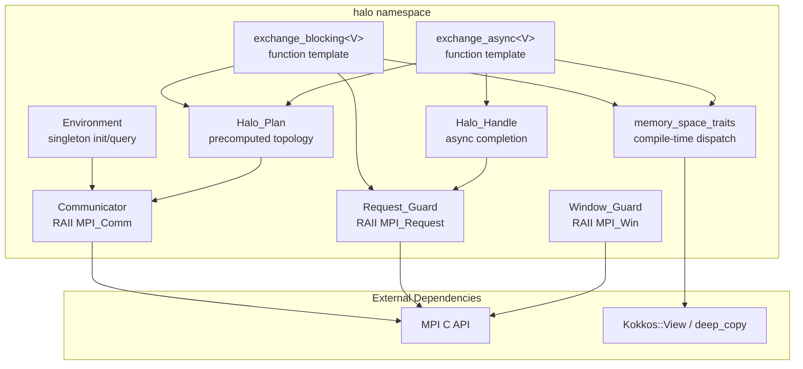
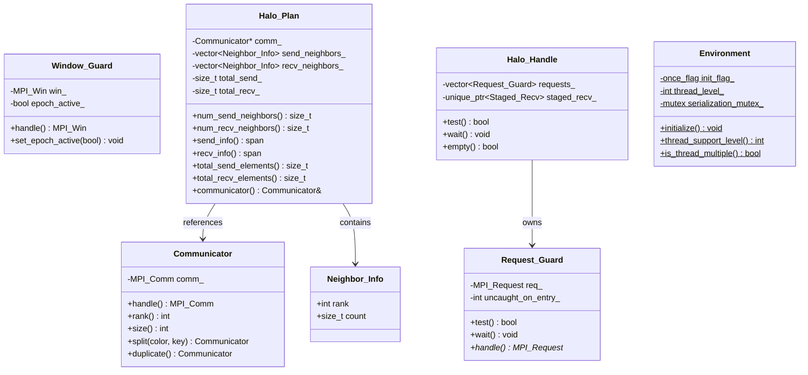
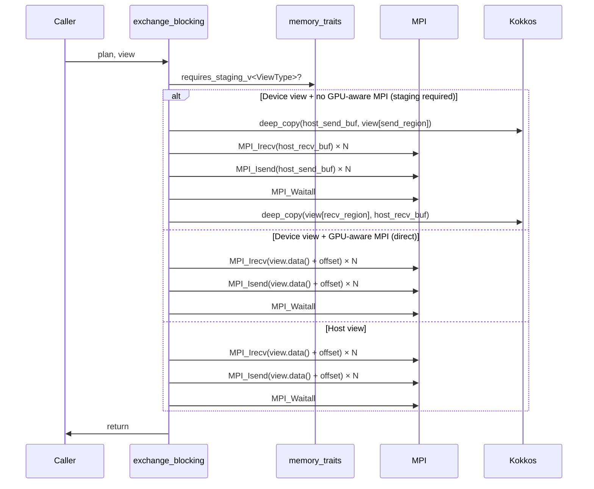
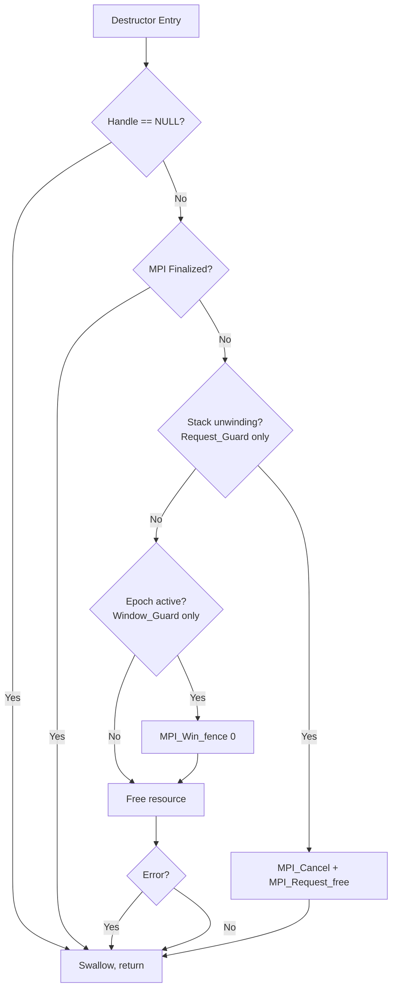
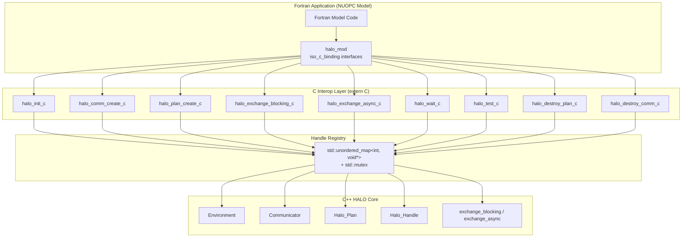

# Design Document: HALO (Hardware-Abstracted Link Operations)

## Overview

HALO is a Tier 1 C++20 micro-library providing RAII-wrapped MPI communication primitives with compile-time GPU memory space dispatch for halo exchanges. It replaces the legacy ESMF VM class and halo exchange infrastructure with a stateless, zero-copy design built on Kokkos for hardware portability.

The library is structured around three pillars:

1. **RAII Resource Safety** — All MPI handles (`MPI_Comm`, `MPI_Request`, `MPI_Win`) are wrapped in scope-bound C++ objects that guarantee cleanup on all exit paths, including exceptions.
2. **Compile-Time Memory Dispatch** — Template metaprogramming detects the Kokkos memory space of a View at compile time and selects either GPU-direct MPI paths or host-staged transfer paths.
3. **Precomputed Exchange Plans** — Neighbor topology and buffer geometry are computed once and reused across timesteps, amortizing setup cost over thousands of halo exchanges.

### Design Rationale

| Decision | Rationale |
|----------|-----------|
| C++20 concepts for memory space dispatch | Enables zero-overhead abstraction; no virtual dispatch on the hot path |
| Separate `Halo_Plan` from execution | Mirrors the legacy RouteHandle pattern scientists already understand |
| `HALO_GPU_AWARE_MPI` compile-time flag | Avoids runtime branching in the inner loop; matches MPAS v8.4.0 pattern |
| Kokkos-only parallelism | Satisfies HELM Law #2; supports CUDA, HIP, OpenMP, and OpenACC backends |
| Move-only RAII wrappers | Prevents accidental double-free of MPI handles |

---

## Architecture

### Component Diagram



### Namespace Structure

```
halo::                          // Top-level public namespace
├── Communicator                // RAII MPI_Comm wrapper
├── Request_Guard               // RAII MPI_Request wrapper
├── Window_Guard                // RAII MPI_Win wrapper
├── Halo_Plan                   // Precomputed exchange metadata
├── Halo_Handle                 // Async operation handle
├── Environment                 // Singleton init/query
├── exchange_blocking<V>()      // Blocking halo exchange
├── exchange_async<V>()         // Non-blocking halo exchange
└── detail::                    // Internal implementation namespace
    ├── memory_space_traits<V>  // Compile-time memory space detection
    ├── is_device_space_v<S>    // constexpr bool trait
    ├── stage_send()            // Host-staging send helper
    └── stage_recv()            // Host-staging recv helper
```

### Header Layout

```
include/halo/
├── halo.hpp                    // Umbrella header (includes all public headers)
├── communicator.hpp            // Communicator class
├── request_guard.hpp           // Request_Guard class
├── window_guard.hpp            // Window_Guard class
├── halo_plan.hpp               // Halo_Plan class
├── halo_handle.hpp             // Halo_Handle class
├── exchange.hpp                // exchange_blocking / exchange_async templates
├── environment.hpp             // Environment singleton
└── detail/
    ├── memory_traits.hpp       // memory_space_traits, is_device_space_v
    └── staging.hpp             // Host-staging buffer utilities
```

### Repository Layout

```
libs/halo/                      // Git submodule root within HELM workspace
├── CMakeLists.txt              // Standalone build (produces HELM::HALO)
├── cmake/
│   ├── HALOConfig.cmake.in     // Exported config template
│   └── HALOConfigVersion.cmake.in
├── include/halo/               // Public headers (as above)
├── src/
│   ├── communicator.cpp        // Non-template implementations
│   ├── request_guard.cpp
│   ├── window_guard.cpp
│   ├── halo_plan.cpp
│   ├── environment.cpp
│   └── detail/
│       └── staging.cpp         // Host-staging buffer management
├── tests/
│   ├── CMakeLists.txt
│   ├── mpi_interposition.hpp   // Mock/spy layer for MPI calls
│   ├── test_communicator.cpp
│   ├── test_request_guard.cpp
│   ├── test_window_guard.cpp
│   ├── test_halo_plan.cpp
│   ├── test_exchange.cpp
│   └── test_raii_exceptions.cpp
├── README.md
└── .gitignore
```

---

## Components and Interfaces

### 1. `halo::Environment` — Singleton Initialization

```cpp
namespace halo {

class Environment {
public:
    /// Initialize HALO. Must be called after MPI_Init_thread.
    /// Queries MPI_Query_thread and stores the result.
    /// Throws std::runtime_error if MPI is not initialized.
    /// Second and subsequent calls are no-ops.
    static void initialize();

    /// Returns the MPI thread support level (MPI_THREAD_SINGLE, etc.)
    [[nodiscard]] static int thread_support_level() noexcept;

    /// Returns true if thread level >= MPI_THREAD_MULTIPLE
    [[nodiscard]] static bool is_thread_multiple() noexcept;

    Environment(const Environment&) = delete;
    Environment& operator=(const Environment&) = delete;

private:
    Environment() = default;
    static inline std::once_flag init_flag_;
    static inline int thread_level_{-1};
    static inline std::mutex serialization_mutex_;

    friend class detail::Serialized_MPI_Guard;
};

} // namespace halo
```

### 2. `halo::Communicator` — RAII MPI_Comm Wrapper

```cpp
namespace halo {

class Communicator {
public:
    /// Construct from raw handle. Takes exclusive ownership.
    /// Predefined comms (WORLD, SELF) are stored but not freed.
    explicit Communicator(MPI_Comm comm) noexcept;

    /// Destructor: calls MPI_Comm_free if owned, not predefined, not NULL,
    /// and MPI is not finalized.
    ~Communicator();

    // Move semantics
    Communicator(Communicator&& other) noexcept;
    Communicator& operator=(Communicator&& other) noexcept;

    // No copies
    Communicator(const Communicator&) = delete;
    Communicator& operator=(const Communicator&) = delete;

    /// Raw handle access (no ownership transfer). noexcept.
    [[nodiscard]] MPI_Comm handle() const noexcept;

    /// Process rank within this communicator.
    [[nodiscard]] int rank() const;

    /// Total number of processes in this communicator.
    [[nodiscard]] int size() const;

    /// Split into sub-communicator. Returns Communicator owning result.
    /// color == MPI_UNDEFINED yields a NULL communicator.
    [[nodiscard]] Communicator split(int color, int key) const;

    /// Duplicate this communicator.
    [[nodiscard]] Communicator duplicate() const;

private:
    MPI_Comm comm_{MPI_COMM_NULL};

    [[nodiscard]] bool is_predefined() const noexcept;
};

} // namespace halo
```

### 3. `halo::Request_Guard` — RAII MPI_Request Wrapper

```cpp
namespace halo {

class Request_Guard {
public:
    /// Construct from raw request. Source is set to MPI_REQUEST_NULL.
    explicit Request_Guard(MPI_Request& req) noexcept;

    /// Default construct (empty, holds MPI_REQUEST_NULL).
    Request_Guard() noexcept = default;

    /// Destructor:
    ///   - Normal exit: MPI_Wait (complete the operation)
    ///   - Stack unwinding: MPI_Cancel + MPI_Request_free
    ~Request_Guard();

    // Move semantics
    Request_Guard(Request_Guard&& other) noexcept;
    Request_Guard& operator=(Request_Guard&& other) noexcept;

    // No copies
    Request_Guard(const Request_Guard&) = delete;
    Request_Guard& operator=(const Request_Guard&) = delete;

    /// Non-blocking test. Returns true if complete or if handle is NULL.
    [[nodiscard]] bool test();

    /// Blocking wait. No-op if handle is NULL.
    void wait();

    /// Raw handle pointer access (for MPI functions needing MPI_Request*).
    /// Returns nullptr if moved-from. noexcept.
    [[nodiscard]] MPI_Request* handle() noexcept;

private:
    MPI_Request req_{MPI_REQUEST_NULL};
    int uncaught_on_entry_{0};  // snapshot of std::uncaught_exceptions() at construction
};

} // namespace halo
```

### 4. `halo::Window_Guard` — RAII MPI_Win Wrapper

```cpp
namespace halo {

class Window_Guard {
public:
    /// Construct from raw window handle. Takes exclusive ownership.
    explicit Window_Guard(MPI_Win win) noexcept;

    /// Destructor: MPI_Win_fence(0) if epoch active, then MPI_Win_free.
    /// No-throw: swallows errors during destruction.
    ~Window_Guard() noexcept;

    // Move semantics
    Window_Guard(Window_Guard&& other) noexcept;
    Window_Guard& operator=(Window_Guard&& other) noexcept;

    // No copies
    Window_Guard(const Window_Guard&) = delete;
    Window_Guard& operator=(const Window_Guard&) = delete;

    /// Raw handle access. noexcept.
    [[nodiscard]] MPI_Win handle() const noexcept;

    /// Mark that an access epoch is currently active.
    void set_epoch_active(bool active) noexcept;

private:
    MPI_Win win_{MPI_WIN_NULL};
    bool epoch_active_{false};
};

} // namespace halo
```

### 5. `halo::Halo_Plan` — Precomputed Exchange Metadata

```cpp
namespace halo {

struct Neighbor_Info {
    int rank;
    std::size_t count;  // number of elements
};

class Halo_Plan {
public:
    /// Construct a plan. Validates ranks against comm size.
    /// Throws std::invalid_argument for out-of-range or duplicate ranks.
    Halo_Plan(const Communicator& comm,
              std::vector<Neighbor_Info> send_neighbors,
              std::vector<Neighbor_Info> recv_neighbors);

    // Copyable and movable
    Halo_Plan(const Halo_Plan&) = default;
    Halo_Plan& operator=(const Halo_Plan&) = default;
    Halo_Plan(Halo_Plan&&) noexcept = default;
    Halo_Plan& operator=(Halo_Plan&&) noexcept = default;

    [[nodiscard]] std::size_t num_send_neighbors() const noexcept;
    [[nodiscard]] std::size_t num_recv_neighbors() const noexcept;

    [[nodiscard]] std::span<const Neighbor_Info> send_info() const noexcept;
    [[nodiscard]] std::span<const Neighbor_Info> recv_info() const noexcept;

    /// Total elements to send (sum of all send counts).
    [[nodiscard]] std::size_t total_send_elements() const noexcept;

    /// Total elements to receive (sum of all recv counts).
    [[nodiscard]] std::size_t total_recv_elements() const noexcept;

    /// Reference to the communicator used for exchanges.
    [[nodiscard]] const Communicator& communicator() const noexcept;

private:
    const Communicator* comm_;  // non-owning
    std::vector<Neighbor_Info> send_neighbors_;
    std::vector<Neighbor_Info> recv_neighbors_;
    std::size_t total_send_{0};
    std::size_t total_recv_{0};
};

} // namespace halo
```

### 6. `halo::Halo_Handle` — Async Operation Handle

```cpp
namespace halo {

class Halo_Handle {
public:
    Halo_Handle() = default;

    /// Destructor: calls wait() to ensure completion.
    ~Halo_Handle();

    // Move-only
    Halo_Handle(Halo_Handle&& other) noexcept;
    Halo_Handle& operator=(Halo_Handle&& other) noexcept;
    Halo_Handle(const Halo_Handle&) = delete;
    Halo_Handle& operator=(const Halo_Handle&) = delete;

    /// Non-blocking test. Returns true if all operations complete.
    /// Performs post-receive deep-copy on completion.
    [[nodiscard]] bool test();

    /// Blocking wait. Performs post-receive deep-copy on completion.
    void wait();

    /// True if this handle has no pending operations.
    [[nodiscard]] bool empty() const noexcept;

private:
    template <typename ViewType>
    friend Halo_Handle exchange_async(const Halo_Plan&, ViewType&);

    std::vector<Request_Guard> requests_;

    // Host-staged receive state (only populated when GPU-aware MPI unavailable)
    struct Staged_Recv;
    std::unique_ptr<Staged_Recv> staged_recv_;
};

} // namespace halo
```

### 7. Exchange Function Templates

```cpp
namespace halo {

/// Blocking halo exchange.
/// Posts Irecv before Isend, then Waitall.
/// Dispatches GPU-direct or host-staged path at compile time.
template <typename ViewType>
void exchange_blocking(const Halo_Plan& plan, ViewType& view);

/// Non-blocking halo exchange.
/// Posts all Isend/Irecv, returns Halo_Handle for later completion.
template <typename ViewType>
[[nodiscard]] Halo_Handle exchange_async(const Halo_Plan& plan, ViewType& view);

} // namespace halo
```

### 8. Memory Space Dispatch (Compile-Time Traits)

```cpp
namespace halo::detail {

/// Detect if a Kokkos memory space is a device space.
template <typename MemorySpace>
struct is_device_space : std::false_type {};

// Specializations for known device spaces
template <> struct is_device_space<Kokkos::CudaSpace> : std::true_type {};
template <> struct is_device_space<Kokkos::CudaUVMSpace> : std::true_type {};
#ifdef KOKKOS_ENABLE_HIP
template <> struct is_device_space<Kokkos::HIPSpace> : std::true_type {};
#endif
#ifdef KOKKOS_ENABLE_OPENACC
template <> struct is_device_space<Kokkos::Experimental::OpenACCSpace> : std::true_type {};
#endif

template <typename MemorySpace>
inline constexpr bool is_device_space_v = is_device_space<MemorySpace>::value;

/// Extract memory space from a Kokkos::View type.
template <typename ViewType>
using view_memory_space_t = typename ViewType::memory_space;

/// Determine if a view requires host staging for MPI.
/// True when: view is on device AND GPU-aware MPI is NOT enabled.
template <typename ViewType>
inline constexpr bool requires_staging_v =
    is_device_space_v<view_memory_space_t<ViewType>>
#ifdef HALO_GPU_AWARE_MPI
    && false;  // GPU-aware MPI: never stage
#else
    ;          // No GPU-aware MPI: always stage device views
#endif

/// Host mirror type for staging buffers.
template <typename ViewType>
using host_mirror_t = typename ViewType::HostMirror;

} // namespace halo::detail
```

### 9. KokkACC Compatibility Layer

The OpenACC backend (`Kokkos::Experimental::OpenACCSpace`) integrates seamlessly through the same `is_device_space` trait specialization. This enables:

- **Legacy Fortran interop**: Codes using OpenACC directives can share device memory with HALO without explicit copies, since Kokkos OpenACC views and OpenACC `!$acc` regions operate on the same device allocation.
- **Unified dispatch**: The compile-time trait treats `OpenACCSpace` identically to `CudaSpace`/`HIPSpace` — if `HALO_GPU_AWARE_MPI` is defined, device pointers pass directly to MPI; otherwise, host staging occurs.
- **No backend-specific code**: HALO never references OpenACC pragmas directly. It only interacts with `Kokkos::View` and `Kokkos::deep_copy`, which the Kokkos OpenACC backend implements internally.

```cpp
// Example: Fortran OpenACC code shares memory with HALO
// Fortran side: !$acc data present(field)
// C++ side via SPAN:
//   auto view = Kokkos::View<double*, Kokkos::Experimental::OpenACCSpace>(ptr, n);
//   halo::exchange_blocking(plan, view);  // dispatches GPU-direct or staged
```

---

## Data Models

### Core Data Structures



### MPI Tag Derivation

Tags are computed deterministically to avoid collisions across concurrent exchanges:

```cpp
// tag = (sender_rank * comm_size + receiver_rank) % MPI_TAG_UB
inline int compute_tag(int sender, int receiver, int comm_size) noexcept {
    return (sender * comm_size + receiver) % MPI_TAG_UB_VALUE;
}
```

Where `MPI_TAG_UB_VALUE` is queried once during `Environment::initialize()` via `MPI_Comm_get_attr(MPI_COMM_WORLD, MPI_TAG_UB, ...)`.

### Thread Serialization Strategy

```cpp
namespace halo::detail {

/// RAII guard that locks the serialization mutex when thread level < MULTIPLE.
class Serialized_MPI_Guard {
public:
    Serialized_MPI_Guard() {
        if (!Environment::is_thread_multiple()) {
            Environment::serialization_mutex_.lock();
            locked_ = true;
        }
    }
    ~Serialized_MPI_Guard() {
        if (locked_) Environment::serialization_mutex_.unlock();
    }
    Serialized_MPI_Guard(const Serialized_MPI_Guard&) = delete;
    Serialized_MPI_Guard& operator=(const Serialized_MPI_Guard&) = delete;
private:
    bool locked_{false};
};

} // namespace halo::detail
```

### Exchange Execution Flow




---

## Correctness Properties

*A property is a characteristic or behavior that should hold true across all valid executions of a system — essentially, a formal statement about what the system should do. Properties serve as the bridge between human-readable specifications and machine-verifiable correctness guarantees.*

### Property 1: RAII Construction Round-Trip

*For any* valid MPI handle value (MPI_Comm, MPI_Request, or MPI_Win), constructing the corresponding RAII wrapper and immediately querying the handle accessor SHALL return the original value unchanged.

**Validates: Requirements 1.1, 1.5, 2.1, 3.1, 3.5**

### Property 2: Move Semantics Nullify Source

*For any* RAII wrapper (Communicator, Request_Guard, Window_Guard, or Halo_Handle) holding a non-null handle, move-constructing or move-assigning to a new instance SHALL set the source's internal handle to the null sentinel (MPI_COMM_NULL, MPI_REQUEST_NULL, MPI_WIN_NULL, or empty state) and the destination SHALL hold the original handle value.

**Validates: Requirements 1.3, 2.3, 3.3, 7.9, 8.3**

### Property 3: Communicator Destructor Cleanup

*For any* Communicator holding a non-predefined, non-null MPI_Comm handle where MPI has not been finalized, destruction (whether via normal scope exit or exception unwinding) SHALL invoke MPI_Comm_free exactly once on that handle.

**Validates: Requirements 1.2, 1.6**

### Property 4: Request_Guard Normal Destruction Completes Operation

*For any* Request_Guard holding a non-null MPI_Request when destruction occurs outside of stack unwinding (std::uncaught_exceptions() unchanged from construction), the destructor SHALL invoke MPI_Wait exactly once to complete the pending operation.

**Validates: Requirements 2.2**

### Property 5: Request_Guard Unwinding Destruction Cancels Operation

*For any* Request_Guard holding a non-null MPI_Request when destruction occurs during stack unwinding (std::uncaught_exceptions() increased since construction), the destructor SHALL invoke MPI_Cancel followed by MPI_Request_free, in that order.

**Validates: Requirements 2.7**

### Property 6: Window_Guard Fence-Before-Free on Active Epoch

*For any* Window_Guard with epoch_active set to true and holding a non-null MPI_Win, destruction SHALL invoke MPI_Win_fence(0, win) before invoking MPI_Win_free(win).

**Validates: Requirements 3.7**

### Property 7: Window_Guard Destructor Never Throws

*For any* error code returned by MPI_Win_fence or MPI_Win_free during Window_Guard destruction, the destructor SHALL complete without throwing an exception and SHALL NOT propagate the error.

**Validates: Requirements 3.8**

### Property 8: Halo_Plan Construction Round-Trip

*For any* valid set of send-neighbor and receive-neighbor lists (ranks in [0, comm_size) with no duplicates), constructing a Halo_Plan and querying send_info() and recv_info() SHALL return neighbor data identical to the input in both content and order.

**Validates: Requirements 5.1, 5.2, 5.3**

### Property 9: Halo_Plan Rejects Invalid Ranks

*For any* neighbor list containing at least one rank that is negative or greater than or equal to the communicator size, Halo_Plan construction SHALL throw std::invalid_argument.

**Validates: Requirements 5.4**

### Property 10: Halo_Plan Rejects Duplicate Ranks

*For any* send or receive neighbor list containing at least one rank that appears more than once, Halo_Plan construction SHALL throw std::invalid_argument indicating the duplicate.

**Validates: Requirements 5.9**

### Property 11: Halo_Plan Copy Equivalence

*For any* Halo_Plan, copy-constructing a new plan SHALL produce an object where send_info(), recv_info(), num_send_neighbors(), and num_recv_neighbors() all return values equal to the original.

**Validates: Requirements 5.5**

### Property 12: MPI Tag Determinism and Boundedness

*For any* (sender_rank, receiver_rank, comm_size) triple where both ranks are in [0, comm_size), the computed MPI tag SHALL be deterministic (same inputs always produce same output) and SHALL be in the range [0, MPI_TAG_UB).

**Validates: Requirements 6.2**

### Property 13: Exchange Posts All Receives Before Any Send

*For any* Halo_Plan with at least one send-neighbor and one receive-neighbor, exchange_blocking and exchange_async SHALL post all MPI_Irecv calls before posting any MPI_Isend call.

**Validates: Requirements 6.1, 7.1**

### Property 14: GPU-Aware MPI Uses Device Pointers Directly

*For any* Kokkos::View residing in a device memory space when HALO_GPU_AWARE_MPI is defined, the exchange functions SHALL pass pointers obtained from View::data() directly to MPI send/receive operations without allocating host staging buffers.

**Validates: Requirements 6.4, 7.6**

### Property 15: Non-GPU-Aware MPI Stages Through Host

*For any* Kokkos::View residing in a device memory space when HALO_GPU_AWARE_MPI is NOT defined, the exchange functions SHALL deep_copy send data to host memory before posting MPI_Isend, and SHALL deep_copy received data from host memory back to the device view after completion.

**Validates: Requirements 6.5, 7.7**

### Property 16: MPI Errors During Exchange Throw With Context

*For any* MPI send or receive operation that returns a non-success error code during a halo exchange, the exchange function SHALL throw std::runtime_error containing both the MPI error string and the failing neighbor rank.

**Validates: Requirements 6.6, 7.8**

### Property 17: Async Exchange Handle Owns Correct Request Count

*For any* Halo_Plan with S send-neighbors and R receive-neighbors, exchange_async SHALL return a Halo_Handle owning exactly S + R Request_Guard objects.

**Validates: Requirements 7.1, 7.2**

### Property 18: Completion Triggers Post-Receive Deep-Copy When Staged

*For any* Halo_Handle associated with a staged (non-GPU-aware) exchange, when test() returns true or wait() completes, the handle SHALL perform Kokkos::deep_copy from host receive buffers to the device view before returning to the caller.

**Validates: Requirements 7.3, 7.4**

### Property 19: Halo_Handle Destructor Ensures Completion

*For any* Halo_Handle with pending operations, destruction SHALL invoke wait() to ensure all MPI operations complete and all post-receive deep-copies execute before resources are released.

**Validates: Requirements 7.5**

### Property 20: Environment Initialization Idempotence

*For any* sequence of calls to Environment::initialize() after the first successful call, subsequent calls SHALL return without re-querying MPI and SHALL preserve the previously stored thread support level unchanged.

**Validates: Requirements 9.6**

---

## Error Handling

### Error Classification

| Error Source | Handling Strategy | User-Facing Behavior |
|---|---|---|
| MPI function failure (non-zero return) | Translate MPI error code to string via `MPI_Error_string` | Throw `std::runtime_error` with MPI error text + context |
| Invalid Halo_Plan construction args | Validate at construction time | Throw `std::invalid_argument` with descriptive message |
| MPI not initialized before HALO init | Check via `MPI_Initialized` | Throw `std::runtime_error` |
| Destructor during stack unwinding | Request_Guard: cancel + free; others: best-effort cleanup | Never throw from destructors |
| MPI errors during destruction | Swallow error, leave handle in current state | Silent (logged if LOGS available, but no dependency) |

### Exception Safety Guarantees

| Class | Guarantee |
|---|---|
| `Communicator` | Strong exception safety on `split()`/`duplicate()` — original unchanged on failure |
| `Request_Guard` | Basic guarantee — destructor always cleans up |
| `Window_Guard` | No-throw destructor (errors swallowed) |
| `Halo_Plan` | Strong exception safety on construction — either fully constructed or throws |
| `Halo_Handle` | Basic guarantee — destructor calls `wait()` |
| `exchange_blocking` | Strong guarantee — if MPI fails, exception thrown, no partial state |
| `exchange_async` | Basic guarantee — if posting fails mid-way, already-posted requests are owned by partially-constructed handle |

### Destructor Error Paths



---

## Testing Strategy

### Testing Framework

- **Unit/Integration Tests**: Google Test (GTest) with MPI test runner
- **Property-Based Tests**: [RapidCheck](https://github.com/emil-e/rapidcheck) (C++ property-based testing library)
- **MPI Interposition**: Custom spy/mock layer intercepting MPI C calls via weak symbol overrides or `LD_PRELOAD`

### Dual Testing Approach

#### Unit Tests (Example-Based)

Focus on:
- Specific edge cases (NULL handles, predefined communicators, empty plans)
- Integration points (actual MPI calls with 2-4 processes)
- Compile-time constraints (static_assert for deleted copies, noexcept)
- RAII destruction order verification (nested scopes, exception paths)
- CMake target existence and linkage

#### Property-Based Tests (RapidCheck)

Focus on:
- Universal invariants across all valid inputs (Properties 1–20)
- Minimum **100 iterations** per property test
- Each test tagged with: `// Feature: helm-halo-microlibrary, Property N: <title>`
- Generators for:
  - Arbitrary MPI handle values (integers cast to opaque handles)
  - Random neighbor lists with valid/invalid ranks
  - Random (sender, receiver, comm_size) triples
  - Random Halo_Plan configurations

### MPI Interposition Layer

The test suite uses a mock/spy MPI layer to deterministically verify destructor behavior without relying on MPI runtime side effects:

```cpp
// tests/mpi_interposition.hpp
namespace halo::testing {

struct MPI_Call_Record {
    enum class Type { Comm_free, Request_free, Cancel, Wait, Test,
                      Win_free, Win_fence, Irecv, Isend, Waitall };
    Type type;
    void* handle;  // The handle argument
    int arg;       // Additional argument (e.g., assertion for fence)
};

class MPI_Spy {
public:
    static MPI_Spy& instance();
    void reset();
    std::vector<MPI_Call_Record> const& calls() const;
    void set_next_error(int error_code);  // Inject errors
private:
    std::vector<MPI_Call_Record> calls_;
    std::optional<int> next_error_;
};

} // namespace halo::testing
```

### Test Execution

```bash
# Build with testing enabled
cmake -B build -DBUILD_TESTING=ON -DKokkos_ROOT=/path/to/kokkos
cmake --build build

# Run unit tests (requires MPI, typically 4 ranks)
mpirun -np 4 ./build/tests/halo_tests

# Run property tests (single rank, mocked MPI)
./build/tests/halo_property_tests
```

### Property Test Configuration

```cpp
// RapidCheck configuration for HALO property tests
RC_PARAMS(rc::Params{}.withNumTests(200).withMaxSize(50));
```

### Coverage Targets

| Category | Target |
|---|---|
| Line coverage (unit + property) | ≥ 90% |
| Branch coverage on destructors | 100% |
| All 20 correctness properties | Passing with ≥ 100 iterations |
| MPI error injection paths | All tested via interposition |

### CI Pipeline Integration

1. **Static Analysis**: Scan all HALO headers for forbidden `#include` directives (Requirement 13.5)
2. **Build**: Standalone CMake configure + build inside Docker container
3. **Unit Tests**: `mpirun -np 4` with GTest XML output
4. **Property Tests**: Single-rank RapidCheck suite with mocked MPI
5. **Sanitizers**: ASan + UBSan enabled for all test builds

---

## CMakeLists.txt Specification

```cmake
cmake_minimum_required(VERSION 3.21)
project(HALO VERSION 0.1.0 LANGUAGES CXX)

set(CMAKE_CXX_STANDARD 20)
set(CMAKE_CXX_STANDARD_REQUIRED ON)
set(CMAKE_CXX_EXTENSIONS OFF)

# --- Dependencies ---
find_package(MPI REQUIRED COMPONENTS CXX)
find_package(Kokkos REQUIRED)

# --- Compile-time options ---
option(HALO_GPU_AWARE_MPI "Enable GPU-aware MPI (device pointers passed directly)" OFF)
option(BUILD_TESTING "Build the HALO test suite" OFF)

# --- Library target ---
add_library(halo
    src/communicator.cpp
    src/request_guard.cpp
    src/window_guard.cpp
    src/halo_plan.cpp
    src/environment.cpp
    src/detail/staging.cpp
)

target_include_directories(halo
    PUBLIC
        $<BUILD_INTERFACE:${CMAKE_CURRENT_SOURCE_DIR}/include>
        $<INSTALL_INTERFACE:include>
)

target_link_libraries(halo
    PUBLIC
        MPI::MPI_CXX
        Kokkos::kokkos
)

if(HALO_GPU_AWARE_MPI)
    target_compile_definitions(halo PUBLIC HALO_GPU_AWARE_MPI)
endif()

# Namespace alias
add_library(HELM::HALO ALIAS halo)

# --- Install & Export ---
include(GNUInstallDirs)
include(CMakePackageConfigHelpers)

install(TARGETS halo EXPORT HALOTargets
    LIBRARY DESTINATION ${CMAKE_INSTALL_LIBDIR}
    ARCHIVE DESTINATION ${CMAKE_INSTALL_LIBDIR}
    INCLUDES DESTINATION ${CMAKE_INSTALL_INCLUDEDIR}
)

install(DIRECTORY include/halo DESTINATION ${CMAKE_INSTALL_INCLUDEDIR})

install(EXPORT HALOTargets
    FILE HALOTargets.cmake
    NAMESPACE HELM::
    DESTINATION ${CMAKE_INSTALL_LIBDIR}/cmake/HALO
)

configure_package_config_file(
    cmake/HALOConfig.cmake.in
    ${CMAKE_CURRENT_BINARY_DIR}/HALOConfig.cmake
    INSTALL_DESTINATION ${CMAKE_INSTALL_LIBDIR}/cmake/HALO
)

write_basic_package_version_file(
    ${CMAKE_CURRENT_BINARY_DIR}/HALOConfigVersion.cmake
    VERSION ${PROJECT_VERSION}
    COMPATIBILITY SameMajorVersion
)

install(FILES
    ${CMAKE_CURRENT_BINARY_DIR}/HALOConfig.cmake
    ${CMAKE_CURRENT_BINARY_DIR}/HALOConfigVersion.cmake
    DESTINATION ${CMAKE_INSTALL_LIBDIR}/cmake/HALO
)

# --- Tests ---
if(BUILD_TESTING)
    find_package(GTest REQUIRED)
    enable_testing()
    add_subdirectory(tests)
endif()
```

### Downstream Consumption

```cmake
# In a downstream CMakeLists.txt:
find_package(HALO REQUIRED)
target_link_libraries(my_app PRIVATE HELM::HALO)
# Automatically inherits MPI, Kokkos includes and link flags
```


---

## Fortran C-Interop Interface

### Overview

The Fortran interface enables legacy NUOPC/ESMF-based Fortran models to adopt HALO halo exchanges incrementally. It consists of two layers:

1. **C Interop Layer** (`src/fortran/halo_c_interop.cpp`) — `extern "C"` functions that catch all C++ exceptions at the boundary and return integer error codes.
2. **halo_mod Fortran Module** (`fortran/halo_mod.f90`) — A Fortran 2008 module using `iso_c_binding` that provides idiomatic Fortran subroutines wrapping the C interop functions.

The design uses an **opaque handle registry** pattern: C++ objects (Communicator, Halo_Plan, Halo_Handle) are stored in a global registry and referenced by integer tokens across the language boundary. This avoids exposing raw C++ pointers to Fortran and is compatible with the ESMF integer-handle convention.

### Architecture Diagram



### 10. Opaque Handle Registry

The handle registry maps integer tokens to C++ object pointers. It is the central mechanism enabling safe cross-language resource management.

```cpp
// src/fortran/handle_registry.hpp
#pragma once

#include <cstdint>
#include <mutex>
#include <stdexcept>
#include <unordered_map>

namespace halo::fortran {

/// Thread-safe registry mapping integer tokens to C++ object pointers.
/// Tokens are monotonically increasing positive integers.
class Handle_Registry {
public:
    static Handle_Registry& instance() {
        static Handle_Registry reg;
        return reg;
    }

    /// Register a pointer, return a unique positive integer token.
    int register_handle(void* ptr) {
        std::lock_guard<std::mutex> lock(mutex_);
        int token = next_token_++;
        handles_[token] = ptr;
        return token;
    }

    /// Retrieve the pointer for a token. Returns nullptr if invalid.
    void* lookup(int token) const {
        std::lock_guard<std::mutex> lock(mutex_);
        auto it = handles_.find(token);
        return (it != handles_.end()) ? it->second : nullptr;
    }

    /// Remove a token from the registry. Returns the pointer (caller frees).
    /// Returns nullptr if token was not found.
    void* release(int token) {
        std::lock_guard<std::mutex> lock(mutex_);
        auto it = handles_.find(token);
        if (it == handles_.end()) return nullptr;
        void* ptr = it->second;
        handles_.erase(it);
        return ptr;
    }

    /// Check if a token is currently valid.
    bool valid(int token) const {
        std::lock_guard<std::mutex> lock(mutex_);
        return handles_.count(token) > 0;
    }

private:
    Handle_Registry() = default;
    mutable std::mutex mutex_;
    std::unordered_map<int, void*> handles_;
    int next_token_{1};  // 0 reserved as "invalid handle"
};

} // namespace halo::fortran
```

**Design Decisions:**

| Decision | Rationale |
|----------|-----------|
| Monotonically increasing integer tokens | Simple, deterministic, no reuse avoids dangling-handle bugs |
| Token 0 reserved as "invalid" | Matches Fortran convention where 0/null signals error |
| `std::mutex` protection | Supports MPI_THREAD_MULTIPLE where multiple threads may create/destroy objects |
| Singleton pattern | Single global registry simplifies the C API (no registry pointer to pass) |
| `void*` storage with typed retrieval | Avoids template instantiation in the C layer; type safety enforced by API contract |

### 11. C Interop Layer (`extern "C"` Functions)

All C interop functions follow a uniform contract:
- Return `int` error code: 0 = success, non-zero = error
- Output parameters passed as pointers (e.g., `int* handle_out`)
- All C++ exceptions caught at the boundary via a `HALO_C_TRY` macro
- MPI communicators accepted as `int` (Fortran `integer` compatible)

```cpp
// src/fortran/halo_c_interop.cpp
#include "handle_registry.hpp"
#include <halo/halo.hpp>
#include <cstring>

namespace {

/// Error codes returned to Fortran
enum Halo_Error : int {
    HALO_SUCCESS         = 0,
    HALO_ERR_INVALID_ARG = 1,
    HALO_ERR_MPI         = 2,
    HALO_ERR_RUNTIME     = 3,
    HALO_ERR_BAD_HANDLE  = 4,
    HALO_ERR_UNKNOWN     = 99
};

} // anonymous namespace

/// Macro to wrap function bodies with exception catching
#define HALO_C_TRY(body)                                    \
    try { body; return HALO_SUCCESS; }                      \
    catch (const std::invalid_argument&) {                  \
        return HALO_ERR_INVALID_ARG;                        \
    } catch (const std::runtime_error&) {                   \
        return HALO_ERR_RUNTIME;                            \
    } catch (...) {                                         \
        return HALO_ERR_UNKNOWN;                            \
    }

```

```cpp
extern "C" {

/// Initialize HALO and create root communicator from Fortran MPI_Comm integer.
/// @param mpi_comm_int  The integer value of the MPI communicator (from MPI_Comm%mpi_val or ESMF)
/// @param comm_handle_out  Output: opaque handle for the created Communicator
/// @return 0 on success, non-zero error code on failure
int halo_init_c(int mpi_comm_int, int* comm_handle_out) {
    HALO_C_TRY(
        halo::Environment::initialize();
        MPI_Comm comm = MPI_Comm_f2c(mpi_comm_int);
        auto* c = new halo::Communicator(comm);
        *comm_handle_out = halo::fortran::Handle_Registry::instance()
                               .register_handle(static_cast<void*>(c));
    )
}

/// Create a sub-communicator via split.
/// @param parent_handle  Opaque handle of the parent Communicator
/// @param color          Split color
/// @param key            Split key
/// @param child_handle_out  Output: opaque handle for the new sub-communicator
int halo_comm_create_c(int parent_handle, int color, int key,
                       int* child_handle_out) {
    HALO_C_TRY(
        auto& reg = halo::fortran::Handle_Registry::instance();
        auto* parent = static_cast<halo::Communicator*>(reg.lookup(parent_handle));
        if (!parent) return HALO_ERR_BAD_HANDLE;
        auto child = parent->split(color, key);
        auto* c = new halo::Communicator(std::move(child));
        *child_handle_out = reg.register_handle(static_cast<void*>(c));
    )
}

/// Create a Halo_Plan from neighbor arrays.
/// @param comm_handle     Opaque handle of the Communicator
/// @param send_ranks      Array of send-neighbor ranks
/// @param send_counts     Array of per-neighbor send element counts
/// @param num_send        Number of send neighbors
/// @param recv_ranks      Array of receive-neighbor ranks
/// @param recv_counts     Array of per-neighbor receive element counts
/// @param num_recv        Number of receive neighbors
/// @param plan_handle_out Output: opaque handle for the created Halo_Plan
int halo_plan_create_c(int comm_handle,
                       const int* send_ranks, const int* send_counts, int num_send,
                       const int* recv_ranks, const int* recv_counts, int num_recv,
                       int* plan_handle_out) {
    HALO_C_TRY(
        auto& reg = halo::fortran::Handle_Registry::instance();
        auto* comm = static_cast<halo::Communicator*>(reg.lookup(comm_handle));
        if (!comm) return HALO_ERR_BAD_HANDLE;

        std::vector<halo::Neighbor_Info> sends(num_send);
        for (int i = 0; i < num_send; ++i) {
            sends[i] = {send_ranks[i], static_cast<std::size_t>(send_counts[i])};
        }
        std::vector<halo::Neighbor_Info> recvs(num_recv);
        for (int i = 0; i < num_recv; ++i) {
            recvs[i] = {recv_ranks[i], static_cast<std::size_t>(recv_counts[i])};
        }

        auto* plan = new halo::Halo_Plan(*comm, std::move(sends), std::move(recvs));
        *plan_handle_out = reg.register_handle(static_cast<void*>(plan));
    )
}

```

```cpp
/// Execute a blocking halo exchange on a contiguous array.
/// @param plan_handle   Opaque handle of the Halo_Plan
/// @param data          Pointer to contiguous array data (from Fortran c_loc)
/// @param num_elements  Total number of elements in the array
/// @param element_size  Size of each element in bytes (e.g., 8 for real(8))
int halo_exchange_blocking_c(int plan_handle, void* data,
                             int num_elements, int element_size) {
    HALO_C_TRY(
        auto& reg = halo::fortran::Handle_Registry::instance();
        auto* plan = static_cast<halo::Halo_Plan*>(reg.lookup(plan_handle));
        if (!plan) return HALO_ERR_BAD_HANDLE;

        // Construct a non-owning Kokkos::View over the Fortran array
        auto view = Kokkos::View<char*, Kokkos::HostSpace,
                                 Kokkos::MemoryTraits<Kokkos::Unmanaged>>(
            static_cast<char*>(data),
            static_cast<std::size_t>(num_elements) * element_size);
        halo::exchange_blocking(*plan, view);
    )
}

/// Initiate a non-blocking halo exchange on a contiguous array.
/// @param plan_handle    Opaque handle of the Halo_Plan
/// @param data           Pointer to contiguous array data (from Fortran c_loc)
/// @param num_elements   Total number of elements in the array
/// @param element_size   Size of each element in bytes
/// @param handle_out     Output: opaque handle for the Halo_Handle
int halo_exchange_async_c(int plan_handle, void* data,
                          int num_elements, int element_size,
                          int* handle_out) {
    HALO_C_TRY(
        auto& reg = halo::fortran::Handle_Registry::instance();
        auto* plan = static_cast<halo::Halo_Plan*>(reg.lookup(plan_handle));
        if (!plan) return HALO_ERR_BAD_HANDLE;

        auto view = Kokkos::View<char*, Kokkos::HostSpace,
                                 Kokkos::MemoryTraits<Kokkos::Unmanaged>>(
            static_cast<char*>(data),
            static_cast<std::size_t>(num_elements) * element_size);
        auto handle = halo::exchange_async(*plan, view);
        auto* h = new halo::Halo_Handle(std::move(handle));
        *handle_out = reg.register_handle(static_cast<void*>(h));
    )
}

/// Wait for an async exchange to complete.
/// @param handle  Opaque handle of the Halo_Handle
int halo_wait_c(int handle) {
    HALO_C_TRY(
        auto& reg = halo::fortran::Handle_Registry::instance();
        auto* h = static_cast<halo::Halo_Handle*>(reg.lookup(handle));
        if (!h) return HALO_ERR_BAD_HANDLE;
        h->wait();
    )
}

/// Test if an async exchange has completed.
/// @param handle       Opaque handle of the Halo_Handle
/// @param complete_out Output: 1 if complete, 0 if pending
int halo_test_c(int handle, int* complete_out) {
    HALO_C_TRY(
        auto& reg = halo::fortran::Handle_Registry::instance();
        auto* h = static_cast<halo::Halo_Handle*>(reg.lookup(handle));
        if (!h) return HALO_ERR_BAD_HANDLE;
        *complete_out = h->test() ? 1 : 0;
    )
}

```

```cpp
/// Destroy a Halo_Plan and invalidate its handle.
/// @param plan_handle  Opaque handle of the Halo_Plan to destroy
int halo_destroy_plan_c(int plan_handle) {
    HALO_C_TRY(
        auto& reg = halo::fortran::Handle_Registry::instance();
        auto* ptr = reg.release(plan_handle);
        if (!ptr) return HALO_ERR_BAD_HANDLE;
        delete static_cast<halo::Halo_Plan*>(ptr);
    )
}

/// Destroy a Communicator and invalidate its handle.
/// @param comm_handle  Opaque handle of the Communicator to destroy
int halo_destroy_comm_c(int comm_handle) {
    HALO_C_TRY(
        auto& reg = halo::fortran::Handle_Registry::instance();
        auto* ptr = reg.release(comm_handle);
        if (!ptr) return HALO_ERR_BAD_HANDLE;
        delete static_cast<halo::Communicator*>(ptr);
    )
}

} // extern "C"
```

### 12. `halo_mod` Fortran Module

The Fortran module provides idiomatic subroutine interfaces using `iso_c_binding`. All handles are stored as plain `integer(c_int)` values.

```fortran
! fortran/halo_mod.f90
module halo_mod
  use, intrinsic :: iso_c_binding
  implicit none
  private

  ! Public API
  public :: halo_init, halo_comm_create, halo_plan_create
  public :: halo_exchange_blocking, halo_exchange_async
  public :: halo_wait, halo_test
  public :: halo_destroy_plan, halo_destroy_comm

  ! Error code constants
  integer(c_int), parameter, public :: HALO_SUCCESS         = 0
  integer(c_int), parameter, public :: HALO_ERR_INVALID_ARG = 1
  integer(c_int), parameter, public :: HALO_ERR_MPI         = 2
  integer(c_int), parameter, public :: HALO_ERR_RUNTIME     = 3
  integer(c_int), parameter, public :: HALO_ERR_BAD_HANDLE  = 4
  integer(c_int), parameter, public :: HALO_ERR_UNKNOWN     = 99

```fortran
  ! C interop interfaces
  interface

    function halo_init_c(mpi_comm_int, comm_handle_out) &
        bind(c, name='halo_init_c') result(ierr)
      import :: c_int
      integer(c_int), value, intent(in) :: mpi_comm_int
      integer(c_int), intent(out)       :: comm_handle_out
      integer(c_int)                    :: ierr
    end function

    function halo_comm_create_c(parent_handle, color, key, child_handle_out) &
        bind(c, name='halo_comm_create_c') result(ierr)
      import :: c_int
      integer(c_int), value, intent(in) :: parent_handle
      integer(c_int), value, intent(in) :: color
      integer(c_int), value, intent(in) :: key
      integer(c_int), intent(out)       :: child_handle_out
      integer(c_int)                    :: ierr
    end function

    function halo_plan_create_c(comm_handle, send_ranks, send_counts, &
        num_send, recv_ranks, recv_counts, num_recv, plan_handle_out) &
        bind(c, name='halo_plan_create_c') result(ierr)
      import :: c_int
      integer(c_int), value, intent(in) :: comm_handle
      integer(c_int), intent(in)        :: send_ranks(*)
      integer(c_int), intent(in)        :: send_counts(*)
      integer(c_int), value, intent(in) :: num_send
      integer(c_int), intent(in)        :: recv_ranks(*)
      integer(c_int), intent(in)        :: recv_counts(*)
      integer(c_int), value, intent(in) :: num_recv
      integer(c_int), intent(out)       :: plan_handle_out
      integer(c_int)                    :: ierr
    end function

    function halo_exchange_blocking_c(plan_handle, data, &
        num_elements, element_size) &
        bind(c, name='halo_exchange_blocking_c') result(ierr)
      import :: c_int, c_ptr
      integer(c_int), value, intent(in) :: plan_handle
      type(c_ptr), value, intent(in)    :: data
      integer(c_int), value, intent(in) :: num_elements
      integer(c_int), value, intent(in) :: element_size
      integer(c_int)                    :: ierr
    end function

    function halo_exchange_async_c(plan_handle, data, &
        num_elements, element_size, handle_out) &
        bind(c, name='halo_exchange_async_c') result(ierr)
      import :: c_int, c_ptr
      integer(c_int), value, intent(in) :: plan_handle
      type(c_ptr), value, intent(in)    :: data
      integer(c_int), value, intent(in) :: num_elements
      integer(c_int), value, intent(in) :: element_size
      integer(c_int), intent(out)       :: handle_out
      integer(c_int)                    :: ierr
    end function

    function halo_wait_c(handle) &
        bind(c, name='halo_wait_c') result(ierr)
      import :: c_int
      integer(c_int), value, intent(in) :: handle
      integer(c_int)                    :: ierr
    end function

    function halo_test_c(handle, complete_out) &
        bind(c, name='halo_test_c') result(ierr)
      import :: c_int
      integer(c_int), value, intent(in) :: handle
      integer(c_int), intent(out)       :: complete_out
      integer(c_int)                    :: ierr
    end function

    function halo_destroy_plan_c(plan_handle) &
        bind(c, name='halo_destroy_plan_c') result(ierr)
      import :: c_int
      integer(c_int), value, intent(in) :: plan_handle
      integer(c_int)                    :: ierr
    end function

    function halo_destroy_comm_c(comm_handle) &
        bind(c, name='halo_destroy_comm_c') result(ierr)
      import :: c_int
      integer(c_int), value, intent(in) :: comm_handle
      integer(c_int)                    :: ierr
    end function

  end interface

```

```fortran
contains

  !> Initialize HALO from a Fortran MPI communicator.
  !! Accepts integer from type(MPI_Comm)%mpi_val or ESMF_VMGet.
  subroutine halo_init(mpi_comm, comm_handle, ierr)
    integer, intent(in)  :: mpi_comm
    integer, intent(out) :: comm_handle
    integer, intent(out) :: ierr
    ierr = halo_init_c(int(mpi_comm, c_int), comm_handle)
  end subroutine

  !> Create a sub-communicator via split.
  subroutine halo_comm_create(parent_handle, color, key, child_handle, ierr)
    integer, intent(in)  :: parent_handle, color, key
    integer, intent(out) :: child_handle
    integer, intent(out) :: ierr
    ierr = halo_comm_create_c(int(parent_handle, c_int), &
                              int(color, c_int), &
                              int(key, c_int), child_handle)
  end subroutine

  !> Create a Halo_Plan from neighbor arrays.
  subroutine halo_plan_create(comm_handle, send_ranks, send_counts, &
                              recv_ranks, recv_counts, plan_handle, ierr)
    integer, intent(in)  :: comm_handle
    integer, intent(in)  :: send_ranks(:), send_counts(:)
    integer, intent(in)  :: recv_ranks(:), recv_counts(:)
    integer, intent(out) :: plan_handle
    integer, intent(out) :: ierr
    ierr = halo_plan_create_c(int(comm_handle, c_int), &
                              send_ranks, send_counts, &
                              int(size(send_ranks), c_int), &
                              recv_ranks, recv_counts, &
                              int(size(recv_ranks), c_int), &
                              plan_handle)
  end subroutine

  !> Execute a blocking halo exchange on a contiguous real(8) array.
  subroutine halo_exchange_blocking(plan_handle, array, ierr)
    integer, intent(in)              :: plan_handle
    real(8), intent(inout), target, contiguous :: array(:)
    integer, intent(out)             :: ierr
    ierr = halo_exchange_blocking_c(int(plan_handle, c_int), &
                                    c_loc(array), &
                                    int(size(array), c_int), &
                                    int(8, c_int))
  end subroutine

  !> Initiate a non-blocking halo exchange, return handle.
  subroutine halo_exchange_async(plan_handle, array, handle, ierr)
    integer, intent(in)              :: plan_handle
    real(8), intent(inout), target, contiguous :: array(:)
    integer, intent(out)             :: handle
    integer, intent(out)             :: ierr
    ierr = halo_exchange_async_c(int(plan_handle, c_int), &
                                 c_loc(array), &
                                 int(size(array), c_int), &
                                 int(8, c_int), handle)
  end subroutine

  !> Wait for an async exchange to complete.
  subroutine halo_wait(handle, ierr)
    integer, intent(in)  :: handle
    integer, intent(out) :: ierr
    ierr = halo_wait_c(int(handle, c_int))
  end subroutine

  !> Test if an async exchange has completed.
  subroutine halo_test(handle, is_complete, ierr)
    integer, intent(in)  :: handle
    logical, intent(out) :: is_complete
    integer, intent(out) :: ierr
    integer(c_int) :: flag
    ierr = halo_test_c(int(handle, c_int), flag)
    is_complete = (flag == 1)
  end subroutine

  !> Destroy a Halo_Plan and invalidate its handle.
  subroutine halo_destroy_plan(plan_handle, ierr)
    integer, intent(in)  :: plan_handle
    integer, intent(out) :: ierr
    ierr = halo_destroy_plan_c(int(plan_handle, c_int))
  end subroutine

  !> Destroy a Communicator and invalidate its handle.
  subroutine halo_destroy_comm(comm_handle, ierr)
    integer, intent(in)  :: comm_handle
    integer, intent(out) :: ierr
    ierr = halo_destroy_comm_c(int(comm_handle, c_int))
  end subroutine

end module halo_mod
```

### Usage Example (Fortran Caller)

```fortran
program test_halo_fortran
  use mpi
  use halo_mod
  implicit none

  integer :: ierr, mpi_comm, comm_handle, plan_handle, async_handle
  integer :: send_ranks(1), send_counts(1), recv_ranks(1), recv_counts(1)
  real(8), allocatable, target :: field(:)
  logical :: done

  call MPI_Init(ierr)

  ! Get MPI_COMM_WORLD as integer (compatible with ESMF convention)
  mpi_comm = MPI_COMM_WORLD

  ! Initialize HALO
  call halo_init(mpi_comm, comm_handle, ierr)
  if (ierr /= HALO_SUCCESS) stop 'halo_init failed'

  ! Create a plan (1 send neighbor, 1 recv neighbor)
  send_ranks  = [1]
  send_counts = [100]
  recv_ranks  = [0]
  recv_counts = [100]
  call halo_plan_create(comm_handle, send_ranks, send_counts, &
                        recv_ranks, recv_counts, plan_handle, ierr)
  if (ierr /= HALO_SUCCESS) stop 'halo_plan_create failed'

  ! Allocate field and perform blocking exchange
  allocate(field(100))
  field = 42.0d0
  call halo_exchange_blocking(plan_handle, field, ierr)
  if (ierr /= HALO_SUCCESS) stop 'blocking exchange failed'

  ! Async exchange
  call halo_exchange_async(plan_handle, field, async_handle, ierr)
  ! ... overlap computation ...
  call halo_wait(async_handle, ierr)

  ! Cleanup
  call halo_destroy_plan(plan_handle, ierr)
  call halo_destroy_comm(comm_handle, ierr)

  call MPI_Finalize(ierr)
end program
```

---

## Updated Repository Layout (with Fortran)

```
libs/halo/
├── CMakeLists.txt              // Standalone build (produces HELM::HALO + halo_fortran)
├── cmake/
│   ├── HALOConfig.cmake.in
│   └── HALOConfigVersion.cmake.in
├── include/halo/               // Public C++ headers (unchanged)
│   ├── halo.hpp
│   ├── communicator.hpp
│   ├── request_guard.hpp
│   ├── window_guard.hpp
│   ├── halo_plan.hpp
│   ├── halo_handle.hpp
│   ├── exchange.hpp
│   ├── environment.hpp
│   └── detail/
│       ├── memory_traits.hpp
│       └── staging.hpp
├── src/
│   ├── communicator.cpp
│   ├── request_guard.cpp
│   ├── window_guard.cpp
│   ├── halo_plan.cpp
│   ├── environment.cpp
│   ├── detail/
│   │   └── staging.cpp
│   └── fortran/                // NEW: C interop layer
│       ├── handle_registry.hpp // Opaque handle registry
│       └── halo_c_interop.cpp  // extern "C" function implementations
├── fortran/                    // NEW: Fortran module source
│   └── halo_mod.f90           // iso_c_binding Fortran module
├── tests/
│   ├── CMakeLists.txt
│   ├── mpi_interposition.hpp
│   ├── test_communicator.cpp
│   ├── test_request_guard.cpp
│   ├── test_window_guard.cpp
│   ├── test_halo_plan.cpp
│   ├── test_exchange.cpp
│   ├── test_raii_exceptions.cpp
│   └── test_fortran_interop.cpp  // NEW: C interop layer tests
├── tests_fortran/              // NEW: Fortran-side integration tests
│   ├── CMakeLists.txt
│   └── test_halo_mod.f90
├── README.md
└── .gitignore
```

---

## Updated CMakeLists.txt (Fortran Support)

The following additions enable Fortran language support and build the Fortran module:

```cmake
# --- Add Fortran language ---
# Appended after: project(HALO VERSION 0.1.0 LANGUAGES CXX)
enable_language(Fortran)

# --- Compile-time options (addition) ---
option(BUILD_FORTRAN "Build the Fortran iso_c_binding module" ON)

# --- C Interop Layer (always built, needed by Fortran module) ---
if(BUILD_FORTRAN)
    # C interop shared object (C++ compiled with extern "C")
    add_library(halo_c_interop
        src/fortran/halo_c_interop.cpp
    )
    target_include_directories(halo_c_interop PRIVATE
        ${CMAKE_CURRENT_SOURCE_DIR}/src/fortran
        ${CMAKE_CURRENT_SOURCE_DIR}/include
    )
    target_link_libraries(halo_c_interop
        PRIVATE halo
    )
    set_target_properties(halo_c_interop PROPERTIES
        POSITION_INDEPENDENT_CODE ON
    )

    # Fortran module library
    add_library(halo_fortran
        fortran/halo_mod.f90
    )
    target_link_libraries(halo_fortran
        PUBLIC halo_c_interop
        PUBLIC MPI::MPI_Fortran
    )
    set_target_properties(halo_fortran PROPERTIES
        Fortran_MODULE_DIRECTORY ${CMAKE_CURRENT_BINARY_DIR}/fortran_modules
    )
    target_include_directories(halo_fortran
        PUBLIC $<BUILD_INTERFACE:${CMAKE_CURRENT_BINARY_DIR}/fortran_modules>
        PUBLIC $<INSTALL_INTERFACE:include/fortran>
    )

    # Namespace alias for Fortran target
    add_library(HELM::HALO_Fortran ALIAS halo_fortran)

    # Install Fortran module files
    install(TARGETS halo_fortran halo_c_interop
        EXPORT HALOTargets
        LIBRARY DESTINATION ${CMAKE_INSTALL_LIBDIR}
        ARCHIVE DESTINATION ${CMAKE_INSTALL_LIBDIR}
    )
    install(DIRECTORY ${CMAKE_CURRENT_BINARY_DIR}/fortran_modules/
        DESTINATION ${CMAKE_INSTALL_INCLUDEDIR}/fortran
        FILES_MATCHING PATTERN "*.mod"
    )
endif()

# --- Fortran Tests ---
if(BUILD_TESTING AND BUILD_FORTRAN)
    find_package(MPI REQUIRED COMPONENTS Fortran)
    add_subdirectory(tests_fortran)
endif()
```

### Downstream Fortran Consumption

```cmake
# In a downstream Fortran project:
find_package(HALO REQUIRED)
target_link_libraries(my_fortran_model PRIVATE HELM::HALO_Fortran)
# Inherits MPI Fortran bindings and halo_mod module path
```

---

## Fortran Interface Correctness Properties

### Property 21: Handle Registry Round-Trip

*For any* sequence of object creation calls (halo_init_c, halo_comm_create_c, halo_plan_create_c, halo_exchange_async_c), each call SHALL return a unique positive integer handle, and passing that handle to subsequent operations (lookup, wait, test, destroy) SHALL resolve to the same C++ object that was originally created.

**Validates: Requirements 14.3, 14.4, 14.16**

### Property 22: Exception Boundary Returns Error Code

*For any* C_Interop_Layer function call that triggers a C++ exception (std::invalid_argument, std::runtime_error, or any other exception), the function SHALL return a non-zero integer error code without propagating the exception across the language boundary, and for any valid operation that completes successfully, the function SHALL return 0.

**Validates: Requirements 14.9, 14.10**

### Property 23: Destroy Invalidates Handle

*For any* opaque handle returned by a creation function, after calling the corresponding destroy function (halo_destroy_plan_c or halo_destroy_comm_c), any subsequent operation using that handle SHALL return HALO_ERR_BAD_HANDLE.

**Validates: Requirements 14.13**

### Property 24: Plan Creation Validates Neighbor Arrays

*For any* set of send-neighbor ranks and receive-neighbor ranks passed to halo_plan_create_c, if all ranks are in [0, comm_size) with no duplicates, the function SHALL return HALO_SUCCESS and a valid plan handle; if any rank is out of range or duplicated, the function SHALL return HALO_ERR_INVALID_ARG without creating a plan.

**Validates: Requirements 14.12**

### Property 25: Exchange Forwarding Preserves Pointer and Size

*For any* contiguous array passed to halo_exchange_blocking_c or halo_exchange_async_c with a given num_elements and element_size, the C_Interop_Layer SHALL construct a non-owning view over exactly `num_elements * element_size` bytes starting at the provided data pointer, and SHALL forward this view to the underlying C++ exchange function without copying the array data.

**Validates: Requirements 14.5, 14.6**

---

## Fortran Interface Error Handling

| Error Source | C Interop Behavior | Fortran-Visible Result |
|---|---|---|
| Invalid handle token | Registry lookup returns nullptr | `HALO_ERR_BAD_HANDLE` (4) |
| Invalid neighbor ranks | `Halo_Plan` throws `std::invalid_argument` | `HALO_ERR_INVALID_ARG` (1) |
| MPI failure during exchange | Exchange throws `std::runtime_error` | `HALO_ERR_RUNTIME` (3) |
| MPI not initialized | `Environment::initialize()` throws | `HALO_ERR_RUNTIME` (3) |
| Unknown C++ exception | Caught by `catch(...)` | `HALO_ERR_UNKNOWN` (99) |
| Successful operation | No exception | `HALO_SUCCESS` (0) |

### Fortran Interface Testing Strategy

**Unit Tests (C++ side — `test_fortran_interop.cpp`):**
- Test handle registry: create, lookup, release, double-release
- Test each `extern "C"` function with mocked MPI
- Test exception boundary: inject exceptions, verify error codes
- Test invalid handle detection

**Property Tests (RapidCheck — C++ side):**
- Property 21: Generate random sequences of create/destroy, verify handle uniqueness and round-trip
- Property 22: Generate inputs triggering various exception types, verify all caught
- Property 23: Generate create/destroy/reuse sequences, verify invalidation
- Property 24: Generate random neighbor arrays (valid and invalid), verify error code correctness
- Property 25: Generate random array sizes, verify view construction parameters match input

**Integration Tests (Fortran side — `test_halo_mod.f90`):**
- Full lifecycle: init → plan_create → exchange → destroy
- MPI communicator integer compatibility (MPI_COMM_WORLD%mpi_val)
- Error code propagation to Fortran caller
- Contiguous array passing via `c_loc`

```bash
# Build with Fortran tests
cmake -B build -DBUILD_TESTING=ON -DBUILD_FORTRAN=ON
cmake --build build

# Run Fortran integration tests (requires MPI)
mpirun -np 4 ./build/tests_fortran/halo_fortran_tests

# Run C interop property tests (single rank, mocked MPI)
./build/tests/halo_fortran_interop_property_tests
```
