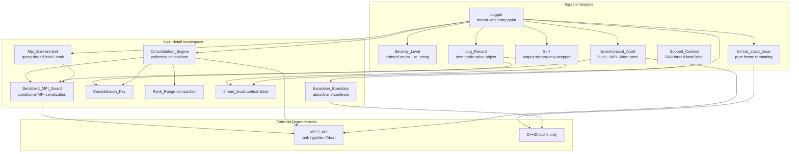
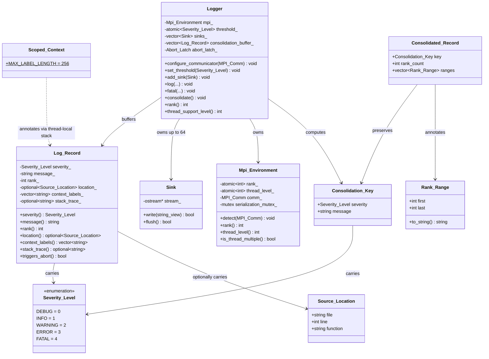
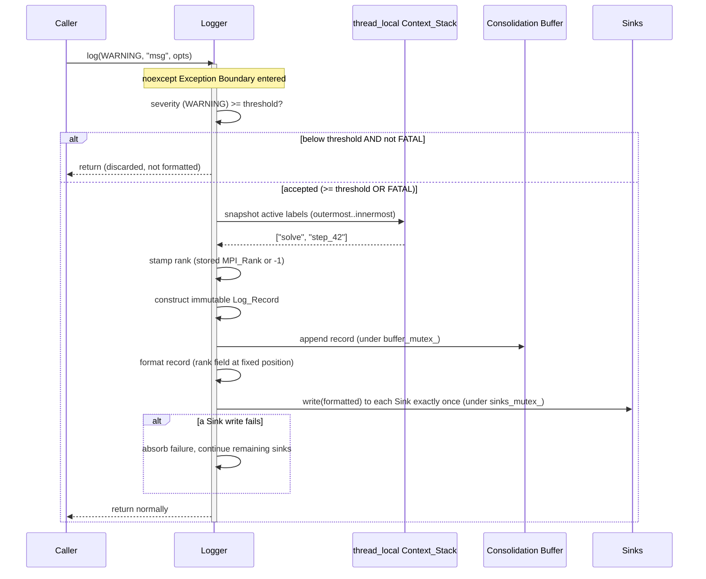

# Design Document: LOGS (Lightweight Operational Global Status)

## Overview

LOGS is a Tier 1 C++20 micro-library providing a thread-safe, MPI-rank-aware operational status, logging, and error-handling surface for distributed HPC jobs. It replaces the legacy ESMF logging surface — `ESMF_LogWrite` (message emission), `ESMF_LogErr`/`ESMF_LogFoundError` (error reporting), `ESMF_LogSet` (configuration), and the per-PET one-log-file-per-rank model — with a stateless, target-centric design that consolidates redundant cross-rank messages into single representative entries to prevent filesystem I/O storms at scale (e.g., 10,000 ranks failing simultaneously).

LOGS is **strictly an output and status mechanism**. It contains no input-parsing logic of any kind: no YAML, no namelist, no configuration-file reading, and it never opens a path for reading. All run-time behavior is configured exclusively through programmatic API calls.

The library is structured around five pillars:

1. **Thread-Safe Logger** — A central entry point that stamps every record with the originating MPI rank, applies atomic severity filtering, and serializes access to all shared mutable state (sink collection, severity threshold, consolidation buffers) so concurrent threads never race and never interleave a record's formatted text.
2. **Multi-Rank Consolidation / Throttling** — A collective engine that combines records sharing an identical `Consolidation_Key` across thousands of ranks into one representative record annotated with the contributing-rank count and compact `Rank_Range` spans, emitted from a single root rank (rank 0).
3. **Synchronized Abort** — A FATAL record flushes all sinks and then invokes `MPI_Abort` exactly once per process with a fixed non-zero exit code in the range 1–255, deterministically terminating the entire job rather than leaving zombie processes.
4. **Exception Boundary** — Every public logging entry point is `noexcept` from the caller's perspective; internal failures are absorbed, at most one ERROR diagnostic is attempted, and only the controlled FATAL path is permitted to terminate the process.
5. **Strict No-Parsing Separation of Concerns** — LOGS treats every configured stream as write-only, owns no file lifecycle, links no parsing library, and is enforced by a CI static-verification scan.

### Design Rationale

| Decision | Rationale |
|----------|-----------|
| Severity as a scoped enum with explicit total order | Enables deterministic comparison and filtering; FATAL as the maximum simplifies the never-suppressed rule |
| Immutable `Log_Record` value object | Eliminates data races on record fields once constructed; safe to buffer and hand to consolidation across threads |
| `Consolidation_Key` excludes rank | Identical messages from different ranks collapse to one representative — the core I/O-storm defense |
| `Rank_Range` maximal-contiguous-span compaction | Summarizes "0-9999" instead of enumerating 10,000 ranks, keeping output bounded under mass failure |
| Root-rank-0 emission of consolidated records | Guarantees exactly one writer per representative across the communicator |
| `noexcept` public entry points (Exception Boundary) | A logging failure must never crash the logger or the job; only FATAL terminates |
| RAII `Scoped_Context` with copy AND move deleted | Each pushed label is owned by exactly one scope-bound object; guarantees push/pop balance under unwinding |
| Thread-local context stack | Per-thread trace context with no locking on the hot path |
| Single `Synchronized_Abort` guard | `MPI_Abort` invoked at most once per process even under concurrent FATALs |
| MPI used only for rank id, consolidation gather, and `MPI_Abort` | Keeps LOGS a status utility; transport and compute belong to HALO |
| **No Kokkos dependency** | LOGS performs no numerical compute or device offload — an explicit build-system choice |
| Sinks are output streams only (max 64) | LOGS owns no file lifecycle and never reads input; bounded sink count caps fan-out cost |
| Conservative `MPI_THREAD_SINGLE` fallback | When the detected thread level is below `MPI_THREAD_MULTIPLE`, all MPI calls are serialized through a mutex to avoid undefined behavior |

---

## Architecture

### Component Diagram



### Namespace Structure

```
logs::                          // Top-level public namespace
├── Severity_Level              // Ordered enum: DEBUG < INFO < WARNING < ERROR < FATAL
├── to_string(Severity_Level)   // Fixed human-readable label mapping
├── Source_Location             // Optional file/line/function annotation
├── Log_Record                  // Immutable log value object
├── Sink                        // Output-stream-only destination wrapper
├── Scoped_Context              // RAII thread-local trace-context label
├── Stack_Frame                 // Caller-supplied frame data (POD)
├── format_stack_trace()        // Pure frame-sequence formatter
├── Logger                      // Central thread-safe entry point
└── detail::                    // Internal implementation namespace
    ├── Mpi_Environment          // MPI_Query_thread / MPI_Comm_rank wrapper
    ├── Serialized_MPI_Guard     // Conditional MPI serialization (RAII)
    ├── Consolidation_Key        // {Severity_Level, payload}, excludes rank
    ├── Rank_Range               // {first, last} contiguous span
    ├── compact_ranges()         // Ranks -> maximal contiguous Rank_Range set
    ├── Consolidation_Engine     // Collective gather + representative emission
    ├── Context_Stack            // thread_local std::vector<std::string>
    └── Abort_Latch              // std::once_flag-style single-abort guard
```

### Header Layout

```
include/logs/
├── logs.hpp                    // Umbrella header (includes all public headers)
├── severity.hpp                // Severity_Level enum + to_string
├── source_location.hpp         // Source_Location annotation type
├── log_record.hpp              // Log_Record immutable value object
├── sink.hpp                    // Sink output-stream wrapper
├── scoped_context.hpp          // Scoped_Context RAII type
├── stack_trace.hpp             // Stack_Frame + format_stack_trace()
├── logger.hpp                  // Logger central entry point
└── detail/
    ├── mpi_environment.hpp     // Mpi_Environment, thread-level detection
    ├── serialized_mpi_guard.hpp// Serialized_MPI_Guard RAII helper
    ├── consolidation.hpp       // Consolidation_Key, Rank_Range, compact_ranges, engine
    └── context_stack.hpp       // thread_local context stack accessors
```

> **Tier 1 `<span>` disambiguation:** The detail consolidation header may use the C++20 standard `<span>` for non-owning views over rank arrays. This is the standard library header `<span>`, NOT the HELM **SPAN** component. Per Requirement 14.1, an include such as `<span>` (a bare standard header) is permitted, while any include whose path contains a `span/` directory segment (e.g. `<span/interop.hpp>`) is forbidden. LOGS includes only C++ standard library headers and MPI headers.

### Repository Layout

```
libs/logs/                      // Git submodule root within HELM workspace
├── CMakeLists.txt              // Standalone build (produces HELM::LOGS)
├── cmake/
│   ├── LOGSConfig.cmake.in     // Exported config template
│   └── LOGSConfigVersion.cmake.in
├── include/logs/               // Public headers (as above)
├── src/
│   ├── logger.cpp              // Logger implementation
│   ├── sink.cpp                // Sink write/flush implementation
│   ├── scoped_context.cpp      // Context stack push/pop
│   ├── stack_trace.cpp         // format_stack_trace implementation
│   └── detail/
│       ├── mpi_environment.cpp // Thread-level + rank detection
│       └── consolidation.cpp   // Consolidation engine + range compaction
├── tests/
│   ├── CMakeLists.txt
│   ├── mpi_interposition.hpp   // Spy/mock layer for MPI calls
│   ├── in_memory_sink.hpp      // In-memory test Sink
│   ├── test_severity.cpp
│   ├── test_log_record.cpp
│   ├── test_rank_stamping.cpp
│   ├── test_filtering.cpp
│   ├── test_consolidation.cpp
│   ├── test_synchronized_abort.cpp
│   ├── test_sinks.cpp
│   ├── test_stack_trace.cpp
│   ├── test_scoped_context.cpp
│   ├── test_exception_boundary.cpp
│   ├── test_thread_safety.cpp
│   ├── prop_severity_ordering.cpp
│   ├── prop_rank_stamping.cpp
│   ├── prop_filtering.cpp
│   ├── prop_consolidation.cpp
│   ├── prop_rank_range.cpp
│   ├── prop_stack_trace.cpp
│   ├── prop_scoped_context.cpp
│   └── prop_format_round_trip.cpp
├── README.md
└── .gitignore
```

> **No `fortran/` directory and no Kokkos.** Unlike HALO, LOGS exposes no Fortran C-interop layer in this design and declares no Kokkos dependency. LOGS is a pure C++20 + MPI status utility.

---

## Components and Interfaces

> The interface sketches below are illustrative C++20 declarations included to communicate structure and contracts. They are design artifacts, not implementation source. Naming follows the HALO snake_case convention.

### 1. `logs::Severity_Level` — Ordered Severity Enum + To-String

```cpp
namespace logs {

/// Ascending order of severity. The fixed underlying values establish a
/// total ordering such that DEBUG < INFO < WARNING < ERROR < FATAL.
enum class Severity_Level : int {
    DEBUG   = 0,
    INFO    = 1,
    WARNING = 2,
    ERROR   = 3,
    FATAL   = 4
};

/// Map a Severity_Level to its fixed, human-readable label.
/// Returns "DEBUG", "INFO", "WARNING", "ERROR", or "FATAL".
[[nodiscard]] std::string_view to_string(Severity_Level level) noexcept;

// Relational comparison follows the underlying integer order. The total
// ordering is guaranteed for any two values (defaulted operator<=> in C++20).

} // namespace logs
```

### 2. `logs::Source_Location` — Optional Source Annotation

```cpp
namespace logs {

/// Caller-supplied source-location annotation. When absent, the Log_Record
/// stores std::nullopt rather than fabricating field values.
struct Source_Location {
    std::string file;       // source file name, verbatim
    int         line{0};    // line number, guaranteed >= 1 when present
    std::string function;   // function name, verbatim
};

} // namespace logs
```

### 3. `logs::Log_Record` — Immutable Log Value Object

```cpp
namespace logs {

class Log_Record {
public:
    /// Construct an immutable record. The Logger supplies the rank stamp and
    /// the snapshot of active Scoped_Context labels at construction time.
    Log_Record(Severity_Level severity,
               std::string message,
               int mpi_rank,
               std::optional<Source_Location> location,
               std::vector<std::string> context_labels,
               std::optional<std::string> stack_trace_text);

    // Copyable and movable; all accessors are const. No mutators exist.
    Log_Record(const Log_Record&) = default;
    Log_Record(Log_Record&&) noexcept = default;
    Log_Record& operator=(const Log_Record&) = default;
    Log_Record& operator=(Log_Record&&) noexcept = default;

    [[nodiscard]] Severity_Level severity() const noexcept;
    [[nodiscard]] const std::string& message() const noexcept;     // verbatim payload
    [[nodiscard]] int rank() const noexcept;                       // -1 sentinel if unidentified
    [[nodiscard]] const std::optional<Source_Location>& location() const noexcept;
    [[nodiscard]] const std::vector<std::string>& context_labels() const noexcept; // outermost..innermost
    [[nodiscard]] const std::optional<std::string>& stack_trace() const noexcept;

    /// True when this record was submitted at Severity_Level::FATAL.
    [[nodiscard]] bool triggers_abort() const noexcept;

private:
    Severity_Level severity_;
    std::string message_;                          // immutable after construction
    int rank_;
    std::optional<Source_Location> location_;
    std::vector<std::string> context_labels_;
    std::optional<std::string> stack_trace_;
};

} // namespace logs
```

### 4. `logs::Sink` — Output-Stream-Only Destination

```cpp
namespace logs {

/// A Sink wraps exactly one std::ostream (stderr, stdout, or a caller-supplied
/// stream). It performs write and flush ONLY. It never opens, reads, closes,
/// or parses any file or input source. The caller owns the stream lifecycle.
class Sink {
public:
    /// Wrap a caller-owned output stream. Does not take ownership.
    explicit Sink(std::ostream& stream) noexcept;

    /// Write the fully formatted record text to the stream exactly once.
    /// noexcept: any stream failure is reported via the return value, never thrown.
    [[nodiscard]] bool write(std::string_view formatted) noexcept;

    /// Flush the underlying stream. noexcept (Requirement 9.4).
    [[nodiscard]] bool flush() noexcept;

    Sink(const Sink&) = default;
    Sink& operator=(const Sink&) = default;

private:
    std::ostream* stream_;  // non-owning; never closed or destroyed by Sink
};

/// Compile-time upper bound on configured sinks (Requirement 6.1).
inline constexpr std::size_t MAX_SINKS = 64;

} // namespace logs
```

### 5. `logs::Scoped_Context` — RAII Thread-Local Trace Context

```cpp
namespace logs {

class Scoped_Context {
public:
    /// Push `label` onto the calling thread's context stack as the innermost
    /// entry. An empty label is replaced by a fixed placeholder so push/pop
    /// balance is preserved. A label longer than 256 characters is truncated
    /// to its first 256 characters before being pushed.
    explicit Scoped_Context(std::string_view label);

    /// Pop the single label this object pushed, restoring the stack to its
    /// state immediately before construction. noexcept: never propagates
    /// during stack unwinding (Requirements 8.3, 9.4).
    ~Scoped_Context() noexcept;

    // Copy AND move are deleted so each pushed label is owned by exactly one
    // Scoped_Context bound to its constructing scope (Requirement 8.5).
    Scoped_Context(const Scoped_Context&)            = delete;
    Scoped_Context& operator=(const Scoped_Context&) = delete;
    Scoped_Context(Scoped_Context&&)                 = delete;
    Scoped_Context& operator=(Scoped_Context&&)      = delete;

    /// Maximum stored label length in characters (Requirement 8.9).
    static constexpr std::size_t MAX_LABEL_LENGTH = 256;
};

} // namespace logs
```

### 6. `logs::Stack_Frame` + `format_stack_trace` — Pure Formatting

```cpp
namespace logs {

/// Caller-captured frame data. LOGS never captures or symbolizes frames itself;
/// it only formats supplied data. Missing fields are represented as std::nullopt.
struct Stack_Frame {
    std::optional<std::string> function;
    std::optional<std::string> file;
    std::optional<int>         line;
};

/// Pure formatting transformation over a supplied frame sequence:
///   - Exactly one line per supplied frame, in supplied order.
///   - Identical frame sequences always produce byte-identical text.
///   - Missing function/file/line fields render a fixed placeholder token.
///   - Empty sequence -> a fixed single-line "no frames available" indication.
///   - More than 256 frames -> first 256 rendered, then a fixed
///     "remaining frames omitted" line appended.
/// Reads/opens/parses NOTHING (Requirement 7.2).
[[nodiscard]] std::string format_stack_trace(std::span<const Stack_Frame> frames);

/// Cap on rendered frames before truncation (Requirement 7.8).
inline constexpr std::size_t MAX_TRACE_FRAMES = 256;

} // namespace logs
```

### 7. `logs::Logger` — Central Thread-Safe Entry Point

```cpp
namespace logs {

struct Submit_Options {
    std::optional<Source_Location> location{};
    std::span<const Stack_Frame>   frames{};   // empty -> no stack trace attached
    bool                           include_stack_trace{false};
};

class Logger {
public:
    /// Construct an unconfigured Logger. Before a communicator is configured,
    /// the stored rank is the sentinel -1 and the thread level defaults to
    /// MPI_THREAD_SINGLE.
    Logger() noexcept;
    ~Logger();

    Logger(const Logger&)            = delete;
    Logger& operator=(const Logger&) = delete;

    // ---- Configuration (programmatic only; never read from any file) ----

    /// Configure the MPI communicator. Calls MPI_Comm_rank exactly once and
    /// stores the rank; queries MPI_Query_thread and stores the thread level.
    /// If MPI_Comm_rank fails, the stored rank is set to -1 and the failure is
    /// absorbed via the Exception_Boundary (Requirements 2.1, 2.7, 11.3).
    void configure_communicator(MPI_Comm comm) noexcept;

    /// Atomically set the active severity threshold (last-writer-wins).
    void set_threshold(Severity_Level level) noexcept;        // Requirement 3.1, 3.8
    [[nodiscard]] Severity_Level threshold() const noexcept;  // default INFO

    /// Register an output-stream Sink. Rejected (absorbed) beyond MAX_SINKS.
    void add_sink(Sink sink) noexcept;                        // Requirement 6.1, 6.7

    // ---- Query (all thread-safe) ----

    [[nodiscard]] int rank() const noexcept;                  // -1 if unconfigured
    [[nodiscard]] int thread_support_level() const noexcept;  // MPI_THREAD_* constant

    // ---- Logging entry points (noexcept Exception Boundary) ----

    /// Submit a record. Applies severity filtering, rank stamping, context
    /// snapshot, formatting, and dispatch. FATAL is never suppressed and
    /// triggers the Synchronized_Abort path. Never propagates an exception.
    void log(Severity_Level severity, std::string_view message,
             const Submit_Options& opts = {}) noexcept;

    /// Convenience: emit a FATAL record and initiate Synchronized_Abort in one
    /// call (Requirement 5.5). Does not return on the abort path.
    [[noreturn]] void fatal(std::string_view message,
                            const Submit_Options& opts = {}) noexcept;

    // ---- Consolidation ----

    /// Collective consolidation across the configured communicator. Every rank
    /// must invoke this collectively. Operates over records buffered since the
    /// previous consolidation (or since configuration), emits representatives
    /// from root rank 0, and clears the buffer. With no communicator
    /// configured, consolidates locally and emits with a sentinel -1
    /// Rank_Range (Requirements 4.7, 4.9).
    void consolidate() noexcept;

private:
    detail::Mpi_Environment    mpi_;             // rank + thread level
    std::atomic<Severity_Level> threshold_{Severity_Level::INFO};
    std::mutex                  sinks_mutex_;
    std::vector<Sink>           sinks_;           // <= MAX_SINKS
    std::mutex                  buffer_mutex_;
    std::vector<Log_Record>     consolidation_buffer_;
    detail::Abort_Latch         abort_latch_;     // ensures MPI_Abort at most once
    std::mutex                  diagnostic_mutex_; // prevents diagnostic recursion
};

/// Fixed non-zero abort exit code, in the inclusive range 1..255 (Requirement 5.3).
inline constexpr int ABORT_EXIT_CODE = 70;  // EX_SOFTWARE-style fixed code

} // namespace logs
```

### 8. `logs::detail::Mpi_Environment` — MPI Threading & Rank

```cpp
namespace logs::detail {

class Mpi_Environment {
public:
    Mpi_Environment() noexcept;  // rank_ = -1, thread_level_ = MPI_THREAD_SINGLE

    /// Detect rank and thread level for the given communicator.
    /// - Calls MPI_Comm_rank exactly once; on failure sets rank to -1.
    /// - Calls MPI_Query_thread if MPI is initialized; otherwise stores the
    ///   conservative MPI_THREAD_SINGLE default (Requirements 11.3, 11.9).
    void detect(MPI_Comm comm) noexcept;

    [[nodiscard]] int rank() const noexcept;            // thread-safe; -1 sentinel
    [[nodiscard]] int thread_level() const noexcept;    // MPI_THREAD_* constant
    [[nodiscard]] bool is_thread_multiple() const noexcept;
    [[nodiscard]] bool has_communicator() const noexcept;
    [[nodiscard]] MPI_Comm communicator() const noexcept;

private:
    std::atomic<int> rank_{-1};
    std::atomic<int> thread_level_{MPI_THREAD_SINGLE};
    MPI_Comm         comm_{MPI_COMM_NULL};
    bool             has_comm_{false};
    mutable std::mutex serialization_mutex_;  // serializes MPI calls when level < MULTIPLE

    friend class Serialized_MPI_Guard;
};

} // namespace logs::detail
```

### 9. `logs::detail::Consolidation_Engine` — Cross-Rank Throttling

```cpp
namespace logs::detail {

/// Identity used for consolidation: severity + payload, EXCLUDING rank.
struct Consolidation_Key {
    Severity_Level severity;
    std::string    message;

    bool operator==(const Consolidation_Key&) const = default;
};

/// A maximal contiguous span of contributing ranks, rendered "first-last"
/// (first == last for a single-rank span).
struct Rank_Range {
    int first;
    int last;
    [[nodiscard]] std::string to_string() const;  // "first-last"
};

/// Partition a set of contributing ranks into maximal contiguous spans,
/// ordered by ascending first rank. e.g. {0,1,2,5,6,9} -> {0-2, 5-6, 9-9}.
[[nodiscard]] std::vector<Rank_Range> compact_ranges(std::vector<int> ranks);

/// Representative consolidated record: original severity + payload preserved,
/// annotated with the contributing-rank count and compacted Rank_Ranges.
struct Consolidated_Record {
    Consolidation_Key       key;        // severity + payload preserved unchanged
    int                     rank_count; // total contributing ranks
    std::vector<Rank_Range> ranges;     // ordered by ascending first
};

class Consolidation_Engine {
public:
    /// Collective consolidation across `comm`. Uses MPI ONLY to gather
    /// Consolidation_Keys and contributing ranks (no other payload transported).
    /// Produces representatives on root rank 0 only; non-root ranks emit nothing.
    [[nodiscard]] std::vector<Consolidated_Record>
    consolidate_collective(std::span<const Log_Record> buffered,
                           MPI_Environment& env) noexcept;

    /// Local (no-communicator) path: consolidates only local records and
    /// annotates each representative with a single-rank Rank_Range bearing the
    /// sentinel rank -1. Issues NO MPI communication (Requirement 4.9).
    [[nodiscard]] std::vector<Consolidated_Record>
    consolidate_local(std::span<const Log_Record> buffered) noexcept;
};

} // namespace logs::detail
```

### 10. `logs::detail::Abort_Latch` — Single Synchronized Abort

```cpp
namespace logs::detail {

/// Ensures the Synchronized_Abort path runs at most once per process, even
/// under concurrent or subsequent FATAL submissions (Requirements 5.8, 11.6).
class Abort_Latch {
public:
    /// Returns true exactly once (to the first caller). All later callers,
    /// concurrent or sequential, receive false and must not invoke MPI_Abort.
    [[nodiscard]] bool try_acquire() noexcept {
        bool expected = false;
        return latched_.compare_exchange_strong(expected, true,
                                                std::memory_order_acq_rel);
    }

private:
    std::atomic<bool> latched_{false};
};

} // namespace logs::detail
```

---

## Data Models

### Core Data Structures



### Consolidation_Key Composition

A `Consolidation_Key` is the tuple `{Severity_Level severity, std::string message}`. The originating `MPI_Rank` is **deliberately excluded** so that identical messages emitted from different ranks collapse to a single representative. Two `Log_Records` consolidate together if and only if their keys are equal under value comparison (severity equal AND payload byte-equal). The representative record preserves the original severity and message payload unchanged; only the rank annotation differs (count + ranges instead of a single rank).

### Rank_Range Compaction Algorithm

Given the set of distinct contributing ranks for one `Consolidation_Key`, the engine partitions them into maximal contiguous spans:

1. Collect the distinct contributing ranks into a vector.
2. Sort ascending.
3. Walk the sorted ranks, opening a new `Rank_Range{first=last=r}` at the start of each run and extending `last` while the next rank equals `last + 1`.
4. Close a span when the next rank is non-contiguous (or input ends), then open a new span.
5. Emit the spans in ascending `first` order. A single rank `r` yields `Rank_Range{r, r}` rendered `"r-r"`.

```cpp
// Illustrative reference implementation (design sketch)
std::vector<Rank_Range> compact_ranges(std::vector<int> ranks) {
    std::sort(ranks.begin(), ranks.end());
    ranks.erase(std::unique(ranks.begin(), ranks.end()), ranks.end());
    std::vector<Rank_Range> out;
    for (std::size_t i = 0; i < ranks.size(); ++i) {
        int first = ranks[i];
        int last  = first;
        while (i + 1 < ranks.size() && ranks[i + 1] == last + 1) {
            ++i;
            last = ranks[i];
        }
        out.push_back(Rank_Range{first, last});
    }
    return out;  // already ordered by ascending first
}
```

Example: `{0,1,2,3,...,9999}` → a single `Rank_Range{0, 9999}` rendered `"0-9999"` — the core defense against per-rank output explosion. Example: `{0,1,2,5,6,9}` → `{0-2, 5-6, 9-9}`.

### Thread Serialization Strategy

LOGS serializes access to each shared mutable resource and, when the detected MPI thread level is below `MPI_THREAD_MULTIPLE`, serializes all MPI calls it issues. This mirrors HALO's `Serialized_MPI_Guard`.

```cpp
namespace logs::detail {

/// RAII guard that locks the environment serialization mutex when the detected
/// MPI thread level is below MPI_THREAD_MULTIPLE (Requirements 11.4, 11.9).
class Serialized_MPI_Guard {
public:
    explicit Serialized_MPI_Guard(Mpi_Environment& env) : env_(env) {
        if (!env_.is_thread_multiple()) {
            env_.serialization_mutex_.lock();
            locked_ = true;
        }
    }
    ~Serialized_MPI_Guard() {
        if (locked_) env_.serialization_mutex_.unlock();
    }
    Serialized_MPI_Guard(const Serialized_MPI_Guard&)            = delete;
    Serialized_MPI_Guard& operator=(const Serialized_MPI_Guard&) = delete;

private:
    Mpi_Environment& env_;
    bool             locked_{false};
};

} // namespace logs::detail
```

Resource-level serialization summary:

| Shared Resource | Protection | Rationale |
|---|---|---|
| Active severity threshold | `std::atomic<Severity_Level>` | Lock-free atomic set/get; last-writer-wins; no torn reads (Req 3.1) |
| Configured sink collection | `sinks_mutex_` | Guards add/iterate; bounded to 64 (Req 11.1) |
| Consolidation buffer | `buffer_mutex_` | Guards append/drain/clear during submit and consolidate (Req 11.1) |
| Per-record formatted write | `sinks_mutex_` held across a record's writes | Prevents interleaving of one record's text with another's (Req 11.2) |
| MPI calls (rank/gather/Abort) | `Serialized_MPI_Guard` | Serializes when thread level < MULTIPLE (Req 11.4) |
| Synchronized abort | `Abort_Latch` (atomic) | MPI_Abort at most once per process (Req 5.8, 11.6) |
| Scoped_Context labels | `thread_local` stack (no lock) | Per-thread independence without locking (Req 8.6, 11.7) |

### Sequence Diagram — Normal Log Submission Flow



### Sequence Diagram — Collective Consolidation + FATAL Synchronized Abort

```mermaid
sequenceDiagram
    participant AllRanks as All Ranks (collective)
    participant Logger
    participant Engine as Consolidation_Engine
    participant MPI
    participant Sinks
    participant Root as Root Rank 0

    AllRanks->>Logger: consolidate() (collective)
    activate Logger
    Logger->>Engine: consolidate_collective(buffer, env)
    Engine->>MPI: gather Consolidation_Keys + contributing ranks ONLY
    MPI-->>Engine: gathered keys/ranks at root
    Engine->>Engine: group by key, compact_ranges(ranks)
    Engine-->>Logger: representatives (root only); empty on non-root
    Logger->>Root: write each representative exactly once (rank 0)
    Logger->>Logger: clear consolidation buffer
    deactivate Logger

    note over AllRanks,Root: Later — a FATAL condition occurs

    AllRanks->>Logger: fatal("unrecoverable")
    activate Logger
    Logger->>Sinks: format + dispatch FATAL to all sinks
    Logger->>Sinks: flush all sinks (absorb flush failures)
    Logger->>Logger: abort_latch_.try_acquire()
    alt latch acquired (first/only)
        Logger->>MPI: MPI_Abort(comm, ABORT_EXIT_CODE in 1..255)
    else latch already held (concurrent FATAL)
        Logger->>Logger: suppress second abort
    end
    note over Logger: no-communicator path -> flush then exit(ABORT_EXIT_CODE)
    deactivate Logger
```


---

## Correctness Properties

*A property is a characteristic or behavior that should hold true across all valid executions of a system — essentially, a formal statement about what the system should do. Properties serve as the bridge between human-readable specifications and machine-verifiable correctness guarantees.*

LOGS is dominated by pure, input-driven logic — severity ordering, immutable-record construction, threshold filtering, key-based consolidation, contiguous-span partitioning, deterministic stack-trace formatting, and LIFO context handling — whose behavior varies meaningfully with input. These are ideal targets for property-based testing. MPI rank identity, the consolidation gather, and `MPI_Abort` are observed deterministically through the Interposition_Layer (see Testing Strategy) so that rank-stamping, consolidation, and abort properties hold without a live MPI runtime. Build-system, CI-scan, repository-structure, and "no input parsing" criteria (Requirements 10.5–10.8, 12, 14, 15) are **not** property-based; they are verified by static scans, CMake configuration checks, and smoke/integration tests, and therefore do not appear as correctness properties below.

### Property 1: Severity Level Total Ordering

*For any* two Severity_Level values `a` and `b`, the comparison `a < b` SHALL hold if and only if the rank of `a` precedes the rank of `b` in the fixed sequence DEBUG, INFO, WARNING, ERROR, FATAL, and the ordering SHALL be total, antisymmetric, and transitive over all five levels.

**Validates: Requirements 1.1**

### Property 2: Severity Label Mapping Is Fixed and Total

*For any* Severity_Level value, `to_string` SHALL return exactly the mandated label ("DEBUG", "INFO", "WARNING", "ERROR", or "FATAL"), the mapping SHALL be defined for every level, and distinct levels SHALL map to distinct labels.

**Validates: Requirements 1.6**

### Property 3: Log_Record Construction Preserves Fields Immutably

*For any* severity, message string, rank, optional source location, and context-label sequence, constructing a Log_Record and reading its accessors SHALL return values equal to the constructor inputs — with the message preserved byte-for-byte — and the type SHALL expose no operation that mutates any field after construction.

**Validates: Requirements 1.2, 1.3**

### Property 4: Absent Source Location Is Never Fabricated

*For any* Log_Record constructed without a source-location annotation, the stored location SHALL be empty (absent) rather than carrying any fabricated file name, line number, or function name.

**Validates: Requirements 1.7**

### Property 5: FATAL Classification

*For any* Log_Record, `triggers_abort()` SHALL return true if and only if the record's severity is FATAL.

**Validates: Requirements 1.5**

### Property 6: Rank Stamping Invariance

*For any* sequence of submissions issued after the Logger is initialized with a stored rank `r` (where `r >= 0`), every produced Log_Record on every thread SHALL carry rank exactly `r`, and the stored rank SHALL be determined by exactly one call to MPI_Comm_rank during initialization.

**Validates: Requirements 2.1, 2.2, 2.5, 2.6**

### Property 7: Unidentified-Rank Sentinel Before Configuration

*For any* submission issued before an MPI communicator has been configured, the produced Log_Record SHALL carry rank `-1`, and the rank accessor SHALL likewise return `-1` until a communicator is configured.

**Validates: Requirements 2.4, 2.5**

### Property 8: Record Formatting Round-Trip

*For any* Log_Record with rank `r`, severity `s`, and message `m`, formatting the record to text and extracting the fields at their fixed positions SHALL recover `r`, the label of `s`, and `m` each equal to the original values.

**Validates: Requirements 2.3, 1.6**

### Property 9: Atomic Threshold Last-Writer-Wins

*For any* interleaving of concurrent threshold-setting calls drawn from the defined levels, every threshold read SHALL observe one of the set values with no torn or partial value, and after any setter returns, the active threshold SHALL equal the value established by the most recent successful setter until a later setter returns.

**Validates: Requirements 3.1, 3.5, 3.8**

### Property 10: Severity Filtering Monotonicity

*For any* submission with severity `s` and active threshold `t`, the record SHALL be accepted for formatting and dispatch when `s >= t` and SHALL be discarded — neither formatted nor written to any sink — when `s < t`.

**Validates: Requirements 3.2, 3.3**

### Property 11: FATAL Is Never Suppressed

*For any* active threshold value, including a threshold equal to FATAL, a submission at severity FATAL SHALL be accepted for formatting and dispatch.

**Validates: Requirements 3.7**

### Property 12: Consolidation Key Excludes Rank

*For any* two accepted Log_Records, their Consolidation_Keys SHALL be equal if and only if their severity and message payload are equal, irrespective of their originating ranks.

**Validates: Requirements 4.1**

### Property 13: Exactly One Root-Written Representative Per Key

*For any* set of buffered records spanning two or more distinct ranks that share a Consolidation_Key, a consolidation operation SHALL produce exactly one representative record for that key and SHALL write it to the configured sinks on exactly the root rank (rank 0), with no other rank writing that representative.

**Validates: Requirements 4.2**

### Property 14: Consolidated Rank Partitioning Into Ordered Contiguous Spans

*For any* set of contributing ranks, the representative record SHALL carry a contributing-rank count equal to the number of distinct ranks and a sequence of Rank_Ranges that are maximal contiguous spans collectively covering exactly those distinct ranks, each rendered "first-last" (with first equal to last for a single rank), non-overlapping, non-adjacent, and ordered by ascending first rank.

**Validates: Requirements 4.3, 4.4, 4.6**

### Property 15: Consolidation Preserves Severity and Message

*For any* representative record produced by consolidation, its severity and message payload SHALL equal the severity and message of the contributing records unchanged.

**Validates: Requirements 4.8**

### Property 16: Consolidation Transports Only Keys and Ranks

*For any* collective consolidation, the data transported via MPI SHALL consist solely of Consolidation_Keys and contributing ranks, and SHALL NOT include any other record payload such as source location, stack-trace text, or context labels.

**Validates: Requirements 4.5**

### Property 17: Consolidation Buffer Lifecycle

*For any* set of records buffered since the previous consolidation, a consolidation operation SHALL process exactly that set and then clear the buffer, such that an immediately following consolidation over an unchanged buffer produces zero representative records.

**Validates: Requirements 4.7**

### Property 18: No-Communicator Local Consolidation Fallback

*For any* set of buffered records when no MPI communicator has been configured, `consolidate()` SHALL produce representative records locally, annotate each with a single-rank Rank_Range bearing the sentinel rank `-1`, write them to the local sinks, clear the buffer, and issue no MPI communication.

**Validates: Requirements 4.9**

### Property 19: FATAL Format-and-Flush Precede Abort

*For any* FATAL submission with any number of configured sinks, the Logger SHALL write the formatted record to every sink and flush every sink before initiating any termination action, such that all write and flush operations are observably ordered before the abort.

**Validates: Requirements 5.1, 5.2**

### Property 20: Abort Exit Code Is a Fixed Value in 1..255

*For any* FATAL-triggered Synchronized_Abort, MPI_Abort SHALL be invoked on the configured communicator with a fixed, deterministic, non-zero exit code in the inclusive range 1 to 255.

**Validates: Requirements 5.3, 5.5**

### Property 21: MPI_Abort Occurs At Most Once Per Process

*For any* number of FATAL records submitted concurrently or sequentially, the Synchronized_Abort body SHALL execute at most once and MPI_Abort SHALL be invoked no more than once per process lifetime.

**Validates: Requirements 5.8, 11.6**

### Property 22: Synchronized_Abort Is the Sole Termination Path

*For any* sequence of non-FATAL operations (submissions below FATAL, threshold changes, sink configuration, consolidation), the Logger SHALL invoke neither MPI_Abort nor any process-termination primitive.

**Validates: Requirements 5.6, 9.5, 13.10**

### Property 23: Sink Write-Exactly-Once and Bounded Cardinality

*For any* record that passes severity filtering with `k` configured sinks (`0 <= k <= 64`), the formatted record SHALL be written exactly once to each configured sink; when `k` is zero the record SHALL be written exactly once to the default stderr sink; and the configured sink count SHALL never exceed 64.

**Validates: Requirements 6.1, 6.2, 6.3**

### Property 24: Sink Write-Failure Isolation

*For any* configuration of sinks in which a write to one sink fails, the Logger SHALL absorb the failure without propagating an exception, SHALL still write the record exactly once to every remaining sink, and SHALL retain the failed sink configured for subsequent records.

**Validates: Requirements 6.6, 6.7**

### Property 25: Borrowed Stream Lifecycle Is Untouched

*For any* caller-supplied output stream wrapped by a Sink, the Logger SHALL only write to and flush the stream and SHALL never open, close, or destroy it, leaving the stream lifecycle entirely to the caller.

**Validates: Requirements 6.4, 6.5**

### Property 26: Stack-Trace Formatting Determinism and Structure

*For any* sequence of supplied stack frames, the formatter SHALL produce exactly one line per frame in supplied order (capped at 256 lines), render the function, file, and line fields of each frame in the same fixed field order with a fixed placeholder token substituted for any missing field, never omit a frame, and produce byte-identical output for byte-identical input.

**Validates: Requirements 7.1, 7.2, 7.3, 7.4**

### Property 27: Stack-Trace Frame Cap With Omission Indicator

*For any* supplied frame sequence containing more than 256 frames, the formatter SHALL render the first 256 frames in supplied order followed by exactly one fixed single-line omission indication.

**Validates: Requirements 7.8**

### Property 28: Conditional Stack-Trace Attachment

*For any* submission, the produced Log_Record SHALL carry attached stack-trace text if and only if the caller requested stack-trace inclusion.

**Validates: Requirements 7.6, 7.7**

### Property 29: Scoped_Context LIFO Push/Pop Balance

*For any* nesting of Scoped_Context objects constructed and destroyed in reverse construction order on a single thread, each construction SHALL push its (normalized) label as the innermost entry and each destruction SHALL pop exactly that label, so that the thread-local context stack is restored to its exact pre-construction state at every level.

**Validates: Requirements 8.1, 8.2, 8.7**

### Property 30: Scoped_Context Pops On Exception Unwind

*For any* exception that unwinds the stack through a scope containing a Scoped_Context, the destructor SHALL pop the label it pushed and SHALL NOT propagate any exception, restoring the context stack to its pre-construction state.

**Validates: Requirements 8.3**

### Property 31: Context Capture Ordered Outermost-to-Innermost

*For any* set of active Scoped_Context labels on the submitting thread, the produced Log_Record SHALL carry exactly those labels ordered from outermost to innermost, and SHALL carry an empty sequence when no context is active.

**Validates: Requirements 1.4, 8.4, 8.10**

### Property 32: Context Stack Per-Thread Independence

*For any* concurrent execution of threads each pushing distinct Scoped_Context labels, records submitted on one thread SHALL never include labels pushed on any other thread.

**Validates: Requirements 8.6, 11.7**

### Property 33: Context Label Normalization

*For any* context label supplied to a Scoped_Context, an empty label SHALL push the fixed placeholder (preserving push/pop balance) and a label longer than 256 characters SHALL be truncated to its first 256 characters before being pushed.

**Validates: Requirements 8.8, 8.9**

### Property 34: Public Entry Points Never Propagate Exceptions

*For any* internal operation that throws during a public logging entry point, the entry point SHALL catch the exception, cease the offending submission without retrying it, return control to the caller normally without propagating the exception, and leave the configured sinks, active threshold, and consolidation buffers in a valid, usable state for subsequent submissions.

**Validates: Requirements 9.1, 9.2, 9.7**

### Property 35: Bounded, Non-Recursive Absorbed-Failure Diagnostic

*For any* exception absorbed at a public entry point, the Logger SHALL attempt at most one diagnostic record at severity ERROR describing the failure, and if that diagnostic attempt itself throws it SHALL be discarded silently with no further attempt and no propagation.

**Validates: Requirements 9.3, 9.6**

### Property 36: Concurrent Record-Count Integrity and Non-Interleaving

*For any* number of threads concurrently submitting accepted records to a shared sink, the count of emitted records SHALL equal the count of submitted records (no record lost, none duplicated), each emitted record's fields SHALL match exactly one submitted record, and the formatted text of any one record SHALL be written without interleaving with the text of another.

**Validates: Requirements 11.1, 11.2, 11.8**

### Property 37: MPI Thread-Level Detection and Serialization

*For any* MPI thread support level reported at initialization, the Logger SHALL store and return that level (and SHALL store MPI_THREAD_SINGLE when MPI was not initialized), and whenever the stored level is below MPI_THREAD_MULTIPLE the Logger SHALL serialize every MPI call it issues so that no two MPI calls overlap.

**Validates: Requirements 11.3, 11.4, 11.5, 11.9**
