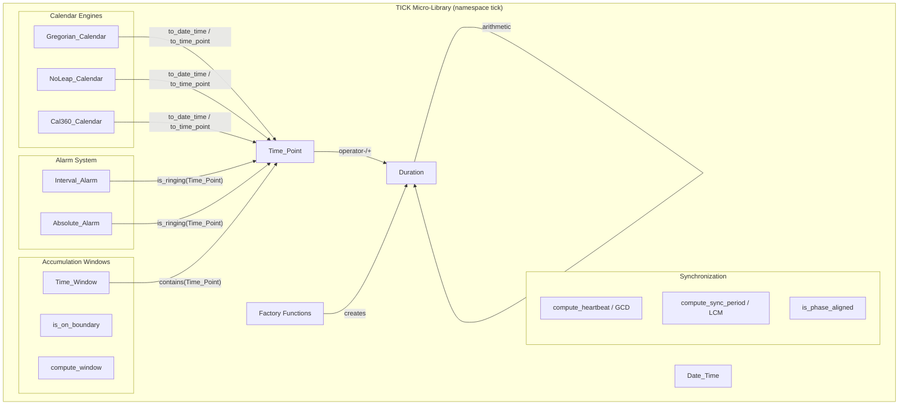
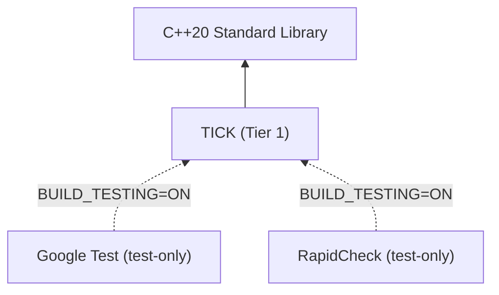

# Design Document: TICK (Time Integration & Chronology Kernel)

## Overview

TICK is a Tier 1 C++20 micro-library providing fixed-point temporal arithmetic, calendar decomposition, alarm queries, multi-rate heartbeat synchronization, and accumulation window computation for the HELM ecosystem. It replaces the legacy ESMF Time Manager with a stateless, zero-dependency design that eliminates floating-point drift and supports the three calendar types required by Earth system models (Gregorian, NoLeap, Cal360).

### Design Principles

- **Pure integer arithmetic**: All time values are 64-bit signed integers in nanoseconds. No `float` or `double` anywhere in the library.
- **Value semantics**: `Time_Point`, `Duration`, `Date_Time`, and `Time_Window` are immutable value types — cheaply copyable, trivially destructible.
- **Statelessness**: No mutable global state, no singletons, no thread-local storage. Calendar objects are stateless policy types.
- **`constexpr` by default**: All arithmetic, comparisons, and factory functions are `constexpr`. Calendar decomposition is `constexpr` where feasible.
- **Tier 1 isolation**: Zero `#include` of any HELM library header. Only C++20 standard library headers.

### Representable Range

A signed 64-bit nanosecond counter provides a range of approximately ±292 years from the epoch, which is sufficient for climate simulations spanning millennial timescales when combined with calendar arithmetic. The epoch is fixed at 2026-01-01T00:00:00.

## Architecture

### Component Diagram



### Dependency Graph (Tier Architecture)



TICK has zero runtime dependencies. Google Test and RapidCheck are test-only dependencies, gated behind `BUILD_TESTING=ON`.

## Components and Interfaces

### Core Value Types

#### `tick::Time_Point`

An opaque wrapper around a `std::int64_t` nanosecond offset from the epoch.

```cpp
namespace tick {

class Time_Point {
public:
    constexpr Time_Point() noexcept = default;
    constexpr explicit Time_Point(std::int64_t nanos_since_epoch) noexcept;

    [[nodiscard]] constexpr std::int64_t nanos() const noexcept;

    // Arithmetic
    constexpr Time_Point  operator+(Duration d) const;
    constexpr Time_Point  operator-(Duration d) const;
    constexpr Duration    operator-(Time_Point other) const noexcept;
    constexpr Time_Point& operator+=(Duration d);
    constexpr Time_Point& operator-=(Duration d);

    // Comparison (C++20 spaceship)
    constexpr auto operator<=>(const Time_Point&) const noexcept = default;
    constexpr bool operator==(const Time_Point&)  const noexcept = default;

private:
    std::int64_t nanos_{0};
};

} // namespace tick
```

#### `tick::Duration`

An opaque wrapper around a `std::int64_t` nanosecond count representing a time interval.

```cpp
namespace tick {

class Duration {
public:
    constexpr Duration() noexcept = default;
    constexpr explicit Duration(std::int64_t nanos) noexcept;

    [[nodiscard]] constexpr std::int64_t nanos() const noexcept;

    // Arithmetic
    constexpr Duration  operator+(Duration other) const;
    constexpr Duration  operator-(Duration other) const;
    constexpr Duration  operator*(std::int64_t scalar) const;
    constexpr Duration  operator/(std::int64_t scalar) const;
    constexpr Duration  operator-() const noexcept;
    constexpr Duration& operator+=(Duration other);
    constexpr Duration& operator-=(Duration other);
    constexpr Duration& operator*=(std::int64_t scalar);
    constexpr Duration& operator/=(std::int64_t scalar);

    // Comparison (C++20 spaceship)
    constexpr auto operator<=>(const Duration&) const noexcept = default;
    constexpr bool operator==(const Duration&)  const noexcept = default;

private:
    std::int64_t nanos_{0};
};

} // namespace tick
```

#### `tick::Date_Time`

A decomposed calendar representation — a plain aggregate with no invariants of its own (validation is performed by calendar engines).

```cpp
namespace tick {

struct Date_Time {
    std::int32_t year;
    std::int32_t month;       // 1-12
    std::int32_t day;         // 1-31 (calendar-dependent max)
    std::int32_t hour;        // 0-23
    std::int32_t minute;      // 0-59
    std::int32_t second;      // 0-59
    std::int32_t nanosecond;  // 0-999999999

    constexpr auto operator<=>(const Date_Time&) const noexcept = default;
    constexpr bool operator==(const Date_Time&)  const noexcept = default;
};

} // namespace tick
```

### Calendar Engines

Calendars are stateless policy types with static member functions. They share a concept interface:

```cpp
namespace tick {

template <typename Cal>
concept Calendar = requires(Time_Point tp, Date_Time dt) {
    { Cal::to_date_time(tp) } -> std::same_as<Date_Time>;
    { Cal::to_time_point(dt) } -> std::same_as<Time_Point>;
    { Cal::days_in_month(std::int32_t year, std::int32_t month) } -> std::same_as<std::int32_t>;
    { Cal::days_in_year(std::int32_t year) } -> std::same_as<std::int32_t>;
};

} // namespace tick
```

#### `tick::Gregorian_Calendar`

```cpp
namespace tick {

struct Gregorian_Calendar {
    [[nodiscard]] static constexpr Date_Time   to_date_time(Time_Point tp);
    [[nodiscard]] static constexpr Time_Point  to_time_point(Date_Time dt);
    [[nodiscard]] static constexpr bool        is_leap_year(std::int32_t year) noexcept;
    [[nodiscard]] static constexpr std::int32_t days_in_month(std::int32_t year, std::int32_t month);
    [[nodiscard]] static constexpr std::int32_t days_in_year(std::int32_t year) noexcept;

    // Calendar-aware month/year addition
    [[nodiscard]] static constexpr Time_Point add_months(Time_Point tp, std::int32_t months);
    [[nodiscard]] static constexpr Time_Point add_years(Time_Point tp, std::int32_t years);
};

} // namespace tick
```

#### `tick::NoLeap_Calendar`

Same interface as `Gregorian_Calendar` but every year is 365 days, February always has 28 days.

#### `tick::Cal360_Calendar`

Same interface but every month has 30 days, every year has 360 days.

### Alarm System

#### `tick::Interval_Alarm`

```cpp
namespace tick {

class Interval_Alarm {
public:
    constexpr Interval_Alarm(Duration interval, Time_Point reference);

    [[nodiscard]] constexpr bool       is_ringing(Time_Point current_time) const noexcept;
    [[nodiscard]] constexpr Time_Point next_ring_at(Time_Point current_time) const noexcept;
    [[nodiscard]] constexpr Duration   interval() const noexcept;
    [[nodiscard]] constexpr Time_Point reference() const noexcept;

private:
    Duration   interval_;
    Time_Point reference_;
};

} // namespace tick
```

#### `tick::Absolute_Alarm`

```cpp
namespace tick {

class Absolute_Alarm {
public:
    constexpr explicit Absolute_Alarm(Time_Point trigger_time) noexcept;

    [[nodiscard]] constexpr bool       is_ringing(Time_Point current_time) const noexcept;
    [[nodiscard]] constexpr bool       has_passed(Time_Point current_time) const noexcept;
    [[nodiscard]] constexpr Time_Point trigger_time() const noexcept;

private:
    Time_Point trigger_time_;
};

} // namespace tick
```

### Synchronization Functions

```cpp
namespace tick {

// GCD of all time steps — the fundamental heartbeat
[[nodiscard]] Duration compute_heartbeat(std::span<const Duration> time_steps);

// LCM of all time steps — the synchronization period
[[nodiscard]] Duration compute_sync_period(std::span<const Duration> time_steps);

// Phase alignment check
[[nodiscard]] constexpr bool is_phase_aligned(
    Time_Point current_time,
    Time_Point base_time,
    Duration   time_step);

} // namespace tick
```

### Accumulation Window

#### `tick::Time_Window`

```cpp
namespace tick {

class Time_Window {
public:
    constexpr Time_Window(Time_Point start, Time_Point end);

    [[nodiscard]] constexpr bool     contains(Time_Point t) const noexcept;
    [[nodiscard]] constexpr Duration duration() const noexcept;
    [[nodiscard]] constexpr Time_Point start() const noexcept;
    [[nodiscard]] constexpr Time_Point end() const noexcept;

    constexpr auto operator<=>(const Time_Window&) const noexcept = default;
    constexpr bool operator==(const Time_Window&)  const noexcept = default;

private:
    Time_Point start_;
    Time_Point end_;
};

// Boundary detection
[[nodiscard]] constexpr bool is_on_boundary(Time_Point current_time, Duration interval);

// Window computation
[[nodiscard]] constexpr Time_Window compute_window(Time_Point current_time, Duration interval);

} // namespace tick
```

### Factory Functions

```cpp
namespace tick {

[[nodiscard]] constexpr Duration nanoseconds(std::int64_t count)  noexcept;
[[nodiscard]] constexpr Duration microseconds(std::int64_t count) noexcept;
[[nodiscard]] constexpr Duration milliseconds(std::int64_t count) noexcept;
[[nodiscard]] constexpr Duration seconds(std::int64_t count)      noexcept;
[[nodiscard]] constexpr Duration minutes(std::int64_t count)      noexcept;
[[nodiscard]] constexpr Duration hours(std::int64_t count)        noexcept;
[[nodiscard]] constexpr Duration days(std::int64_t count)         noexcept;

} // namespace tick
```

### Key Algorithms

#### Calendar Decomposition (Gregorian)

The Gregorian decomposition uses the civil-from-days algorithm (Howard Hinnant's algorithm adapted from the C++20 `<chrono>` library specification):

1. Compute total days from nanosecond offset: `day_offset = nanos / nanos_per_day`
2. Compute sub-day remainder: `sub_day_nanos = nanos % nanos_per_day` (handle negative offsets by adjusting)
3. Apply the era-based decomposition:
   - Shift to a March-based epoch for uniform month handling
   - Compute era (400-year cycle), year-of-era, and day-of-year
   - Derive month and day from day-of-year using a magic-number lookup
   - Un-shift back to January-based months
4. Decompose `sub_day_nanos` into hour, minute, second, nanosecond via successive division

The inverse (`to_time_point`) reverses the process: accumulate days from year, month, and day fields, then add sub-day nanoseconds.

#### Calendar Decomposition (NoLeap)

Simplified — no era logic needed:
1. `day_offset = nanos / nanos_per_day`
2. `year_offset = day_offset / 365`; `day_in_year = day_offset % 365`
3. Walk cumulative month-day table `[0, 31, 59, 90, 120, 151, 181, 212, 243, 273, 304, 334]` to find month
4. Day = remaining days + 1

#### Calendar Decomposition (Cal360)

Trivial — uniform 30-day months:
1. `day_offset = nanos / nanos_per_day`
2. `year_offset = day_offset / 360`; `day_in_year = day_offset % 360`
3. `month = day_in_year / 30 + 1`; `day = day_in_year % 30 + 1`

#### GCD / LCM Computation

```
gcd(a, b):
    while b != 0:
        a, b = b, a % b
    return abs(a)

lcm(a, b):
    // Overflow-safe: divide before multiply
    return abs(a / gcd(a, b)) * b   // check for overflow on final multiply
```

For collections, fold left: `gcd(a, b, c) = gcd(gcd(a, b), c)` and similarly for LCM.

#### Overflow Detection

Overflow is detected using GCC/Clang `__builtin_add_overflow`, `__builtin_sub_overflow`, and `__builtin_mul_overflow` intrinsics. For `constexpr` contexts where builtins are unavailable, a portable pre-check is used:

```
// Addition overflow: if b > 0 and a > INT64_MAX - b, or b < 0 and a < INT64_MIN - b
// Multiplication overflow: if a != 0 and result / a != b (post-check), or pre-check using limits
```

When overflow is detected, `std::overflow_error` is thrown.

## Data Models

### Type Summary

| Type | Storage | Semantics | Copy | Constexpr |
|------|---------|-----------|------|-----------|
| `Time_Point` | `int64_t` (8 bytes) | Nanoseconds since epoch | Trivial | Yes |
| `Duration` | `int64_t` (8 bytes) | Nanosecond interval | Trivial | Yes |
| `Date_Time` | 7 × `int32_t` (28 bytes) | Decomposed fields | Trivial | Yes |
| `Interval_Alarm` | `Duration` + `Time_Point` (16 bytes) | Periodic trigger | Trivial | Yes (ctor throws) |
| `Absolute_Alarm` | `Time_Point` (8 bytes) | One-shot trigger | Trivial | Yes |
| `Time_Window` | 2 × `Time_Point` (16 bytes) | Half-open interval | Trivial | Yes (ctor throws) |

### Constants

```cpp
namespace tick {

inline constexpr std::int64_t nanos_per_second = 1'000'000'000LL;
inline constexpr std::int64_t nanos_per_minute = 60LL * nanos_per_second;
inline constexpr std::int64_t nanos_per_hour   = 60LL * nanos_per_minute;
inline constexpr std::int64_t nanos_per_day    = 24LL * nanos_per_hour;

// Epoch: 2026-01-01T00:00:00 — nanos() == 0 at this instant
inline constexpr Time_Point epoch{0};

} // namespace tick
```

### Epoch Convention

The epoch is `2026-01-01T00:00:00`. A `Time_Point{0}` represents this instant. Negative values represent times before the epoch; positive values represent times after. The Gregorian decomposition algorithms are adjusted so that the civil date 2026-01-01 maps to day-offset 0.

### Calendar-Month Duration Representation

Calendar-month additions are NOT represented as `Duration` values (since "1 month" has no fixed nanosecond equivalent). Instead, they are free functions on the calendar types:

```cpp
Cal::add_months(Time_Point tp, std::int32_t months) -> Time_Point
Cal::add_years(Time_Point tp, std::int32_t years) -> Time_Point
```

This keeps `Duration` as a pure integer nanosecond type while supporting calendar-aware advancing.


## Correctness Properties

*A property is a characteristic or behavior that should hold true across all valid executions of a system — essentially, a formal statement about what the system should do. Properties serve as the bridge between human-readable specifications and machine-verifiable correctness guarantees.*

### Property 1: Duration arithmetic is exact integer arithmetic

*For any* two Duration values `a` and `b` (whose operation does not overflow), `(a + b).nanos() == a.nanos() + b.nanos()`, `(a - b).nanos() == a.nanos() - b.nanos()`, and for any non-zero scalar `s`, `(a * s).nanos() == a.nanos() * s` and `(a / s).nanos() == a.nanos() / s` (truncated). Similarly, for any Time_Point `tp` and Duration `d`, `(tp + d).nanos() == tp.nanos() + d.nanos()` and `(tp - d).nanos() == tp.nanos() - d.nanos()`, and for any two Time_Points `tp1` and `tp2`, `(tp1 - tp2).nanos() == tp1.nanos() - tp2.nanos()`.

**Validates: Requirements 1.4, 1.5, 1.6, 1.7, 1.8, 1.9, 1.10**

### Property 2: Gregorian calendar round-trip

*For any* valid Gregorian Date_Time value `dt`, `Gregorian_Calendar::to_date_time(Gregorian_Calendar::to_time_point(dt)) == dt`. Conversely, for any Time_Point `tp`, `Gregorian_Calendar::to_time_point(Gregorian_Calendar::to_date_time(tp)) == tp`.

**Validates: Requirements 2.1, 2.2, 2.3**

### Property 3: NoLeap calendar round-trip

*For any* valid NoLeap Date_Time value `dt` (where February has at most 28 days), `NoLeap_Calendar::to_date_time(NoLeap_Calendar::to_time_point(dt)) == dt`. Conversely, for any Time_Point `tp`, `NoLeap_Calendar::to_time_point(NoLeap_Calendar::to_date_time(tp)) == tp`.

**Validates: Requirements 3.1, 3.2, 3.3**

### Property 4: Cal360 calendar round-trip

*For any* valid Cal360 Date_Time value `dt` (where day is in range 1–30), `Cal360_Calendar::to_date_time(Cal360_Calendar::to_time_point(dt)) == dt`. Conversely, for any Time_Point `tp`, `Cal360_Calendar::to_time_point(Cal360_Calendar::to_date_time(tp)) == tp`.

**Validates: Requirements 4.1, 4.2, 4.3**

### Property 5: Gregorian leap year matches mathematical definition

*For any* integer year, `Gregorian_Calendar::is_leap_year(year)` returns `true` if and only if `(year % 4 == 0 && year % 100 != 0) || (year % 400 == 0)`.

**Validates: Requirements 2.4, 2.5, 2.6**

### Property 6: Calendar-month addition preserves validity and advances correctly

*For any* valid Date_Time `dt` under a given calendar and any integer month count `n`, `Cal::add_months(Cal::to_time_point(dt), n)` produces a Time_Point whose decomposed Date_Time has the correct month advancement (month + n, wrapped modulo 12 with year adjustment), and whose day field is clamped to at most `days_in_month(target_year, target_month)`.

**Validates: Requirements 5.1, 5.2**

### Property 7: Cal360 month addition is a fixed nanosecond shift

*For any* Time_Point `tp` and integer month count `n`, `Cal360_Calendar::add_months(tp, n).nanos() == tp.nanos() + n * 30 * nanos_per_day`.

**Validates: Requirements 5.3**

### Property 8: Calendar-year addition equals 12 calendar-months

*For any* Time_Point `tp`, any calendar type `Cal`, and any integer year count `n`, `Cal::add_years(tp, n) == Cal::add_months(tp, 12 * n)`.

**Validates: Requirements 5.4**

### Property 9: Interval_Alarm is_ringing matches modulo condition

*For any* positive Duration `interval`, Time_Point `reference`, and Time_Point `current_time`: `Interval_Alarm(interval, reference).is_ringing(current_time)` returns `true` if and only if `current_time >= reference` and `(current_time.nanos() - reference.nanos()) % interval.nanos() == 0`.

**Validates: Requirements 6.2, 6.6**

### Property 10: Interval_Alarm next_ring_at is the smallest future ring time

*For any* valid Interval_Alarm `alarm` and Time_Point `current_time`, let `next = alarm.next_ring_at(current_time)`. Then `next > current_time`, `alarm.is_ringing(next) == true`, and there is no Time_Point `t` with `current_time < t < next` where `alarm.is_ringing(t)` is true.

**Validates: Requirements 6.7**

### Property 11: Absolute_Alarm is_ringing and has_passed match equality/inequality

*For any* Time_Point `trigger_time` and Time_Point `current_time`: `Absolute_Alarm(trigger_time).is_ringing(current_time) == (current_time == trigger_time)` and `Absolute_Alarm(trigger_time).has_passed(current_time) == (current_time > trigger_time)`.

**Validates: Requirements 7.2, 7.4**

### Property 12: Heartbeat (GCD) divides all time steps

*For any* non-empty collection of positive Duration values, `compute_heartbeat(steps)` returns a Duration `h` such that for every Duration `s` in the collection, `s.nanos() % h.nanos() == 0`.

**Validates: Requirements 8.1, 8.8**

### Property 13: All time steps divide the sync period (LCM)

*For any* non-empty collection of positive Duration values (whose LCM fits in int64_t), `compute_sync_period(steps)` returns a Duration `p` such that for every Duration `s` in the collection, `p.nanos() % s.nanos() == 0`.

**Validates: Requirements 8.2**

### Property 14: Phase alignment matches modulo condition

*For any* Time_Point `current_time`, Time_Point `base_time`, and positive Duration `time_step`: `is_phase_aligned(current_time, base_time, time_step)` returns `true` if and only if `current_time >= base_time` and `(current_time.nanos() - base_time.nanos()) % time_step.nanos() == 0`.

**Validates: Requirements 9.1, 9.4**

### Property 15: Time_Window contains matches half-open interval semantics

*For any* valid Time_Window `w` (where `w.start() < w.end()`) and Time_Point `t`: `w.contains(t) == (t >= w.start() && t < w.end())`.

**Validates: Requirements 10.3**

### Property 16: compute_window returns a window containing current_time on a boundary

*For any* Time_Point `current_time` (>= epoch) and positive Duration `interval`, let `w = compute_window(current_time, interval)`. Then `w.contains(current_time)`, `w.duration() == interval`, and `is_on_boundary(w.start(), interval) == true`.

**Validates: Requirements 10.5, 10.6**

### Property 17: Comparison operators reflect underlying integer ordering

*For any* two Time_Points `a` and `b`, `(a <=> b)` has the same result as `(a.nanos() <=> b.nanos())`. The same holds for any two Duration values.

**Validates: Requirements 11.1, 11.2, 11.3, 11.4**

### Property 18: Factory functions are exact multiplications of conversion factors

*For any* signed 64-bit integer `count` (where the product does not overflow), each factory function `f` with conversion factor `m` satisfies `f(count).nanos() == count * m`. Specifically: `nanoseconds` (m=1), `microseconds` (m=1000), `milliseconds` (m=1'000'000), `seconds` (m=1'000'000'000), `minutes` (m=60'000'000'000), `hours` (m=3'600'000'000'000), `days` (m=86'400'000'000'000).

**Validates: Requirements 12.1, 12.2, 12.3, 12.4, 12.5, 12.6, 12.7**

## Error Handling

### Strategy

TICK uses exceptions for precondition violations and overflow conditions. This is appropriate for a library where:
- Errors represent programming mistakes (invalid calendar dates, division by zero) or environmental limits (overflow)
- The caller (DAGR) is expected to validate inputs before calling TICK in hot paths
- `constexpr` evaluation catches errors at compile time when possible

### Exception Types

| Condition | Exception | Message Pattern |
|-----------|-----------|-----------------|
| Division by zero | `std::invalid_argument` | `"Duration division by zero"` |
| Invalid Date_Time field | `std::invalid_argument` | `"Invalid {field}: {value} not in range [{min}, {max}]"` |
| Zero/negative alarm interval | `std::invalid_argument` | `"Interval_Alarm interval must be positive"` |
| Time_Window start >= end | `std::invalid_argument` | `"Time_Window requires start < end"` |
| Zero time_step in phase check | `std::invalid_argument` | `"time_step must be positive"` |
| Empty collection for GCD/LCM | `std::invalid_argument` | `"At least one time step required"` |
| Zero duration in collection | `std::invalid_argument` | `"All time steps must be positive"` |
| Arithmetic overflow | `std::overflow_error` | `"Integer overflow in {operation}"` |

### `noexcept` Policy

- **Operations that cannot fail** (comparisons, accessors, factory functions with non-overflowing inputs): marked `noexcept`
- **Operations that can overflow** (addition, subtraction, multiplication on Duration/Time_Point): NOT marked `noexcept`
- **Constructors with preconditions** (Interval_Alarm, Time_Window): NOT marked `noexcept`
- **Constructors without preconditions** (Time_Point, Duration, Absolute_Alarm): marked `noexcept`

### `constexpr` and Exceptions

In C++20, `constexpr` functions can throw — the throw becomes a compile-time error if the function is evaluated in a constant expression context. This means:
- `Duration::operator*` is `constexpr` — overflow at compile time is a hard error
- `Gregorian_Calendar::to_time_point` is `constexpr` — invalid dates are caught at compile time when used in `constexpr` context

## Testing Strategy

### Dual Testing Approach

TICK uses both property-based tests and example-based unit tests:

- **Property-based tests (RapidCheck)**: Verify the 18 correctness properties above across hundreds of randomly generated inputs. These are the primary correctness guarantee.
- **Example-based unit tests (Google Test)**: Verify specific edge cases, error conditions, known calendar dates, and the representative Earth system model configurations mentioned in Requirement 16.

### Property-Based Testing Configuration

- **Library**: RapidCheck (already installed in the HELM Docker container)
- **Integration**: RapidCheck's GTest integration (`RC_GTEST_PROP`) for unified test output
- **Iterations**: Minimum 100 per property (RapidCheck default), configurable via `RC_PARAMS`
- **Generators**: Custom generators for valid `Date_Time` values under each calendar, constrained `Duration` values that avoid overflow, and collections of positive Durations

Each property test is tagged with a comment referencing the design property:

```cpp
// Feature: helm-tick-microlibrary, Property 2: Gregorian calendar round-trip
RC_GTEST_PROP(GregorianCalendar, RoundTrip, (Date_Time dt)) {
    // ... verify to_time_point(to_date_time(to_time_point(dt))) == to_time_point(dt)
}
```

### Unit Test Coverage

Unit tests complement properties by covering:
- Specific known dates (2000-02-29, 1900-03-01, 2026-01-01)
- Century boundary leap year rules (1900, 2000, 2100, 2400)
- Exact overflow boundaries (INT64_MAX - 1, etc.)
- The representative ESM time steps: 300s (atm), 900s (ocean), 1800s (land) → GCD=300s, LCM=1800s
- Zero and negative inputs that trigger exceptions
- Compile-time evaluation via `static_assert` for `constexpr` operations

### Test Organization

```
tests/
├── CMakeLists.txt
├── test_duration.cpp          # Properties 1, 17, 18 + overflow edge cases
├── test_gregorian.cpp         # Properties 2, 5, 6, 8 + known dates
├── test_noleap.cpp            # Property 3 + Feb 29 rejection
├── test_cal360.cpp            # Properties 4, 7 + uniform month verification
├── test_alarm.cpp             # Properties 9, 10, 11 + error conditions
├── test_sync.cpp              # Properties 12, 13, 14 + ESM time steps
├── test_window.cpp            # Properties 15, 16 + boundary edge cases
└── generators.hpp             # RapidCheck generators for TICK types
```

### File/Directory Structure

```
libs/tick/
├── CMakeLists.txt                    # Top-level build (HELM::TICK target)
├── README.md                         # Build/test instructions
├── cmake/
│   ├── TICKConfig.cmake.in           # find_package config template
│   └── TICKConfigVersion.cmake.in    # Version compatibility (SameMajorVersion)
├── include/
│   └── tick/
│       ├── tick.hpp                   # Umbrella header
│       ├── time_point.hpp            # Time_Point class
│       ├── duration.hpp              # Duration class + factory functions
│       ├── date_time.hpp             # Date_Time struct
│       ├── calendar.hpp              # Calendar concept
│       ├── gregorian_calendar.hpp    # Gregorian_Calendar
│       ├── noleap_calendar.hpp       # NoLeap_Calendar
│       ├── cal360_calendar.hpp       # Cal360_Calendar
│       ├── interval_alarm.hpp        # Interval_Alarm class
│       ├── absolute_alarm.hpp        # Absolute_Alarm class
│       ├── sync.hpp                  # compute_heartbeat, compute_sync_period, is_phase_aligned
│       ├── time_window.hpp           # Time_Window, is_on_boundary, compute_window
│       └── detail/
│           └── overflow.hpp          # Overflow detection utilities (internal)
├── src/
│   └── sync.cpp                      # Non-constexpr implementations (GCD/LCM with span)
└── tests/
    ├── CMakeLists.txt
    ├── generators.hpp
    ├── test_duration.cpp
    ├── test_gregorian.cpp
    ├── test_noleap.cpp
    ├── test_cal360.cpp
    ├── test_alarm.cpp
    ├── test_sync.cpp
    └── test_window.cpp
```

### CMake Target Structure

```cmake
# libs/tick/CMakeLists.txt (simplified outline)
cmake_minimum_required(VERSION 3.21)
project(TICK VERSION 0.1.0 LANGUAGES CXX)

set(CMAKE_CXX_STANDARD 20)
set(CMAKE_CXX_STANDARD_REQUIRED ON)
set(CMAKE_CXX_EXTENSIONS OFF)

# Primary library target — header-only with one .cpp for span-based functions
add_library(tick STATIC src/sync.cpp)
add_library(HELM::TICK ALIAS tick)

target_include_directories(tick
    PUBLIC
        $<BUILD_INTERFACE:${CMAKE_CURRENT_SOURCE_DIR}/include>
        $<INSTALL_INTERFACE:include>
)
target_compile_features(tick PUBLIC cxx_std_20)

# Testing
option(TICK_BUILD_TESTING "Build the TICK test suite" OFF)
if(TICK_BUILD_TESTING)
    enable_testing()
    find_package(GTest REQUIRED)
    find_package(rapidcheck REQUIRED)
    add_subdirectory(tests)
endif()

# Install + Export
include(GNUInstallDirs)
include(CMakePackageConfigHelpers)

install(TARGETS tick EXPORT TICKTargets
    ARCHIVE DESTINATION ${CMAKE_INSTALL_LIBDIR}
    INCLUDES DESTINATION ${CMAKE_INSTALL_INCLUDEDIR}
)
install(DIRECTORY include/tick DESTINATION ${CMAKE_INSTALL_INCLUDEDIR})
install(EXPORT TICKTargets
    FILE TICKTargets.cmake
    NAMESPACE HELM::
    DESTINATION ${CMAKE_INSTALL_LIBDIR}/cmake/TICK
)
configure_package_config_file(
    cmake/TICKConfig.cmake.in
    ${CMAKE_CURRENT_BINARY_DIR}/TICKConfig.cmake
    INSTALL_DESTINATION ${CMAKE_INSTALL_LIBDIR}/cmake/TICK
)
write_basic_package_version_file(
    ${CMAKE_CURRENT_BINARY_DIR}/TICKConfigVersion.cmake
    VERSION ${PROJECT_VERSION}
    COMPATIBILITY SameMajorVersion
)
install(FILES
    ${CMAKE_CURRENT_BINARY_DIR}/TICKConfig.cmake
    ${CMAKE_CURRENT_BINARY_DIR}/TICKConfigVersion.cmake
    DESTINATION ${CMAKE_INSTALL_LIBDIR}/cmake/TICK
)
```

### Design Decisions and Rationale

| Decision | Rationale |
|----------|-----------|
| Static library (not header-only) | `std::span`-based GCD/LCM functions cannot be `constexpr` (runtime iteration over unknown-size input). One `.cpp` file keeps the header-only benefit for everything else while avoiding ODR violations. |
| Stateless calendar structs with static functions | No state needed — calendars are pure algorithms. Static functions avoid object lifetime management and are trivially thread-safe. |
| `int64_t` nanoseconds (not `std::chrono::duration`) | Direct control over overflow semantics. `std::chrono` uses different overflow rules that would complicate the "throw on overflow" requirement. |
| Epoch at 2026-01-01 (not Unix epoch) | Maximizes the ±292-year representable range around the operational period of HELM. Unix epoch (1970) would waste 56 years of positive range. |
| RapidCheck for PBT (not custom) | Pre-installed in the HELM Docker image. Provides GTest integration, shrinking, and `std::span`-friendly generators. |
| Value types with defaulted spaceship | C++20 best practice — one line gives all six comparison operators with strong ordering. Zero boilerplate, zero bugs. |
| Calendar-month as free function (not Duration variant) | "1 month" has no fixed nanosecond equivalent. Encoding it as a Duration subtype would violate the integer-nanosecond invariant. Free functions on calendar types make the calendar-dependence explicit. |
