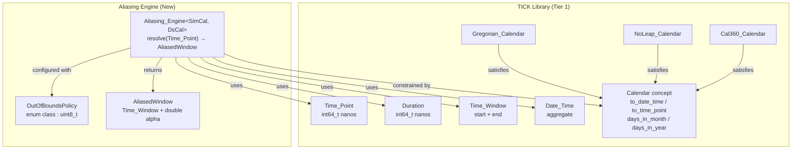
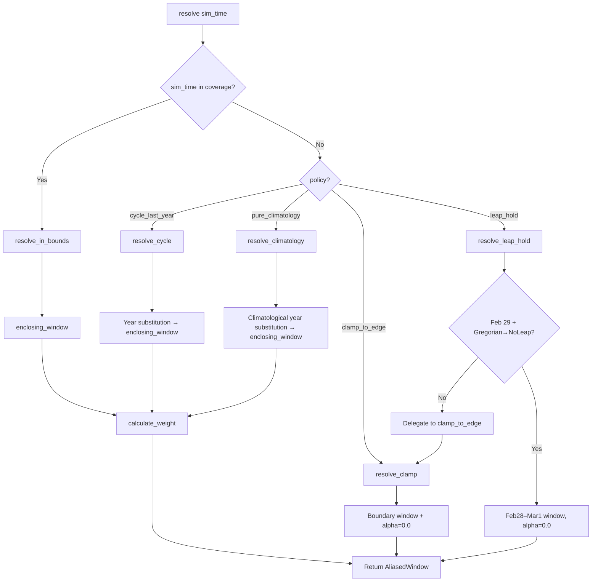

# Design Document: Time Aliasing Engine

## Overview

The Time Aliasing Engine extends the TICK micro-library with a stateless, template-based class (`Aliasing_Engine`) that resolves an arbitrary simulation `Time_Point` into a bounded dataset temporal window. This is the mechanism by which Earth System Models handle forcing datasets with finite temporal coverage when simulation clocks exceed those bounds.

The engine accepts a simulation time and produces an `AliasedWindow` containing two bounding dataset `Time_Point` values (forming a `Time_Window`) and a single `double` interpolation weight (alpha). Four out-of-bounds policies define the remapping strategy: clamping, cyclic year repetition, perpetual climatological year, and leap-day hold.

### Design Principles

- **Stateless & Immutable**: All construction parameters are `const`. No mutable state exists. Thread-safe by construction.
- **Integer Arithmetic Throughout**: All temporal computations use `int64_t` nanosecond values. The sole floating-point operation is the final `alpha = numerator / denominator` division.
- **Zero-Copy / Zero-Allocation**: `resolve()` uses only stack-local variables and the immutable construction parameters. No heap allocations.
- **Calendar Polymorphism via Templates**: The engine is parameterized on `Simulation_Calendar` and `Dataset_Calendar`, constrained by the existing `tick::Calendar` concept—no virtual dispatch.

## Architecture



### Dependency Direction

The aliasing engine depends only on existing TICK primitives (`Time_Point`, `Duration`, `Time_Window`, `Date_Time`, `Calendar` concept). It introduces no new dependencies on other HELM tiers and no circular references. The engine is a leaf node in the TICK dependency graph.

### File Layout

```
libs/tick/
├── include/tick/
│   ├── out_of_bounds_policy.hpp      ← OutOfBoundsPolicy enum
│   ├── aliased_window.hpp            ← AliasedWindow struct
│   └── aliasing_engine.hpp           ← Aliasing_Engine class template
└── tests/
    ├── test_aliasing_engine.cpp      ← Property-based + unit tests
    └── generators.hpp                ← Extended with aliasing generators
```

All new code is header-only (the engine is a class template). No new `.cpp` source files are needed for the library itself—only for tests.

## Components and Interfaces

### OutOfBoundsPolicy

```cpp
// include/tick/out_of_bounds_policy.hpp
#pragma once
#include <cstdint>

namespace tick {

enum class OutOfBoundsPolicy : std::uint8_t {
    clamp_to_edge      = 0,
    cycle_last_year    = 1,
    pure_climatology   = 2,
    leap_hold          = 3
};

} // namespace tick
```

A scoped enum with `std::uint8_t` underlying type. Four enumerators, no implicit conversions.

### AliasedWindow

```cpp
// include/tick/aliased_window.hpp
#pragma once
#include <cstring>
#include "tick/time_window.hpp"

namespace tick {

struct AliasedWindow {
    Time_Window window;
    double      alpha;   // interpolation weight in [0.0, 1.0]

    constexpr bool operator==(const AliasedWindow& other) const noexcept {
        // Bitwise comparison of alpha (not epsilon-based)
        return window == other.window &&
               std::memcmp(&alpha, &other.alpha, sizeof(double)) == 0;
    }
};

} // namespace tick
```

An aggregate struct. `Time_Window` provides the two bounding `Time_Point` values. Alpha is the linear interpolation weight. Equality uses bitwise comparison on the double to satisfy the determinism requirement.

**Note:** `AliasedWindow` is not trivially default-constructible because `Time_Window` enforces `start < end` in its constructor. A factory function or a sentinel-based default will be provided via a static `zero()` method that constructs with `Time_Point{0}` to `Time_Point{1}` and alpha `0.0`.

### Aliasing_Engine Class Template

```cpp
// include/tick/aliasing_engine.hpp
#pragma once
#include <cstdint>
#include <stdexcept>
#include "tick/time_point.hpp"
#include "tick/duration.hpp"
#include "tick/time_window.hpp"
#include "tick/date_time.hpp"
#include "tick/calendar.hpp"
#include "tick/out_of_bounds_policy.hpp"
#include "tick/aliased_window.hpp"

namespace tick {

template <Calendar Sim_Cal, Calendar Ds_Cal>
class Aliasing_Engine {
public:
    /// Construct an immutable aliasing engine.
    /// @param coverage       Half-open interval [start, end) of dataset temporal range
    /// @param snapshot_interval  Duration between dataset snapshots (must evenly divide coverage)
    /// @param policy         Out-of-bounds remapping strategy
    /// @param climatological_year  Reference year for pure_climatology (ignored by other policies)
    /// @throws std::invalid_argument if snapshot_interval <= 0, doesn't divide coverage,
    ///         or climatological_year is outside coverage for pure_climatology
    constexpr Aliasing_Engine(Time_Window coverage,
                              Duration snapshot_interval,
                              OutOfBoundsPolicy policy,
                              std::int32_t climatological_year = 0);

    /// Resolve a simulation Time_Point to an AliasedWindow.
    /// @param sim_time  The current simulation time
    /// @return AliasedWindow with bounding dataset times and interpolation weight
    /// @throws std::overflow_error if internal arithmetic overflows int64_t
    [[nodiscard]] constexpr AliasedWindow resolve(Time_Point sim_time) const;

    /// Calculate interpolation weight for a time within a window.
    /// @param current  Time_Point within [window.start(), window.end())
    /// @param window   The enclosing Time_Window
    /// @return alpha in [0.0, 1.0)
    /// @throws std::out_of_range if current not in [window.start(), window.end())
    /// @throws std::invalid_argument if window has zero duration
    [[nodiscard]] static constexpr double calculate_weight(Time_Point current,
                                                           Time_Window window);

    // ─── Const Accessors ───
    [[nodiscard]] constexpr Time_Window         coverage()            const noexcept;
    [[nodiscard]] constexpr Duration            snapshot_interval()   const noexcept;
    [[nodiscard]] constexpr OutOfBoundsPolicy   policy()              const noexcept;
    [[nodiscard]] constexpr std::int32_t        climatological_year() const noexcept;

private:
    const Time_Window         coverage_;
    const Duration            snapshot_interval_;
    const OutOfBoundsPolicy   policy_;
    const std::int32_t        climatological_year_;

    // ─── Policy dispatch (private, const) ───
    [[nodiscard]] constexpr AliasedWindow resolve_in_bounds(Time_Point sim_time) const;
    [[nodiscard]] constexpr AliasedWindow resolve_clamp(Time_Point sim_time) const;
    [[nodiscard]] constexpr AliasedWindow resolve_cycle(Time_Point sim_time) const;
    [[nodiscard]] constexpr AliasedWindow resolve_climatology(Time_Point sim_time) const;
    [[nodiscard]] constexpr AliasedWindow resolve_leap_hold(Time_Point sim_time) const;

    // ─── Utility (private, static, constexpr) ───
    [[nodiscard]] static constexpr Time_Window enclosing_window(Time_Point t,
                                                                 Time_Point coverage_start,
                                                                 Duration interval);
    [[nodiscard]] static constexpr Date_Time clamp_date(Date_Time dt);
    [[nodiscard]] static constexpr bool is_feb29(const Date_Time& dt) noexcept;
};

} // namespace tick
```

### Key Design Decisions

| Decision | Rationale |
|----------|-----------|
| Class template (not runtime polymorphism) | Zero virtual dispatch overhead; calendar logic resolved at compile time; consistent with TICK's constexpr-heavy style |
| `calculate_weight` as static member | Usable independently of the engine for direct weight computation; pure function with no state dependency |
| Immutable `const` members | Enforces thread-safety structurally; prevents accidental mutation; matches TICK's stateless philosophy |
| Header-only implementation | Template must be visible at instantiation site; no separate `.cpp` needed; consistent with existing TICK headers |
| Bitwise double equality in AliasedWindow | Required by determinism property (9.2); avoids epsilon-based comparison ambiguity |
| `constexpr` throughout | Enables compile-time evaluation where possible; consistent with existing calendar implementations |

## Data Models

### Core Types

```
┌─────────────────────────────────────────────────┐
│ OutOfBoundsPolicy (enum class : uint8_t)        │
│   clamp_to_edge = 0                             │
│   cycle_last_year = 1                           │
│   pure_climatology = 2                          │
│   leap_hold = 3                                 │
└─────────────────────────────────────────────────┘

┌─────────────────────────────────────────────────┐
│ AliasedWindow (aggregate struct)                │
│   window : Time_Window  (t_left, t_right)       │
│   alpha  : double       [0.0, 1.0]             │
└─────────────────────────────────────────────────┘

┌─────────────────────────────────────────────────┐
│ Aliasing_Engine<Sim_Cal, Ds_Cal>                │
│   coverage_          : const Time_Window        │
│   snapshot_interval_ : const Duration           │
│   policy_            : const OutOfBoundsPolicy  │
│   climatological_year_ : const int32_t          │
├─────────────────────────────────────────────────┤
│   resolve(Time_Point) → AliasedWindow    [const]│
│   calculate_weight(Time_Point, Time_Window)     │
│                     → double             [static]│
│   coverage()        → Time_Window        [const]│
│   snapshot_interval() → Duration         [const]│
│   policy()          → OutOfBoundsPolicy  [const]│
│   climatological_year() → int32_t        [const]│
└─────────────────────────────────────────────────┘
```

### Resolve Algorithm Flow



**Note on pure_climatology**: Unlike other policies, `pure_climatology` applies its year substitution to ALL simulation times (both in-bounds and out-of-bounds), so it bypasses the initial bounds check.

### Weight Calculation Formula

```
alpha = static_cast<double>(current.nanos() - window.start().nanos())
      / static_cast<double>(window.end().nanos() - window.start().nanos())
```

Both numerator and denominator are computed as `int64_t` nanosecond differences first, then cast to `double` for the single division operation. This ensures:
- No intermediate floating-point rounding
- Maximum precision (53-bit mantissa covers nanosecond differences up to ~104 days without precision loss)
- Deterministic results across platforms (IEEE 754 double division)

## Correctness Properties

*A property is a characteristic or behavior that should hold true across all valid executions of a system—essentially, a formal statement about what the system should do. Properties serve as the bridge between human-readable specifications and machine-verifiable correctness guarantees.*

### Property 1: Weight Formula Correctness

*For any* valid `Time_Window` with positive duration and *any* `Time_Point` `current` within `[window.start(), window.end())`, `calculate_weight(current, window)` SHALL return a value equal to `static_cast<double>(current.nanos() - window.start().nanos()) / static_cast<double>(window.end().nanos() - window.start().nanos())`.

**Validates: Requirements 1.1, 1.2, 1.3**

### Property 2: Out-of-Range Rejection

*For any* `Time_Window` and *any* `Time_Point` `current` that is either before `window.start()` or at/after `window.end()`, `calculate_weight(current, window)` SHALL throw `std::out_of_range`.

**Validates: Requirements 1.5**

### Property 3: Weight-Bounds Invariant

*For any* valid `Aliasing_Engine` instance and *any* simulation `Time_Point`, the `alpha` field of the `AliasedWindow` returned by `resolve()` SHALL satisfy `0.0 <= alpha <= 1.0`.

**Validates: Requirements 7.3, 8.2, 11.1**

### Property 4: Clamp-to-Edge Boundary Freeze

*For any* `Aliasing_Engine` configured with `clamp_to_edge` policy and *any* simulation `Time_Point` outside the dataset coverage (either before start or at/after end), `resolve()` SHALL return an `AliasedWindow` with `alpha == 0.0` and `window` equal to the first or last snapshot interval respectively.

**Validates: Requirements 3.1, 3.2**

### Property 5: Cycle-Last-Year Target Year Containment

*For any* `Aliasing_Engine` configured with `cycle_last_year` policy and *any* simulation `Time_Point` outside dataset coverage, both `t_left` and `t_right` of the returned `AliasedWindow` SHALL have `Date_Time` year components falling within the target year of dataset coverage (last year for post-coverage, first year for pre-coverage), when decomposed using the Dataset_Calendar.

**Validates: Requirements 4.1, 4.3, 4.4, 11.3**

### Property 6: Pure-Climatology Year-Lock

*For any* `Aliasing_Engine` configured with `pure_climatology` policy and *any* simulation `Time_Point` (regardless of whether it is within or outside dataset coverage), both `t_left` and `t_right` of the returned `AliasedWindow` SHALL have `Date_Time` year components equal to the configured `climatological_year` or `climatological_year + 1` (for December-to-January wrap), when decomposed using the Dataset_Calendar.

**Validates: Requirements 5.1, 5.3, 5.5, 11.4**

### Property 7: Leap-Hold Freeze

*For any* `Aliasing_Engine<Gregorian_Calendar, NoLeap_Calendar>` configured with `leap_hold` policy and *any* simulation `Time_Point` falling on February 29 (any sub-day time), `resolve()` SHALL return an `AliasedWindow` with `alpha == 0.0`, `t_left` corresponding to February 28 00:00:00.000000000, and `t_right` corresponding to March 1 00:00:00.000000000 (same year, in Dataset_Calendar).

**Validates: Requirements 6.1, 11.5**

### Property 8: Leap-Hold Fallback Equivalence

*For any* `Aliasing_Engine<Gregorian_Calendar, NoLeap_Calendar>` configured with `leap_hold` policy and *any* simulation `Time_Point` that does NOT fall on February 29, `resolve()` SHALL return a result identical to what the same engine configured with `clamp_to_edge` would return.

**Validates: Requirements 6.2**

### Property 9: Weight Monotonicity

*For any* valid `Time_Window` and *any* two `Time_Point` values A and B within `[window.start(), window.end())` where `A < B`, `calculate_weight(A, window) <= calculate_weight(B, window)` SHALL hold.

**Validates: Requirements 11.6**

### Property 10: Resolve Determinism

*For any* valid `Aliasing_Engine` instance and *any* simulation `Time_Point`, calling `resolve()` twice with the same input SHALL produce bitwise-identical `AliasedWindow` results.

**Validates: Requirements 9.2, 11.2**

### Property 11: Construction Rejects Non-Divisible Intervals

*For any* `Time_Window` coverage and *any* positive `Duration` snapshot_interval where `coverage.duration().nanos() % snapshot_interval.nanos() != 0`, constructing an `Aliasing_Engine` SHALL throw `std::invalid_argument`.

**Validates: Requirements 7.5**

## Error Handling

| Condition | Exception | Thrown By |
|-----------|-----------|-----------|
| `snapshot_interval <= 0` | `std::invalid_argument` | Constructor |
| `snapshot_interval` doesn't divide coverage | `std::invalid_argument` | Constructor |
| `pure_climatology` with climatological_year outside coverage | `std::invalid_argument` | Constructor |
| `current` outside `[window.start(), window.end())` | `std::out_of_range` | `calculate_weight` |
| Zero-duration `Time_Window` | `std::invalid_argument` | `Time_Window` constructor (existing) |
| Integer overflow in nanosecond arithmetic | `std::overflow_error` | `resolve` (via `detail::checked_add/sub/mul`) |

All error paths use existing TICK overflow-checked arithmetic from `tick/detail/overflow.hpp`. No new error mechanisms are introduced. Exceptions propagate naturally through the `constexpr` call stack.

### Error Design Rationale

- **Constructor validation (fail-fast)**: Invalid configurations are rejected at construction time rather than at each `resolve()` call, reducing per-call overhead and preventing invalid engines from existing.
- **Existing overflow infrastructure**: Reuses `detail::checked_add`, `detail::checked_sub`, `detail::checked_mul` already used by `Duration` and `Time_Point` arithmetic.
- **No error codes**: Consistent with TICK's exception-based error reporting pattern seen in all calendar implementations.

## Testing Strategy

### Property-Based Tests (RapidCheck + GTest)

The aliasing engine is well-suited for property-based testing because:
- It is a pure function (stateless, deterministic)
- Behavior varies meaningfully across a large input space (arbitrary Time_Points, multiple policies, multiple calendar combinations)
- Universal properties hold across all valid inputs
- The existing RapidCheck + GTest infrastructure is already established in TICK

**Configuration:**
- Library: RapidCheck (already a project dependency)
- Framework: Google Test (existing)
- Minimum iterations: 1000 per property (as specified in Requirement 11.7)
- Tag format: `Feature: tick-aliasing-engine, Property N: <description>`

**Properties to implement (1 property-based test per correctness property):**

| Property | Generator Strategy |
|----------|-------------------|
| 1: Weight formula | Generate random `Time_Window` + random `Time_Point` within it |
| 2: Out-of-range rejection | Generate random `Time_Window` + random `Time_Point` outside it |
| 3: Weight-bounds | Generate random engine config + random `Time_Point` for each policy |
| 4: Clamp boundary freeze | Generate random engine + random out-of-bounds `Time_Point` |
| 5: Cycle year containment | Generate random engine + random future/past `Time_Point` |
| 6: Climatology year-lock | Generate random engine + random `Time_Point` (any range) |
| 7: Leap-hold freeze | Generate random Feb 29 `Time_Point` (varying sub-day times) |
| 8: Leap-hold fallback | Generate random non-Feb-29 `Time_Point` |
| 9: Weight monotonicity | Generate random window + two ordered points within it |
| 10: Resolve determinism | Generate random engine + random `Time_Point` |
| 11: Construction rejection | Generate random non-divisible coverage/interval pairs |

### Custom Generators (extend `tests/generators.hpp`)

New generators needed:
- `aliasing_engine_config()` — produces valid coverage, interval, policy, climatological_year tuples
- `time_point_in_coverage(Time_Window)` — produces a Time_Point within the given coverage
- `time_point_outside_coverage(Time_Window)` — produces a Time_Point before or after coverage
- `feb29_time_point()` — produces Time_Points on February 29 of random leap years
- `non_feb29_time_point()` — produces Time_Points guaranteed not to be on February 29

### Unit Tests (specific examples and edge cases)

- Construction with zero-duration interval → `std::invalid_argument`
- Construction with negative interval → `std::invalid_argument`
- Construction with non-divisible interval → `std::invalid_argument`
- Construction with out-of-range climatological year → `std::invalid_argument`
- `calculate_weight` at exact start → alpha == 0.0
- `calculate_weight` one nanosecond before end → alpha < 1.0
- Cycle-last-year with Feb 29 → day clamped to Feb 28
- Pure-climatology December 31 near midnight → year-boundary wrap
- Leap-hold with non-Gregorian/NoLeap calendars → behaves as clamp_to_edge
- Accessor round-trip: construction params match accessors
- `AliasedWindow` equality: identical windows compare equal

### Integration Tests

- Thread-safety: concurrent `resolve()` calls from multiple threads produce consistent results
- Compile-time verification: `static_assert` for `std::is_same_v<std::underlying_type_t<OutOfBoundsPolicy>, std::uint8_t>`
- Concept constraint verification: ensure non-Calendar types fail to instantiate `Aliasing_Engine`

### Build Integration

The new test file `test_aliasing_engine.cpp` is added to the `TICK_TEST_SOURCES` list in `tests/CMakeLists.txt`, following the existing pattern:

```cmake
set(TICK_TEST_SOURCES
    test_duration
    test_gregorian
    test_noleap
    test_cal360
    test_alarm
    test_sync
    test_window
    test_integration
    test_aliasing_engine   # ← new
)
```

No additional dependencies beyond the existing GTest + RapidCheck are needed.
