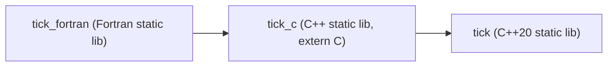

# Design Document: TICK Fortran Bridge

## Overview

The TICK Fortran Bridge provides a two-layer interoperability surface that exposes the TICK micro-library (C++20) to Fortran 2003+ callers:

1. **C ABI Layer** (`tick_c.h` + `tick_c_api.cpp`): A flat `extern "C"` API that maps TICK's C++ value types to C-interoperable scalars/structs and catches all C++ exceptions at the boundary, translating them to integer return codes.

2. **Fortran Module** (`tick_mod.f90`): A thin Fortran module that declares `iso_c_binding` interfaces for every C API function and exposes Fortran-idiomatic derived types and named constants.

The bridge passes only scalar `int64_t`/`int32_t` values and one small POD struct (`tick_date_time_t`, 7×int32) across the ABI boundary. No heap allocation, no opaque handles, no pointer-to-class objects. This keeps the FFI surface trivially safe and avoids the need for explicit lifecycle management from Fortran.

### Design Rationale

- **Scalar representation**: `Time_Point` and `Duration` are each a single `int64_t` internally. Exposing them as typedefs (not structs) means Fortran can pass them as `integer(c_int64_t)` values directly — zero marshalling overhead.
- **Output-pointer pattern**: Every function returns `tick_status_t` and writes results to caller-provided pointers. This mirrors AMIO's established pattern in the HELM ecosystem and maps cleanly to Fortran `intent(out)` arguments.
- **Exception firewall**: A single macro `TICK_C_TRY` wraps all C++ calls in a try/catch that maps exception types to error codes. No exception can escape to Fortran.

## Architecture

```mermaid
graph TB
    subgraph "Fortran Model Code"
        F[Fortran Caller]
    end

    subgraph "tick_mod.f90"
        FM[iso_c_binding interfaces<br/>+ derived types + constants]
    end

    subgraph "tick_c_api.cpp"
        CA[extern C functions<br/>TICK_C_TRY exception firewall]
    end

    subgraph "TICK C++ Library (tick)"
        TP[Time_Point]
        DU[Duration]
        DT[Date_Time]
        CAL[Calendar Engines]
        AL[Alarms]
        SY[Sync]
        TW[Time_Window]
    end

    F --> FM
    FM -->|bind(c)| CA
    CA --> TP
    CA --> DU
    CA --> DT
    CA --> CAL
    CA --> AL
    CA --> SY
    CA --> TW
```

### Build Dependency Graph



### Directory Layout

```
libs/tick/
├── CMakeLists.txt              # Extended with tick_c and tick_fortran targets
├── cmake/
│   └── TICKConfig.cmake.in     # Updated to export new targets
├── include/tick/
│   ├── tick.hpp                # Existing umbrella header
│   ├── tick_c.h                # NEW: C ABI header (C99 + C++20 compatible)
│   ├── duration.hpp
│   ├── time_point.hpp
│   ├── date_time.hpp
│   ├── calendar.hpp
│   ├── gregorian_calendar.hpp
│   ├── noleap_calendar.hpp
│   ├── cal360_calendar.hpp
│   ├── interval_alarm.hpp
│   ├── absolute_alarm.hpp
│   ├── sync.hpp
│   ├── time_window.hpp
│   └── detail/overflow.hpp
├── src/
│   ├── sync.cpp                # Existing
│   └── tick_c_api.cpp          # NEW: C API implementation
├── fortran/
│   └── tick_mod.f90            # NEW: Fortran module
└── tests/
    ├── CMakeLists.txt          # Extended with C API tests
    ├── test_tick_c.cpp         # NEW: GTest tests for C API
    ├── test_tick_fortran.f90   # NEW: Fortran tests (optional, gated)
    ├── generators.hpp          # Existing RapidCheck generators
    └── ... (existing test files)
```

## Components and Interfaces

### Component 1: C Header (`tick_c.h`)

The public C header declares all types, constants, and function prototypes. It is self-contained (includes only `<stdint.h>`) and dual-compilable as C99 and C++20.

```c
/* tick_c.h — C99/C++20 public API for TICK */
#ifndef TICK_C_H
#define TICK_C_H

#include <stdint.h>

#ifdef __cplusplus
extern "C" {
#endif

/* ── Types ─────────────────────────────────────────────────────── */

typedef int64_t tick_time_point_t;   /* nanoseconds since TICK epoch */
typedef int64_t tick_duration_t;     /* nanoseconds */
typedef int32_t tick_status_t;       /* return code */

typedef struct tick_date_time_t {
    int32_t year;
    int32_t month;
    int32_t day;
    int32_t hour;
    int32_t minute;
    int32_t second;
    int32_t nanosecond;
} tick_date_time_t;

typedef enum tick_calendar_t {
    TICK_CAL_GREGORIAN = 0,
    TICK_CAL_NOLEAP    = 1,
    TICK_CAL_360DAY    = 2
} tick_calendar_t;

/* ── Error Codes ───────────────────────────────────────────────── */

#define TICK_OK                  0
#define TICK_ERR_OVERFLOW        1
#define TICK_ERR_INVALID_ARG     2
#define TICK_ERR_INVALID_CALENDAR 3
#define TICK_ERR_INVALID_DATE    4
#define TICK_ERR_INTERNAL        5

/* ── Error Reporting ───────────────────────────────────────────── */

const char* tick_strerror(tick_status_t status);

/* ── Time_Point Functions ──────────────────────────────────────── */

tick_status_t tick_time_point_create(int64_t nanos, tick_time_point_t* out);
tick_status_t tick_time_point_add_duration(tick_time_point_t tp,
                                           tick_duration_t dur,
                                           tick_time_point_t* out);
tick_status_t tick_time_point_sub_duration(tick_time_point_t tp,
                                           tick_duration_t dur,
                                           tick_time_point_t* out);
tick_status_t tick_time_point_diff(tick_time_point_t lhs,
                                   tick_time_point_t rhs,
                                   tick_duration_t* out);
tick_status_t tick_time_point_compare(tick_time_point_t lhs,
                                      tick_time_point_t rhs,
                                      int32_t* out);

/* ── Duration Functions ────────────────────────────────────────── */

tick_status_t tick_duration_from_nanos(int64_t nanos, tick_duration_t* out);
tick_status_t tick_duration_from_seconds(int64_t count, tick_duration_t* out);
tick_status_t tick_duration_from_minutes(int64_t count, tick_duration_t* out);
tick_status_t tick_duration_from_hours(int64_t count, tick_duration_t* out);
tick_status_t tick_duration_from_days(int64_t count, tick_duration_t* out);
tick_status_t tick_duration_add(tick_duration_t lhs, tick_duration_t rhs,
                                tick_duration_t* out);
tick_status_t tick_duration_sub(tick_duration_t lhs, tick_duration_t rhs,
                                tick_duration_t* out);
tick_status_t tick_duration_mul(tick_duration_t dur, int64_t scalar,
                                tick_duration_t* out);
tick_status_t tick_duration_div(tick_duration_t dur, int64_t scalar,
                                tick_duration_t* out);

/* ── Calendar Conversions ──────────────────────────────────────── */

tick_status_t tick_to_date_time(tick_time_point_t tp, tick_calendar_t cal,
                                tick_date_time_t* out);
tick_status_t tick_to_time_point(tick_date_time_t dt, tick_calendar_t cal,
                                 tick_time_point_t* out);
tick_status_t tick_days_in_month(tick_calendar_t cal, int32_t year,
                                 int32_t month, int32_t* out);
tick_status_t tick_days_in_year(tick_calendar_t cal, int32_t year,
                                int32_t* out);

/* ── Alarm Queries ─────────────────────────────────────────────── */

tick_status_t tick_interval_alarm_is_ringing(tick_duration_t interval,
                                             tick_time_point_t reference,
                                             tick_time_point_t current,
                                             int32_t* out);
tick_status_t tick_interval_alarm_next_ring(tick_duration_t interval,
                                            tick_time_point_t reference,
                                            tick_time_point_t current,
                                            tick_time_point_t* out);
tick_status_t tick_absolute_alarm_is_ringing(tick_time_point_t trigger,
                                             tick_time_point_t current,
                                             int32_t* out);

/* ── Synchronization ───────────────────────────────────────────── */

tick_status_t tick_compute_heartbeat(const tick_duration_t* timesteps,
                                     int32_t count,
                                     tick_duration_t* out);
tick_status_t tick_compute_sync_period(const tick_duration_t* timesteps,
                                       int32_t count,
                                       tick_duration_t* out);
tick_status_t tick_is_phase_aligned(tick_time_point_t current,
                                    tick_time_point_t base,
                                    tick_duration_t timestep,
                                    int32_t* out);

/* ── Accumulation Windows ──────────────────────────────────────── */

tick_status_t tick_is_on_boundary(tick_time_point_t current,
                                  tick_duration_t interval,
                                  int32_t* out);
tick_status_t tick_compute_window(tick_time_point_t current,
                                  tick_duration_t interval,
                                  tick_time_point_t* out_start,
                                  tick_time_point_t* out_end);
tick_status_t tick_window_contains(tick_time_point_t win_start,
                                   tick_time_point_t win_end,
                                   tick_time_point_t query,
                                   int32_t* out);

#ifdef __cplusplus
} /* extern "C" */
#endif

#endif /* TICK_C_H */
```

### Component 2: C++ Implementation (`tick_c_api.cpp`)

The implementation file includes the full TICK C++ umbrella header and implements each `extern "C"` function using a macro-based exception firewall pattern.

**Exception Firewall Macro:**

```cpp
#define TICK_C_TRY(body)                                    \
    try {                                                   \
        body                                                \
        return TICK_OK;                                     \
    } catch (const std::overflow_error&) {                  \
        return TICK_ERR_OVERFLOW;                            \
    } catch (const std::invalid_argument&) {                \
        return TICK_ERR_INVALID_ARG;                         \
    } catch (...) {                                         \
        return TICK_ERR_INTERNAL;                            \
    }
```

**Calendar Dispatch Helper:**

A `switch` on the `tick_calendar_t` enum dispatches to the appropriate templated calendar engine (`Gregorian_Calendar`, `Noleap_Calendar`, `Cal360_Calendar`). Invalid enum values return `TICK_ERR_INVALID_CALENDAR` before entering the try block.

**Implementation Pattern (example):**

```cpp
tick_status_t tick_time_point_add_duration(tick_time_point_t tp,
                                           tick_duration_t dur,
                                           tick_time_point_t* out)
{
    if (!out) return TICK_ERR_INVALID_ARG;
    TICK_C_TRY(
        auto result = tick::Time_Point{tp} + tick::Duration{dur};
        *out = result.nanos();
    )
}
```

### Component 3: Fortran Module (`tick_mod.f90`)

The Fortran module provides:

1. **Derived types** mapping to C types via `iso_c_binding` kind parameters
2. **Named constants** for calendars and error codes
3. **Interface blocks** with `bind(c)` for every C API function
4. **Explicit `intent` attributes** on all arguments

**Structure:**

```fortran
module tick_mod
  use, intrinsic :: iso_c_binding
  implicit none
  private

  ! ── Public types ──
  public :: tick_time_point, tick_duration, tick_date_time

  ! ── Public constants ──
  public :: TICK_OK, TICK_ERR_OVERFLOW, TICK_ERR_INVALID_ARG, &
            TICK_ERR_INVALID_CALENDAR, TICK_ERR_INVALID_DATE, TICK_ERR_INTERNAL
  public :: TICK_CAL_GREGORIAN, TICK_CAL_NOLEAP, TICK_CAL_360DAY

  ! ── Public procedures ──
  ! (all interface block names)

  ! Type definitions
  integer(c_int32_t), parameter :: TICK_OK = 0
  ! ... (all error codes)

  integer(c_int32_t), parameter :: TICK_CAL_GREGORIAN = 0
  integer(c_int32_t), parameter :: TICK_CAL_NOLEAP = 1
  integer(c_int32_t), parameter :: TICK_CAL_360DAY = 2

  type, bind(c) :: tick_date_time
    integer(c_int32_t) :: year
    integer(c_int32_t) :: month
    integer(c_int32_t) :: day
    integer(c_int32_t) :: hour
    integer(c_int32_t) :: minute
    integer(c_int32_t) :: second
    integer(c_int32_t) :: nanosecond
  end type

  ! tick_time_point and tick_duration are just integer(c_int64_t) aliases
  ! Fortran doesn't have typedef, so these are documented conventions
  ! or wrapper types if desired.

  interface
    ! ... bind(c) declarations for all functions
  end interface

end module tick_mod
```

### Component 4: CMake Integration

The existing `CMakeLists.txt` is extended with two new targets:

```cmake
# ── C API target (always built) ──
add_library(tick_c STATIC src/tick_c_api.cpp)
add_library(HELM::TICK_C ALIAS tick_c)
target_link_libraries(tick_c PUBLIC tick)
target_include_directories(tick_c
    PUBLIC
        $<BUILD_INTERFACE:${CMAKE_CURRENT_SOURCE_DIR}/include>
        $<INSTALL_INTERFACE:include>
)

# ── Fortran module target (optional) ──
option(TICK_BUILD_FORTRAN "Build the Fortran tick_mod module" OFF)
if(TICK_BUILD_FORTRAN)
    enable_language(Fortran)
    add_library(tick_fortran STATIC fortran/tick_mod.f90)
    add_library(HELM::TICK_Fortran ALIAS tick_fortran)
    target_link_libraries(tick_fortran PUBLIC tick_c)
    # Install .mod file
    install(DIRECTORY ${CMAKE_CURRENT_BINARY_DIR}/
            DESTINATION ${CMAKE_INSTALL_INCLUDEDIR}/tick
            FILES_MATCHING PATTERN "tick_mod.mod")
endif()
```

## Data Models

### Type Mapping Table

| C++ Type | C Type (`tick_c.h`) | Fortran Type (`tick_mod`) | ABI Width |
|---|---|---|---|
| `tick::Time_Point` | `tick_time_point_t` (`int64_t`) | `integer(c_int64_t)` | 8 bytes |
| `tick::Duration` | `tick_duration_t` (`int64_t`) | `integer(c_int64_t)` | 8 bytes |
| `tick::Date_Time` | `tick_date_time_t` (7×int32) | `type(tick_date_time), bind(c)` | 28 bytes |
| Calendar enum | `tick_calendar_t` (enum → int32) | `integer(c_int32_t)` | 4 bytes |
| Return code | `tick_status_t` (`int32_t`) | `integer(c_int32_t)` | 4 bytes |
| Boolean result | `int32_t` (0/1) | `integer(c_int32_t)` | 4 bytes |
| Array param | `const tick_duration_t*` + `int32_t count` | `integer(c_int64_t), dimension(*)` + `integer(c_int32_t)` | pointer + 4 bytes |

### Calling Convention

All functions follow the pattern:

```
tick_status_t function_name(input_args..., output_pointer(s))
```

- **Inputs**: passed by value (scalars) or by const pointer (arrays)
- **Outputs**: written to caller-provided pointers
- **Return**: always `tick_status_t` (0 = success)
- **On error**: output pointer contents are unmodified

### Calendar Dispatch

The C API uses a runtime `switch` on the `tick_calendar_t` integer to dispatch to the correct static calendar class:

```cpp
switch (cal) {
    case TICK_CAL_GREGORIAN: /* use tick::Gregorian_Calendar */ break;
    case TICK_CAL_NOLEAP:    /* use tick::Noleap_Calendar */    break;
    case TICK_CAL_360DAY:    /* use tick::Cal360_Calendar */    break;
    default: return TICK_ERR_INVALID_CALENDAR;
}
```

This converts the C++ compile-time polymorphism (concepts/static dispatch) to runtime dispatch at the ABI boundary.


## Correctness Properties

*A property is a characteristic or behavior that should hold true across all valid executions of a system — essentially, a formal statement about what the system should do. Properties serve as the bridge between human-readable specifications and machine-verifiable correctness guarantees.*

### Property 1: Calendar Conversion Round-Trip

*For any* valid `tick_date_time_t` value under any valid `tick_calendar_t`, converting to `tick_time_point_t` via `tick_to_time_point` and back to `tick_date_time_t` via `tick_to_date_time` SHALL produce a value equal to the original.

**Validates: Requirements 5.7**

### Property 2: Time_Point Arithmetic Equivalence

*For any* `tick_time_point_t` value `tp` and `tick_duration_t` value `dur` where the operation does not overflow, `tick_time_point_add_duration(tp, dur, &out)` SHALL return `TICK_OK` and set `out` to `tp + dur`, and `tick_time_point_sub_duration(tp, dur, &out)` SHALL return `TICK_OK` and set `out` to `tp - dur`. Additionally, for any two `tick_time_point_t` values `lhs` and `rhs`, `tick_time_point_diff(lhs, rhs, &out)` SHALL set `out` such that `rhs + out == lhs`, and `tick_time_point_compare` SHALL return a value whose sign matches the true ordering.

**Validates: Requirements 3.2, 3.3, 3.4, 3.5**

### Property 3: Duration Arithmetic Equivalence

*For any* two `tick_duration_t` values and any `int64_t` scalar where the operation does not overflow or divide by zero, `tick_duration_add`, `tick_duration_sub`, `tick_duration_mul`, and `tick_duration_div` SHALL return `TICK_OK` and produce the mathematically correct result (with division truncated toward zero).

**Validates: Requirements 4.3, 4.4, 4.5, 4.6**

### Property 4: Duration Factory Correctness

*For any* `int64_t` count where the result does not overflow `int64_t`, `tick_duration_from_seconds(count, &out)` SHALL set `out` to `count × 10⁹`, `tick_duration_from_minutes(count, &out)` SHALL set `out` to `count × 6×10¹⁰`, `tick_duration_from_hours(count, &out)` SHALL set `out` to `count × 3.6×10¹²`, and `tick_duration_from_days(count, &out)` SHALL set `out` to `count × 8.64×10¹³`. For any `int64_t` n, `tick_duration_from_nanos(n, &out)` SHALL set `out` to `n`.

**Validates: Requirements 4.1, 4.2**

### Property 5: Exception-to-Error-Code Mapping

*For any* C_API function call that triggers `std::overflow_error` in the underlying C++ code, the function SHALL return `TICK_ERR_OVERFLOW` and leave the output pointer value unchanged. *For any* call that triggers `std::invalid_argument`, the function SHALL return `TICK_ERR_INVALID_ARG` and leave the output pointer value unchanged.

**Validates: Requirements 2.4, 2.5, 3.6, 4.8**

### Property 6: tick_strerror Completeness

*For any* `tick_status_t` value in the range [0, 5], `tick_strerror` SHALL return a non-null pointer to a non-empty null-terminated string. *For any* integer value outside the defined range, it SHALL still return a non-null pointer (to a fallback message).

**Validates: Requirements 2.7**

### Property 7: Interval Alarm Equivalence

*For any* positive `tick_duration_t` interval, any `tick_time_point_t` reference, and any `tick_time_point_t` current where current ≥ reference, `tick_interval_alarm_is_ringing` SHALL return 1 if and only if `(current - reference) % interval == 0`. Furthermore, the time returned by `tick_interval_alarm_next_ring` SHALL be greater than `current` and SHALL itself satisfy the ringing condition.

**Validates: Requirements 6.1, 6.2**

### Property 8: Heartbeat Divides All Timesteps

*For any* array of positive `tick_duration_t` values, the result of `tick_compute_heartbeat` SHALL evenly divide every element in the input array (i.e., `timesteps[i] % heartbeat == 0` for all i).

**Validates: Requirements 7.1**

### Property 9: Sync Period Divisible By All Timesteps

*For any* array of positive `tick_duration_t` values where the LCM does not overflow, the result of `tick_compute_sync_period` SHALL be evenly divisible by every element in the input array (i.e., `sync_period % timesteps[i] == 0` for all i).

**Validates: Requirements 7.2**

### Property 10: Window and Boundary Operations Equivalence

*For any* `tick_time_point_t` current and positive `tick_duration_t` interval: (a) `tick_is_on_boundary` SHALL return 1 if and only if `current % interval == 0`; (b) the window returned by `tick_compute_window` SHALL satisfy `start ≤ current < end` and `end - start == interval`; (c) `tick_window_contains(start, end, query)` SHALL return 1 if and only if `start ≤ query < end`.

**Validates: Requirements 7.3, 8.1, 8.2, 8.3**

## Error Handling

### Exception Firewall Architecture

The C API implementation uses a single macro (`TICK_C_TRY`) that wraps every function body in a try/catch block:

```
┌─────────────────────────────────────────────┐
│  Fortran / C Caller                         │
│  (cannot catch C++ exceptions)              │
└─────────────┬───────────────────────────────┘
              │ returns tick_status_t (int32)
┌─────────────▼───────────────────────────────┐
│  TICK_C_TRY macro                           │
│  ┌────────────────────────────────────────┐ │
│  │ try {                                  │ │
│  │   // C++ TICK operations               │ │
│  │   return TICK_OK;                      │ │
│  │ } catch (std::overflow_error)          │ │
│  │   → TICK_ERR_OVERFLOW                  │ │
│  │ } catch (std::invalid_argument)        │ │
│  │   → TICK_ERR_INVALID_ARG              │ │
│  │ } catch (...)                          │ │
│  │   → TICK_ERR_INTERNAL                  │ │
│  └────────────────────────────────────────┘ │
└─────────────────────────────────────────────┘
```

### Error Code Semantics

| Code | Value | C++ Exception Source | Meaning |
|------|-------|---------------------|---------|
| `TICK_OK` | 0 | (none) | Operation succeeded |
| `TICK_ERR_OVERFLOW` | 1 | `std::overflow_error` | Arithmetic overflow in int64 |
| `TICK_ERR_INVALID_ARG` | 2 | `std::invalid_argument` | Bad parameter (null ptr, zero divisor, negative interval) |
| `TICK_ERR_INVALID_CALENDAR` | 3 | (pre-check) | Calendar enum out of range [0,2] |
| `TICK_ERR_INVALID_DATE` | 4 | `std::invalid_argument` from calendar validate | Date_Time fields violate calendar rules |
| `TICK_ERR_INTERNAL` | 5 | `catch(...)` | Unexpected/unknown error |

### Pre-check vs Exception-based Errors

Some errors are detected *before* calling C++ code:
- **Null output pointer**: checked at function entry, returns `TICK_ERR_INVALID_ARG` immediately
- **Invalid calendar enum**: checked by switch-default, returns `TICK_ERR_INVALID_CALENDAR` before try block
- **Zero/negative intervals**: caught by `std::invalid_argument` from TICK C++ code within try block

### Distinguishing TICK_ERR_INVALID_ARG from TICK_ERR_INVALID_DATE

Both originate from `std::invalid_argument` in C++. The calendar conversion functions distinguish them:
- Calendar validation errors (`tick_to_time_point` with bad date fields) are caught and remapped to `TICK_ERR_INVALID_DATE`
- All other `std::invalid_argument` throws map to `TICK_ERR_INVALID_ARG`

Implementation approach: the calendar conversion functions use an inner try/catch specifically for the calendar validation path, mapping that specific `std::invalid_argument` to `TICK_ERR_INVALID_DATE`.

### Fortran Error Handling Pattern

```fortran
integer(c_int32_t) :: rc
integer(c_int64_t) :: tp_out

rc = tick_time_point_add_duration(current_time, dt, tp_out)
if (rc /= TICK_OK) then
    write(*,*) 'TICK error: ', tick_strerror(rc)
    stop 1
end if
```

## Testing Strategy

### Unit Tests (`test_tick_c.cpp`)

GTest-based tests covering:
- **Type layout assertions**: `sizeof`, `offsetof`, enum values (compile-time smoke tests)
- **Happy-path examples**: each function with representative inputs
- **Error-path examples**: null pointers, zero divisors, invalid calendars, invalid dates
- **Boundary conditions**: INT64_MAX, INT64_MIN, epoch boundaries

### Property-Based Tests (RapidCheck)

The project already uses RapidCheck for property-based testing. The C API tests will reuse the existing `generators.hpp` and add new generators for the C-level types.

**Configuration**: minimum 100 iterations per property.

**PBT Library**: RapidCheck (already a project dependency)

**Tag format**: Each property test is tagged with a comment:
```cpp
// Feature: tick-fortran-bridge, Property N: <property text>
```

**Properties to implement**:

| Property | Test Focus | Generators |
|----------|-----------|------------|
| 1 | Calendar round-trip | Random valid Date_Time per calendar |
| 2 | Time_Point arithmetic | Random int64 pairs (filtered for no overflow) |
| 3 | Duration arithmetic | Random int64 pairs (filtered for no overflow) |
| 4 | Duration factories | Random int64 counts (filtered for no overflow) |
| 5 | Error mapping | Random inputs that trigger overflow/invalid_arg |
| 6 | tick_strerror | All int32 values including out-of-range |
| 7 | Interval alarm | Random positive intervals + time points |
| 8 | Heartbeat (GCD) | Random arrays of positive durations |
| 9 | Sync period (LCM) | Random arrays of small positive durations |
| 10 | Window/boundary | Random time points + positive intervals |

### Fortran Integration Tests (`test_tick_fortran.f90`, optional)

A minimal Fortran program that:
1. Calls every `tick_mod` procedure at least once
2. Verifies return codes match expected values
3. Confirms the calendar round-trip from Fortran

Gated behind `TICK_BUILD_FORTRAN=ON`.

### Build Verification

- `tick_c.h` compiles under `gcc -std=c99 -pedantic -Werror`
- `tick_c.h` compiles under `g++ -std=c++20 -Werror`
- `tick_mod.f90` compiles under `gfortran -std=f2003 -Wall`
- All tests run inside Docker: `docker compose run --rm helm-dev bash -c "cd /workspace/helm-project && cmake --build build && ctest --test-dir build"`
